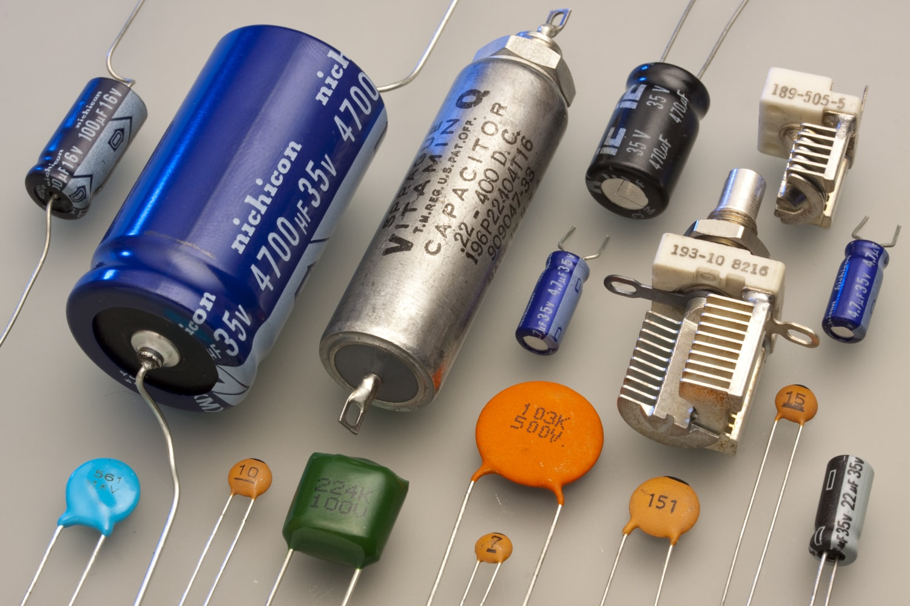

# Конденсатор

Книга "Энциклопедия юного радиолюбителя-конструктора В.Г.Борисов 2001"

    Конденсатор   стр. 73

    КАТУШКИ  ИНДУКТИВНОСТИ стр. 154

## Емкостной элемент

Емкостной элемент — это **линейный пассивный** компонент электрической цепи, который обладает свойством ёмкости, то есть способностью накапливать **электрический заряд** (количество электрики) и **энергию в электрическом поле** между своими обкладками. Основным представителем емкостных элементов является **конденсатор** либо две метталические пластины рядом расположенные.

Схема замещения емкости:

В цепи постоянного тока после времени заряда кондекнсатора, ток на конденсаторе будет равен 0, а напряжение будет равно источнику питания.

График заряда и разряда конденсатора:

Так как между выводами конденсатора может протекать **ток утечки**, поэтому реальный конденсатор с влияющими на цепь токами утечки используют **шунтированный резистором кондексатор** т.е. параллельно подключенный резистор, на плате резистор будет, но на схеме замещения резистора не будет.

Схема реального емкостного элемента:

---

### Типы емкостных элементов:
1. **Постоянные конденсаторы**:
   - Полярные (например, электролитические).
   - Неполярные (например, керамические или плёночные).
2. **Переменные конденсаторы**:
   - Ёмкость которых можно изменять механически или электрически.

### Основные характеристики емкостного элемента:

1. **Ёмкость ($ C $)**:
   - Измеряется в **фарадах (Ф)** ([конвертер](https://www.translatorscafe.com/unit-converter/ru-RU/electrostatic-capacitance/13-1/microfarad-farad/)).
     * **Миллифарад (мкФ):** 1 мкФ = $10^{-3}$ Ф (0.001 Ф)
     * **Микрофарад (мкФ):** 1 мкФ = $10^{-6}$ Ф (0.000001 Ф)
     * **Нанофарад (нФ):** 1 нФ = $10^{-9}$ Ф (0.000000001 Ф)
     * **Пикофарад (пФ):** 1 пФ = $10^{-12}$ Ф (0.000000000001 Ф)

        Выбор фарада в качестве единицы измерения емкости связан с именем известного английского физика Майкла Фарадея, внесшего значительный вклад в изучение электромагнетизма.

   - Определяет способность элемента накапливать заряд при заданном напряжении.
   - Формула для ёмкости:
    
     $C = \frac{Q}{U},$
    
     где  
      - $C$ — ёмкость,  
      - $Q$ — заряд (Кл),  
      - $U$ — напряжение (В).

2. **Энергия электрического поля**:
   - Ёмкостный элемент накапливает энергию в виде электрического поля между обкладками.
   - Формула для накопленной энергии:
    
     $W = \frac{1}{2} C U^2,$
     
     где  
      - $W$ — энергия (Дж),  
      - $C$ — ёмкость (Ф),  
      - $U$ — напряжение (В).

3. **Ток через конденсатор**:
   - Зависит от скорости изменения напряжения:
      
     $I = C \frac{dU}{dt},$
     
     где  
      - $I$ — ток (А),  
      - $C$ — ёмкость (Ф),  
      - $ \frac{dU}{dt}$ — скорость изменения напряжения (В/с).

---

## Поведение в цепи постоянного тока:

#### Формулы:
1. **Напряжение на конденсаторе при заряде:**
   
   $U_C(t) = U_{source} \cdot \left(1 - e^{-\frac{t}{RC}}\right)$
   
   где:
   - $U_{source}$ — напряжение источника,
   - $R$ — сопротивление цепи,
   - $C$ — ёмкость конденсатора,
   - $t$ — время.

2. **Ток через конденсатор при заряде:**
   
   $I(t) = \frac{U_{source}}{R} \cdot e^{-\frac{t}{RC}}$
   

3. **Постоянная времени ($\tau$):**
   - Время, за которое конденсатор заряжается до $63.2\%$ от максимального напряжения.
  
   $\tau = R \cdot C$
    
#### Пример: Зарядка конденсатора
- Дано: $U_{source} = 10 \, \text{В}$, $R = 1 \, \text{кОм}$, $C = 100 \, \mu\text{Ф}$.
- Постоянная времени:
   
  $\tau = R \cdot C = 1000 \cdot 100 \cdot 10^{-6} = 0.1 \, \text{с}$
   
- Напряжение на конденсаторе через $0.1 \, \text{с}$:
  
  $U_C(0.1) = 10 \cdot \left(1 - e^{-1}\right) \approx 6.32 \, \text{В}$

---

Основы конденсаторов:

Что такое ёмкость и как она измеряется (Фарады).

Как работает конденсатор в цепи постоянного тока (зарядка и разрядка).

Формулы для расчёта напряжения и тока при заряде/разряде.

Практические примеры:

Зарядка конденсатора через резистор.

Разрядка конденсатора через резистор.

Использование конденсатора в RC-цепях (например, фильтры низких частот).

Эксперименты:

Соберите простую RC-цепь и измерьте время заряда/разряда.

Используйте осциллограф (или симулятор) для наблюдения за формой сигнала.
