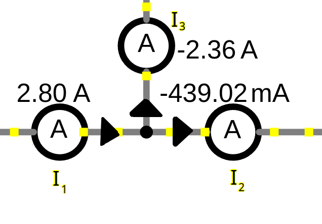
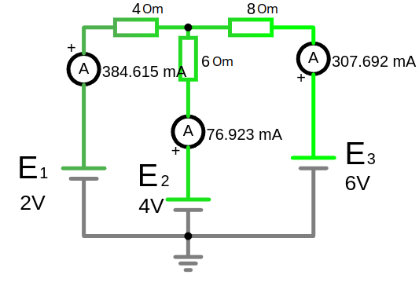

# Урок 8. Первый и второй законы Кирхгофа.

## **Законы Кирхгофа**

Законы Кирхгофа описывают основные принципы поведения электрических цепей. Они позволяют рассчитывать токи, напряжения и сопротивления в сложных электрических схемах.

**Зачем нужны законы Кирхгофа:**

* **Анализ электрических цепей:** Эти законы позволяют нам составлять математические уравнения, описывающие поведение электрической цепи. Решая эти уравнения, мы можем найти значения токов и напряжений в любой точке цепи.
* **Проектирование электрических схем:** Законы Кирхгофа необходимы для проектирования новых электрических схем, таких как усилители, фильтры, генераторы и т.д. Они позволяют нам рассчитать значения элементов схемы, чтобы она работала так, как задумано.
* **Понимание работы электронных устройств:** Понимание законов Кирхгофа необходимо для того, чтобы разобраться в принципах работы различных электронных устройств, от простых лампочек до сложных компьютеров.
* **Решение задач по электротехнике:** В учебных заведениях и на практике часто приходится решать задачи, связанные с расчетом электрических цепей. Законы Кирхгофа являются основным инструментом для решения таких задач.

**Какие задачи можно решать с помощью законов Кирхгофа:**

* **Расчет токов и напряжений в любой точке цепи:** Зная значения сопротивлений и ЭДС источников питания, можно рассчитать силу тока в любой ветви цепи и напряжение на любом элементе.
* **Определение эквивалентного сопротивления:** Законы Кирхгофа позволяют найти эквивалентное сопротивление сложных электрических цепей.
* **Анализ работы различных электронных схем:** С помощью этих законов можно анализировать работу усилителей, фильтров, генераторов и других электронных устройств.

### **Алгоритм применения законов Кирхгофа**
1. **Обозначьте направления токов**:  
   Предположите направление токов в ветвях цепи в каждом узле. Если итоговый результат конкретного тока получится отрицательным, реальное направление противоположно предположенному.

2. **Примените первый закон Кирхгофа к узлам**:  
   Запишите уравнения для всех узлов (кроме одного, так как его уравнение будет зависимым от остальных).

3. **Найти все независимые контуры**:
   Найдите все независимые контуры и произвольно выберите направление для их обхода. При обходе контура те токи которые не совпадают с направлением контура будут суммироваться с минусом.

4. **Примените второй закон Кирхгофа к контурам**:  
   Запишите уравнения для каждого контура, включая источники и падения напряжения на элементах.

5. **Решите систему уравнений**:  
   Полученная система уравнений позволяет найти токи и напряжения.

---

## **1. Первый закон Кирхгофа (Закон токов)**

**Первый закон Кирхгофа (закон токов):** Алгебраическая сумма (с учетом знака) токов, сходящихся в узле, равна нулю. Это означает, что в любой точке цепи количество заряда, втекающего в нее, равно количеству заряда, вытекающего из нее.

**Суть**: Сумма токов, входящих в узел, равна сумме токов, выходящих из него.  

Количество токов в цепи определяет количество ветвей (В ветвях с источником тока уже известен ток).
 
Количество уравнений которое необходимо составить по первому закону Кирхгофа, **равно количество узлов минус 1**

$\sum I_{\text{вход}} = \sum I_{\text{выход}} \quad \text{или} \quad \sum I = 0$
 
$\sum I = \sum J\quad $ где $J$ - это источник тока

**Узел** — это точка соединения двух или более проводников.

### Пример:

Для узла с токами $I_1$, $I_2$, $I_3$:  
- Произвольно выберем соответвие направления токов и знаки. По умолчанию выбирают, если ток $I_1$ входит в узел то он плюсуются, а токи $I_2$ и $I_3$ выходят то они минусуются:
 
  $I_1 - I_2 - I_3 = 0$ $\quad (2.80 - 0.44 - 2.36 = 0)$
  
  $I_1 = I_2 + I_3 = 0.44 + 2.36 = 2.80, A$
  
  $I_2 = I_1 - I_3 = 2.80 - 2.36 = 0.44, A$

**Применение:**
Используется для анализа токов в электрических цепях, особенно в параллельных соединениях элементов.

---

## **2. Второй закон Кирхгофа (Закон напряжений)**

**Второй закон Кирхгофа (закон напряжений):** Алгебраическая сумма (учитывает знаки) напряжений на всех пассивных элементах замкнутого контура равна нулю. Это означает, что при обходе любого замкнутого контура сумма падений напряжения равна сумме ЭДС.

Или другая формулировка, в любом контуре произвольной электрической цепи, алгебраическая сумма падений напряжений на всех пассивных элементах равна алгебраической сумме электродвижущих сил действующих в этом контуре.

Сумма напряжений, создаваемых источниками питания (батареи, генераторы и т. д.), будет равна сумме напряжений, которые "поглощаются" элементами (резисторами, конденсаторами, катушками и т. д.).

Это очень просто, если в цепи присутствует только один пассивный элемент то он забирает на себя все напряжение, если два пассивных элемента то они делят все напряжения в зависимости от количества Ом сопротивления.

Когда мы выбрали произвольно напрвление токов и направление контура, то при составлении уравнений мы учитываем эти направления. 
Так при сумировании источников напряжения мы минусуем тот $-E$ направление которого не совпадает с направлением контура, а при сумировании падений напряжений $\sum I\cdot R$ мы смотрим на то соврадает ли ток с выбранным направление тока контура, если не совпадает тогда отнимаем его: 
   - $-E_1+E_2 = - I_3\cdot R_3 - I_4\cdot R_4 + I_5\cdot R_5$ 

**Суть**: В любом замкнутом контуре сумма всех ЭДС (источников напряжения) равна сумме падений напряжения на всех элементах контура.  

Количество уравнений которое необходимо составить по второму закону Кирхгофа, для независимых контуров, **равно количеству ветвей без источника тока минус количество уравней по первому закону Кирхгофа**

$\sum \mathcal{E} = \sum U \quad \text{или} \quad \sum \mathcal{E} - \sum IR = 0$
 
Если в контуре нет источника ЭДС то оно равно 0:

$ \sum U = 0\ \quad \text{или} \quad \sum IR = 0$ 

**Контур** — это замкнутый путь в электрической цепи.

**Независимый контур** - это контур электрической схемы, который включает в себя хотя бы одну ветвь, которой нет в предыдущих найденных контурах, и хотя бы одну ветвь, содержащуюся в предыдущих контурах.

Для расчета схемы выбирают контур так что бы в нем небыло источника тока (источник тока может быть внутри контура)

**Применение:**
Используется для расчёта напряжений и токов в сложных цепях, включая последовательные соединения и многоконтурные схемы.

### Пример 1:
Для замкнутого контура с источником напряжения $ \mathcal{E} $, резисторами $ R_1, R_2 $ и током $ I $:  

$\mathcal{E} - I R_1 - I R_2 = 0$

Представьте замкнутую цепь с источником напряжения $ \mathcal{E} = 12 \, \text{В} $ и двумя резисторами:
- $ R_1 = 4 \, \text{Ом} $
- $ R_2 = 2 \, \text{Ом} $

 
 

#### Шаги:
1. По второму закону Кирхгофа:  
   
   $\mathcal{E} = U_1 + U_2$
   

   Напряжение на каждом резисторе рассчитывается по закону Ома ($ U = IR $):  
   
   $U_1 = I R_1, \quad U_2 = I R_2$
   

2. Общий ток $I$ в цепи:  
   - Суммарное сопротивление последовательно соединеных резисторов: 
      $ R\ общ = R_1 + R_2 = 4 + 2 = 6 \, \text{Ом} $
   - $ I = \frac{\mathcal{E}}{R\ общ} = \frac{12}{6} = 2 \, \text{А} $

3. Подставляем значения:  
   - $ U_1 = I R_1 = 2 \cdot 4 = 8 \, \text{В} $
   - $ U_2 = I R_2 = 2 \cdot 2 = 4 \, \text{В} $

4. Проверяем закон Кирхгофа:  
   
   $\mathcal{E} = U_1 + U_2 \quad \Rightarrow \quad 12 = 8 + 4$
   

### Пример 2:

Найти токи во всех участках цепи.

Цепь имеет два независимых контура и три разных тока ветви.
Выберем произвольно направления обхода контуров (можно прикинуть относительно узла А, что сумма напряжений положительно направленых к нему $E_2 + E_3$ будет больше чем встречное напряжение $E_1$ даже с учетом падений напряжения на резисторах) и узел в котором произвольно направления токов (но тоже учитывая логику направления контура можно предположить как будет протекать ток).

Для узла А имеем по первому закону Кирхгофа: $I_2 + I_3 - I_1 = 0 \quad$ или $\quad I_1 = I_2 + I_3$

где:
- $- I_1$ - минусуем ток так как он выходит из узла А, а остальные токи плюсуем так как они входят в узел А.

Для 1-го контура по второму закону Кирхгофа: $E_2 - E_1 = I_2\cdot R_2 + I_1\cdot R_1$

где:
- $- E_1$ - минусуем напряжение так как оно направленно на встречу заданому направлению обхода контура, а $E_2$ c положительным знаком так как его направление совпадает с контуром.
- Суммируя напряжение контура мы его преобразовали к виду $I \cdot R$, и так как токи ветвей $I_2$ и $I_1$ совпадают с направлением контура поэтому они с положительными знаками.

Для 2-го контура по второму закону Кирхгофа: $E_3 - E_2 = I_3\cdot R_3 + I_2\cdot R_2$

Итого имеем систему уравнений:
- $I_1 = I_2 + I_3\quad$ (1)
- $E_2 - E_1 = I_2\cdot R_2 + I_1\cdot R_1\quad$ (2)
- $E_3 - E_2 = I_3\cdot R_3 + I_2\cdot R_2\quad$ (3)

Подставим значения:
- $I_1 = I_2 + I_3 \quad$ (1)
- $2 = I_2\cdot 6 + I_1\cdot 4 \quad$ (2)
- $2 = I_3\cdot 8 + I_2\cdot 6 \quad$ (3)

Упростим уравнения (2) и (3) поделив на два и выразим $I_2$ из уравнения (1) и подставим его. Сложим множители $I_1\ и\ I_3$:

- $I_2 = I_1 - I_3 \quad $ (1)
- $1 = 3\cdot I_2 + 2\cdot I_1 \quad \to 1 = 3\cdot I_1 - 3\cdot I_3 + 2\cdot I_1 \quad \to 1 = 5\cdot I_1 - 3\cdot I_3\quad $ (2)
- $1 = 4\cdot I_3 + 3\cdot I_2 \quad \to 1 = 4\cdot I_3 - 3\cdot I_1 + 3\cdot I_3 \quad \to 1 = 7\cdot I_3 - 3\cdot I_1\quad $ (3)

Приведем коэфициенты для $I_3$ к одному значению, умножив уравнение (2) на 7, а уравнение (3) на 7:
- $I_2 = I_1 - I_3 \quad $ (1)
- $7 = 35\cdot I_1 - 21\cdot I_3\quad $ (2)
- $3 = 21\cdot I_3 - 9\cdot I_1\quad $ (3)

Сложим уравнения (2) и (3), чтобы исключить $I_3$:
- $I_2 = I_1 - I_3 \quad $ (1)

- $7 + 3 = 35\cdot I_1 - 9\cdot I_1 - 21\cdot I_3 + 21\cdot I_3 \quad \to 10 = 35\cdot I_1 - 9\cdot I_1 \quad \to 10 = 26\cdot I_1$ 
   - $I_1 = \frac{10}{26} = 0.384\ mA$

Выведем ток $I_3$ из любого предудущего уравнения подставив значение $I_1$:
- $1 = 5\cdot I_1 - 3\cdot I_3\to 1 = 5\cdot 0.384 - 3I_3 \to 1 = 1.923 - 3I_3 \to 1 - 1.923 = -3I_3$ 
   - $I_3=\frac{- 1.923}{- 3}$  

- $I_3=0.308\ mA$ 
- $I_2 = 0.384 - 0.308 = 0.076\ mA$

Схема из программы [LTspice](https://www.youtube.com/watch?v=tJn63ScpS2M&list=PLgUwXvgNkHQLO3A8j1NC338lka7UzdWBM&index=2):

---

### **Преимущества законов Кирхгофа**
- Позволяют анализировать как простые, так и сложные цепи.
- Основа для методов расчёта, таких как метод узловых потенциалов или метод контурных токов.
- Работают для любых типов элементов, включая резисторы, источники напряжения и тока.

