# Индуктивный элемент

<details>

<summary>Проверка работоспособности индуктивного элемента</summary>

Редко, но всё же из строя выходят индуктивности. Причины тому две. Первая – КЗ витков, а вторая – обрыв. Обрыв вычислить легко – достаточно проверить сопротивление катушки. Если оно меньше бесконечности, то всё ОК. Сопротивление индуктивностей обычно не более сотен Ом. Чаще всего несколько десятков. . .

КЗ между витков вычислить несколько труднее. Надо проверить напряжение самоиндукции. Это работает только на дросселях/трансформаторах, с обмотками в хотя бы 1000 витков. Надо подать импульс низковольтный на обмотку, А после, замкнуть эту обмотку лампочкой газоразрядной. Фактически, любя ИН-ка. Импульс обычно подают, слегка касаясь контактов КРОНЫ. Если ИН-ка в итоге мигнёт, то всё норм. Если нет, то либо КЗ витков, либо очень мало витков. . .

Как видите, способ не очень точный, и не очень удобный. Так что сначала проверьте все детали, и лишь потом грешите на КЗ витков!

---

</details>

```admonish info
В цепи постоянного тока, после времени заряда индуктивности т.е. уже в установившемся режиме, обычный проводник с очень малым сопротивлением. Индуктивность реагирует на изменения **тока** в цепи, будь то цепь постоянный напряжения или переменного, а источник может быть кварцевый генератор. 
```

[Основные понятия цепей с магнитными связями](https://www.youtube.com/watch?v=gdws_TmnQOI&list=PLa1hZtD9sL40izP87AoDr1O8CmlvW8pck&index=23)


**Индуктивный элемент** — это **линейный пассивный** компонент электрической цепи, который обладает свойством индуктивности, то есть способностью накапливать **энергию ($W $) в виде магнитного поля** при прохождении через него электрического тока. Индуктивные элементы играют важную роль в цепях переменного тока и в схемах, где требуется управление или фильтрация сигналов.

Но катушка индуктивности с сердечником т.е. с обмоткой уже **не линейный** компонет.

Схема замещения идеального реактивного элемента:


Схема реального реактивного элемента т.е. он обладает каким-то сопротивлением, резистор подключенным последовательно с индуктивностью, на плате резистор будет но на схеме замещения резистора не будет:


Обозначение на схемах:

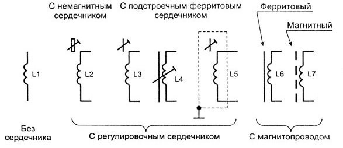

**Катушка индуктивности (индуктивность)** — это наиболее распространённый индуктивный элемент. Она состоит из проводника, намотанного в виде спирали, чаще всего витки наматываются на цилиндрический или тороидальный каркас, что создаёт магнитное поле при прохождении тока. При этом ее индуктивность значительно выше чем ее внутреннее сопротивление.

Важнейшей характеристикой катушки индуктивности является, **индуктивность**. По определению индуктивность - это способность преобразовывать энергию электрического поля в энергию магнитного поля. Это свойство катушки связано с тем, что при протекании по проводнику тока вокруг него возникает магнитное поле.

---

### Поведение индуктивного элемента в цепи постоянного тока (DC):
Индуктивный элемент ведёт себя как обычный проводник с очень малым сопротивлением, так как магнитное поле стабилизируется.
   
---

## Магнит

Магнит — это объект, который создает вокруг себя магнитное поле и притягивает или отталкивает другие магниты и ферромагнитные материалы (например, железо, никель, кобальт). 

Ферромагнетики (железо, никель, кобальт и их сплавы) обладают высокой магнитной восприимчивостью и высокой остаточной намагниченностью, что делает их идеальными для хранения данных (жёсткие диски HDD, гибкие дискеты Floppy Disks, магнитные ленты и карты, пластинки с музыкой). Данные хранятся в виде намагниченной области определенной полярности домена "+ -" или "- +", магнитная головка считывает изменения полярности доменов и преобразуюет в электрический сигнал, который затем интерпретируются как цифровая информация 0 или 1.

Ферриты — это керамические материалы, состоящие из оксидов металлов (например, Fe₂O₃ с добавками других металлов). Они обладают высокой электросопротивляемостью, но меньшей остаточной намагниченностью по сравнению с металлическими ферромагнетиками, поэтому ферриты не подходят для хранения информации но подходят для сердечников трансформаторов и дросселей.


Магниты бывают:
- Постоянные магниты: Сохраняют свои магнитные свойства без внешнего воздействия (например, магниты на холодильник).
- Электромагниты: Создают магнитное поле только при протекании электрического тока (например, катушка с током).

**Магнитное поле** — это область пространства, где действуют магнитные силы. Оно характеризуется магнитной индукцией (B), которая измеряется в теслах (Тл). Магнитное поле можно визуализировать с помощью магнитных линий, которые выходят из северного полюса магнита и входят в южный полюс.

Магнитное поле создается движущимися зарядами (токами). В постоянных магнитах это **связано с движением электронов** внутри атомов (спинами электронов и их орбитальным движением внутри атомов. Эти микроскопические токи выстраиваются в одном направлении, создавая макроскопическое магнитное поле.), а в электромагнитах — с протеканием тока через катушку (Чем больше ток и число витков катушки, тем сильнее магнитное поле.).

Если магнит движется относительно проводника, в нем возникает ЭДС индукции.
С постоянного магнита можно получить взаимную индукцию, но только если магнитное поле, создаваемое магнитом, изменяется во времени (например, магнит движется относительно катушки). Взаимная индукция возникает, когда изменение магнитного потока через одну катушку вызывает появление ЭДС в другой катушке. Постоянные магниты создают относительно слабое магнитное поле по сравнению с электромагнитами.

Взаимная индукция с постоянным магнитом используется в:
- Генераторах: Вращение магнита относительно катушки создает ток.
- Датчиках движения: Изменение магнитного потока используется для измерения скорости или положения.
- Беспроводной зарядке: Магнитное поле постоянного магнита может индуцировать ток в катушке (хотя это менее эффективно, чем с электромагнитами).

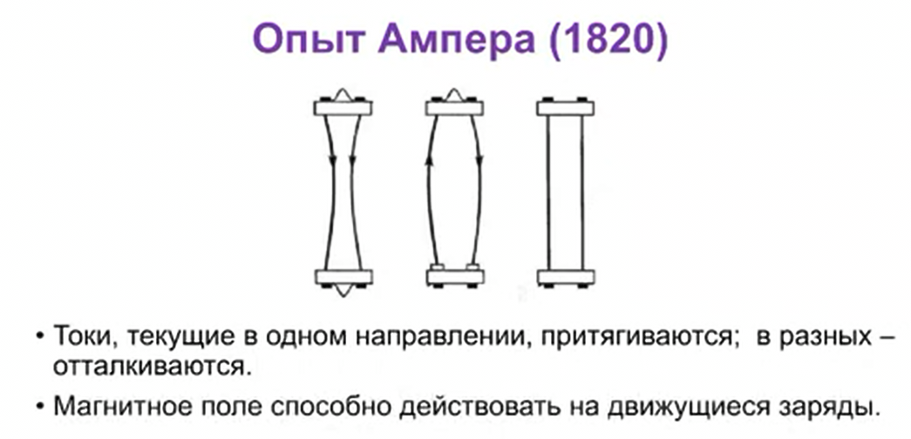

## Электромагнит
Электромагнит — это устройство, создающее магнитное поле с помощью электрического тока, протекающего через катушку с проводником! 🧲

Когда по проводнику течёт ток, вокруг него образуется магнитное поле (это явление описано в законе Ампера), получается магнит с полюсами (северным и южным). Если намотать провод в виде катушки, поле суммируется и усиливается, а вставка из ферромагнитного материала (например, железа) ещё больше увеличит магнитную индукцию.

В электромагнитах сила Ампера позволяет поднимать тяжёлые предметы — ток в катушке создаёт поле, а взаимодействие с магнитными материалами создаёт мощную силу притяжения.

Преимущества электромагнитов:
- Управляемость: можно включать и выключать магнитное поле.
- Регулируемая сила: чем больше ток — тем сильнее поле.

---

## Магнитное поле

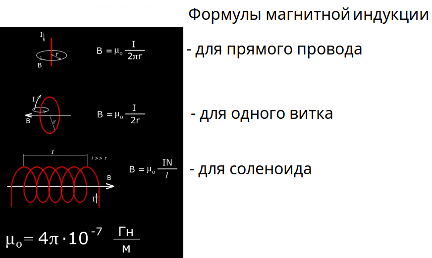

Магнитное поле можно назвать особым видом материи, посредством которой осуществляется взаимодействие между **движущимися** заряженными частицами или телами, обладающими магнитным моментом.

Источники магнитного поля:
- Постоянные магниты (полевые линии выходят из северного полюса и входят в южный).
- Электрический ток (любое движение заряженных частиц создаёт магнитное поле).
- Электромагниты (катушки с током, усиливающие поле с помощью ферромагнитного сердечника).

Применение магнитных полей:
- Электродвигатели и генераторы — преобразуют электрическую энергию в механическую и наоборот.
- МРТ (магнитно-резонансная томография) — мощные магнитные поля для медицинской диагностики.
- Трансформаторы — используют магнитные поля для передачи энергии между обмотками.
- Магнитная левитация (маглев) — для бесконтактного движения поездов.
- Фильтрация частиц в ускорителях — магнитные поля отклоняют заряженные частицы.

Интересные факты:
- Земля — это гигантский магнит с магнитным полем, защищающим нас от солнечного ветра.
- Электроны в атомах вращаются вокруг ядра, создавая крошечные магнитные поля — именно поэтому некоторые материалы (ферромагнетики) могут становиться постоянными магнитами.
- Магнитное поле может передавать энергию без проводов — на этом принципе работают беспроводные зарядные устройства!


1. Поле создаётся током, текущим по бесконечно длинному прямому проводнику.
Линии магнитного поля — концентрические окружности вокруг провода (правило правой руки).
   - **Закон Ампера (магнитное поле вокруг проводника):**  
   
   $B = \frac{\mu_0 I}{2 \pi r}$
   
   где:  
   - $ B $ — магнитная индукция (Тл),  
   - $ \mu_0 $ — магнитная постоянная ($ 4\pi \times 10^{-7} \, \mathrm{Гн/м}$),  
   - $ I $ — ток в проводнике (А),  
   - $ r $ — расстояние до проводника (м), и чем дальше от провода, тем слабее поле.  

2. Поле создаётся катушкой (намотанным проводником). Чем больше витков $ N $ и ток $ I $, тем сильнее поле. Если вставить ферромагнитный сердечник (с высокой $ \mu_r $), поле станет ещё мощнее.  Поле создаётся движением зарядов, и его направление можно определить по **правилу правой руки**.
   - **Поле катушки с током (соленоида):**  
   
   $B = \mu_0 \cdot \mu_r \cdot \frac{N \cdot I}{l}$
   
   где:  
   - $ B $ — магнитная индукция (Тл),
   - $ N $ — число витков,  
   - $ l $ — длина катушки,  
   - $ \mu_r $ — относительная магнитная проницаемость сердечника.  

Магнитное поле имеет свое направление по **правилу правой руки**, которое определяется направлением тока, и при росте тока растет и магнитное поле.

---

## Индуктивность
Магнитный поток $\Phi$ пропорционален току, а индуктивность это $L=\frac{\Phi}{I}$ [Генри]

Если через провод пропустить электрический ток, то он вокруг себя создаст магнитное поле, а магнитная индукция — это векторная величина, характеризующая магнитное поле. Она обозначается буквой B и измеряется в Теслах:

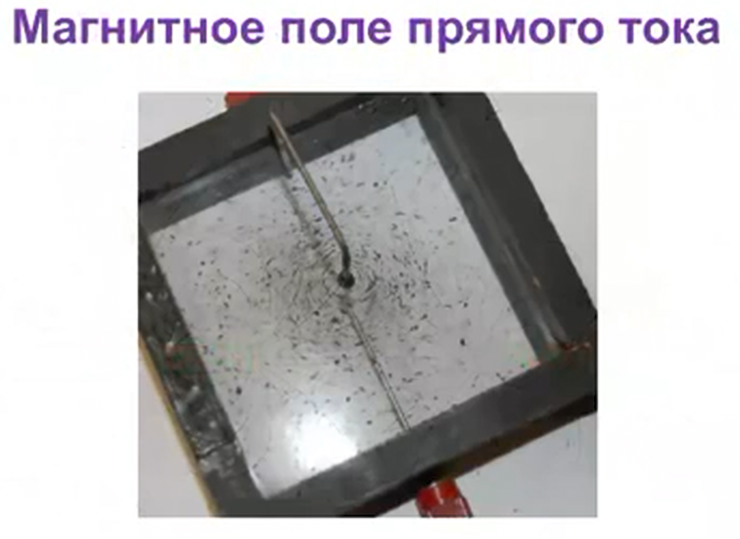

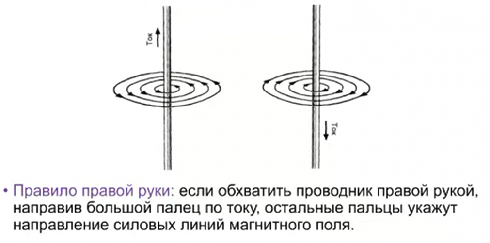

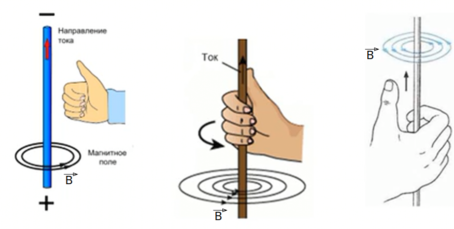

**Индуктивность** — это физическая величина, характеризующая способность проводника или контура создавать магнитное поле при протекании через него электрического тока, а также способность этого магнитного поля индуцировать электродвижущую силу (ЭДС) в этом же проводнике или другом проводнике, находящемся вблизи. Любой проводник, по которому течёт электрический ток, создаёт вокруг себя магнитное поле.

С научной же точки зрения, индуктивность — это способность извлекать энергию из источника электрического тока и сохранять ее в виде магнитного поля. Если ток в катушке увеличивается, магнитное поле вокруг катушки расширяется, а если ток уменьшается , то магнитное поле сжимается.

**Формула катушки с соленоидом (сердечником с магнитной проницаемостью $\mu_r$):**

$L = \mu_0 \cdot \mu_r \cdot \frac{N^2 \cdot A}{l}$
 
Где:  
- $L$ — индуктивность (в Генри, Гн) 
- $\mu_0$ — магнитная проницаемость вакуума ($4 \pi \times 10^{-7}\ \mathrm{Гн/м}$) 
- $\mu_r$ — относительная магнитная проницаемость материала сердечника 
- $N$ — число витков катушки  
- $A$ — площадь поперечного сечения катушки ($A = \pi r^2$) в квадратных метрах   
- $l$ — длина катушки в метрах  

**Формула для тороидальной катушки:**
 
$L = \frac{\mu_0 \cdot \mu_r \cdot N^2 \cdot A}{2 \pi r_{\text{ср}}}$
 
Где $ r_{\text{ср}} $ — средний радиус тора.  

А эти формулы связаны с фундаментальными определениями индуктивности через магнитный поток.  

**Формула индуктивности через потокосцепление:**

$L = \frac{N \cdot \Phi}{I}$

Где:  
- $L$ — индуктивность (в Генри, Гн)  
- $N$ — число витков катушки  
- $\Phi$ — магнитный поток через один виток (в веберах, Вб)  
- $I$ — ток, протекающий через катушку (в амперах, А)  

Эта формула показывает, что индуктивность — это отношение магнитного потока, сцепленного с витками, к току, который этот поток создаёт.  

**Формула индуктивности через потокосцепление (обобщённая форма):**
 
$L = \frac{\psi}{I}$
 

Где:  
- $ \psi $ — потокосцепление (в Вб·витках), т.е. полный магнитный поток, сцепленный со всеми витками: $ \psi = N \cdot \Phi $  
- $ I $ — ток в катушке  

Эта формула аналогична предыдущей, но более универсальна. Потокосцепление учитывает общее количество витков сразу.

Эти выражения — основа для понимания индуктивности, а формулы с геометрией катушки (те, что я писал выше) уже следуют из этих фундаментальных соотношений.  

Из формул следует, что при увеличении числа витков или, к примеру, диаметра (а соответственно и площади поперечного сечения), индуктивность будет увеличиваться. А при увеличении длины - уменьшаться. Таким образом, витки на катушке стоит располагать как можно ближе друг к другу, поскольку это приведет к уменьшению длины.


А если провод намотать спиралью (соленоид) то провода будут пересекать магнитное поле.
Магнитный поток это совокупность всех вектором магнитной индукции:

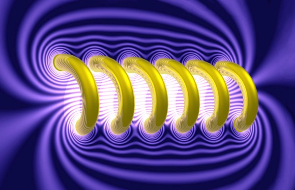

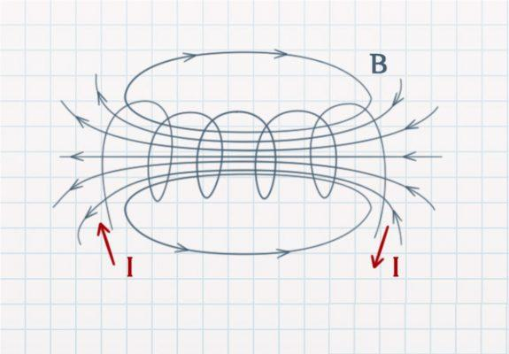

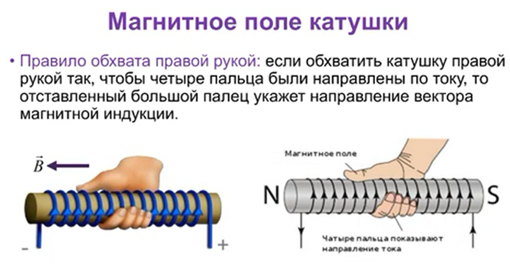

Чем больше линий магнитного поля пересекут площадь этого соленоида, в нашем случае площадь цилиндра, тем больше будет магнитный поток (Ф). Так как через катушку течет электрический ток, значит, через нее проходит ток с Силой тока (I), а коэффициент между магнитным потоком и силой тока называется **индуктивностью**.  

```admonish info
А если во внутрь соленоида поместить ферромагнитный материал (Железо $\mu \approx 4000$, Сталь $\mu \approx 7000$, Ферриты $\mu \approx 5000$, Пермаллой $\mu \approx 8000$, Альсиферы) со своейством магнитной проницаемости $\mu$, то магнитное поле усилится в 1000 раз.
```
 
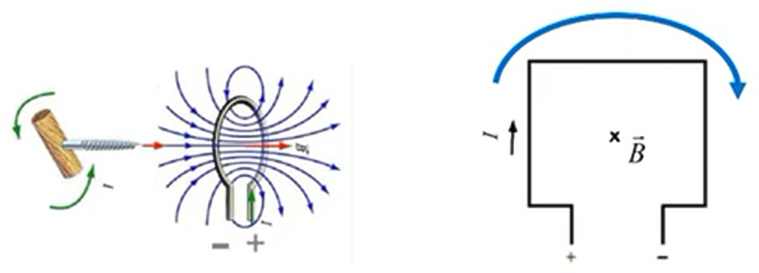 

**ЭДС самоиндукции** — это электродвижущая сила (напряжение), которая возникает в проводнике или катушке **при изменении тока**  (увеличивается или уменьшается) через них, магнитное поле вокруг катушки также изменяется. Это изменение магнитного поля создает ЭДС самоиндукции в той же самой катушке. ЭДС самоиндукции направлена так, чтобы противодействовать изменению тока, что является следствием закона Ленца:
- Если ток увеличивается ($ \frac{dI}{dt} > 0 $), то ЭДС самоиндукции направлена против тока.
- Если ток уменьшается ($ \frac{dI}{dt} < 0 $), то ЭДС самоиндукции направлена в сторону тока.
 
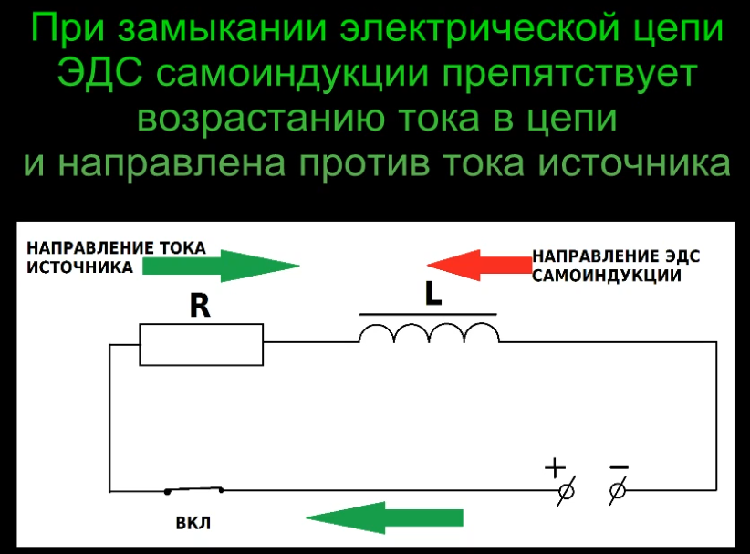 

Если разомкнуть цепь то катушка индуктивности — источник тока (ток в цепи резко падает, а катушка, согласно закону Ленца, противодействует этому изменению, поэтому возникает ЭДС самоиндукции), и у нас ЭДС самоиндукции будет суммироваться к напряжению, которое мы уже подали на катушку. То есть как только мы разрываем цепь, на катушке напряжение в этот момент может быть в разы больше, чем было до размыкания  цепи, а сила тока в цепи катушки будет тихонько падать, так как ЭДС самоиндукции будет поддерживать убывающее напряжение.

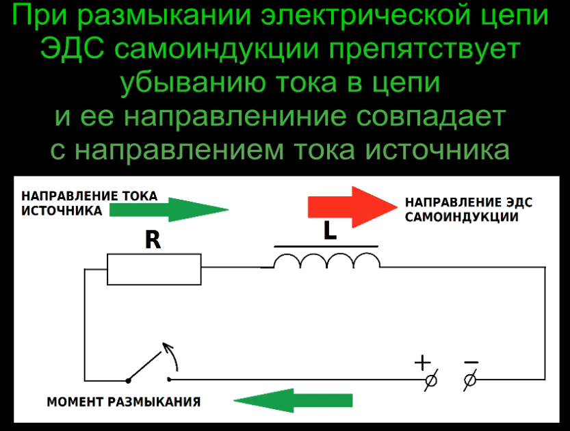 

Если ток обрывается мгновенно (например, механическим размыканием контактов), производная тока по времени становится очень большой, и, соответственно, напряжение на катушке может резко возрасти до значительных значений. Это и вызывает те самые высоковольтные всплески, которые могут пробивать изоляцию или вызывать искрение на контактах размыкателя.

Поэтому в схемах с индуктивными нагрузками часто используют **защитные диоды ,диод Шоттки** (например, диод свободного хода в цепях с реле или электромагнитами) подключается параллельно катушке в обратной полярности или **варистор** (устройство, которое резко уменьшает свое сопротивление при превышении напряжения) или **RC-цепь снаббер** (подключается параллельно катушке для гашения импульсов напряжения), чтобы замкнуть ток через катушку и рассеять энергию в виде тепла, а не в виде разрушительных всплесков напряжения.

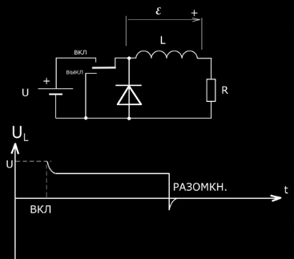

Пробой и ЭДС самоиндукции связаны через явление, которое возникает при резком изменении тока в цепи, особенно при размыкании цепи с катушкой индуктивности. 

Пробой — это явление, при котором напряжение в цепи превышает допустимое значение, что приводит к разрушению изоляции или другим повреждениям.

**Т.е. пробой может быть при резком отключении катушки т.е. резкий ее разряд, который резко уменьшает ток и она этому сопротивляется повышая напряжение, в следствии чего возникает пробой. Так как накопленное магнитное поле в катушке не может ей поддерживаться и должно разрядится.**

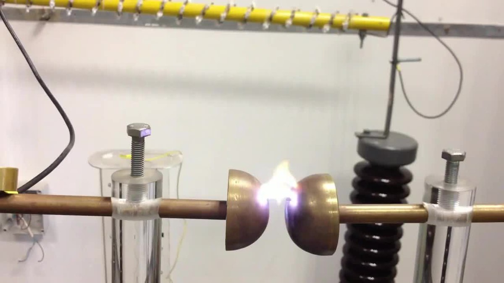

---

## Электромагнитная индукция

Электромагнитная индукция — это фундаментальное явление в физике, открытое Майклом Фарадеем в 1831 году. Оно описывает процесс возникновения электрического тока в проводнике при изменении магнитного поля вокруг него. Это явление лежит в основе работы многих устройств, таких как генераторы, трансформаторы, индукционные нагреватели и т.д.

Электромагнитная индукция — это явление, при котором изменяющееся магнитное поле создает электрическое поле, которое, в свою очередь, вызывает появление электрического тока в проводнике (если проводник замкнут в цепь).

**Самоиндукция** — это явление, при котором изменение тока в проводнике или катушке вызывает появление ЭДС самоиндукции в этой же катушке, которая противодействует этому изменению тока. Когда ток через катушку изменяется (увеличивается или уменьшается), магнитное поле вокруг катушки также изменяется. Это изменение магнитного поля создает ЭДС самоиндукции в той же самой катушке. Согласно закону электромагнитной индукции Фарадея

**Взаимная индукция** — это явление в цепи переменного тока, при котором изменение тока в одной катушке вызывает появление ЭДС индукции в другой катушке, расположенной рядом. Это происходит благодаря тому, что переменное магнитное поле, создаваемое первой катушкой, пронизывает вторую катушку и индуцирует в ней переменное напряжение. При этом ничего двигаться не должно, ни проводник ни магнит.

   Упрощённая версиея для расчета ЭДС во второй катушке. 
   Эта формула используется для расчета ЭДС в случае, когда магнитный поток изменяется периодически (например, в переменном токе)
   - $e = W_2 \cdot \Phi \cdot f $

   Где:
   - $ W_2 $ — Число витков второй катушки  ,
   - $ \Phi $ — Магнитный поток,
   - $ f $ — Частоту изменения магнитного потока.

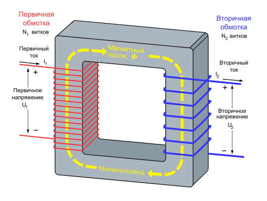

```admonish info
Теоретически, использовать магнитное поле Земли для получения электрического тока через взаимную индукцию возможно, но на практике это крайне сложно и малоэффективно.
Магнитное поле Земли слабое по сравнению с полями, которые мы создаем в лабораторных условиях. Его напряженность составляет примерно 25–65 микротесла (для сравнения: магнитное поле обычного магнита — около 0,1–1 тесла)
```

**Сила Ампера**

Сила Ампера — это сила, действующая на проводник с током, помещённый в магнитное поле. Это проявление взаимодействия магнитного поля с движущимися зарядами, которое тесно связано с понятием индуктивности, ведь катушка с током создаёт своё магнитное поле и может испытывать воздействие внешнего! 
Катушка индуктивности с током — это набор проводников, и на каждый из них действует сила Ампера. Если катушка попадает в магнитное поле, на её витки действует сила, стремящаяся повернуть катушку. Именно так работают электродвигатели — катушка с током в магнитном поле начинает вращаться под действием силы Ампера! Катушка сама создаёт магнитное поле. Если вблизи есть другой проводник с током, они начнут притягиваться или отталкиваться под действием силы Ампера. Сила Ампера является основой работы электромагнита.
Магнитное поле, создаваемое электромагнитом, действует на проводники с током с силой Ампера.

$\mathbf{F} = I \cdot (\mathbf{l} \times \mathbf{B})$
 
Где:  
- $ \mathbf{F} $ — сила, действующая на проводник (Н).  
- $ I $ — ток в проводнике (А).  
- $ \mathbf{l}$ — вектор длины проводника (м), направленный вдоль тока.  
- $ \mathbf{B} $ — вектор магнитной индукции (Тл).  
- $ \times $ — векторное произведение (сила перпендикулярна и току, и магнитному полю).  

🔸 **Модуль силы:**  
 
$F = I \cdot l \cdot B \cdot \sin\theta$
 
где $ \theta $ — угол между проводником и линиями магнитного поля.

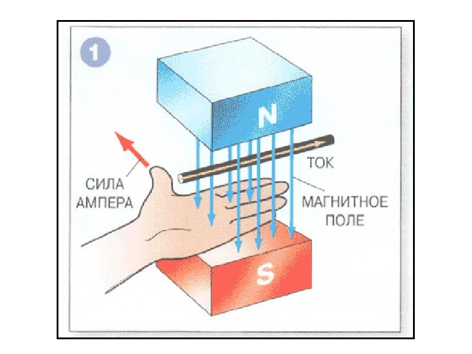


**Закон электромагнитной индукции Фарадея**

Фарадей сформулировал закон, который количественно описывает это явление:
 
$\mathcal{E} = -\frac{d\Phi}{dt}= -L\cdot \frac{dI}{dt} =\mathcal{E}_m \sin \omega t$
 
где:
- $ \mathcal{E} $ — электродвижущая сила (ЭДС) индукции (в вольтах),
- $ \Phi $ — магнитный поток через контур (в веберах),
- $ \frac{d\Phi}{dt} $ — скорость изменения магнитного потока.

Знак "минус" в формуле отражает **правило Ленца**, которое гласит, что индуцированный ток всегда направлен так, чтобы противодействовать изменению магнитного потока.


**Что такое магнитный поток?**

Магнитный поток $ \Phi $ через контур определяется как:
 
$\Phi = B \cdot A \cdot \cos(\theta)$
 
где:
- $ B $ — магнитная индукция (в теслах),
- $ A $ — площадь контура (в квадратных метрах) проводника который находится вв магнитном поле,
- $ \theta $ — угол между вектором магнитной индукции и нормалью к поверхности контура, в идеале перпендикулярно.

**ЭДС индукции (E)**

Возникающую в проводнике длиной $ l $, движущемся со скоростью $ v $ в магнитном поле с индукцией $ B $. Она является частным случаем закона Фарадея и широко используется в технике.
   - $ E = B \cdot l \cdot v \cdot \sin(\alpha) $ 

   где
   - $ E $ — ЭДС индукции (в вольтах),
   - $ B $ — магнитная индукция (в теслах),
   - $ l $ — длина проводника (в метрах),
   - $ v $ — скорость движения проводника (в метрах в секунду),
   - $ \alpha $ — угол между направлением движения проводника и направлением магнитного поля.

   Пример расчета:<br>
   Рассмотрим проводник длиной $ l = 0,5 \, \text{м} $, движущийся со скоростью $ v = 10 \, \text{м/с} $ в магнитном поле с индукцией $B = 0,2 \, \text{Тл}$. Угол между направлением движения и магнитным полем $\alpha = 30^\circ $.

   Тогда ЭДС индукции:
   - $E = B \cdot l \cdot v \cdot \sin(\alpha) = 0,2 \cdot 0,5 \cdot 10 \cdot \sin(30^\circ)$
   
   Так как $ \sin(30^\circ) = 0,5 $, то:
   - $E = 0,2 \cdot 0,5 \cdot 10 \cdot 0,5 = 0,5 \, \text{В}$


**Как возникает ЭДС индукции?**

ЭДС индукции возникает, если:
1. Магнитное поле изменяется: Например, если магнит движется относительно проводника или изменяется ток в катушке.
2. Площадь контура изменяется: Например, если проводник движется в магнитном поле.
3. Угол $\theta $ изменяется: Например, если контур вращается в магнитном поле.

Проводник должен двигаться относительно магнитных линий как можно перпендикулярней, если проводник двагается вдоль магнитных линий то ЭДС в проводнике не возникнет.

**Примеры электромагнитной индукции**
1. Движение магнита относительно катушки
Если магнит вдвигают в катушку или выдвигают из неё, то магнитный поток через катушку изменяется, и в катушке возникает ЭДС индукции.

2. Изменение тока в одной катушке индуцирует ток в другой
Если две катушки расположены близко друг к другу, и ток в одной катушке изменяется, то во второй катушке возникает ЭДС индукции. Это принцип работы **трансформатора**.

3. Вращение проводника в магнитном поле
Если проводник вращается в магнитном поле (например, в генераторе), то магнитный поток через контур изменяется, и в проводнике возникает ЭДС индукции.

**Правило Ленца**

Правило Ленца гласит, что направление индуцированного тока всегда таково, что создаваемое им магнитное поле **противодействует изменению магнитного потока**, вызвавшего этот ток. Это правило объясняет знак "минус" в законе Фарадея.

**Применение электромагнитной индукции**

Электромагнитная индукция используется в:
- Генераторах: Преобразуют механическую энергию в электрическую.
- Трансформаторах: Изменяют напряжение переменного тока.
- Индукционных нагревателях: Нагревают металлы за счет вихревых токов.
- Беспроводной зарядке: Передают энергию без проводов благодаря взаимной индукции.


---

## Типы катушек индуктивности
Катушки индуктивности делятся в основном на два класса: с магнитным и немагнитным сердечником.

Катушки индуктивности с немагнитным сердечником:

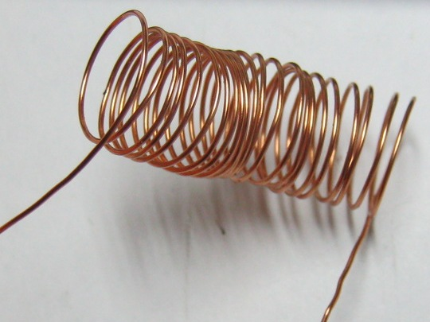

Катушки индуктивности с магнитным сердечником:

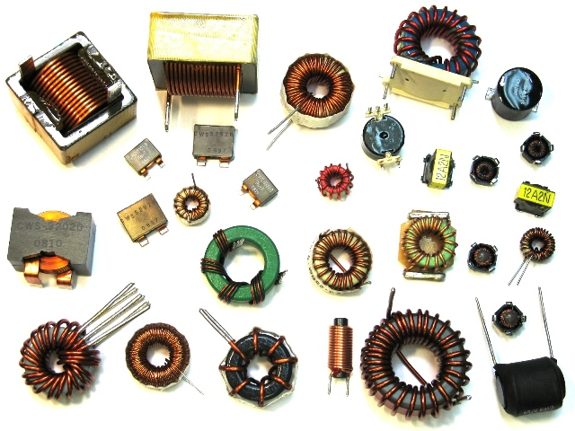

В основном используют сердечники из феррита и железных пластин. Сердечники повышают индуктивность катушек в разы. Сердечники в виде кольца (тороидальные) позволяют получить большую индуктивность, нежели просто сердечники из цилиндра.

Катушки с большой индуктивностью делают как трансформатор с железным сердечником, но с одной обмоткой, в отличие от трансформатора.

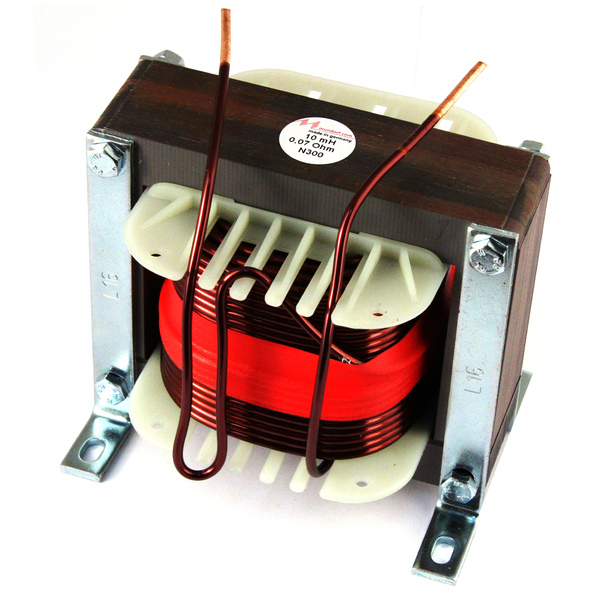

Дроссель  особый вид катушек индуктивностей. Это так называемые дроссели. Дроссель — это катушка индуктивности, задача которой состоит в том, чтобы создать в цепи большое сопротивление для переменного тока, чтобы подавить токи высоких частот.

Постоянный ток через дроссель проходит без проблем. Обычно дроссели включаются в цепях питания усилительных устройств. Дроссели предназначены для защиты источников питания от попадания в них высокочастотных сигналов (ВЧ-сигналов). На низких частотах (НЧ) они используются в фильтрах цепей питания и обычно имеют металлические или ферритовые сердечники. Ниже на фото силовые дроссели:

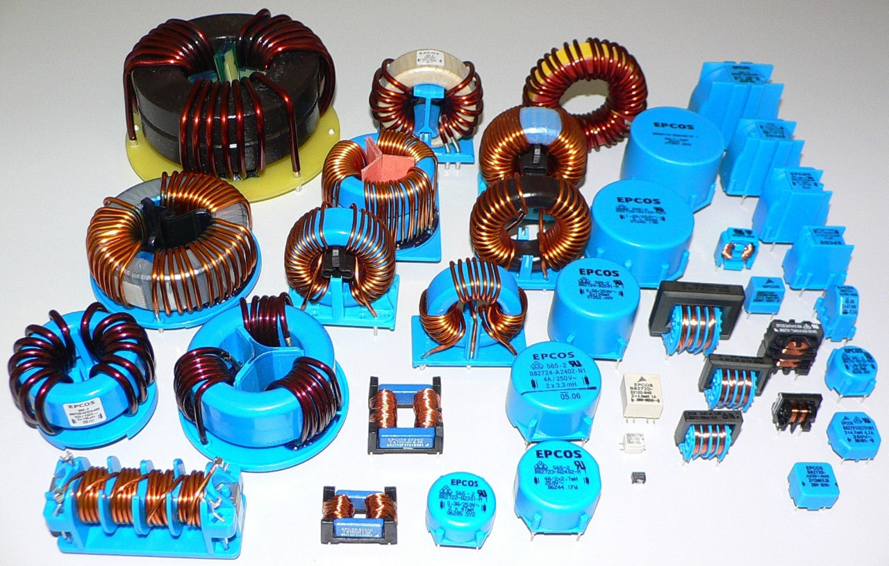

Также существует еще один особый вид дросселей — это сдвоенный дроссель. Он представляет из себя две встречно намотанных катушки индуктивности. За счет встречной намотки и взаимной индукции он более эффективен. Сдвоенные дроссели получили широкое распространение в качестве входных фильтров блоков питания, а также в звуковой технике.

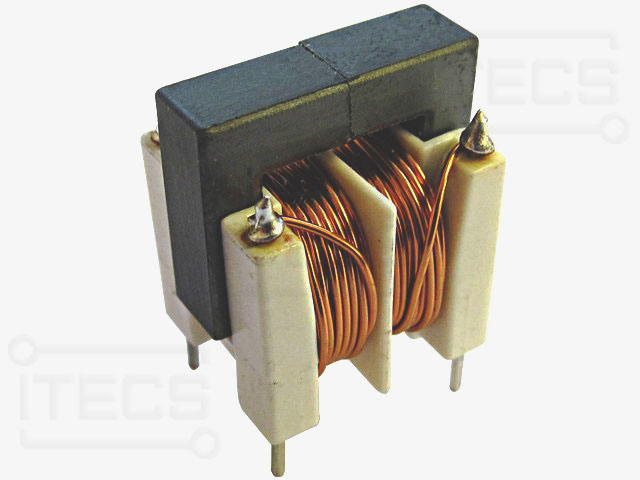

---

### Основные характеристики индуктивного элемента:


**Конвертер единиц измерения Генри**:<br>
 
<div class="inline-inputs">
<input type="number" id="valueConvertInductance">
<label for="fromUnitConvertInductance">Из:</label>
<select id="fromUnitConvertInductance">
<option value="H">H, Г (Генри)</option>
<option value="cH">cH, сГ (сантигенри)</option>
<option value="mH">mH, мГ (миллигенри)</option>
<option value="uH">$\mu\text{H}$, мкГ (микрогенри)</option>
<option value="nH">nH, нГ (наногенри)</option>
<option value="pH">pH, пГ (пикогенри)</option>
<option value="fH">fH, фГ (фемтогенри)</option>
</select>
<label for="toUnitConvertInductance">В:</label>
<select id="toUnitConvertInductance">
<option value="H">H, Г (Генри)</option>
<option value="cH">cH, сГ (сантигенри)</option>
<option value="mH">mH, мГ (миллигенри)</option>
<option value="uH">$\mu\text{H}$, мкГ (микрогенри)</option>
<option value="nH">nH, нГ (наногенри)</option>
<option value="pH">pH, пГ (пикогенри)</option>
<option value="fH">fH, фГ (фемтогенри)</option>
</select>
</div>
<div class="inline-inputs">
<button onclick="convertInductance()">Конвертировать</button>
<p id="resultConvertInductance">...</p>
</div>

1. **Постоянная времени $\tau$** — это время, за которое ток в цепи с индуктивностью достигает примерно 63,2% от своего максимального значения (или уменьшается до 36,8% от начального значения). По прошествии 5-ти $\tau$ времени, катушка заряжена на 99.24% или разряжена (в зависимости от режима). По прошествии 3-х $\tau$ времени, катушка заряжена/разряжена на 95%.

   Постоянная времени показывает, насколько быстро цепь с индуктивностью реагирует на изменения напряжения.
   - Чем больше индуктивность $ L $, тем медленнее меняется ток (больше инерция), т.е. чем больше временная постоянная, тем медленнее изменяется ток.
   - Чем больше сопротивление $ R $, тем быстрее ток достигает установившегося значения.

   $\tau = \frac{L}{R}$ [sec]
   
   Где:
   - $ \tau $ — постоянная времени (в секундах),
   - $ L $ — индуктивность (в генри, Гн),
   - $ R $ — сопротивление цепи (в омах, Ом).


2. **Индуктивность (L)**:
   - Измеряется в **Генри (Гн)** и замеряется с помощью [LC — метра](https://www.ruselectronic.com/news/lc-mjetr/).
     - Миллигенри (мГн): $1\ mH = 10^{-3} H (0.001 H)$
     - Микрогенри (мкГн): $1\ \mu H = 10^{-6} H (0.000001 H)$
   - Определяет способность элемента накапливать магнитную энергию.
   - Чем больше витков провода в катушке и чем выше проницаемость сердечника, тем больше индуктивность.

   $ L = \frac{\Phi}{I} \cdot  N_{витки\ кат}$

   $ L = \frac{\psi}{I}$

   $ U_L = {I_L} \cdot {R} = 0$ (напряжение на индуктивности стремиться к 0 в цепи постоянного тока)
 
   где:  
    $\Phi $ — магнитный поток через площадь, ограниченную одним витком
    
     **Магнитное потоксосцепление**: $\psi = N{витки\ кат} \cdot \Phi$  [веберов]

     Магнитное потокосцепление — это физическая величина, характеризующая взаимодействие магнитного поля и электрической цепи, в частности, катушки. Оно численно равно произведению магнитного потока через площадь, ограниченную контуром витка, на число витков контура.

     **Закон электромагнитной индукции Фарадея**: ЭДС индукции в контуре пропорциональна скорости изменения магнитного потоксосцепления.
          
3. **Энергия магнитного поля**:
   - Накапливаемая энергия выражается формулой:
    
     $W = \frac{1}{2} L I^2,$
    
     где  
      - $W$ — энергия (Дж или J),  
      - $L$ — индуктивность (Гн или H),  
      - $I$ — ток (А).

4. **ЭДС самоиндукции**:
   - Когда ток через индуктивный элемент изменяется, в нём возникает электродвижущая сила (ЭДС) самоиндукции, которая препятствует изменению тока:
     
     $\mathcal{E} = -L \frac{dI}{dt} =-L \cdot \frac{I_0}{\Delta t}$
     
     где  
     - $I_0$ — ток в цепи на момент начала разряда (если катушка была полностью заряжена тогда $I_0=I_{max}$)
     - $\mathcal{E}$ — ЭДС (В),  
     - $\frac{dI}{dt}\approx \frac{I_0}{\Delta t}$ — скорость изменения тока.

   Если ток уменьшается очень быстро (например, при размыкании ключа), то $ \frac{dI}{dt} $ становится очень большим, и напряжение на катушке $ U_L $ может достигать огромных значений.

   Напряжение на катушке со знаком "минус" указывает на то, что напряжение направлено против изменения тока.

5. **Максимальный ток:**
 
   - $I_{max} = \frac{U_{source}}{R}$ 

     где $U_{source}$ — напряжение источника.

6. **Ток через катушку:**
   
   **при заряде**: $I(t) = I_{max}\cdot \left(1 - e^{-\frac{t}{\tau}}\right)$

   **при разряде**: $I(t) = I_0 \cdot e^{-\frac{t}{\tau}}$

   где:
   - $R$ — сопротивление цепи,
   - $I_0$ — ток в цепи на момент начала разряда (если катушка была полностью заряжена тогда $I_0=I_{max}$)
   - $\tau = \frac{L}{R}$ — постоянная времени.

7. **Напряжение на катушке при установлении:**
    
   **при заряде**: $U_L(t) = U_{source} \cdot e^{-\frac{t}{\tau}}$

   **при разряде**: $U_L(t) = I_0 \cdot R \cdot e^{-\frac{t}{\tau}}$

   где:
      - $R$ — сопротивление цепи,
      - $I_0$ — ток в цепи на момент начала разряда (если катушка была полностью заряжена тогда $I_0=I_{max}$)
      - $\tau = \frac{L}{R}$ — постоянная времени.
 
8. **Добротность катушки** (Q-фактор) 

   Добротность катушки - это коэффициент, определяющий отношение пассивного сопротивления катушки (энергию в своем магнитном пол) к активному сопротивлению (нагрев обмотки проволоки, а также потерями в сердечнике), который характеризует эффективность катушки индуктивности в накоплении энергии по сравнению с ее потерями энергии. Значение добротности зависит от типа и диаметра обмоточного провода, формы обмотки, и материала корпуса катушки.

   $Q = \frac{XL}{R}$

   Где:

   * $Q$ - добротность (Q-фактор)
   * $XL$ - индуктивное реактивное сопротивление катушки (XL = ωL = 2πfL), где:
      * $ω$ - угловая частота
      * $f$ - частота
      * $L$ - индуктивность катушки
   * $R$ - активное сопротивление катушки (сопротивление обмотки и потери в сердечнике)


   Интерпретация значения добротности:
   * **Высокое значение Q (Q >> 1):** Указывает на то, что реактивное сопротивление катушки значительно больше ее активного сопротивления. Это означает, что катушка эффективно накапливает энергию и имеет низкие потери. Такие катушки считаются "более качественными".
   * **Низкое значение Q (Q ≈ 1 или Q < 1):** Указывает на то, что активное сопротивление катушки сравнимо с ее реактивным сопротивлением или даже больше. Это означает, что значительная часть энергии теряется в виде тепла, и катушка менее эффективно накапливает энергию.

   Увеличение R приводит к уменьшению значения добротности (Q).

   Чем больше величина вихревых токов (или токи Фуко), тем больше потери энергии в сердечнике и, следовательно, тем выше эффективное активное сопротивление (R) катушки.


## [Как размещать индуктивности на печатной плате](https://cxem.net/beginner/beginner175.php)

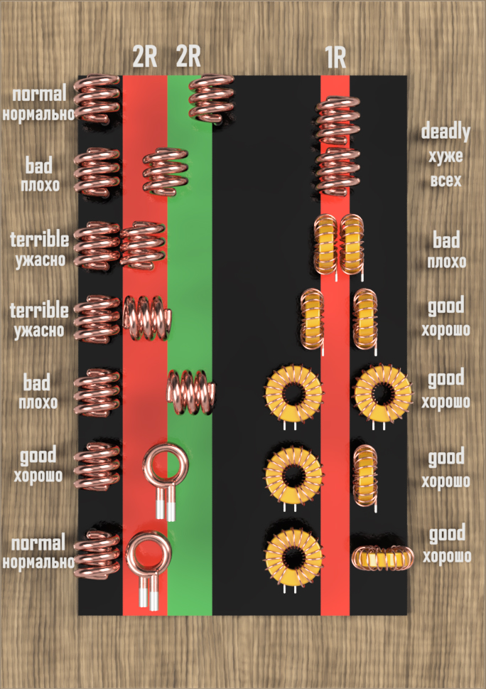

**Можно расположить катушки таким образом, чтобы минимизировать или практически исключить их взаимное влияние (наведенную индуктивность) без использования экранирования**. Это достигается за счет определенных геометрических расположений и ориентаций катушек.

Вот несколько основных способов:

1. **Ортогональное (перпендикулярное) расположение осей катушек:** Если оси двух катушек расположены под углом 90 градусов друг к другу, их магнитные поля будут в значительной степени ортогональны. Это означает, что магнитный поток, создаваемый одной катушкой, будет проходить преимущественно параллельно виткам второй катушки, не пересекая их перпендикулярно и, следовательно, не индуцируя в ней значительной ЭДС. Чем точнее угол 90 градусов, тем меньше взаимная индуктивность.

2. **Большое расстояние между катушками:** Магнитное поле, создаваемое катушкой, быстро ослабевает с увеличением расстояния. Если две катушки расположены на достаточно большом расстоянии друг от друга, магнитный поток от одной катушки, достигающий второй, будет очень слабым, что приведет к незначительной наведенной индуктивности. Недостаток этого метода - увеличение габаритов всей системы.

3. **Специальная геометрия катушек:**
    * **Тороидальные катушки:** Тороидальные катушки имеют магнитное поле, практически полностью сосредоточенное внутри тора (кольца). Внешнее магнитное поле у таких катушек очень слабое, что значительно уменьшает их влияние на соседние компоненты и наоборот.
    * **Катушки с противоположным направлением намотки (в некоторых случаях):** Если две катушки намотаны таким образом, что создаваемые ими магнитные поля в области другой катушки направлены противоположно и имеют примерно одинаковую величину, их взаимное влияние может быть скомпенсировано. Однако это сложнее реализовать на практике и требует точной настройки.

4. **Использование катушек с сердечниками, направляющими магнитный поток:** Ферритовые или другие магнитные сердечники могут быть сконструированы таким образом, чтобы направлять магнитный поток внутри катушки, минимизируя его рассеяние в окружающее пространство. Это уменьшает магнитное поле, достигающее соседних катушек.

**Важно отметить:**

* **Полностью исключить взаимное влияние практически невозможно**, особенно если катушки находятся относительно близко друг к другу. Всегда будет присутствовать некоторая, пусть и очень малая, степень магнитной связи.
* **Эффективность этих методов зависит от конкретной конструкции катушек, их размеров, формы, количества витков и рабочей частоты.**
* **На высоких частотах паразитная емкость между катушками также может играть роль в их взаимодействии.**

**В заключение:**

Хотя экранирование является эффективным способом уменьшения наведенной индуктивности, **геометрическое расположение и ориентация катушек могут значительно снизить или минимизировать их взаимное влияние без использования экранов**. Выбор метода зависит от конкретных требований к системе, ее габаритов, стоимости и необходимого уровня изоляции между катушками. В некоторых случаях может использоваться комбинация этих методов.

---

**Наведенная индуктивность (Induced Inductance)** — это явление, при котором изменение тока в одном проводнике (или катушке индуктивности) создает изменяющееся магнитное поле, которое, в свою очередь, индуцирует электродвижущую силу (ЭДС) и, как следствие, ток во втором проводнике (или катушке), расположенном рядом. Этот индуцированный ток стремится противодействовать изменению магнитного потока, вызвавшему его появление (закон Ленца).

По сути, это **взаимная индуктивность** между двумя или более элементами цепи, где изменение тока в одном элементе "наводит" ЭДС и потенциально ток в другом.

**При чем тут экранирование?**

Экранирование используется для **уменьшения или предотвращения наведенной индуктивности** между различными частями электрической или электронной схемы. Это достигается путем создания физического барьера из проводящего материала (экрана), который размещается между элементами, взаимодействие которых необходимо ослабить.

Вот как это работает:

1. **Создание барьера для магнитного поля:** Проводящий экран, помещенный между двумя индуктивно связанными элементами, перехватывает часть магнитного потока, создаваемого одним элементом.
2. **Индуцирование токов в экране:** Изменяющееся магнитное поле, проходящее через экран, индуцирует в нем вихревые токи (токи Фуко).
3. **Создание встречного магнитного поля:** Эти индуцированные токи в экране, в свою очередь, создают собственное магнитное поле, которое направлено **противоположно** исходному магнитному полю, создаваемому первым элементом.
4. **Ослабление результирующего магнитного поля:** В результате результирующее магнитное поле, достигающее второго элемента, значительно ослабляется.
5. **Уменьшение наведенной ЭДС и тока:** Поскольку магнитный поток, пронизывающий второй элемент, уменьшается, то и наведенная в нем ЭДС и, следовательно, наведенный ток также становятся значительно меньше.

**Типы экранирования для уменьшения наведенной индуктивности:**

* **Электростатическое экранирование:** Используется для предотвращения емкостной связи (которая также может привести к передаче сигналов). Заземленный проводящий экран между двумя цепями перехватывает электрические поля. Хотя это в первую очередь для емкостной связи, оно может косвенно влиять и на индуктивную связь, особенно на высоких частотах.
* **Магнитное экранирование:** Используется для непосредственного ослабления магнитных полей. Для этого применяются материалы с высокой магнитной проницаемостью (например, мю-металл, пермаллой). Такие материалы "притягивают" магнитные линии, шунтируя их и не давая им распространяться на соседние элементы. Это наиболее эффективный способ снижения наведенной индуктивности.
* **Экранирование витой парой:** Скручивание проводов витой пары само по себе является формой экранирования от внешних магнитных полей. Внешнее магнитное поле одинаково воздействует на оба проводника пары, индуцируя в них ЭДС противоположной полярности, которые взаимно компенсируются.

**Применение экранирования для борьбы с наведенной индуктивностью:**

* **Трансформаторы:** Экранирующие обмотки между первичной и вторичной обмотками используются для уменьшения емкостной связи и утечки магнитного потока, что снижает наведенную индуктивность и улучшает характеристики.
* **Кабели:** Экранированные кабели (например, коаксиальные кабели, экранированная витая пара) используются для предотвращения как внешних помех, так и излучения собственных помех, что включает в себя минимизацию нежелательной наведенной индуктивности на соседние кабели или компоненты.
* **Электронные блоки и корпуса:** Металлические корпуса и экранирующие перегородки внутри электронных устройств используются для предотвращения взаимного влияния различных функциональных блоков друг на друга через электромагнитные поля, включая индуктивную связь.
* **Индуктивности и дроссели:** Иногда сами индуктивные элементы помещаются в экранирующие корпуса для предотвращения их влияния на соседние компоненты и наоборот.

Таким образом, **экранирование является важным методом борьбы с нежелательной наведенной индуктивностью**, обеспечивая более стабильную и предсказуемую работу электронных схем за счет уменьшения паразитных взаимодействий между их элементами.

