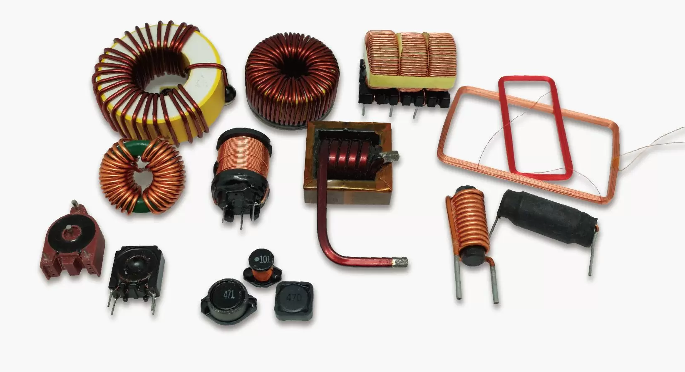
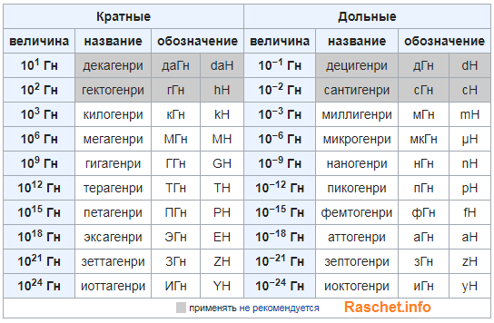

# Индуктивный элемент

[Основные понятия цепей с магнитными связями](https://www.youtube.com/watch?v=gdws_TmnQOI&list=PLa1hZtD9sL40izP87AoDr1O8CmlvW8pck&index=23)

**Индуктивный элемент** — это **линейный пассивный** компонент электрической цепи, который обладает свойством индуктивности, то есть способностью накапливать **энергию ($W $) в виде магнитного поля** при прохождении через него электрического тока. Индуктивные элементы играют важную роль в цепях переменного тока и в схемах, где требуется управление или фильтрация сигналов.

Но катушка индуктивности с сердечником т.е. с обмоткой уже **не линейный** компонет.

Схема замещения идеального реактивного элемента:

Схема реального реактивного элемента т.е. он обладает каким-то сопротивлением, резистор подключенным последовательно с индуктивностью, на плате резистор будет но на схеме замещения резистора не будет:

Обозначение на схемах:

**Катушка индуктивности (индуктивность)** — это наиболее распространённый индуктивный элемент. Она состоит из проводника, намотанного в виде спирали, что создаёт магнитное поле при прохождении тока. При этом ее индуктивность значительно выше чем ее внутреннее сопротивление.

---

### Поведение индуктивного элемента в цепи DC:
**Постоянный ток**:
   - Индуктивный элемент ведёт себя как обычный проводник с очень малым сопротивлением, так как магнитное поле стабилизируется.
   
---

## Индуктивность

Если через провод пропустить электрический ток, то он вокруг себя создаст магнитное поле:

А если провод намотать спиралью (соленоид) то провода будут пересекать магнитное поле:

Чем больше линий магнитного поля пересекут площадь этого соленоида, в нашем случае площадь цилиндра, тем больше будет магнитный поток (Ф). Так как через катушку течет электрический ток, значит, через нее проходит ток с Силой тока (I), а коэффициент между магнитным потоком и силой тока называется индуктивностью и вычисляется по формуле:

$L=\frac{\Phi}{I}$

С научной же точки зрения, индуктивность — это способность извлекать энергию из источника электрического тока и сохранять ее в виде магнитного поля. Если ток в катушке увеличивается, магнитное поле вокруг катушки расширяется, а если ток уменьшается , то магнитное поле сжимается.

**ЭДС самоиндукции** — при подаче на катушку постоянного напряжения, в катушке возникает на короткий промежуток времени противоположное напряжение. Эта ЭДС зависит от значения индуктивности катушки. Поэтому, в момент подачи напряжения на катушку сила тока в течение долей секунд плавно меняет свое значение от 0 до некоторого значения, потому что напряжение, в момент подачи электрического тока, также меняет свое значение от ноля и до установившегося значения. Согласно Закону Ома $I_L=\frac{U_L}{R_L}$

Если разомкнуть цепь то катушка индуктивности — источник тока (ток в цепи резко падает, а катушка, согласно закону Ленца, противодействует этому изменению, поэтому возникает ЭДС самоиндукции), и у нас ЭДС самоиндукции будет суммироваться к напряжению, которое мы уже подали на катушку. То есть как только мы разрываем цепь, на катушке напряжение в этот момент может быть в разы больше, чем было до размыкания  цепи, а сила тока в цепи катушки будет тихонько падать, так как ЭДС самоиндукции будет поддерживать убывающее напряжение.

Если ток обрывается мгновенно (например, механическим размыканием контактов), производная тока по времени становится очень большой, и, соответственно, напряжение на катушке может резко возрасти до значительных значений. Это и вызывает те самые высоковольтные всплески, которые могут пробивать изоляцию или вызывать искрение на контактах размыкателя.

Поэтому в схемах с индуктивными нагрузками часто используют защитные диоды (например, диод свободного хода в цепях с реле или электромагнитами), чтобы замкнуть ток через катушку и рассеять энергию в виде тепла, а не в виде разрушительных всплесков напряжения.

---

### Типы катушек индуктивности
Катушки индуктивности делятся в основном на два класса: с магнитным и немагнитным сердечником.

Катушки индуктивности с немагнитным сердечником:

Катушки индуктивности с магнитным сердечником:

В основном используют сердечники из феррита и железных пластин. Сердечники повышают индуктивность катушек в разы. Сердечники в виде кольца (тороидальные) позволяют получить большую индуктивность, нежели просто сердечники из цилиндра.

Катушки с большой индуктивностью делают как трансформатор с железным сердечником, но с одной обмоткой, в отличие от трансформатора.

Дроссель  особый вид катушек индуктивностей. Это так называемые дроссели. Дроссель — это катушка индуктивности, задача которой состоит в том, чтобы создать в цепи большое сопротивление для переменного тока, чтобы подавить токи высоких частот.

Постоянный ток через дроссель проходит без проблем. Обычно дроссели включаются в цепях питания усилительных устройств. Дроссели предназначены для защиты источников питания от попадания в них высокочастотных сигналов (ВЧ-сигналов). На низких частотах (НЧ) они используются в фильтрах цепей питания и обычно имеют металлические или ферритовые сердечники. Ниже на фото силовые дроссели:

Также существует еще один особый вид дросселей — это сдвоенный дроссель. Он представляет из себя две встречно намотанных катушки индуктивности. За счет встречной намотки и взаимной индукции он более эффективен. Сдвоенные дроссели получили широкое распространение в качестве входных фильтров блоков питания, а также в звуковой технике.

---

### Основные характеристики индуктивного элемента:

**Конвертер единиц измерения Генри**: 
 

<input type="number" id="valueConvertInductance">
<label for="fromUnitConvertInductance">Из:</label>
<select id="fromUnitConvertInductance">
<option value="H">H, Г (Генри)</option>
<option value="cH">cH, сГ (сантигенри)</option>
<option value="mH">mH, мГ (миллигенри)</option>
<option value="uH">$\mu\text{H}$, мкГ (микрогенри)</option>
<option value="nH">nH, нГ (наногенри)</option>
<option value="pH">pH, пГ (пикогенри)</option>
<option value="fH">fH, фГ (фемтогенри)</option>
</select>
<label for="toUnitConvertInductance">В:</label>
<select id="toUnitConvertInductance">
<option value="H">H, Г (Генри)</option>
<option value="cH">cH, сГ (сантигенри)</option>
<option value="mH">mH, мГ (миллигенри)</option>
<option value="uH">$\mu\text{H}$, мкГ (микрогенри)</option>
<option value="nH">nH, нГ (наногенри)</option>
<option value="pH">pH, пГ (пикогенри)</option>
<option value="fH">fH, фГ (фемтогенри)</option>
</select>

<button onclick="convertInductance()">Конвертировать</button>

...

1. **Индуктивность (L)**:
   - Измеряется в **Генри (Гн)** и замеряется с помощью [LC — метра](https://www.ruselectronic.com/news/lc-mjetr/).
     - Миллигенри (мГн): $1\ mH = 10^{-3} H (0.001 H)$
     - Микрогенри (мкГн): $1\ \mu H = 10^{-6} H (0.000001 H)$
   - Определяет способность элемента накапливать магнитную энергию.
   - Чем больше витков провода в катушке и чем выше проницаемость сердечника, тем больше индуктивность.

   $ L = \frac{\Phi}{I} \cdot  N_{витки\ кат}$

   $ L = \frac{\psi}{I}$

   $ U_L = {I_L} \cdot {R} = 0$ (напряжение на индуктивности стремиться к 0 в цепи постоянного тока)
 
   где:  
    $\Phi $ — магнитный поток через площадь, ограниченную одним витком
    
     **Магнитное потоксосцепление**: $\psi = N{витки\ кат} \cdot \Phi$  [веберов]

     Магнитное потокосцепление — это физическая величина, характеризующая взаимодействие магнитного поля и электрической цепи, в частности, катушки. Оно численно равно произведению магнитного потока через площадь, ограниченную контуром витка, на число витков контура.

     **Закон электромагнитной индукции Фарадея**: ЭДС индукции в контуре пропорциональна скорости изменения магнитного потоксосцепления.
          
2. **Энергия магнитного поля**:
   - Накапливаемая энергия выражается формулой:
    
     $W = \frac{1}{2} L I^2,$
    
     где  
      - $W$ — энергия (Дж),  
      - $L$ — индуктивность (Гн),  
      - $I$ — ток (А).

3. **ЭДС самоиндукции**:
   - Когда ток через индуктивный элемент изменяется, в нём возникает электродвижущая сила (ЭДС) самоиндукции, которая препятствует изменению тока:
     
     $\mathcal{E} = -L \frac{dI}{dt},$
     
     где  
     - $\mathcal{E}$ — ЭДС (В),  
     - $\frac{dI}{dt}$ — скорость изменения тока.
 
 
4. **Ток через катушку при установлении:**
   
   $I(t) = \frac{U_{source}}{R} \cdot \left(1 - e^{-\frac{t}{\tau}}\right)$
   
   где:
   - $U_{source}$ — напряжение источника,
   - $R$ — сопротивление цепи,
   - $\tau = \frac{L}{R}$ — постоянная времени.

5. **Напряжение на катушке при установлении:**
    
   $U_L(t) = U_{source} \cdot e^{-\frac{t}{\tau}}$
   
#### Пример: Установление тока в катушке
- Дано: $U_{source} = 12 \, \text{В}$, $R = 100 \, \text{Ом}$, $L = 0.1 \, \text{Гн}$.
- Постоянная времени:
  
  $\tau = \frac{L}{R} = \frac{0.1}{100} = 0.001 \, \text{с}$
  
- Ток через катушку через $0.001 \, \text{с}$:
 
  $I(0.001) = \frac{12}{100} \cdot \left(1 - e^{-1}\right) \approx 0.076 \, \text{А}$
      

---

Основы индуктивности:

Что такое индуктивность и как она измеряется (Генри).

Как работает катушка в цепи постоянного тока (установление тока).

Формулы для расчёта тока и напряжения при включении/выключении.

Практические примеры:

Проведите эксперименты с RC-цепями.

Разберитесь, как конденсаторы работают в фильтрах и таймерах.

Установление тока в RL-цепи.

Использование катушки в LC-цепях (например, резонансные контуры).

Эксперименты:

Соберите простую RL-цепь и измерьте время установления тока.

Используйте осциллограф для наблюдения за формой сигнала.