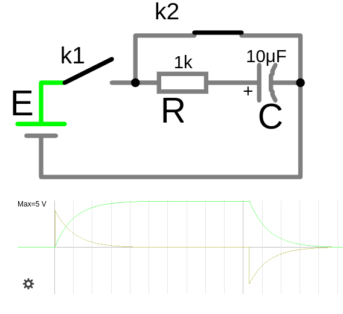
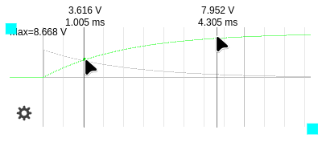

# Поведение конденсатора в переходном режиме


## Поведение конденсатора в установившемся режиме в цепи постоянного тока (обрыв $I=0,A$)

Конденсатор противодействует изменению напряжения. Если напряжение пытается измениться, конденсатор заряжается или разряжается, чтобы его стабилизировать. Накопление энергии происходит в виде электрического поля между его обкладками. В установившемся режиме ведёт себя как разрыв цепи (обрыв). Реакция на скачок напряжения вызывает скачок тока.

В **установившемся режиме** в цепи постоянного тока (когда все переходные процессы завершились) конденсатор ведет себя как разомкнутая цепь (нет тока,а напряжение в ветви равно источнику так как конденсатор заряжен).


**1. Включение конденсатора в цепь постоянного тока (DC)**
- **При подаче напряжения на конденсатор** ток начинает протекать в цепи, но **только до тех пор, пока конденсатор заряжается**. Это происходит, потому что в начале зарядки разность потенциалов между обкладками конденсатора мала, и ток ограничивается только сопротивлением цепи. И так как в начале заряда емкость не обладает сопротивлением то ток от источника идет без сопротивления т.е. пусковой ток высокий, что может повредить компоненты цепи или сработать защита источника, для целей защиты мы должны ограничить ток включив последовательно с нагрузкой **токоограничивающий резистор**, по формуле $R_{огран.}=\frac{U}{I_{max}}$ и подобрать резистор с мощностью рассеивания $P=I_{ветви}\cdot R$
   - ток в цепи при заряде может быть большим так как напряжение на конденсаторе при старте 0 вольт и при отсутвии ограничивающего ток сопротивления или оно маленькое, ток может повредить компоненты
   - $I=\frac{U_{вх}-U_{c}}{R_{огран.}}=\frac{U_{вх}-0}{R_{огран.}}$

   Способ убрать токоограничивающий резистор из схемы, так как он нужен только при включении. Ключ `k2` после заряда конденсатора т.е. в установившемся режиме замыкают (шунтируют резистор) и ток через резистор не идет.
   

- Постепенно, по мере зарядки, напряжение на обкладках конденсатора увеличивается, и ток уменьшается. Как только напряжение на конденсаторе достигает напряжения источника, ток в цепи прекращается, так как конденсатор становится эквивалентен разрыву цепи ($R\to \infty$).
- Итог: После завершения зарядки конденсатор больше не пропускает ток в цепи постоянного тока (он ведёт себя как разомкнутая цепь). Как только напряжение на обкладках конденсатора достигает напряжения источника, ток прекращается, так как нет изменения напряжения (а ток в конденсаторе зависит от изменения напряжения: $ I = C\cdot \frac{dU}{dt} $).


**2. Отключение конденсатора от источника**
- При отключении конденсатора от источника питания он обладает сохраненным зарядом на своих обкладках, то есть напряжение на его обкладках остаётся неизменным (в идеальном случае) равным источнику напряжения. Это связано с тем, что энергия, накопленная в электрическом поле, остаётся в конденсаторе.

- Если конденсатор отключён от источника и не подключён к нагрузке, он сохраняет заряд, ток через конденсатор не протекает. (Однако в реальности всегда есть токи утечки через диэлектрик и окружающую среду расположенные между пластинами конденсатора, поэтому конденсатор постепенно разряжается от 1 сек до нескольких часов.)

- Если конденсатор отключён от источника но подключён к нагрузке, он начинает разряжаться через нагрузку (например, резистор) или через внутреннее сопротивление цепи.


**3. Разряд конденсатора**
- Если цепь замкнуть подключив нагрузку через которую конденсатор сможет разрядится и одновременно источник напряжения, то:
  - либо (обрыв) подача напряжения и тока прекратится если конденсатор уже был заряжен
  - либо конденсатор начнет снова заряжаться
- Если цепь замкнуть подключив только нагрузку, то:
  - либо конденсатор будет разряжаться через нагрузку, если был у него заряд "отдавая" накопленную энергию. При этом через нагрузку будет течь ток, а напряжение на конденсаторе будет постепенно уменьшаться.  
  - либо обрыв, так как заряда нет
   
На схеме два режима работы, `режим 1` заряда конденсатора, когда ключ `k1` замкнут,а ключ `k2` разомкнут. И `режим 2`, разряд конденсатора об резистор, когда ключ `k1` разомкнут,а ключ `k2` замкнут.
Осциллограф подключен к конденсатору и показывает сперва `режим 1` заряд и потом `режим 2` разряд по экспоненте.



<a href="/theories_of_electrical_circuits/falstad/circuitjs-84.txt" download="circuitjs-84.txt">Скачать схему для www.falstad.com/circuit</a>

<a href="/theories_of_electrical_circuits/falstad/circuitjs-81.2.txt" download="circuitjs-81.2.txt">Скачать схему мультивибратора на транзисторах для www.falstad.com/circuit</a>

[мультивибратор](https://radioskot.ru/publ/nachinajushhim/multivibrator/5-1-0-600)

**Заряженная катушка индуктивности после размыкания цепи пытаясь поддерживать ток, повышает напряжение, а заряженный конденсатор при размыкании цепи пытаясь удержать напряжение, повышает ток, таким образом они способствуют протеканию тока после размыкания цепи.**

 
### Пояснение

Исходная цепь (слева на схеме) и как цепь будет выглядеть в установившемся режиме (справа), в котором конденсаторы равносильны обрыву цепи. Ток в ветви с конденсатором $C_1$ и $C_2$ равен 0, поэтому остается только путь через ветвь с резистором $R_1$


Когда конденсатор полностью заряжен то ток через него перестает протекать, поэтому конденсатор в таких цепях представляют как разрыв цепи и ток $I = 0$ в ветки с конденсатором,а сопротивление ветви с конденсатором $R \to \infty$

Когда цепь замыкается то конденсатор заряжается т.е. ток протекает, и когда цепь размыкается конденсатор разряжается т.е. ток тоже протекает, но это **переходные режимы**, а в устоявшемся режиме ток $I = 0$


- для отрезка [0A], ток в конденсаторе $ I = C\cdot \frac{dU}{dt} =  C\cdot \frac{U_1 - U_2}{t_0 - t_1} = C\cdot \frac{5 - 0}{1 - 0} = C\cdot \frac{5,B}{1,mc}, A$ т.е. растет с этой скоростью до момента полного заряда конденсатора

- для отрезка [AB] когда конденсатор зярядился,т.е. для устоявшегося режима, $I = 0$ потому что 
$I = C\cdot \frac{U_2 - U_3}{t_1 - t_2} = C\cdot \frac{5-5 B}{2 mc} = C\cdot \frac{0,B}{2,mc} = 0, A$, т.е. напряжение не изменилось за время и соответсвенно ток нулевой на этом отрезке $\to I=0,A$ это равносльно **разрыву цепи**

- отрезок [BC] характерен в моменты включения/выключения или замыкания/размыкания цепи, показывает зависимость времени от тока, чем больше изменится напряжение за единицу времени тем больше ток будет протекать через конденсатор
$I = C\cdot \frac{U_3 - U_2}{t_3 - t_2} = C\cdot \frac{15 - 5}{4 - 3} = C\cdot \frac{10,B}{1,mc}$

Когда в электрической цепи есть несколько заряженных конденсаторов и резисторы, подключенные между ними, то при замыкании цепи произойдет процесс перераспределения зарядов. Этот процесс будет продолжаться до тех пор, пока не установится равновесное состояние, то есть пока напряжения на всех конденсаторах не сравняются они будут передавать заряд на более низкий потенциал другого конденсатора то есть конденсатор с более низким потенциалом будет еще и заряжаться.

---

## Для проверки того, как конденсатор отдает энергию после отключения источника

Выбор компонентов:
- Конденсатор: Подберите ёмкость от 100 μФ до 1000 μФ, чтобы он мог накопить достаточную энергию.
- Резистор: Обычно 330 Ом для светодиодов.
- Источник: 5–12 В (в зависимости от напряжения светодиода).

При отключении от источника питания, тогда через некоторое время ток на конденсаторе станет равен 0, Ампер т.е. конденсатор уже зарядил свое электрическое поле, отдавая накопленное напряжение. Если конденсатор был заряжен, то после отключения его от питания, он начнёт отдавать в цепь заряд т.е. разряжаться через светодиод, и светодиод будет светиться до тех пор, пока конденсатор не разрядится (напряжение на конденсаторе не упадёт ниже порога включения светодиода, в нашем случае при падении напряжения на светодиоде ниже 1.4, Вольт).


  
Накопленная энергия конденсатора за время установившегося режима:
 - $C=200 \mu F = 200 \cdot 10^{-6} F = 0.0002 F$ т.е. мы микрофарады $\mu F$ привели к фарадам $F$ формы международной единицы СИ 
 - $W(t\to \infty) = \frac{1}{2}\cdot C\cdot U^2(t\to \infty) = (1/2) * 0.0002 F * (9 V)^2 = 0.5 * 0.0002 * 81 = 0.0081, J$

   Таким образом, конденсатор емкостью 100 кФ, заряженный до напряжения 9 вольт, накопит энергию в 0.0081 джоуля.

## Пример расчета времени заряда конденсатора в RC-цепи

При заряде конденсатора напряжение на нём изменяется по экспоненте. 

**Формулы для заряда конденсатора:**

- Формула для напряжения при заряде на конденсаторе ($U_C$) в зависимости от времени ($t$) выглядит так:

    $U_C(t) = U_{source} \cdot \left(1 - e^{-\frac{t}{R\cdot C}}\right)$
    
    где:
    - $R\cdot C=\tau$ — постоянная времени
    - $U_{source}$ — напряжение источника,
    - $R$ — сопротивление цепи заряда,
    - $C$ — ёмкость конденсатора,
    - $R\cdot C=\tau$ — постоянная времени (сек) для заряда емкости до 63.2% от напряжения источника. По прошествии 5-ти $\tau$ времени, емкость заряжена на 99.24%    
    - $t$ — время с начала заряда,
    - $e$ — основание натурального логарифма ($e \approx 2.718$).

- Формула для тока на конденсаторе ($I(t)$) при заряде в зависимости от времени ($t$) выглядит так:

    $I(t) = \frac{dQ}{dt} = \frac{U_{source}}{R} \cdot e^{-\frac{t}{R\cdot C}}$

    где:
     - $R\cdot C=\tau$ — постоянная времени

- Формула величины заряда:

    $Q(t) = C \cdot U_C(t)$

- Формула величины накопленной энергия электрического поля

    $W(t) = \frac{1}{2}\cdot C\cdot U_{C}^2(t)= \frac{Q^2(t)}{2\cdot C}$ (Дж)

    где  
    - $W$ — энергия (Дж)
    - $C$ — ёмкость (Ф) 
    - $U$ — напряжение (В)
    - $Q^2(t)$ — заряд (Кл) в момент времени t

**Дано**:
  - Напряжение источника: $U_{source} = 9 \, \text{В}$,
  - Сопротивление: $R = 10 \, \text{Ом}$,
  - Ёмкость: $C = 200 \, \mu\text{F} = 200 \cdot 10^{-6} = 0.0002 \, \text{F}$,
  - Время: 
    - $t=0$ — к моменту начала заряда
    - $t = 1 \, \text{мс} = 1/1000 = 0.001 \, \text{с}$.  
    - $t = 4.3 \, \text{мс} = 4.3/1000 = 0.0043 \, \text{с}$.
    - $t \to \infty$ — установившийся режим




<a href="/theories_of_electrical_circuits/falstad/circuitjs-81.txt" download="circuitjs-81.txt">Скачать схему для www.falstad.com/circuit</a>


1. **Постоянная времени ($\tau$):**
    
   $\tau = R \cdot C = 10 \cdot 0.0002 = 0.002 \, \text{с}$
   
   Конденсатор считается полностью заряженным/разряженным после пяти постоянных времени $\tau$:
   - $t_{max}=5\cdot 0.002=0.01\, \text{с} $ (10 ms)

2. **Напряжение на конденсаторе:**
   
   $U_C(0) = 0\ V$

   $U_C(0.001) = 9 \cdot \left(1 - e^{-\frac{0.001}{0.002}}\right) = 9 \cdot \left(1 - e^{-0.5}\right) = 9\cdot (1-0.60653066) \approx 3.54 V $

   $U_C(0.0043) = 9 \cdot \left(1 - e^{-\frac{0.0043}{0.002}}\right) = 9 \cdot \left(1 - e^{-2.15}\right) = 9\cdot (1-0.116484158) \approx 7.95 V $
  
   $U_C(t \to \infty) = U_E = 9\ V$

3. **Ток в цепи:**
     
   $I(0) = \frac{9}{10}\cdot e^{-0} = 0.9 \ A$

   $I(0.001) = \frac{9}{10}\cdot e^{-\frac{0.001}{0.002}}=0.9\cdot e^{-\frac{0.001}{0.002}}=0.9\cdot e^{-0.5}=0.545\ A$ 

   $I(0.0043) = \frac{9}{10}\cdot e^{-\frac{0.0043}{0.002}}=0.9\cdot e^{-\frac{0.0043}{0.002}}=0.9\cdot e^{-2.15}=0.104\ A$ 

   $I(t \to \infty) = 0\ A$, так как ($R_C \to \infty$)

4. **Величина заряда**

   $Q(0) = 0\ Кл$

   $Q(0.001) = 0.0002 \cdot 3.54 = 0.000708\ Кл$ ($0.000708\cdot 1000=0.708\ мКл$)

   $Q(0.0043) = 0.0002 \cdot 7.95 = 0.00159\ Кл$ ($0.00159\cdot 1000=1.59\ мКл$)

   $Q(t \to \infty) = 0.0002 \cdot 9 = 0.0018\ Кл$ ($0.0018\cdot 1000=1.8\ мКл$) 

5. **Величина накопленной энергии**

   $W(0) =0\ Дж$

   $W(0.001) = \frac{1}{2}\cdot C\cdot U^2(0.001)=\frac{1}{2}\cdot 0.0002\cdot 3.54^2 \approx 0.00125\ Дж$ (1.25 мДж) 
    - $W(0.001) = \frac{Q^2(0.001)}{2\cdot C}\approx 0.00125\ Дж$ (для проверки второй формулы)

   $W(0.0043) = \frac{1}{2}\cdot C\cdot U^2(0.0043)=\frac{1}{2}\cdot 0.0002\cdot 7.95^2 \approx 0.00632\ Дж$ (6.32 мДж) 

   $W(t \to \infty) = \frac{1}{2}\cdot C\cdot U^2(t \to \infty)=\frac{1}{2}\cdot 0.0002\cdot 9^2 = 0.0081\ Дж$ (8.10 мДж)


Заряд выражается в Кулонах (Кл), но для удобства мы перевели его в мКл, умножив на 1000.
И для энергии которая измеряется Джоулях (Дж), для удобства отрисовки на графике превели их в мДж, умножив на 1000.


<details>

<summary>Build chart use python</summary>

```python
import numpy as np
import matplotlib.pyplot as plt

# Данные
E = 9  # Напряжение источника (В)
R = 10  # Сопротивление (Ом)
C = 200e-6  # Ёмкость (Ф)
t_max = 0.01  # Время до 10 мс (с)

# Постоянная времени
tau = R * C

# Время от 0 до 10 мс
t = np.linspace(0, t_max, 1000)

# Напряжение на конденсаторе
U_C = E * (1 - np.exp(-t / tau))

# Ток в цепи
I = (E / R) * np.exp(-t / tau)

# Заряд на конденсаторе
Q = C * U_C

# Энергия в конденсаторе
W = 0.5 * C * U_C**2

# Построение графиков
plt.figure(figsize=(10, 6))

# График напряжения
plt.plot(t * 1000, U_C, label="Напряжение на конденсаторе, $U_C(t)$ (В)", color="blue")

# График тока
plt.plot(t * 1000, I, label="Ток в цепи, $I(t)$ (А)", color="red", linestyle="--")

# График заряда
plt.plot(t * 1000, Q * 1000, label="Заряд на конденсаторе, $Q(t)$ (мКл)", color="green", linestyle="-.")

# График энергии
plt.plot(t * 1000, W * 1000, label="Энергия в конденсаторе, $W(t)$ (мДж)", color="purple", linestyle=":")

# Настройки графика
plt.title("Изменение напряжения, тока, заряда и энергии при заряде конденсатора")
plt.xlabel("Время, $t$ (мс)")
plt.ylabel("Напряжение (В) / Ток (А) / Заряд (мКл) / Энергия (мДж)")
plt.grid(True)
plt.legend()
plt.show()
```
</details>

 
## Пример расчета времени разряда конденсатора в RC-цепи

**Формулы для разряда конденсатора:**

1. **Напряжение на конденсаторе:**
   
   $U_C(t) = U_С \cdot e^{-\frac{t}{R\cdot C}}$
    
   где:
    - $R\cdot C=\tau$ — постоянная времени
    - $U_C$ — напряжение на конденсаторе к моменту начала разряда. 
        - (при полном заряде $U_С=U_{source}$)
    - $U_C(t)$ — напряжение на конденсаторе при данном времени t 

2. **Ток в цепи:**
   
   $I(t) = \frac{U_С}{R} \cdot e^{-\frac{t}{R\cdot C}}$

    где:
    - $R\cdot C=\tau$ — постоянная времени
    - $U_C$ — напряжение на конденсаторе к моменту начала разряда. 
        - (при полном заряде $U_С=U_{source}$)

3. **Заряд на конденсаторе:**
   
   $Q(t) = C \cdot U_C(t)$
   
4. **Энергия в конденсаторе:**
   
   $W(t) = \frac{1}{2}\cdot C\cdot U_{C}^2(t)= \frac{Q^2(t)}{2\cdot C}$

**Дано**:
  - Напряжение источника: $U_{source} = 9 \, \text{В}$
  - Сопротивление: $R = 330 \, \text{Ом}$
  - Ёмкость: $C = 200 \, \mu\text{F} = 200 \cdot 10^{-6} = 0.0002 \, \text{F}$
  - Время: 
    - $t = 0$ — к моменту начала разряда
    - $t = 1 \, \text{мс} = 1/1000 = 0.001 \, \text{с}$  
    - $t = 50 \, \text{мс} = 5/1000 = 0.05 \, \text{с}$
    - $t \to \infty$ — к моменту окончания разряда


1. **Постоянная времени ($\tau$):**
    
   $\tau = R \cdot C = 330 \cdot 0.0002 = 0.066 \, \text{с}$ (66 мс)

   Конденсатор считается полностью заряженным/разряженным после пяти постоянных времени $\tau$:
   - $t_{max}=5\cdot 0.066=0.33\, \text{с} $ (330 ms)

2. **Напряжение на конденсаторе:**
   
   $U_C(0) = U_C = 9\cdot e^{-0}=9\cdot 1 = 9\ V$

   $U_C(0.001) = 9 \cdot e^{-\frac{0.001}{0.066}} = 8.864 \, \text{В}$

   $U_C(0.05) = 9 \cdot e^{-\frac{0.05}{0.066}} = 4.219 \, \text{В}$
  
   $U_C(t \to \infty) = 0\ \text{В}$

3. **Ток в цепи:**
     
   $I(0) = \frac{9}{330}\cdot e^{-0} = 0.0272\ A$ (27.2 мА) 

   $I(0.001) = \frac{9}{330}\cdot e^{-\frac{0.001}{0.066}}\approx 0.0269\ A$ (26.9 мА) 
   
   $I(0.05) = \frac{9}{330}\cdot e^{-\frac{0.05}{0.066}}\approx 0.0127\ A$ (12.7 мА) 
      
   $I(t \to \infty) = 0\ A$ 

4. **Величина заряда**

   $Q(0) = 0.0002 \cdot 9 = 0.0018\ Кл$ ($0.0018\cdot 1000=1.8\ мКл$)

   $Q(0.001) = 0.0002 \cdot 8.864 = 0.001773\ Кл$ ($0.001773\cdot 1000=1.7728\ мКл$)

   $Q(0.05) = 0.0002 \cdot 4.219 = 0.0008438\ Кл$ ($0.0008438\cdot 1000=0.8438\ мКл$)

   $Q(t \to \infty) = 0\ Кл$

5. **Величина накопленной энергии**

   $W(0) = \frac{1}{2}\cdot 0.0002\cdot 9^2\approx 0.0081\ Дж$ (8.1 мДж)

   $W(0.001) = \frac{1}{2}\cdot 0.0002\cdot 8.864^2\approx 0.007857\ Дж$ (7.86 мДж) 
    - $W(0.001) = \frac{0.001773^2}{2\cdot 0.0002}\approx 0.007858 \ Дж$ (для проверки второй формулы)

   $W(0.05) = \frac{1}{2}\cdot 0.0002\cdot 4.219^2\approx 0.001779 \ Дж$ (1.7 мДж)

   $W(t \to \infty) = 0\ Дж$


Величина тока на графике увеличина на 100 для наглядности.

Энергия $W\ (Дж)$ в конденсаторе уменьшается быстрее, чем напряжение $U_C\ (\text{В})$, потому что она пропорциональна **квадрату напряжения**.

Заряженный конденсатор при размыкании цепи пытаясь удержать напряжение, повышает ток.

<details>

<summary>Build chart use python</summary>

```python
import numpy as np
import matplotlib.pyplot as plt

# Данные
E = 9  # Напряжение на конденсаторе (В) к моменту разряда
R = 330  # Сопротивление для разряда (Ом)
C = 200e-6  # Ёмкость (Ф)
t_max = 0.2  # Время до 200 мс (с)

# Постоянная времени
tau = R * C

# Время от 0 до 200 мс
t = np.linspace(0, t_max, 1000)

# Напряжение на конденсаторе
U_C = E * np.exp(-t / tau)

# Ток в цепи 
I = (E / R) * np.exp(-t / tau) * 100

# Заряд на конденсаторе
Q = C * U_C

# Энергия в конденсаторе
W = 0.5 * C * U_C**2

# Построение графиков
plt.figure(figsize=(10, 6))

# График напряжения
plt.plot(t * 1000, U_C, label="Напряжение на конденсаторе, $U_C(t)$ (В)", color="blue")

# График тока
plt.plot(t * 1000, I, label="Ток в цепи, $I(t)$ (А*100)", color="red", linestyle="--")

# График заряда
plt.plot(t * 1000, Q * 1000, label="Заряд на конденсаторе, $Q(t)$ (мКл)", color="green", linestyle="-.")

# График энергии
plt.plot(t * 1000, W * 1000, label="Энергия в конденсаторе, $W(t)$ (мДж)", color="purple", linestyle=":")

# Настройки графика
plt.title("Изменение напряжения, тока, заряда и энергии при заряде конденсатора")
plt.xlabel("Время, $t$ (мс)")
plt.ylabel("Напряжение (В) / Ток (А) / Заряд (мКл) / Энергия (мДж)")
plt.grid(True)
plt.legend()
plt.show()
```
</details>