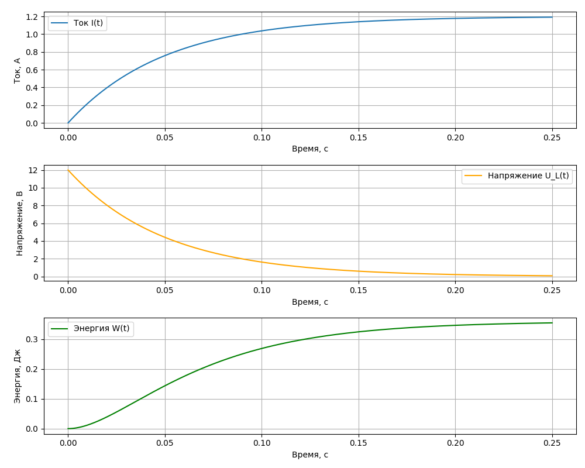

# Поведение индуктивного элемента в переходном режиме

**Поведение индуктивного элемента в установившемся режиме, в цепи постоянного тока, как короткое замыкание - идеальный проводник, перемычка $R=0, Oм$ и $U=0,В$ $I \to \infty$**

Индуктивность - это свойство электрической цепи противостоять изменению силы тока. Свойства индуктивности противоположны конденсатору т.е. противодействует изменению тока и в устоявшемся режиме ведет себя как идеальный проводник (замыкает цепь), в то время как конденсатор наоборот разрывает цепь. И реакция на скачок тока вызывает скачок напряжения, в то время как конденсатор наоборот вызывает скачок тока.

Накопление энергии происходит в виде магнитного поля, создаваемого протекающим током.

## Поведение в цепи постоянного тока:
 
**Включение катушки в цепь постоянного тока**:
- При подаче напряжения на катушку ток возрастает не мгновенно, а постепенно экспоненциально. Изменение тока приведет к изменению магнитного потока внутри катушки, что, в свою очередь, вызовет возникновение ЭДС (электродвижущей силы) самоиндукции. **При увеличении тока создает напряжение, направленное против внешнего источника, чтобы замедлить рост тока**. Это может привести к тому, что напряжение на линии временно снизится (из-за противодействия катушки). А это значит, что в начальный момент времени (непосредственно после замыкания выключателя) ток через катушку $I_L$ будет равен 0. В этот момент времени ЭДС самоиндукции максимальна.

**Отключение катушки от источника**:
- При размыкании цепи ток не прекращается мгновенно из-за ЭДС самоиндукции. Энергия, накопленная в магнитном поле катушки, не может исчезнуть мгновенно. Если в цепи нет пути для протекания тока (например, нет **шунтирующего диода**), напряжение на катушке будет расти до тех пор, пока не произойдёт пробой изоляции или не возникнет искра (высоковольтного импульса) в месте размыкания (расти будет ток если есть замкнутая цепь и нет нагрузки ограничивающей ток тогда катушка превратится в к.з., но при разомкнутой цепи роста не будет, будет только разряд магнитного поля т.е. высоковольтный импульс). При уменьшении тока создает напряжение, которое пытается поддерживать текущий ток. Когда вы отключаете цепь с катушкой, ток через неё резко уменьшается. Катушка, пытаясь поддержать ток, создает высоковольтный импульс напряжения. Этот импульс может быть очень сильным, вплоть до пробоя изоляции или образования искры на разомкнутых контактах. Таким образом, ток продолжает течь до тех пор, пока магнитное поле полностью не разрушится, и энергия не рассеется.Это может вызвать временное увеличение напряжения на линии, поскольку катушка "выдаёт" накопленную энергию из своего магнитного поля.
- **В катушке индуктивности возникнет ЭДС самоиндукции, но индукционный ток в случае размыкания будет направлен в том же самом направлении, что и ток в цепи вызванный внешним источником, а не в противоположном, поэтому запасенная энергия катушки индуктивности пойдет на поддержание тока в цепи. Т.е. при включении катушка препятствовала изменению увеличения тока, создавая противоположное направление тока т.е. к внешнему источнику,а при выключении, наоборот, препятсвует снижению тока создавая движение тока к внешнему источнику пытаясь сохранить состояние до этого момента (недолюбливает изменения)**

В установившемся режиме постоянного тока индуктивность ведет себя как **короткое замыкание**.

Почему так происходит?
- ЭДС самоиндукции: При изменении силы тока в катушке возникает ЭДС самоиндукции, которая препятствует этому изменению. В установившемся режиме ток постоянен, следовательно, ЭДС самоиндукции равна нулю. ЭДС самоиндукции — это электрическое напряжение, возникающее в катушке (или любом проводнике с индуктивностью) в результате изменения силы тока, протекающего через нее. Это явление описывается законом электромагнитной индукции Фарадея. Когда ток через катушку изменяется, меняется магнитное поле, которое она создает. Изменение магнитного поля, в свою очередь, вызывает индуцирование напряжения в той же катушке (или проводнике), которое препятствует изменению тока. Это напряжение называется ЭДС самоиндукции.
- Сопротивление постоянному току: Идеальная катушка индуктивности не имеет активного сопротивления. Поэтому в установившемся режиме постоянного тока на ней не происходит падение напряжения.

---

### Индуктивность как проводник (идеальный провод)
   - В установившемся режиме в цепи постоянного тока через индуктивность течет постоянный ток.  
   - При постоянном токе напряжение на индуктивности становится равным **нулю**. Это связано с тем, что напряжение на катушке индуктивности определяется законом:  
     
     $U_L = L \frac{dI}{dt}$
       
     где $L$ — индуктивность, $\frac{dI}{dt}$ — скорость изменения тока.  
     Если ток **не изменяется** (постоянный ток), то $\frac{dI}{dt}=0$, а $U_L=0$.

   **Физическая причина:** Индуктивный элемент препятствует изменениям тока, но не оказывает сопротивления постоянному току.

   **Пример**: Если в цепи постоянного тока есть резистор $ R $, индуктивность $ L $, подключенные к источнику постоянного напряжения $ U $, то:  
   - Сначала ток будет возрастать экспоненциально при заряде магнитного поля катушки.  
   - После завершения переходных процессов ток станет постоянным, а напряжение на индуктивности будет **нулевым**.  

---

**Важные замечания**:
* **Идеальная индуктивность:** В реальных катушках всегда присутствует некоторое активное сопротивление обмотки. Поэтому в реальных цепях падение напряжения на индуктивности в установившемся режиме будет небольшим, но не равным нулю.
* **Переходные процессы:** При включении или выключении источника питания в цепи с индуктивностью возникают переходные процессы. В этот период напряжение на индуктивности может достигать значительных значений.

### Пояснение:

Исходная цепь и как цепь будет выглядеть в установившемся режиме в котором индуктивные элементы равносильны проводу. Ток пойдет по пути наименьшего сопротивления т.е. по заряженной индуктивности $L_1$ которая превратилась в идеальный проводник с $R=0, Ом$

В установившемся режиме на катушке индуктивности $U=0,B\ $ и $I \to \infty $ и $R=0,Ом$ 

- для отрезка [0A], это переходной период, при изменении силы тока в катушке возникает ЭДС самоиндукции, стабилизируя ток через понижение напряжения 
$U_L = L \frac{dI}{dt} = L \frac{I_1-I_0}{t_1-t_0}= L \frac{1,A}{1,mc}$ т.е. наряжение **есть**, в переходной период поддержания индуктивностью ЭДС самоиндукции

- для отрезка [AВ], это установившейся режим $U_L = L \frac{dI}{dt} = L \frac{I_1-I_1}{t_2-t_1}= L \frac{0,A}{3-1,mc}=0, B$ т.е. ток не изменился, поэтому $dI=0$ и напряжение на индуктивности $U=0,B$

- отрезок [BC] характерен в моменты включения/выключения или замыкания/размыкания цепи, $U_L = L \frac{dI}{dt} = L \frac{I_2-I_1}{t_3-t_2}=L \frac{3-1}{3.5-3}= L \frac{2,A}{0.5,mc}$ т.е. произошел резкий скачок напряжения. При одном и том же токе на индуктивности, чем меньше будет временная составляющая $dt$ тем больше скачок напряжения! В идеале найти такое время переходного этапа, особенно при выключении/размыкании цепи, что бы не пробить изоляцию высоковольтным импульсом напряжения и не повредились компоненты схемы. 
Поэтому катушка реле (что является индуктивностью) при размыкании мы ее шунтируем диодом, что бы замедлить снижение тока. **Диод (его ещё называют демпфирующим или обратным диодом), шунтирующий катушку индуктивности**, помогает гасить скачок напряжения благодаря своему свойству проводить ток в одном направлении, что позволяет перенаправить ток через катушку безопасным образом, избегая повреждения цепи. Диод включается параллельно катушке, обычно в обратной полярности относительно источника питания (анод к минусу катушки, катод к плюсу). Если напряжение становится отрицательным относительно катушки (с учётом полярности), оно превышает пороговое прямое напряжение диода и диод открывается. Диод образует путь для тока, ток, который раньше шёл через нагрузку, теперь замыкается через диод и катушку по замкнутому контуру. Энергия, запасённая в магнитном поле катушки, рассеивается на сопротивлении диода и катушки.

**Идеальный Амперметр имеет $R = 0, Ом$**

**Идеальный Вольтметр имеет $R\to \infty, Ом$**
 
---

Индуктивность может "заряжаться" (то есть накапливать энергию в своём магнитном поле) за счёт другой индуктивности или конденсатора. Это происходит через процессы электромагнитной индукции и обмена энергией между элементами цепи. Давайте разберём подробно:

**1. Зарядка катушки индуктивности от другой катушки (индуктивная связь):**
- Если две катушки размещены рядом, их магнитные поля могут взаимодействовать (взаимоиндукция).
- Когда ток изменяется в первой катушке (первичная катушка), он создаёт переменное магнитное поле, которое индуцирует ЭДС во второй катушке (вторичная катушка).
- Это явление используется, например, в трансформаторах, где энергия передаётся между обмотками.

$\text{Индуцированное напряжение: } \mathcal{E} = -M \frac{dI}{dt}$
 
где:
- $M$ — взаимная индуктивность катушек,
- $dI/dt$ — скорость изменения тока в первичной катушке.

Таким образом, катушка может "заряжаться" энергией, передаваемой от другой катушки через магнитное поле.

**2. Зарядка катушки от конденсатора:**
- Конденсатор может передавать энергию катушке за счёт процесса резонанса.
- В цепи с катушкой ($L$) и конденсатором ($C$) энергия циклически передаётся между электрическим полем конденсатора и магнитным полем катушки. Это называется **колебательным контуром**.

 
$\text{Общая энергия в системе: } W = \frac{1}{2} C U^2 + \frac{1}{2} L I^2$
 
где:
- $C U^2$ — энергия, накопленная в электрическом поле конденсатора,
- $L I^2$ — энергия, накопленная в магнитном поле катушки.

Когда конденсатор разряжается, его энергия переходит в магнитное поле катушки. Затем магнитное поле катушки начинает разрушаться, и энергия возвращается обратно в конденсатор, но с противоположной полярностью. Это создаёт колебания.

**Пример — LC-колебательный контур:**
1. **Начало:** Конденсатор заряжен, катушка "пустая".
2. **Передача энергии:** Конденсатор разряжается через катушку, создавая в ней ток. Это ток накапливает энергию в магнитном поле катушки.
3. **Максимум энергии катушки:** Конденсатор полностью разряжен, вся энергия теперь в магнитном поле катушки.
4. **Обратная передача:** Магнитное поле катушки рушится, создавая ток, который заряжает конденсатор снова, но с обратной полярностью.

**Итог:**
- **Катушка от катушки:** Через взаимную индукцию.
- **Катушка от конденсатора:** Через передачу энергии в колебательном контуре.

Катушки и конденсаторы могут эффективно обмениваться энергией, что активно используется в радиотехнике, резонансных цепях и трансформаторах.

## Для проверки того, как индуктивность отдает энергию после отключения источника

- На рис. 1: индуктивность еще не зарядила свое магнитное поле, поэтому еще не идеальный проводник поэтому обладает сопротивлением и понижает напряжение ветви препятствуя свечению светодиода
- На рис. 2: индуктивность уже в установившемся режиме обладает свойством идеального проводника, пропускает все напряжение источника на светодиод и он светится
- На рис. 3: цепь разомкнута, индуктивность в переходном режиме, отдает накопленную энергию пропуская заряд через открывшийся диод 1N4148
- На рис. 4: индуктивность разрядилась об саму себя

Для катушки не забывайте про шунтирующий диод — он предотвращает повреждение компонентов из-за высоковольтного импульса.

Шунтирующий диод 1N4148 не подключается последовательно с катушкой, он подключается параллельно катушке, но с обратной полярностью.
Это позволяет диоду "срабатывать" только тогда, когда катушка создаёт ЭДС самоиндукции, направленную противоположно предыдущему напряжению источника питания.
 - Анод (положительный вывод) шунтирующего диода подключается к минусу индуктивности.
 - Катод (отмечен полоской) подключается к плюсу индуктивности.

Когда источник питания включён, ток проходит через катушку и светодиод (если он последовательно). Диод 1N4148 при этом заперт, так как его обратное смещение препятствует прохождению тока. (При наличии источника питания, диод заперт, потому что его анод находится на более низком потенциале (минус катушки), чем катод (плюс катушки).) 

**При отключении источника питания** ток через катушку резко уменьшается, и катушка создаёт ЭДС самоиндукции, которая "подталкивает" ток в ту же сторону, в которой он тек до отключения. В этот момент диод открывается, предоставляя токам путь и защищая другие компоненты от высокого напряжения.
- ЭДС самоиндукции катушки пытается поддерживать ток в цепи, создавая напряжение противоположной полярности.
- В этот момент анод диода оказывается на более высоком потенциале, чем катод, и диод открывается.
- Ток замыкается через шунтирующий диод, позволяя энергии катушки безопасно рассеяться.

<a href="/theories_of_electrical_circuits/falstad/circuitjs-82.1.txt" download="circuitjs-82.1.txt">Скачать схему для www.falstad.com/circuit</a>

## Пример расчета времени заряда катушки индуктивности в RL-цепи постоянного тока

При заряде катушки индуктивности, ток нарастает по экспоненциальному закону.

**Формулы для расчета процессов заряда катушки индуктивности:**

1. **Постоянная времени:**
   
   $\tau = \frac{L}{R}$
    
   где $L$ — индуктивность, $R$ — сопротивление цепи.

2. **Ток в цепи:**
   
   $I(t) = I_{max}\cdot \left(1 - e^{-\frac{t}{\tau}}\right)$
   
   где $I_{max} = \frac{U_{source}}{R}$ — максимальный ток.

3. **Напряжение на катушке:**
    
   $U_L(t) = U_{source} \cdot e^{-\frac{t}{\tau}}$
   
   где $U_{source}$ — напряжение источника.

4. **Энергия, запасенная в катушке:**
   
   $W(t) = \frac{1}{2}\cdot L \cdot I(t)^2$ [Дж] или тоже самое в международной ед. [J]

**Дано**:
  - Напряжение источника: $U_{source} = 12 \, \text{V}$
  - Сопротивление: $R = 10 \, \text{Ом}$
  - Индуктивность катушки: $L = 500 \, mH = 500 \cdot 10^{-3} = 0.5 \, \text{H}$
  - Время: 
    - $t=0$ — к моменту начала заряда
    - $t = 1 \tau = 50 \, \text{ms} = 50/1000 = 0.05 \, \text{sec}$  
    - $t = 3 \tau = 150 \, \text{ms} = 150/1000 = 0.15 \, \text{sec}$
    - $t \to \infty$ — установившийся режим

<a href="/theories_of_electrical_circuits/falstad/circuitjs-82.txt" download="circuitjs-82.txt">Скачать схему для www.falstad.com/circuit</a>

1. **Постоянная времени ($\tau$):**

   - $\tau = \frac{L}{R}=\frac{0.5}{10}=0.05\ sec$ (50 ms)

   Катушка индуктивности считается полностью заряженной/разряженной 99.24% после пяти постоянных времени $\tau$:
    - $t_{max}=5\cdot 0.05=0.25\, \text{s} $ (250 ms)

2. **Максимальный ток:**
 
   - $I_{max} = \frac{U}{R} = \frac{12}{10} = 1.2 \, \text{А}$

3. **Ток в цепи:**

   - $I(0) = I_{max}\cdot \left(1 - e^{-\frac{t}{\tau}}\right) = 1.2\cdot \left(1 - e^{-\frac{0}{0.05}}\right) = 1.2\cdot (1-1) = 0 \, \text{А} $
   - $I(0.05=1\tau) = 1.2\cdot \left(1 - e^{-\frac{0.05}{0.05}}\right) = 0.758 \, \text{А} $ (т.е. $\frac{0.758}{1.2}\cdot 100 = 63.17$% )
   - $I(0.15=3\tau) = 1.2\cdot \left(1 - e^{-\frac{0.15}{0.05}}\right) = 1.140 \, \text{А} $ (т.е. $\frac{1.140}{1.2}\cdot 100 = 95$% )
   - $I(\infty) = I_{max} = 1.2 \, \text{А} $

4. **Напряжение на катушке:**

   - $U_L(0) = U_{source} \cdot e^{-\frac{t}{\tau}}=12 \cdot e^{-\frac{0}{0.05}}=12,\ V$
   - $U_L(0.05=1\tau) = 12 \cdot e^{-\frac{0.05}{0.05}}=4.41,\ V$
   - $U_L(0.15=3\tau) = 12 \cdot e^{-\frac{0.15}{0.05}}=0.60,\ V$
   - $U_L(\infty) =0,\ V$

5. **Энергия, запасенная в катушке:**

   - $W(0) = \frac{1}{2}\cdot L \cdot I(t)^2=\frac{1}{2}\cdot 0.5 \cdot 0^2=0, J$
   - $W(0.05=1\tau) =\frac{1}{2}\cdot 0.5 \cdot 0.758^2=0.143, J$
   - $W(0.15=3\tau) =\frac{1}{2}\cdot 0.5 \cdot 1.140^2=0.324, J$
   - $W(\infty) =\frac{1}{2}\cdot 0.5 \cdot 1.2^2=0.36, J$

## Пример расчета времени разряда катушки индуктивности в RL-цепи постоянного тока

При отключении катушки индуктивности от источника постоянного тока, ток в цепи спадает экспоненциально.

**Формулы для расчета процессов разряда катушки индуктивности:**

1. **Постоянная времени:**
   
   $\tau = \frac{L}{R}$
    
   где $L$ — индуктивность, $R$ — сопротивление цепи.

2. **Максимальный ток:**
 
   - $I_{max} = \frac{U}{R} = \frac{12}{10} = 1.2 \, \text{А}$

3. **Ток в цепи:**
   
   $I(t) = I_0 \cdot e^{-\frac{t}{\tau}}$
   
   где
      - $I_0$ — ток в цепи на момент начала разряда (если катушка была полностью заряжена тогда $I_0=I_{max}$)
      - $\tau $ — постоянная времени

4. **Напряжение на катушке:**
   
   $U_L(t) = I_0 \cdot R \cdot e^{-\frac{t}{\tau}}$
   
5. **Энергия, запасенная в катушке:**
   
   $W(t) = \frac{1}{2}\cdot L \cdot I(t)^2$ [J]
   
6. **Эффект самоиндукции и импульс напряжения:**

   Согласно закону электромагнитной индукции, изменение тока вызывает ЭДС самоиндукции:
   
   $U_L = -L \frac{dI}{dt}=-L \cdot \frac{I_0}{\Delta t}$
  
   где
      - $I_0$ — ток в цепи на момент начала разряда (если катушка была полностью заряжена тогда $I_0=I_{max}$)
      - $ \frac{dI}{dt}\approx \frac{I_0}{\Delta t} $ — скорость изменения тока.

   Если ток уменьшается очень быстро (например, при размыкании ключа), то $ \frac{dI}{dt} $ становится очень большим, и напряжение на катушке $ U_L $ может достигать огромных значений.

   Напряжение на катушке со знаком "минус" указывает на то, что напряжение направлено против изменения тока.

**Дано**:
  - Напряжение источника: $U_{source} = 12 \, \text{V}$
  - Сопротивление: $R = 10 \, \text{Ом}$
  - Индуктивность катушки: $L = 500 \, mH = 500 \cdot 10^{-3} = 0.5 \, \text{H}$
  - Время: 
    - $t=0$ — к моменту начала заряда
    - $t = 1 \tau = 50 \, \text{ms} = 50/1000 = 0.05 \, \text{sec}$  
    - $t = 3 \tau = 150 \, \text{ms} = 150/1000 = 0.15 \, \text{sec}$
    - $t \to \infty$ — установившийся режим

<a href="/theories_of_electrical_circuits/falstad/circuitjs-82.txt" download="circuitjs-82.txt">Скачать схему для www.falstad.com/circuit</a>

1. **Постоянная времени ($\tau$):**

   - $\tau = \frac{L}{R}=\frac{0.5}{10}=0.05\ sec$ (50 ms)

   Катушка индуктивности считается полностью заряженной/разряженной 99.24% после пяти постоянных времени $\tau$:
    - $t_{max}=5\cdot 0.05=0.25\, \text{s} $ (250 ms)

2. **Максимальный ток:**
 
   - $I_{max} = \frac{U}{R} = \frac{12}{10} = 1.2 \, \text{А}$

3. **Ток в цепи:**
   $I_0=I_{max}$
   - $I(0) = I_0 \cdot e^{-\frac{t}{\tau}}=1.2 \cdot e^{-\frac{0}{0.05}}=1.2, A$
   - $I(0.05=1\tau) = 1.2 \cdot e^{-\frac{0.05}{0.05}}=0.442, A$
   - $I(0.15=1\tau) = 1.2 \cdot e^{-\frac{0.15}{0.05}}=0.060, A$
   - $I(\infty) = 1.2, A$

4. **Напряжение на катушке:**
   - $U_L(0) = I_0\cdot R\cdot e^{-\frac{t}{\tau}} = 1.2\cdot 10\cdot e^{-\frac{0}{0.05}} = 12,\ V$
   - $U_L(0.05=1\tau) = 1.2\cdot 10\cdot e^{-\frac{0.05}{0.05}} = 4.41,\ V$
   - $U_L(0.15=3\tau) = 1.2\cdot 10\cdot e^{-\frac{0.15}{0.05}} = 0.6,\ V$
   - $U_L(\infty) = 0,\ V$

5. **Энергия, запасенная в катушке:**
   
   - $W(0) = \frac{1}{2}\cdot L \cdot I(t)^2 =  \frac{1}{2}\cdot 0.5 \cdot 1.2^2=0.36,\ J$
   - $W(0.05=1\tau)= \frac{1}{2}\cdot 0.5 \cdot 0.442^2=0.048,\ J$
   - $W(0.15=1\tau)= \frac{1}{2}\cdot 0.5 \cdot 0.060^2=0.0009,\ J$
   - $W(\infty)= 0,\ J$

6. **ЭДС самоиндукции (при отсутвии защитного диода):**

   [Ток при замыкании и размыкании цепи с индуктивностью](https://www.youtube.com/watch?v=r8fE65jvWEo) (но в этой схеме катушка подключена без нагрузки к источнику ЭДС, т.е. это тоже самое что короткое замыкание но плавно по экспоненте, логично что ток достигает больших значений и не останавливается и логично если в этот момент прекратить подачу напряжения от ЭДС то катушка начнет отдавать накопленное магнитное поле и стартанет с текущего на ней большого тока)

   Если **катушка идеальная (без сопротивления)**, то ток через неё будет нарастать бесконечно, что приведет к перегреву и возможному пробою.

   Если **катушка реальная (с сопротивлением)**, то ток через неё будет ограничен, и пробой маловероятен, если ток и напряжение не превышают допустимых значений.

   Предположим, что цепь размыкается за: 
   - $ \Delta t = 1 \, \text{ms} = 0.001\, sec$

   Cкорость изменения тока: 
   - $I_0=I_{max}$
   - $\frac{dI}{dt} \approx \frac{I_0}{\Delta t} = \frac{1.2}{0.001} = 1200 \, \text{А/с}$

   Подставляем скорость изменения тока в формулу ЭДС самоиндукции:
   - $U_L = -L \cdot \frac{I_0}{\Delta t}$

   Импульс напряжения:
   - $U_L = -L \cdot \frac{dI}{dt} = -L \cdot \frac{I_0}{\Delta t} = -0.5 \cdot 1200 = -600\, V$

   Напряжение на катушке при размыкании цепи достигает **600 V** (хотя источник выдавал всего 12 V).
   Это напряжение может повредить элементы цепи, поэтому в реальных схемах используются защитные элементы (например, диоды или варисторы).

   Напряжение на катушке со знаком "минус" указывает на то, что напряжение направлено против изменения тока.

   

При заряде катушки напряжение на катушке равно напряжению источника, так как ток через катушку еще не начал течь.

При разряде катушки напряжение на катушке также равно напряжению источника, так как катушка полностью заряжена и ток через неё максимален.
 