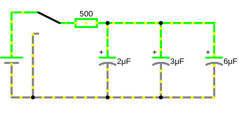

# Параллельное и последовательное соединении конденсаторов.

Как ведут себя конденсаторы при **последовательном** и **параллельном** соединении в цепях **постоянного тока (DC)**. Это важно для понимания, как изменяются общая ёмкость и напряжение на конденсаторах.

## 1. Параллельное соединение конденсаторов:

Используется чаще чем последовательное соединение. Применяют когда нужно увеличить общую ёмкость, но это ограничивает максимальное номинальное напряжение, наименьшим номинальным нарпяжением среди всех конденсаторов.

#### 1.1. Особенности:
- Конденсаторы соединены параллельно (одни выводы соединены вместе, другие — тоже).
- Напряжение на всех конденсаторах одинаковое.
- Заряд $Q$ распределяется между конденсаторами.
- Если конденсаторы имеют разные емкости, то при **разряде** заряд будет перетекать от конденсатора с большей емкостью к конденсатору с меньшей емкостью, чтобы поддерживать равенство напряжений, что замедляет разряд. При разряде емкость теряет напряжение, если есть в цепи емкость с напряжением больше то она начнет отдавать заряд в сторону меньшего напряжения для выравнивания, т.е. подзарядки разрядившей емкости. Это перетекание происходит постоянно, пока напряжение на обоих конденсаторах не выровняется. Каждый конденсатор имеет ограничение по максимальному току разряда. Ток будет распределяться между конденсаторами неравномерно, что приводит к неравномерному износу, сокращению срока их службы. При высоких скоростях разряда, могут возникать **паразитные токи**. В случае, когда необходимо обеспечить равномерный разряд конденсаторов, применяют схемы балансировки.
- При заряде ток заряда будет распределяться между конденсаторами неравномерно.

Повышает общую емкость, но ограничивает максимальное номинальное напряжение наименьшим номинальным напряжением среди всех конденсаторов.

Номинальное напряжение конденсатора — это максимальное напряжение, которое конденсатор может выдержать в течение длительного времени без повреждения. Это критический параметр, который необходимо учитывать при выборе конденсатора для конкретного применения.

#### 1.2. Формула общей ёмкости:
 
$C_{общ} = C_1 + C_2 + C_3 + \dots$
  
#### 1.3. Заряд на каждом конденсаторе:
 
$Q_1 = C_1 \cdot U, \quad Q_2 = C_2 \cdot U, \quad Q_3 = C_3 \cdot U, \dots$
 
- Заряд на каждом конденсаторе пропорционален его ёмкости.

#### 1.4. Пример:

<a href="/theories_of_electrical_circuits/falstad/circuitjs-83.txt" download="circuitjs-83.txt">Скачать схему для www.falstad.com/circuit</a>

- Дано: $C_1 = 2 \, \mu\text{F}$ (0.000002 F), $C_2 = 3 \, \mu\text{F}$ (0.000003 F), $C_3 = 6 \, \mu\text{F}$ (0.000006 F).
- Общая ёмкость:
 
  $C_{общ} = 0.000002 + 0.000003 + 0.000006 = 0.000011\ F = 11 \, \mu\text{F}$  
  
- Если общее напряжение $U = 10 \, \text{В}$, то:
 
  $U_{Q_1}=U_{Q_2}=U_{Q_3}=U=10\, \text{В}$ 

- Заряд на конденсаторах:

  $Q_1 = 0.000002 \cdot 10 = 0.00002\ Кл = 20\, \mu\text{Кл}$
 
  $Q_2 = 0.000003 \cdot 10 = 0.00003\ Кл = 30 \, \mu\text{Кл}$
  
  $Q_3 = 0.000006 \cdot 10 = 0.00006\ Кл = 60 \, \mu\text{Кл}$
  

### Пример параллельного соединения разных емкостей

Пример параллельного соединения разных емкостей

<a href="/theories_of_electrical_circuits/falstad/circuitjs-83.1.txt" download="circuitjs-83.1.txt">Скачать схему для www.falstad.com/circuit</a>

**Дано**:
  - Напряжение источника: $U_{source} = 9 \, \text{В}$,
  - Сопротивление: $R = 500 \, \text{Ом}$,
  - Ёмкость: 
    - $C_1 = 2 \, \mu\text{F} = 2 \cdot 10^{-6} = 0.000002 \, \text{F}$,
    - $C_2 = 300 \, \mu\text{F} = 300 \cdot 10^{-6} = 0.0003 \, \text{F}$,
    - $C_3 = 6 \, m\text{F} = 200 \cdot 10^{-3} = 0.006 \, \text{F}$,
    - Время: 
      - $t=0$ — к моменту начала заряда
      - $t = 1 \, \text{мс} = 1/1000 = 0.001 \, \text{с}$.  
      - $t = 500 \, \text{мс} = 500/1000 = 0.5 \, \text{с}$.
      - $t = 6000 \, \text{мс} = 6000/1000 = 6 \, \text{с}$.
      - $t \to \infty$ — установившийся режим

**Общая ёмкость:** $C_{общ} = C_1 + C_2 + C_3= 0.000002 + 0.0003 + 0.006 = 0.006302 \, \text{F}$

**Постоянная времени ($\tau$):** $\tau = R \cdot C_{общ} = 500 \cdot 0.006302 = 3.151 \, \text{с}$

**Конденсатор полностью зарядится/разрядится** $t_{max_{C_{общ}}}=5\cdot 3.151 = 15.755\, \text{с} $ (15755 ms)

Отличие емкостей по постоянной времени

$\tau$
- $\tau_{C_1} = R \cdot C_1 = 500 \cdot 0.000002 = 0.001 \, \text{с}$ (1 мс)
- $\tau_{C_2} = R \cdot C_2 = 500 \cdot 0.0003 = 0.15 \, \text{с}$ (150 мс)
- $\tau_{C_3} = R \cdot C_3 = 500 \cdot 0.006 = 3 \, \text{с}$ (3000 мс)

Конденсатор считается полностью заряженным/разряженным после пяти постоянных времени $\tau$:
- $t_{max_{C_1}}=5\cdot 0.001 = 0.005 \, \text{с} $ (5 ms)
- $t_{max_{C_2}}=5\cdot 0.15 = 0.75\, \text{с} $ (750 ms)
- $t_{max_{C_3}}=5\cdot 3 = 15\, \text{с} $ (15000 ms)

Но если брать во внимание общую картину параллельного соединения и перетекание зарядов, то скорости отличаются на порядки, и следовательно малая емкость $C_1$ будет быстро производить циклы подзаряда от более емких $C_2$ и $C_3$.

**Напряжение на конденсаторах:**
- $U_C(0.001) = 9 \cdot \left(1 - e^{-\frac{0.001}{3.151}}\right) \approx 9 \cdot \left(1 - e^{-0.000317}\right) \approx 9 \cdot 0.000317 \approx 0.00285 \, \text{В}$
- $U_C(0.5) = 9 \cdot \left(1 - e^{-\frac{0.5}{3.151}}\right) \approx 9 \cdot \left(1 - e^{-0.1587}\right) \approx 9 \cdot 0.146 \approx 1.314 \, \text{В}$ 
- $U_C(6) = 9 \cdot \left(1 - e^{-\frac{6}{3.151}}\right) \approx 9 \cdot \left(1 - e^{-1.905}\right) \approx 9 \cdot 0.85 \approx 7.65 \, \text{В}$

**Ток через каждый конденсатор:**
(Чем больше ёмкость конденсатора, тем больше ток через него в начальный момент.)
- $I_1(0.001) = 0.000002 \cdot 2.857 \approx 5.714 \cdot 10^{-6} \, \text{А} = 5.714 \, \mu\text{А}$
- $I_2(0.001) = 0.0003 \cdot 2.857 \approx 8.571 \cdot 10^{-4} \, \text{А} = 857.1 \, \mu\text{А}$
- $I_3(0.001) = 0.006 \cdot 2.857 \approx 0.01714 \, \text{А} = 17.14 \, \text{мА}$

- $I_1(0.5) = 0.000002 \cdot 2.437 \approx 4.874 \cdot 10^{-6} \, \text{А} = 4.874 \, \mu\text{А}$
- $I_2(0.5) = 0.0003 \cdot 2.437 \approx 7.311 \cdot 10^{-4} \, \text{А} = 731.1 \, \mu\text{А}$
- $I_3(0.5) = 0.006 \cdot 2.437 \approx 0.01462 \, \text{А} = 14.62 \, \text{мА}$
 
- $I_1(6) = 0.000002 \cdot 0.426 \approx 8.52 \cdot 10^{-7} \, \text{А} = 0.852 \, \mu\text{А}$
- $I_2(6) = 0.0003 \cdot 0.426 \approx 1.278 \cdot 10^{-4} \, \text{А} = 127.8 \, \mu\text{А}$
- $I_3(6) = 0.006 \cdot 0.426 \approx 0.002556 \, \text{А} = 2.556 \, \text{мА}$

**Заряд на каждом конденсаторе:**
- $Q_1(0.001) = 0.000002 \cdot 0.00285 \approx 5.7 \cdot 10^{-9} \, \text{Кл} = 5.7 \, \text{нКл}$
- $Q_2(0.001) = 0.0003 \cdot 0.00285 \approx 8.55 \cdot 10^{-7} \, \text{Кл} = 855 \, \text{нКл}$
- $Q_3(0.001) = 0.006 \cdot 0.00285 \approx 1.71 \cdot 10^{-5} \, \text{Кл} = 17.1 \, \mu\text{Кл}$

- $Q_1(0.5) = 0.000002 \cdot 1.314 \approx 2.628 \cdot 10^{-6} \, \text{Кл} = 2.628 \, \mu\text{Кл}$
- $Q_2(0.5) = 0.0003 \cdot 1.314 \approx 3.942 \cdot 10^{-4} \, \text{Кл} = 394.2 \, \mu\text{Кл}$
- $Q_3(0.5) = 0.006 \cdot 1.314 \approx 7.884 \cdot 10^{-3} \, \text{Кл} = 7.884 \, \text{мКл}$

- $Q_1(6) = 0.000002 \cdot 7.65 \approx 1.53 \cdot 10^{-5} \, \text{Кл} = 15.3 \, \mu\text{Кл}$
- $Q_2(6) = 0.0003 \cdot 7.65 \approx 2.295 \cdot 10^{-3} \, \text{Кл} = 2.295 \, \text{мКл}$
- $Q_3(6) = 0.006 \cdot 7.65 \approx 0.0459 \, \text{Кл} = 45.9 \, \text{мКл}$

**Энергия на каждом конденсаторе:**
  
- $W_1(0.001) = \frac{1}{2} \cdot 0.000002 \cdot (0.00285)^2 \approx 8.1 \cdot 10^{-12} \, \text{Дж} = 8.1 \, \text{пДж}$
- $W_2(0.001) = \frac{1}{2} \cdot 0.0003 \cdot (0.00285)^2 \approx 1.22 \cdot 10^{-9} \, \text{Дж} = 1.22 \, \text{нДж}$
- $W_3(0.001) = \frac{1}{2} \cdot 0.006 \cdot (0.00285)^2 \approx 2.43 \cdot 10^{-8} \, \text{Дж} = 24.3 \, \text{нДж}$

- $W_1(0.5) = \frac{1}{2} \cdot 0.000002 \cdot (1.314)^2 \approx 1.73 \cdot 10^{-6} \, \text{Дж} = 1.73 \, \mu\text{Дж}$
- $W_2(0.5) = \frac{1}{2} \cdot 0.0003 \cdot (1.314)^2 \approx 2.59 \cdot 10^{-4} \, \text{Дж} = 259 \, \mu\text{Дж}$
- $W_3(0.5) = \frac{1}{2} \cdot 0.006 \cdot (1.314)^2 \approx 5.18 \cdot 10^{-3} \, \text{Дж} = 5.18 \, \text{мДж}$

- $W_1(6) = \frac{1}{2} \cdot 0.000002 \cdot (7.65)^2 \approx 5.85 \cdot 10^{-5} \, \text{Дж} = 58.5 \, \mu\text{Дж}$
- $W_2(6) = \frac{1}{2} \cdot 0.0003 \cdot (7.65)^2 \approx 8.78 \cdot 10^{-3} \, \text{Дж} = 8.78 \, \text{мДж}$
- $W_3(6) = \frac{1}{2} \cdot 0.006 \cdot (7.65)^2 \approx 0.1756 \, \text{Дж} = 175.6 \, \text{мДж}$

**Итог:**

| Время ($t$) | Напряжение ($U_C$) | Ток ($I$) | Заряд ($Q_1, Q_2, Q_3$) | Энергия ($W_1, W_2, W_3$) |
|---------------|----------------------|-------------|---------------------------|-----------------------------|
| $0.001 \, \text{с}$ | $0.00285 \, \text{В}$ | $5.714 \mu\text{А}, 857.1 \mu\text{А},17.14\ \text{мА}$ | $5.7 \, \text{нКл}, 855 \, \text{нКл}, 17.1 \, \mu\text{Кл}$ | $8.1 \, \text{пДж}, 1.22 \, \text{нДж}, 24.3 \, \text{нДж}$ |
| $0.5 \, \text{с}$ | $1.314 \, \text{В}$ | $4.874 \, \mu\text{А}, 731.1 \, \mu\text{А}, 14.62 \, \text{мА}$ | $2.628 \, \mu\text{Кл}, 394.2 \, \mu\text{Кл}, 7.884 \, \text{мКл}$ | $1.73 \, \mu\text{Дж}, 259 \, \mu\text{Дж}, 5.18 \, \text{мДж}$ |
| $6 \, \text{с}$ | $7.65 \, \text{В}$ | $0.852 \, \mu\text{А}, 127.8 \, \mu\text{А}, 2.556 \, \text{мА}$ | $15.3 \, \mu\text{Кл}, 2.295 \, \text{мКл}, 45.9 \, \text{мКл}$ | $58.5 \, \mu\text{Дж}, 8.78 \, \text{мДж}, 175.6 \, \text{мДж}$ |

## 2. Последовательное соединение конденсаторов:

Используется, когда нужно увеличить рабочее напряжение (например, для возможности работы в высоковольтных схемах),но при этом понижает общую (эквивалентную) емкость, она будет меньше чем наименьшая емкость конденсатора группы. И рабочее напряжение на конденсаторе не должно превышать его же номинальное напряжение, так как чем меньше емкость конденсатора, тем больше напряжение на нем. Поэтому выбирайте конденсаторы с одинаковой емкостью.
(Пример: два конденсатора по 16В последовательно могут работать при 32В)

#### 2.1. **Особенности:**
- Конденсаторы соединены друг за другом.
- Заряд ($Q$) на всех конденсаторах одинаковый.
- Напряжение распределяется между конденсаторами.
- При **разряде** этой цепи, заряд равномерно уменьшается на каждом конденсаторе.
- Повышает максимальное номинальное напряжение, но понижает общую емкость.
- Для уменьшения утечки к каждому конденсатору подключают параллельно резистор (из расчета 100 Ом на каждый вольт напряжения источника) и резистор так же с достаточной номинальной мощностью

#### 2.2. **Формула общей ёмкости:**
 
$\frac{1}{C_{общ}} = \frac{1}{C_1} + \frac{1}{C_2} + \frac{1}{C_3} + \dots$
 
- Для двух конденсаторов:
  
  $C_{общ} = \frac{C_1 \cdot C_2}{C_1 + C_2}$
   

#### 2.3. **Напряжение на каждом конденсаторе:**
 
$U_1 = \frac{Q}{C_1}, \quad U_2 = \frac{Q}{C_2}, \quad U_3 = \frac{Q}{C_3}, \dots$
 
- Напряжение на каждом конденсаторе обратно пропорционально его ёмкости.

#### 2.4. **Заряд на каждом конденсаторе:**

Заряд $Q$ на каждом конденсаторе одинаковый

#### 2.5. **Пример:**

<a href="/theories_of_electrical_circuits/falstad/circuitjs-83.txt" download="circuitjs-83.txt">Скачать схему для www.falstad.com/circuit</a>

- Дано: $C_1 = 2 \, \mu\text{F}$ (0.000002 F), $C_2 = 3 \, \mu\text{F}$ (0.000003 F), $C_3 = 8 \, \mu\text{F}$ (0.000008 F).
- Общая ёмкость:
  
  $\frac{1}{C_{общ}} = \frac{1}{0.000002} + \frac{1}{0.000003} + \frac{1}{0.000008} = \frac{1}{958333.333} \Rightarrow C_{общ} = 0.000001043 \, \mu\text{Ф}$ ($1.043\ \mu F$)
  
- Напряжение. Если входное напряжение $U_{общ} = 10 \, \text{В}$, то:
  
  $U_1 = \frac{Q}{C_1} = \frac{C_{общ} \cdot U_{общ}}{C_1} = \frac{0.000001043 \cdot 10}{0.000002} = 5.215 \, \text{В}$
  
  $U_2 = \frac{0.000001043 \cdot 10}{0.000003} \approx 3.47 \, \text{В}$
 
  $U_3 = \frac{0.000001043 \cdot 10}{0.000008} \approx 1.30 \, \text{В}$
  
  Проверка: сумма напряжений должна быть равна $U_{общ}$:
 
  $U_1 + U_2 + U_3 = 5.215 + 3.477 + 1.304 \approx 10 \, \text{В}$

- Заряд на конденсаторах

  В последовательном соединении заряд $ Q $ на всех конденсаторах одинаковый:
  
  $Q = C_{\text{экв}} \cdot U_{общ} = 0.000001043 \cdot 10 = 0.00001043 \, \text{Кл} = 10.43 \, \text{мкКл}$
  
- Энергия каждого конденсатора  

  $W_1 = \frac{1}{2} \cdot 0.000002 \cdot (5.215)^2 \approx 0.0000272 \, \text{Дж} = 27.2 \, \text{мкДж}$

  $W_2 = \frac{1}{2} \cdot 0.000003 \cdot (3.477)^2 \approx 0.0000181 \, \text{Дж} = 18.1 \, \text{мкДж}$

  $W_3 = \frac{1}{2} \cdot 0.000008 \cdot (1.304)^2 \approx 0.0000068 \, \text{Дж} = 6.8 \, \text{мкДж}$

  Общая энергия системы: 
  
  $W_{\text{общ}} = W_1 + W_2 + W_3 = 27.2 + 18.1 + 6.8 = 52.1 \, \text{мкДж}$

#### 2.6. **Пример неверного выбора емкостей:**
Пусть у вас есть два конденсатора:
- $ C_1 = 100 \, \text{мкФ}, \, 50 \, \text{В} $
- $ C_2 = 200 \, \text{мкФ}, \, 50 \, \text{В} $

Общее напряжение системы: $ U_{\text{общ}} = 100 \, \text{В} $.

1. **Эквивалентная емкость:**
   
  $C_{\text{экв}} = \frac{C_1 \cdot C_2}{C_1 + C_2} = \frac{100 \cdot 200}{100 + 200} \approx 66.67 \, \text{мкФ}$
    

2. **Напряжение на $ C_1 $:**
    
  $U_1 = \frac{C_{\text{экв}}}{C_1} \cdot U_{\text{общ}} = \frac{66.67}{100} \cdot 100 = 66.67 \, \text{В}$

**Проблема:**
Напряжение на $ C_1 $ (66.67 В) превышает его номинальное напряжение (50 В). Это может привести к пробою конденсатора.

3. **Напряжение на $C_2 $:**
   
  $U_2 = \frac{C_{\text{экв}}}{C_2} \cdot U_{\text{общ}} = \frac{66.67}{200} \cdot 100 = 33.33 \, \text{В}$
 
---
 
### 3. **Сравнение последовательного и параллельного соединения:**

| Характеристика          | Последовательное соединение         | Параллельное соединение         |
|-------------------------|-------------------------------------|----------------------------------|
| **Общая ёмкость**       | Уменьшается                        | Увеличивается                   |
| **Напряжение**          | Распределяется между конденсаторами | Одинаковое на всех конденсаторах|
| **Заряд**               | Одинаковый на всех конденсаторах   | Распределяется между конденсаторами |
