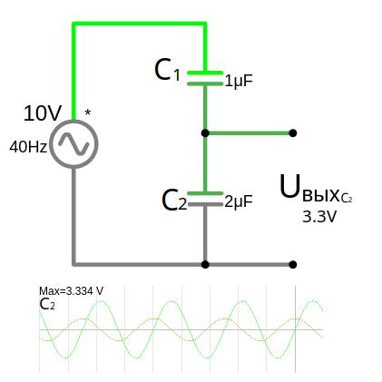

# Емкостный делитель напряжения

**Емкостный делитель напряжения** — это схема, которая использует конденсаторы для деления напряжения в цепи переменного тока (AC). 

https://www.youtube.com/watch?v=wNwYNlvFsi8&list=PL8uwGGI-Cxq7_82j2kLih6bspk4DkOMec&index=18

---
 
### Формула для емкостного делителя:
Если у вас два конденсатора $ C_1 $ и $ C_2 $, соединенных последовательно, то выходное напряжение ($ U_{\text{вых}} $) на конденсаторе $ C_2 $ вычисляется по формуле:
 
$U_{\text{вых}} = U_{\text{вх}} \cdot \frac{X_{C2}}{X_{C1} + X_{C2}} = U_{\text{вх}} \cdot \frac{C1}{C1 + C2}$ (для второго конденсатора, т.е. для $U_{вых}$)

$U_1 = U_{\text{вх}} \cdot \frac{C_2}{C_1 + C_2}$ (для первого конденсатора)

где:
- $ U_{\text{вх}} $ — входное напряжение,
- $C_1,\ C_2$ — емкости конденсаторов в Фарадах,
- $ X_{C1} $ — емкостное сопротивление конденсатора $ C_1 $,
- $ X_{C2} $ — емкостное сопротивление конденсатора $ C_2 $.
 
**Если нужно по другому пути, то**:

Обратная ёмкость всей последовательной цепи емкостей:
- $\frac{1}{C_{\text{общ}}} = \frac{1}{C_1} + \frac{1}{C_2}$

Напряжение на каждом конденсаторе
- $U_{\text{вх}} = U_1 + U_2$ (Общее напряжение — сумма напряжений на каждом конденсаторе  )
- $U_1 = U_{\text{вх}} \cdot \frac{C_{\text{общ}}}{C_1}$
- $U_{вых} = U_{\text{вх}} \cdot \frac{C_{\text{общ}}}{C_2}$

Емкостное сопротивление вычисляется по формуле (в этом типе делителя нет нужды его использовать, просто оно математически сокращается и остается только соотношение емкостей):
- $X_C = \frac{1}{2 \pi f C}= \frac{1}{\omega \cdot C}$
 
где:
- $ X_C $ — емкостное сопротивление (в омах),
- $2 \pi f\ = \omega$ — называется угловой частотой или круговой частотой, это мера скорости вращения или колебания в радианах в секунду (рад/с)
- $ f $ — частота сигнала (в герцах),
- $ C $ — емкость конденсатора (в фарадах).

---

### Пример расчета:

<a href="/theories_of_electrical_circuits/falstad/circuitjs-85.txt" download="circuitjs-85.txt">Скачать схему для www.falstad.com/circuit</a>

Предположим, вы хотите снизить напряжение сигнала в три раза, с помощью емкостного делителя.  
Тогда соотношение $\frac{C_1}{C_1 + C_2}$ должно быть $\frac{1}{3}$ 
Например с 10 В снизить до 3,3 В

Входное напряжение: $ U_{\text{вх}} = 10 \, \text{В} $ 
Подбираем соотношение конденсаторов:
- $ C_1 = 1 \, \text{мкФ} = 0.000001 F$
- $ C_2 = 2 \, \text{мкФ} = 0.000002 F$

Тогда выходное напряжение на $ C_2 $ будет:
 
$U_{\text{вых}} = U_{\text{вх}} \cdot \frac{C_1}{C_1 + C_2}= 10 \cdot \frac{1}{1 + 2} = 10 \cdot \frac{1}{3} \approx 3.33 \, \text{В}$
 
Все остальное напряжение будет на $U_{C_1}$ 
- $U_{C_1} =  U_{\text{вх}} \cdot \frac{C_2}{C_1 + C_2}= 10 \cdot \frac{2}{1+2} \approx 6.67 \, \mathrm{В}$

**Или посчитаем по длинному пути**:

Обратная ёмкость всей цепи:
- $\frac{1}{C_{\text{общ}}} = \frac{1}{1 \, \mu\mathrm{F}} + \frac{1}{2 \, \mu\mathrm{F}} = 1 + 0.5 = 1.5$
- $C_{\text{общ}} = \frac{1}{1.5} \approx 0.667 \, \mu\mathrm{F}$

- $U_{\text{вых}} = U_{\text{вх}} \cdot \frac{C_{\text{общ}}}{C_2}= 10 \cdot \frac{0.667}{2} \approx 3.33 \, \mathrm{В}$

- $U_{C_1} = 10 \cdot \frac{0.667}{1} \approx 6.67 \, \mathrm{В}$

---

### Особенности емкостного делителя:
1. **Работает только в цепях переменного тока:**
   - В цепях постоянного тока (DC) конденсаторы блокируют постоянный ток, и делитель не будет работать.

2. **Зависимость от частоты:**
   - Емкостное сопротивление зависит от частоты сигнала. Чем выше частота, тем меньше $ X_C $, и наоборот.
     - Если мы добавим резистор или катушку индуктивности, частота начнёт реально играть роль:
       -  В RC-цепи конденсатор будет фильтровать сигналы по частоте.
       -  В LC-контуре может возникнуть резонанс, где напряжение скачет в зависимости от частоты.

3. **Фазовый сдвиг:**
   - В емкостном делителе возникает фазовый сдвиг между током и напряжением, что важно учитывать в некоторых приложениях.

4. **Применение:**
   - Емкостные делители используются в высокочастотных схемах, например, в радиотехнике, для снижения напряжения сигнала.

---

### Преимущества и недостатки:
#### **Преимущества:**
- Подходит для высокочастотных цепей.
- Не выделяет тепло (в отличие от резистивного делителя).

#### **Недостатки:**
- Не работает в цепях постоянного тока.
- Зависит от частоты сигнала.

---

## Почему емкостный делитель не работает в DC:
- В цепи постоянного тока конденсатор **блокирует ток** после того, как зарядится.
- После зарядки конденсатора ток через него равен нулю, и напряжение на конденсаторе становится равным приложенному напряжению.
- В результате:
  - Напряжение на первом конденсаторе ($ C_1 $) будет равно входному напряжению ($ U_{\text{вх}} $).
  - Напряжение на втором конденсаторе ($ C_2 $) будет равно нулю.

[Емкостной делитель напряжения diodov.net](https://diodov.net/emkostnoj-delitel-napryazheniya/)