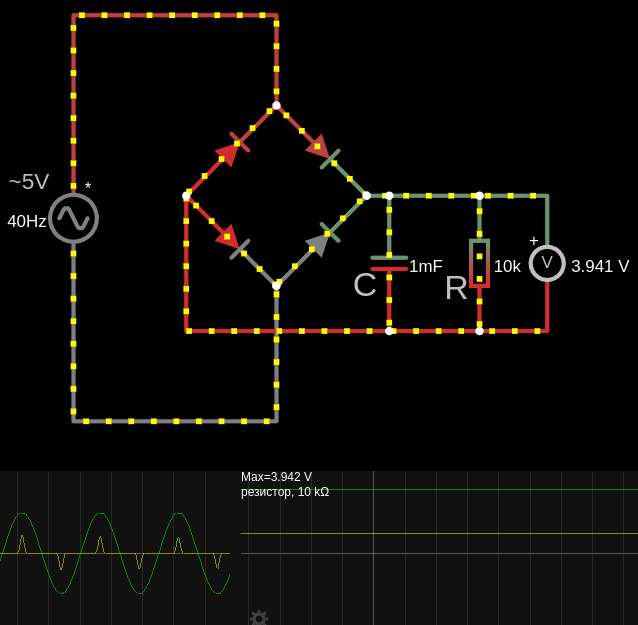

# Сглаживание пульсаций

В блоке питания после диодного моста (выпрямления переменного напряжения) подключён конденсатор $ C = 1000 \, \mu\text{F} $, так как напряжение содержит пульсации.

Конденсатор сглаживает пульсации, делая напряжение более стабильным.

---

Чтобы получить постоянное напряжение из переменного, используется выпрямитель (обычно диодный мост). Диодный мост преобразует переменное напряжение в пульсирующее постоянное напряжение.

Диоды пропускают ток только в одном направлении, "отрезая" отрицательную часть синусоиды.

На выходе диодного моста получается пульсирующее напряжение, которое меняется от 0 до максимального значения (пикового напряжения).

Пульсирующее напряжение после выпрямления не является стабильным. Оно содержит "провалы" между пиками, что неприемлемо для большинства устройств, требующих постоянного напряжения.

Конденсатор используется для сглаживания пульсаций. Он действует как накопитель энергии:
- Когда напряжение на выходе диодного моста достигает пика, конденсатор заряжается.
- Когда напряжение падает, конденсатор разряжается, поддерживая почти постоянное напряжение на нагрузке.

**Расчет пикового напряжение после выпрямления**:

$U_{\text{max}} = U_{\text{вх}} \cdot \sqrt{2} - U_{\text{диоды}}$

$U_{\text{max}} = 5 \cdot \sqrt{2} - 1.4 \approx 5.67 \, \text{В}$

где:
- $U_{\text{диоды}}=1.4$ − это падение напряжение на двух кремниевых диодах (а для одного диода Шоттки 0.3–0.5 В или 3 В)
- $U_{\text{вх}}$ − входящее переменное напряжении (среднеквадратичное значение) 

Конденсатор зарядится до этого напряжения и будет поддерживать его, пока нагрузка не начнет потреблять ток.

Если емкость конденсатора недостаточно велика (например, 1 мкФ), он не сможет эффективно сглаживать пульсации, и напряжение на нагрузке будет значительно ниже пикового.

Чем меньше сопротивление нагрузки (как на схеме 100 Ом) тем ток нагрузки больше, тем быстрее конденсатор разряжается, и тем сильнее пульсации напряжения т.е. плохо выпрямляет.

<a href="/theories_of_electrical_circuits/falstad/circuitjs-86.txt" download="circuitjs-86.txt">Скачать схему для www.falstad.com/circuit</a>

Можно даже расчитать качество выпрямления, через амплитуду пульсаций.

**Амплитуда пульсаций**

$\Delta U = \frac{I_{\text{нагр}}}{2 \pi f C}$
 
где:
- $ I_{\text{нагр}} $ — ток нагрузки,
- $ f $ — частота пульсаций для однополупериодного выпрямления $f = 50 \, \text{Гц}$ или для двухполупериодного выпрямления $f = 100 \, \text{Гц}$ для диодного моста из 4 диодов,
- $ C $ — ёмкость конденсатора.

Для данных на схеме:
- $C=1\ mF = 0.001\ F$
- $R=100\ Om$
- $U_{\text{ср}}=5\ Вольт$
- $f = 100 \, \text{Гц}$

$I_{\text{нагр}} = \frac{U_{\text{ср}}}{R}=\frac{5}{100}=0.05\ A$

$\Delta U = \frac{0.05}{2 \pi \cdot 100 \cdot 0.001} \approx 0.08 \, \text{В}$

$U_{max}=5.67\ V$, а $U_{min}=5.67-0.08=5.59\ V$ т.е. напряжение будет колебаться от 5.59 В до 5.67 В (+/- 0.08)

(Вообще $U_{\text{ср}}$ считается с учетом амплитуды, $U_{\text{ср}}=U_{max}-\frac{\Delta U}{2}$)

(На схеме 3.9 Вольт, что-то не сходится)

- Для более большего сопротивления нагрузки $R=10\ кОm$ т.е. ток нагрузки меньше и конденсатор медленнее разряжается, не создавая пульсаций:

    $I_{\text{нагр}} = \frac{5}{10000} = 0.0005 \, \text{А}$

    $\Delta U = \frac{0.0005}{2 \pi \cdot 100 \cdot 0.001} \approx 0.0008 \, \text{В}$

    $U_{max}=5.67\ V$, а $U_{min}=5.67-0.0008=5.6692\ V$ т.е. напряжение будет колебаться от 5.66 В до 5.67 В (+/- 0.01)

- Или малая емкость, так же будет иметь высокую амплитуду из-за частых циклов заряд/разряд.
Допустим заменим емкость на $C=0.000001\ F$ и даже оставим хорошее сопротивление $R=10\ кОm$ :

    $I_{\text{нагр}} = \frac{5}{10000} = 0.0005 \, \text{А}$

    $\Delta U = \frac{0.0005}{2 \pi \cdot 100 \cdot 0.000001} \approx 0.8 \, \text{В}$ (

    $U_{max}=5.67\ V$, а $U_{min}=5.67-0.8=4.87\ V$ т.е. напряжение будет колебаться от 4.87 В до 5.67 В (+/- 0.8)

- В самом худшем случае при малом сопротивлении $R=100\ Оm$ и малой емкости $C=0.000001\ F$:

    $I_{\text{нагр}} =\frac{5}{100}=0.05\ A$

    $\Delta U = \frac{0.05}{2 \pi \cdot 100 \cdot 0.000001} \approx 79.6 \, \text{В}$ 

    $U_{max}=5.67\ V$, а $U_{min}=5.67-79.6=−73.94\ V$

    Отрицательное напряжение физически невозможно в этой схеме, так как конденсатор не может удерживать отрицательное напряжение после выпрямления.

    Это указывает на то, что:
    - Конденсатор слишком мал для такой нагрузки.
    - Схема не будет работать корректно, и напряжение на нагрузке будет близко к нулю.
    - На практике напряжение на нагрузке будет близко к нулю, так как конденсатор не сможет поддерживать напряжение из-за быстрого разряда. Пульсации будут настолько большими, что схема не сможет выполнять свою функцию.

На схеме выпрямление с большей емкостью и большим сопротивлением

