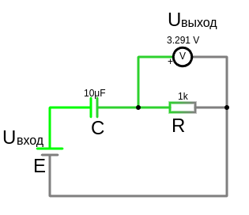
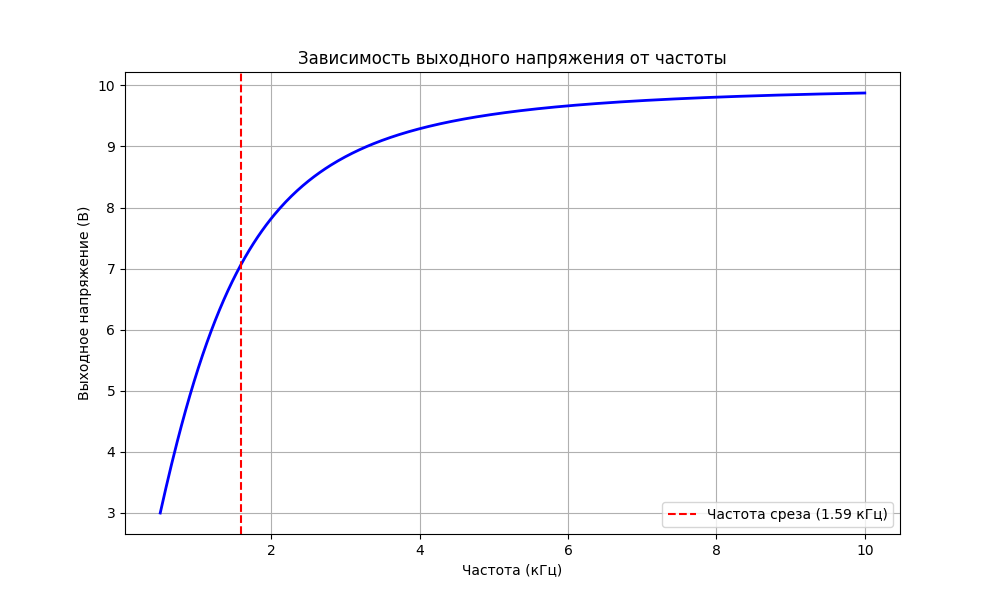
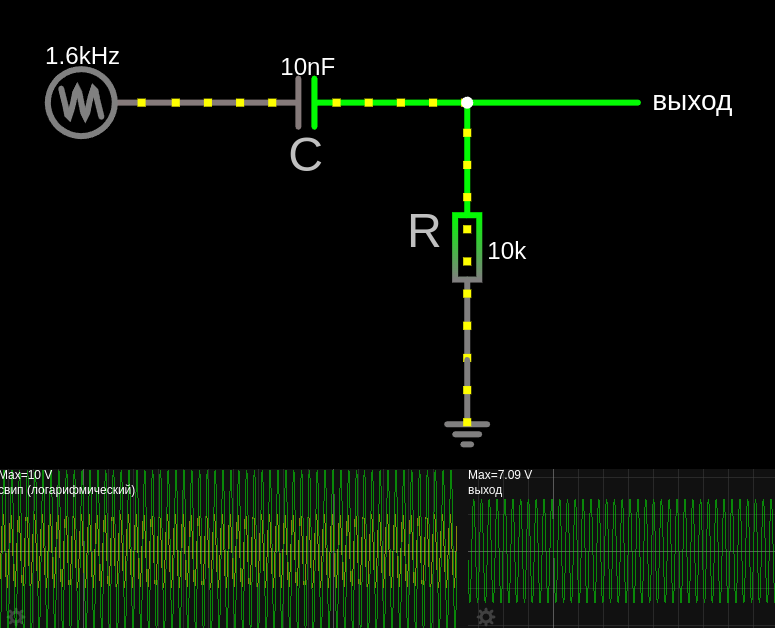
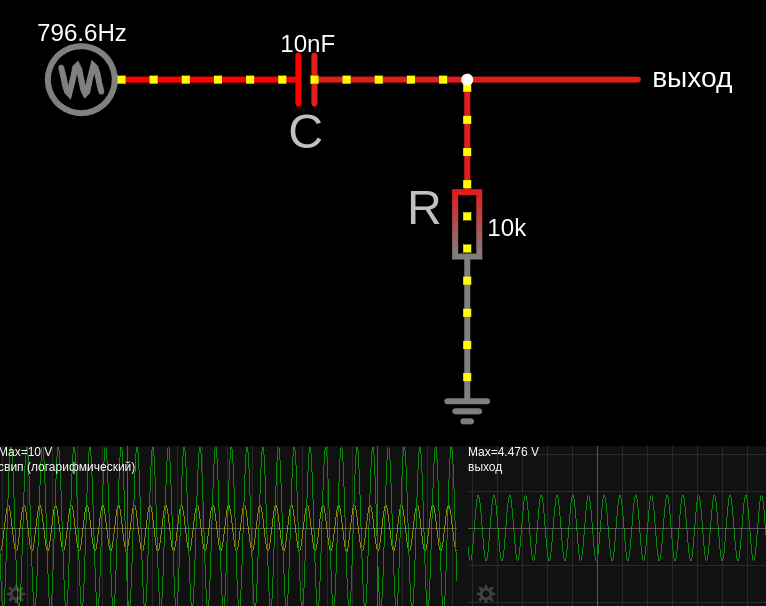

# Подавление высокочастотных помех (дифференцирующая RC-цепь)
Основная функция дифференциальной цепи — выделение переменного тока из сигнала, который состоит из суммы переменного тока и постоянного тока.

RC цепи используются везде, где надо выделить постоянную составляющую (ШИМ), переменную составляющую (межкаскадное соединение усилителей), выделить фронт сигнала, сделать задержку и тд…

- Обнаружение фронтов сигнала: RC-цепь используется для обнаружения резких изменений напряжения (например, фронтов импульсов, используется в схемах управления)
- Фильтр высоких частот пропускает высокие частоты, а низкие ослабляет т.е. подавление низкочастотных помех. В цепях постоянного тока дифференцирующая RC-цепь может подавлять кратковременные помехи в цепях питания или сигнальных линиях.

## [Дифференцирующая RC-цепь](https://www.ruselectronic.com/rc-tsep/). Фильтр высоких частот первого порядка
Дифференциация сигнала — сигнал раскладывается на отдельные составляющие,в отличии от интегрирации сигнала, где отдельные сигналы собираются в один общий.

Дифференцирующая RC-цепь первого порядка состоит из резистора (R) и конденсатора (C), соединенных последовательно, **выходное напряжение снимается с резистора**.



В цепи постоянного тока (DC) дифференцирующая RC-цепь **реагирует на изменения напряжения**, а не на постоянное напряжение.
Конденсатор блокирует постоянный ток, но пропускает переменные составляющие сигнала (например, кратковременные помехи).
Если в цепи появляется кратковременная помеха (например, импульс или скачок напряжения), конденсатор реагирует на это изменение.

**Крутизна спада**:<br>
Фильтр первого порядка ослабляет сигнал на 20 дБ/декаду (или 6 дБ/октаву) ниже частоты среза (10 раз по напряжению на каждую 10-кратную разницу в частоте).

<details>

<summary>Фильтр высоких частот второго порядка на RC-цепи</summary>

Фильтр второго порядка состоит из двух RC-цепей, соединённых последовательно или каскадно. Он обеспечивает более крутой спад амплитудно-частотной характеристики (АЧХ) по сравнению с фильтром первого порядка. Фильтр второго порядка, когда требуется более эффективное подавление низких частот, ослабляет сигнал на 40 дБ/декаду (или 12 дБ/октаву) ниже частоты среза.

</details>

**Как это работает:**
- Высокочастотные помехи — это быстрые изменения напряжения (например, импульсы или шум).
- Конденсатор в дифференцирующей RC-цепи имеет низкое сопротивление для высокочастотных сигналов 
    - по формуле реактивного сопротивления конденсатора (импеданс конденсатора) 

      **Формула для импеданса конденсатора:**

      $ X_C = \frac{1}{2 \pi \cdot f\cdot C} = \frac{1}{\omega \cdot C} $ [Om], 
      где:
        - $X_C$ — реактивное сопротивление конденсатора (в Ом)
        - $2 \pi f\ = \omega$ — называется угловой частотой или круговой частотой, это мера скорости вращения или колебания в радианах в секунду (рад/с)
        - $f$ — частота переменного напряжения
        - $C$ — ёмкость конденсатора (в Фарадах)
    
      С увеличением частоты $f$, либо емкости $C$, сопротивление емкости $X_C$ уменьшается 
        - На низких частотах ($f \to 0$) импеданс конденсатора очень большой, почти как разрыв цепи, поэтому, и сигнал не проходит
        - На высоких частотах ($f \to \infty$) импеданс очень маленький, почти как короткое замыкание т.е. без сопротивления, и высокочастотная составляющая уходит на общий провод (если фильтр на землю)
        - На частоте среза т.е. частота сигнала равна частоте среза, сигнал ослабляется на -3 дБ

- Когда высокочастотная помеха проходит через цепь, конденсатор "пропускает" её, и она появляется на резисторе.
- Однако, если помеха очень кратковременная, её энергия рассеивается на резисторе, и она не влияет на основную цепь.


## Частота среза для RC-фильтра

Частота среза — это такая частота, при которой амплитуда выходного сигнала падает до $\frac{1}{\sqrt{2}}$ от максимального значения,в терминах децибел это `−3дБ` и означает, что мощность сигнала упала в 2 раза, в терминах напряжения, это падение примерно на 29% (в 1.41 раза)

**Расчитать логарифмическую зависимость падения напряжения от входящей частоты.** 

Для частоты среза **RC-фильтра** используется формула для амплитуды выходного сигнала:

1. Амплитудно-частотная характеристика (АЧХ)
    
    $A(f) = \frac{\frac{f}{f_c}}{\sqrt{1 + \left( \frac{f}{f_c} \right)^2}}$
    
    Где:   
    - $ f $ — текущая частота.  
    - $ f_c $ — частота среза.  

2. После этого мы можем перевести амплитуду в **децибелы (дБ)**:

    $\text{Усиление в дБ} = 20 \cdot \log_{10}(A(f))$

3. Взаимосвязь между децибелами (дБ) и напряжением описывается формулой:
   - $\frac{V_{\text{out}}}{V_{\text{in}}} = 10^{\frac{A(f)}{20}}$
        
    Где:  
    - $ V_{\text{out}} $ — выходное напряжение 
    - $ V_{\text{in}} $ — входное напряжение
    - $ A(f)$ — усиление (или ослабление) в **дБ** 


**Например при входящем напряжении 10 Вольт и частотой среза 1.59 kHz**, 
- для текущей частоты 1.59 kHz:
    - $ A(1590)= \frac{\frac{f}{f_c}}{\sqrt{1 + \left( \frac{f}{f_c} \right)^2}} = \frac{\frac{1590}{1590}}{\sqrt{1 + \left( \frac{1590}{1590} \right)^2}} = 0.707106781 $
    - $\text{Усиление в дБ} = 20 \cdot \log_{10}(A(f)) = 20 \cdot \log_{10}(0.707106781)\approx −3\ дБ$
    - $\frac{V_{out}}{V_{in}} = 10^{\frac{A(f)}{20}} \Rightarrow \frac{V_{out}}{V_{in}} = 10^{\frac{-3}{20}}\Rightarrow \frac{V_{out}}{V_{in}} = 0.707945784 \Rightarrow V_{out}=V_{in}\cdot 0.707945784 = 10\cdot 0.707945784 \approx 7.079\ V$ (падение примерно на 29% (в 1.41 раза) от 10 Вольт)

- для текущей частоты 0.795 kHz:
    - $ A(795) = \frac{\frac{795}{1590}}{\sqrt{1 + \left( \frac{795}{1590} \right)^2}}=0.447213595$
    - $\text{Усиление в дБ} = 20 \cdot \log_{10}(A(f)) = 20 \cdot \log_{10}(0.447213595)\approx −6.989700053\ дБ$
    - $\frac{V_{out}}{V_{in}} = 10^{\frac{A(f)}{20}} \Rightarrow \frac{V_{out}}{V_{in}} = 10^{\frac{−6.989700053}{20}}\Rightarrow \frac{V_{out}}{V_{in}} = 0.447213595$ <br>$ \Rightarrow V_{out}=V_{in}\cdot 0.447213595 = 10\cdot 0.447213595 = 4.47\ V$ (т.е. напряжение упало в два раза)

- для текущей частоты 0.159 kHz:
    - $ A(159) = \frac{\frac{159}{1590}}{\sqrt{1 + \left( \frac{159}{1590} \right)^2}}=0.099503719$
    - $\text{Усиление в дБ} = 20 \cdot \log_{10}(A(f)) = 20 \cdot \log_{10}(0.099503719)\approx −20.04321374\ дБ$
    - $\frac{V_{out}}{V_{in}} = 10^{\frac{A(f)}{20}} \Rightarrow \frac{V_{out}}{V_{in}} = 10^{\frac{−20.04321374}{20}}\Rightarrow \frac{V_{out}}{V_{in}} = 0.099503719$ <br>$ \Rightarrow V_{out}=V_{in}\cdot 0.099503719 = 10\cdot 0.099503719 = 0.995\ V$ (что соответвует фильтру первого порядка, ослабление в 10 раз по напряжению на каждую 10-кратную разницу в частоте)



<details>

<summary>build chart cutoff frequency of an RC filter high</summary>

```python
# Мы изобразим, как выходное напряжение зависит от частоты сигнала для заданной RC-цепи.

import numpy as np
import matplotlib.pyplot as plt

# Данные
f_c = 1590  # Частота среза в Гц
R = 10000   # Сопротивление в Ом
C = 10e-9   # Ёмкость в Фарад
V_in = 10   # Входное напряжение в Вольтах

# Частоты от 0.5 до 10 кГц
frequencies = np.linspace(500, 10000, 500)

# Расчёт выходного напряжения
V_out = V_in * (2 * np.pi * frequencies * R * C) / np.sqrt(1 + (2 * np.pi * frequencies * R * C)**2)

# Построение графика
plt.figure(figsize=(10, 6))
plt.plot(frequencies / 1000, V_out, color='blue', linewidth=2)
plt.axvline(x=f_c / 1000, color='red', linestyle='--', label='Частота среза (1.59 кГц)')

# Настройки графика
plt.xlabel('Частота (кГц)')
plt.ylabel('Выходное напряжение (В)')
plt.title('Зависимость выходного напряжения от частоты')
plt.grid()
plt.legend()
plt.show()
```

</details>

## Расчета частоты среза
- $ f_C = \frac{1}{2 \pi \cdot R\cdot C} $ [Hz]

где:
   - $f_C$ — частота среза фильтра (где амплитуда падает на -3 дБ)
   - $R$ — сопротивление резистора (в Ом)
   - $C$ — ёмкость конденсатора (в Фарадах)
   - - $R\cdot C=\tau$ — постоянная времени (сек) для заряда емкости до 63.2% от напряжения источника. По прошествии 5-ти $\tau$ времени, емкость заряжена на 99.24%    

**Амплитудно-частотная характеристика (АЧХ)**
- Частоты ниже частоты среза ($f_C$) ослабляются/приглушаться. Чем выше частота, тем лучше она проходит.
- Частоты выше частоты среза проходят почти без потерь. Чем ниже частота, тем сильнее она гасится.
- При частоте равной $f_C$ сигнал ослабляется на -3 дБ (падает в 2 раза по напряжению)


## Рассчет ёмкости или сопротивления для получения нужной частоты среза

Если вы знаете желаемую частоту среза $f_c$, удобнее сначала выбрать конденсатор (ближайший стандартный номинал), а потом рассчитать резистор.

Если мы знаем сопротивление, то расчитаем нужную емкость: 
- $C = \frac{1}{2 \pi R\cdot f_c}$

Если мы знаем емкость, то расчитаем нужное сопротивление: 
- $R = \frac{1}{2 \pi \cdot f_c\cdot C}$

**Золотое правило подбора RC-фильтра:**  
Обычно выбирают значения так, чтобы:  

- **R** в диапазоне **1 кОм — 100 кОм**  
- **C** в диапазоне **1 нФ — 1 мкФ** 

**Простая формула для соотношения:** 

$R \times C = \frac{1}{2 \pi \cdot f_c}$

Допусти частота среза $f_c=1.59\ kHz$, тогда:
- $R \times C = \frac{1}{2 \pi \cdot 1590} \Rightarrow R \times C = 0.0001 $

Хотите точную частоту → выбирайте конденсатор, подгоняйте резистор.
 - Конденсаторы обычно имеют более ограниченный диапазон стандартных значений
 - Конденсатор влияет на динамику отклика: большая ёмкость может замедлить реакцию фильтра на резкие изменения сигнала.

Боитесь потерять сигнал или перегрузить цепь → начинайте с резистора в пределах 10 кОм – 100 кОм.
 - Резистор влияет на ток и нагрузку цепи: слишком большое сопротивление может ослабить сигнал или создать помехи.

## Пример, высокочастотный фильтр первого порядка (ФВЧ) на RC-цепочке

Отфильтровать частоту `1.59 kHz` т.е. все что выше этой частоты мы хотим видеть на выходе, а все что ниже отрезать. Источник напряжения 10 Вольт.

1. Допустим, выберем резистор: 
    - $R=10\, \text{k}\Omega$

    <details>

    <summary>Или выберим сперва емкость:</summary>
        такую же, для сравнения результатов расчёта $C=0.00000001\ F$
        
    тогда расчитаем сопротивление:
    - $R = \frac{1}{2 \pi \cdot f_c\cdot C} =  \frac{1}{2 \pi \cdot 1590\cdot 0.00000001}\approx 10009.7\ \Omega = 10\, \text{k}\Omega$

    </details>

2. Теперь рассчитаем ёмкость: 
    - $C = \frac{1}{2 \pi \cdot f_c \cdot R}=\frac{1}{2 \pi \cdot 1590 \cdot 10000} \approx 0.00000001\ F = 10 \, \text{nF}$

3. Проверим частоту среза для RC-фильтра, она должна быть равна заданной `1.59 kHz`:
    - $ f_C = \frac{1}{2 \pi R\cdot C} =  \frac{1}{2 \pi 10000\cdot 0.00000001} = 1591.54\ Hz = 1.59\ kHz $ 

4. Проверка импеданса
    -  $ X_C = \frac{1}{2 \pi \cdot f\cdot C} = \frac{1}{2 \pi \cdot 1591.54\cdot 0.00000001}=10000.1\ \Omega=10\, \text{k}\Omega$ 

    То есть:
    -  На частоте среза сигнал ослабляется на -3 дБ (значит мощность сигнала упала в 2 раза, в терминах напряжения, это падение примерно на 29% (в 1.41 раза)).
    -  Чем выше частота, тем сильнее сигнал проходит.

А расчет изменения напряжения в зависимости от входящей частоты уже посчитан выше.

В симуляторе используется источник помех "свип" с частотой в среднем 1.59 kHz для проверки работы фильтра, и как видно на выходе 7 Вольт (т.е. в 1.41 раза меньше входного)



Далее меняем частоту помех на 0.8 kHz и наблюдаем напряжение на выходе 4.4 Вольт, т.е. низкую частоту фильтр отсекает



<a href="/theories_of_electrical_circuits/falstad/circuitjs-87.2.txt" download="circuitjs-87.2.txt">Скачать схему для www.falstad.com/circuit</a>

<a href="/theories_of_electrical_circuits/falstad/circuitjs-87.txt" download="circuitjs-87.txt">Скачать схему генератор помех для www.falstad.com/circuit</a>
