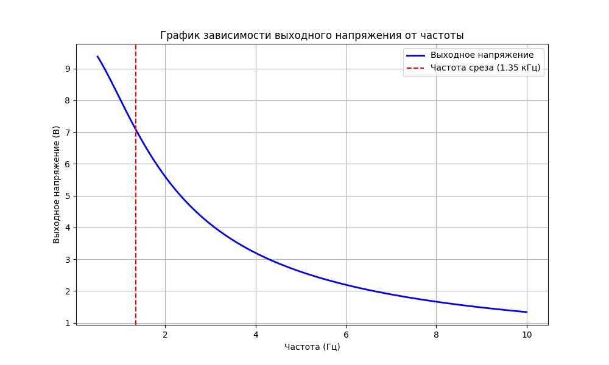
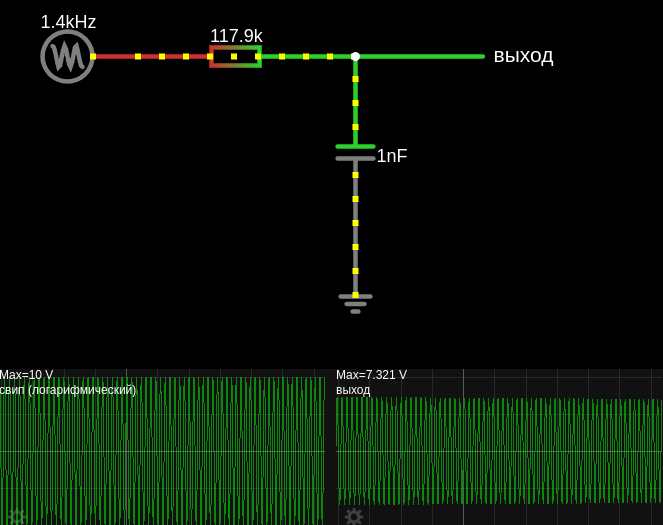
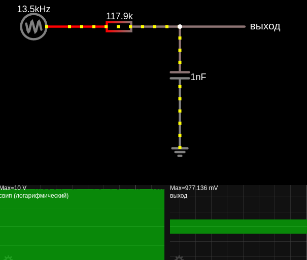

# Подавление низкочастотных помех  (интегрирующая RC-цепь)

- Таймеры и задержки: RC-цепь используется для создания временных задержек в схемах.
- Плавный пуск: Для медленного нарастания напряжения на нагрузке.
- Фильтр низких частот (ФНЧ) пропускает низкие частоты и подавляет высокие частоты. (для уменьшения помех, создаваемых моторчиками постоянного тока, часто используется фильтр низких частот. Этот фильтр помогает снизить высокочастотные помехи, которые могут быть результатом работы мотора, и улучшить стабильность работы схемы)

RC цепи используются везде, где надо выделить постоянную составляющую (ШИМ), переменную составляющую (межкаскадное соединение усилителей), выделить фронт сигнала, сделать задержку и тд…

## [Интегрирующая RC-цепь](https://www.ruselectronic.com/rc-tsep/)
Интегрирация сигнала — (площадь под кривой) усредняет значение сигналов до одного постоянного уровня, отдельные сигналы собираются в один общий,в отличии от дифференциации сигнала, когда сигнал раскладывается на отдельные составляющие.

 
Интегрирующая RC-цепь состоит из резистора (R) и конденсатора (C), соединенных последовательно. **Выходное напряжение снимается с конденсатора**.


В чистой цепи постоянного тока (без переменных составляющих) интегрирующая RC-цепь не выполняет функцию фильтра, так как конденсатор просто заряжается до входного напряжения.

Для работы как фильтр низких частот в цепи должны присутствовать переменные составляющие (например, пульсации или помехи).

Фильтр низких частот пропускает низкочастотные сигналы (включая постоянное напряжение) и подавляет высокочастотные сигналы.
В цепи постоянного тока (DC) интегрирующая RC-цепь ведет себя как фильтр низких частот для переменных составляющих сигнала (например, пульсаций или помех).
 

### Принцип работы
1. **На низких частотах**:
   - Конденсатор имеет высокое сопротивление ($ X_C = \frac{1}{2\pi fC} $), поэтому большая часть входного напряжения падает на резисторе.
   - Выходное напряжение (снимаемое с конденсатора) почти равно входному напряжению.

2. **На высоких частотах**:
   - Конденсатор имеет низкое сопротивление, поэтому большая часть входного напряжения падает на конденсаторе.
   - Выходное напряжение (снимаемое с конденсатора) значительно меньше входного напряжения.

3. **На частоте среза**:
   - Выходное напряжение ослабляется до уровня $\frac{1}{\sqrt{2}}$ (примерно 70,7%) от входного напряжения.
   - Это соответствует ослаблению на -3 дБ.

## Расчет частоты среза
- $ f_C = \frac{1}{2 \pi \cdot R\cdot C} $ [Hz]

где:
   - $f_C$ — частота среза фильтра (где амплитуда падает на -3 дБ)
   - $R$ — сопротивление резистора (в Ом)
   - $C$ — ёмкость конденсатора (в Фарадах)
   - - $R\cdot C=\tau$ — постоянная времени (сек) для заряда емкости до 63.2% от напряжения источника. По прошествии 5-ти $\tau$ времени, емкость заряжена на 99.24%  

**Амплитудно-частотная характеристика (АЧХ)**
- На частотах ниже $f_C$ сигнал проходит почти без ослабления.
- На частотах выше $f_C$ сигнал ослабляется со скоростью -20 дБ/декаду (или -6 дБ/октаву).

## Рассчет ёмкости или сопротивления для получения нужной частоты среза

Если мы знаем сопротивление, то расчитаем нужную емкость: 
- $C = \frac{1}{2 \pi R\cdot f_c}$

Если мы знаем емкость, то расчитаем нужное сопротивление: 
- $R = \frac{1}{2 \pi \cdot f_c\cdot C}$

Конденсаторы имеют ограниченный диапазон стандартных значений, поэтому начните с выбора номинала емкости.
 
Для ФНЧ обычно выбирают конденсаторы с ёмкостью в диапазоне:
- `1 нФ – 1 мкФ` (для высоких частот, например $f_C > 1кГц$
- `1 мкФ – 100 мкФ` (для низких частот, например $f_C < 1кГц$

Учитывайте, что большая ёмкость может замедлить реакцию фильтра на резкие изменения сигнала.

Выберите стандартное значение резистора, близкое к расчётному. Для большинства цепей подходят резисторы в диапазоне `1 кОм – 100 кОм`.
- Если сопротивление слишком велико, это может ослабить сигнал или увеличить уровень шумов.
- Если сопротивление слишком мало, это может привести к большим токам и перегрузке цепи.

Проверьте динамику отклика
- Убедитесь, что выбранные `R` и `C` обеспечивают нужную скорость реакции фильтра.
- Для ФНЧ большая ёмкость `C` увеличивает постоянную времени $τ=R\cdot C$, что замедляет реакцию фильтра.


## Расчет изменения напряжения в зависимости от входящей частоты.

С помощью формулы передаточной функции (коэффициента передачи)

$\frac{U_{\text{out}}}{U_{\text{in}}} = \frac{1}{\sqrt{1 + (2 \pi f R C)^2}}$
 
Где:  
- $ U_{\text{out}}$ — выходное напряжение (V)  
- $ U_{\text{in}} $ — входное напряжение (V) 
- $ f$ — входная частота $(\text{Гц})$ 
- $ R$ — рассчитанное сопротивление $(\Omega)$  
- $ C$ — емкость $(F)$ 


## Пример, низкочастотный фильтр первого порядка (ФВЧ) на RC-цепочке
Отфильтровать частоту `1.35 kHz` т.е. все что ниже этой частоты мы хотим видеть на выходе, а все что выше отрезать. Источник напряжения 10 Вольт.

1. Допустим, выберем емкость:
- $C = 0.000000001\ F=1\ nF$

<details>

<summary>Или выберим сперва сопротивление:</summary>
    такое же, для сравнения результатов расчёта $R=117892.55\ \Omega$
    
тогда расчитаем емкость:
- $C = \frac{1}{2 \pi \cdot f_c\cdot R}=\frac{1}{2 \pi \cdot 1350 \cdot 117892.55} \approx 0.000000001\ F = 1 \, \text{nF}$

</details>

2. Расчитаем сопротивление:
- $R = \frac{1}{2 \pi \cdot f_c\cdot C} =  \frac{1}{2 \pi \cdot 1350\cdot 0.000000001}\approx 117892.55 \ \Omega=117.89\, \text{k}\Omega$ 

3. Проверим частоту среза для RC-фильтра, она должна быть равна заданной `1.35 kHz`:
- $ f_C = \frac{1}{2 \pi R\cdot C} =  \frac{1}{2 \pi 117892.55\cdot 0.000000001} = 1349.99\ Hz = 1.35\ kHz $ 

4. Расчет изменения напряжения в зависимости от входящей частоты. С помощью формулы передаточной функции (коэффициента передачи)

- для текущей частоты 500 Hz:
    - $\frac{U_{out}}{10} = \frac{1}{\sqrt{1 + (2 \pi \cdot 500\cdot 117892.55\cdot 0.000000001)^2}}\Rightarrow U_{out}=10\cdot 0.937748761 = 9.37\ V$   

- для текущей частоты 1350 Hz:
    - $\frac{U_{out}}{10} = \frac{1}{\sqrt{1 + (2 \pi \cdot 1350\cdot 117892.55\cdot 0.000000001)^2}}\Rightarrow U_{out}=10\cdot 0.707106783 = 7.07\ V$  (падение примерно на 29% (в 1.41 раза) от 10 Вольт)

- для текущей частоты 2700 Hz:
    - $\frac{U_{out}}{10} = \frac{1}{\sqrt{1 + (2 \pi \cdot 2700\cdot 117892.55\cdot 0.000000001)^2}}\Rightarrow U_{out}=10\cdot 0.447213597 = 4.47\ V$  (т.е. напряжение упало в два раза ) 

- для текущей частоты 13500 Hz:
    - $\frac{U_{out}}{10} = \frac{1}{\sqrt{1 + (2 \pi \cdot 13500\cdot 117892.55\cdot 0.000000001)^2}}\Rightarrow U_{out}=10\cdot 0.099503719 = 0.99\ V$  (что соответвует фильтру первого порядка, ослабление в 10 раз по напряжению на каждую 10-кратную разницу в частоте)

Чем ниже частота, тем сильнее сигнал проходит, т.е. напряжение больше.  




<details>

<summary>build chart cutoff frequency of an RC filter low</summary>

```python
import numpy as np
import matplotlib.pyplot as plt

# Параметры схемы
f_c = 1350        # Частота среза в Гц
Vin = 10          # Входное напряжение, В
R = 117892.55     # Сопротивление, Ом
C = 1e-9          # Емкость, Ф

# Генерация частот
frequencies = np.linspace(500, 10000, 500)

# Расчет выходного напряжения
Vout = Vin / np.sqrt(1 + (2 * np.pi * frequencies * R * C)**2)

# Построение графика
plt.figure(figsize=(10, 6))
plt.plot(frequencies / 1000, Vout, color='b', label='Выходное напряжение', linewidth=2)
plt.axvline(x=f_c / 1000, color='red', linestyle='--', label='Частота среза (1.35 кГц)')
plt.xlabel('Частота (Гц)')
plt.ylabel('Выходное напряжение (В)')
plt.title('График зависимости выходного напряжения от частоты')
plt.grid()
plt.legend()
plt.show()
```

</details>

В симуляторе используется источник помех "свип" с частотой в среднем 1350 kHz для проверки работы фильтра, и как видно на выходе 7 Вольт (т.е. в 1.41 раза меньше входного)



Далее меняем частоту помех на 13500 Hz и наблюдаем напряжение на выходе 0.9 Вольт, т.е. высокую частоту фильтр отсекает



<a href="/theories_of_electrical_circuits/falstad/circuitjs-88.txt" download="circuitjs-88.txt">Скачать схему для www.falstad.com/circuit</a>