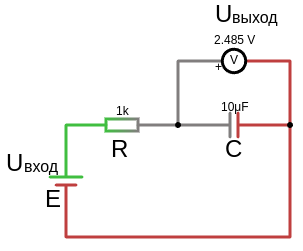

# Подавление низкочастотных помех  (интегрирующая RC-цепь)

- Таймеры и задержки: RC-цепь используется для создания временных задержек в схемах.
- Плавный пуск: Для медленного нарастания напряжения на нагрузке.
- Подавление низкочастотных помех (ФНЧ), но пропускает высокие частоты

## Интегрирующая RC-цепь
Интегрирация сигнала — отдельные сигналы собираются в один общий,в отличии от дифференциации сигнала, когда сигнал раскладывается на отдельные составляющие.

 
Интегрирующая RC-цепь состоит из резистора (R) и конденсатора (C), соединенных последовательно. Выходное напряжение снимается с конденсатора.

В чистой цепи постоянного тока (без переменных составляющих) интегрирующая RC-цепь не выполняет функцию фильтра, так как конденсатор просто заряжается до входного напряжения.

Для работы как фильтр низких частот в цепи должны присутствовать переменные составляющие (например, пульсации или помехи).

Фильтр низких частот пропускает низкочастотные сигналы (включая постоянное напряжение) и подавляет высокочастотные сигналы.
В цепи постоянного тока (DC) интегрирующая RC-цепь ведет себя как фильтр низких частот для переменных составляющих сигнала (например, пульсаций или помех).
 

**5. Пример расчета:**
Если у вас есть:
- Резистор $ R = 1 \, \text{кОм}$ 
- Конденсатор $C = 100 \, \mu\text{F}$

Частота среза фильтра низких частот:
 
$f_c = \frac{1}{2 \pi R C} = \frac{1}{2 \pi \cdot 1000 \cdot 100 \cdot 10^{-6}} \approx 1.59 \, \text{Гц}$
 
Это означает, что фильтр будет подавлять сигналы с частотой выше 1.59 Гц.