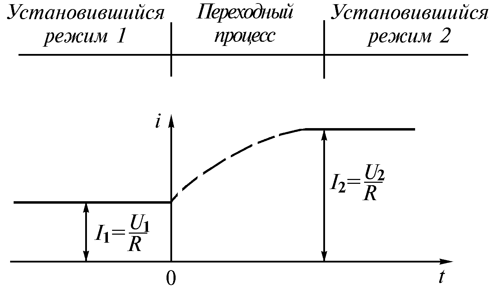
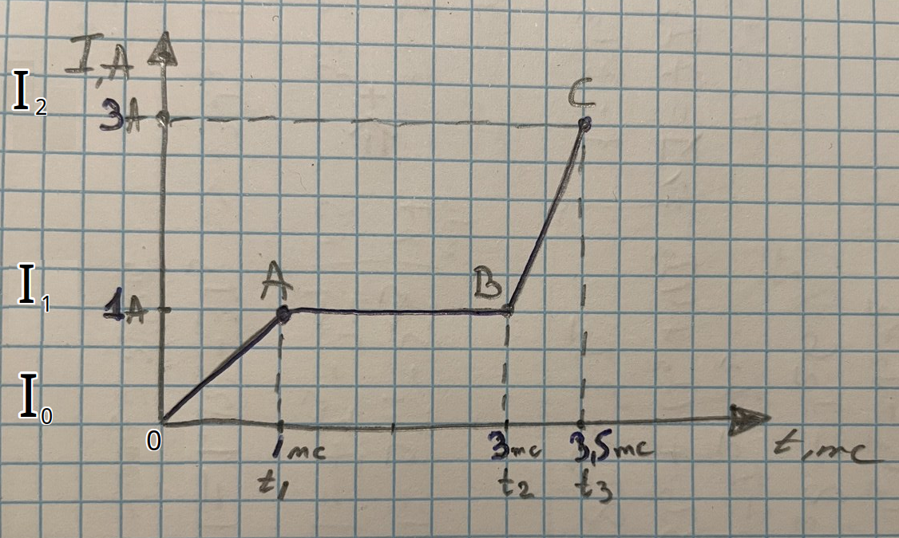
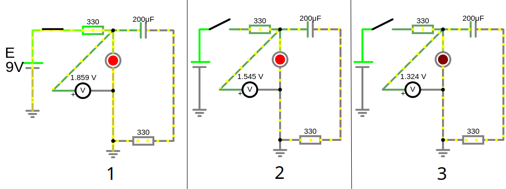

# Урок 9. Установившийся и переходной режимы электрических цепей.

## Анализ и синтез электрических цепей: основные понятия и задачи

**Анализ электрических цепей** и **синтез электрических цепей** – это два взаимосвязанных процесса, которые лежат в основе проектирования и исследования электронных устройств.

## Анализ электрических цепей

**Анализ** - это процесс определения характеристик электрической цепи при заданных параметрах ее элементов и внешних воздействиях. Другими словами, это ответ на вопрос: "Что будет, если...?"

**Основные задачи анализа:**

* **Расчет токов и напряжений:** Определение значений токов в ветвях и напряжений на элементах цепи.
* **Определение частотных характеристик:** Анализ поведения цепи при воздействии сигналов различной частоты.
* **Определение переходных процессов:** Исследование поведения цепи при изменении внешних условий (например, при включении источника питания).
* **Определение устойчивости:** Оценка способности цепи сохранять заданный режим работы при возмущениях.

**Методы анализа:**
* **Законы Кирхгофа:** Основные законы, позволяющие составить систему уравнений для анализа электрических цепей.
* **Метод узловых потенциалов:** Позволяет определять потенциалы узлов цепи.
* **Метод контурных токов:** Позволяет определять токи в контурах цепи.
* **Матричный метод:** Используется для анализа сложных электрических цепей.
* **Компьютерное моделирование:** С помощью специализированных программ (например, SPICE) можно моделировать поведение электрических цепей и проводить анализ.

## Синтез электрических цепей

**Синтез** - это процесс создания электрической цепи с заданными характеристиками. Другими словами, это ответ на вопрос: "Как сделать так, чтобы?".

**Основные задачи синтеза:**
* **Проектирование фильтров:** Создание цепей, пропускающих сигналы определенных частот и задерживающих другие.
* **Проектирование усилителей:** Создание цепей, усиливающих электрические сигналы.
* **Проектирование генераторов:** Создание цепей, генерирующих электрические колебания.
* **Проектирование источников питания:** Создание цепей, преобразующих переменный ток в постоянный или стабилизирующих напряжение.

**Методы синтеза:**
* **Аналитический метод:** Основан на использовании математических методов для расчета параметров элементов цепи.
* **Графический метод:** Используется для визуального представления и анализа электрических цепей.
* **Компьютерное моделирование:** Позволяет быстро и эффективно моделировать различные варианты схем и выбирать оптимальный.

### Связь между анализом и синтезом
Анализ и синтез электрических цепей тесно связаны между собой. При синтезе часто требуется выполнить анализ промежуточных схем для проверки их характеристик. А при анализе существующей схемы можно использовать полученные результаты для ее оптимизации или модификации.

**Примеры задач:**
* **Анализ:** Определить ток, протекающий через резистор в заданной цепи при известном напряжении источника.
* **Синтез:** Спроектировать фильтр нижних частот с заданной частотой среза.

**Современные инструменты для анализа и синтеза:**
* **Специализированные программные пакеты:** SPICE, MATLAB, Multisim и др.
* **Языки программирования:** Python, C++ с использованием соответствующих библиотек.

**Заключение**
Анализ и синтез электрических цепей - это фундаментальные задачи электротехники. Понимание этих процессов позволяет инженерам проектировать и создавать разнообразные электронные устройства, от простых схем до сложных систем автоматики.

## Установившийся режим

**Установившийся режим** электрической цепи – это состояние, при котором токи и напряжения в цепи не изменяются со временем. Это происходит после того, как все переходные процессы, вызванные изменением параметров цепи или включением/выключением источников питания, завершились.

**Характеристики установившегося режима:**

* **Постоянство токов и напряжений:** Значения токов и напряжений не изменяются с течением времени.
* **Линейность:** В большинстве случаев установившийся режим описывается линейными уравнениями.
* **Простота анализа:** Для анализа установившегося режима можно использовать законы Кирхгофа и Ома.

**Пример:**
Если подключить резистор к источнику постоянного напряжения, то через некоторое время установится постоянный ток через резистор, и напряжение на нем будет равно напряжению источника.

## Переходной режим

**Переходной режим** – это процесс перехода электрической цепи из одного установившегося состояния в другое. Он возникает при изменении параметров цепи (например, включении или выключении источника питания, изменении сопротивления) или при воздействии на цепь внешних сигналов.

**Характеристики переходного режима:**
* **Изменение токов и напряжений:** Токи и напряжения в цепи изменяются со временем.
* **Нелинейность:** В некоторых случаях переходные процессы описываются нелинейными уравнениями.
* **Сложность анализа:** Анализ переходных процессов требует использования более сложных математических методов, таких как дифференциальные уравнения.

**Пример:**
При замыкании ключа в цепи с резистором и конденсатором, конденсатор начнет заряжаться, и ток в цепи будет постепенно уменьшаться. Этот процесс и будет переходным режимом.

---

## Поведение конденсатора в установившемся режиме в цепи постоянного тока (обрыв $I=0,A$)

Противодействует изменению напряжения. Если напряжение пытается измениться, конденсатор заряжается или разряжается, чтобы его стабилизировать. Накопление энергии происходит в виде электрического поля между его обкладками. В установившемся режиме ведёт себя как разрыв цепи (обрыв). Реакция на скачок напряжения вызывает скачок тока.

**1. Включение конденсатора в цепь постоянного тока**
- **При подаче напряжения на конденсатор** ток начинает протекать в цепи, но **только до тех пор, пока конденсатор заряжается**. Это происходит, потому что в начале зарядки разность потенциалов между обкладками конденсатора мала, и ток ограничивается только сопротивлением цепи.
- Постепенно, по мере зарядки, напряжение на обкладках конденсатора увеличивается, и ток уменьшается. Как только напряжение на конденсаторе достигает напряжения источника, ток в цепи прекращается, так как конденсатор становится эквивалентен разрыву цепи.
- Итог: После завершения зарядки конденсатор больше не пропускает ток в цепи постоянного тока (он ведёт себя как разомкнутая цепь).

**2. Отключение конденсатора от источника**
- При отключении конденсатора от источника питания он сохраняет заряд на своих обкладках, то есть напряжение на его обкладках остаётся неизменным (в идеальном случае). Это связано с тем, что энергия, накопленная в электрическом поле, остаётся в конденсаторе:
   
  $W = \frac{1}{2} C U^2$
   
  где $C$ — ёмкость, $U$ — напряжение на обкладках.

- Если цепь остаётся разомкнутой, ток через конденсатор не протекает, и напряжение на нём удерживается.

**3. Разряд конденсатора**
- Если цепь замкнуть (например, подключив нагрузку), конденсатор начнёт разряжаться, "отдавая" накопленную энергию. При этом через нагрузку будет течь ток, а напряжение на конденсаторе будет постепенно уменьшаться.  
- Закон разряда конденсатора описывается экспоненциальной зависимостью:
  
  $U(t) = U_0 e^{-\frac{t}{RC}}$
  
  где $R$ — сопротивление нагрузки, $C$ — ёмкость конденсатора.

**Заряженная катушка индуктивности после размыкания цепи пытаясь поддерживать ток, повышает напряжение, а заряженный конденсатор при размыкании цепи пытаясь удержать напряжение, повышает ток, таким образом они способствуют протеканию тока после размыкания цепи.**  

В **установившемся режиме** в цепи постоянного тока (когда все переходные процессы завершились) конденсатор ведет себя следующим образом:

#### 1. **Конденсатор как разомкнутая цепь**
   - Конденсатор полностью заряжается до напряжения источника (если он подключен напрямую к нему через резистор).
   - После завершения зарядки ток через конденсатор перестает течь, так как сопротивление (импеданс) конденсатора в постоянном токе становится **бесконечно большим**. 

   **Физическая причина:**  
   При постоянном напряжении ток через конденсатор течет только до тех пор, пока он заряжается. Как только напряжение на обкладках конденсатора достигает напряжения источника, ток прекращается, так как нет изменения напряжения (а ток в конденсаторе зависит от изменения напряжения: $ I = C\cdot \frac{dU}{dt} $).

#### 2. **Эквивалентная модель**
   - В установившемся режиме конденсатор можно заменить **разрывом цепи** (эквивалентом бесконечного сопротивления).

#### 3. **Энергия в конденсаторе**
   - Конденсатор сохраняет накопленную энергию в электрическом поле между обкладками. Энергия определяется формулой:  
    
     $W = \frac{1}{2} C U^2, J\ $ (измеряется в джойлях Дж)
      
     где $ C $ — ёмкость конденсатора, $ U $ — напряжение на его обкладках.

**Пример**:
Если в цепи постоянного тока есть резистор $ R $ и конденсатор $ C $, подключенные к источнику постоянного напряжения $ U $, то:  
- Сначала ток будет уменьшаться экспоненциально при зарядке конденсатора.  
- После завершения зарядки ток в цепи станет равен **нулю**, и напряжение на конденсаторе будет равно напряжению источника.  

**Итог:** Конденсатор в установившемся режиме в цепи постоянного тока ведет себя как **разрыв цепи**.

### Пояснение:

Исходная цепь и как цепь будет выглядеть в установившемся режиме в котором конденсаторы равносильны обрыву цепи. Ток в ветви с конденсатором $C_1$ и $C_2$ равен 0, поэтому остается только путь через ветвь с резистором $R_1$

Когда конденсатор полностью заряжен то ток через него перестает протекать, поэтому конденсатор в таких цепях представляют как разрыв цепи и ток в ветки с конденсатором $I = 0$ и сопротивление ветви с конденсатором $R \to \infty$

Когда цепь замыкается то конденсатор заряжается т.е. ток протекает и когда цепь размыкается конденсатор разряжается т.е. ток тоже протекает, но это **переходные режимы**, а в устоявшемся режиме ток $I = 0$

- для отрезка [0A], ток в конденсаторе $ I = C\cdot \frac{dU}{dt} =  C\cdot \frac{U_1 - U_2}{t_0 - t_1} = C\cdot \frac{5 - 0}{1 - 0} = C\cdot \frac{5,B}{1,mc}, A$ т.е. растет с этой скоростью до момента полного заряда конденсатора

- для отрезка [AB] когда конденсатор зярядился,т.е. для устоявшегося режима, $I = 0$ потому что 
$I = C\cdot \frac{U_2 - U_3}{t_1 - t_2} = C\cdot \frac{5-5 B}{2 mc} = C\cdot \frac{0,B}{2,mc} = 0, A$, т.е. напряжение не изменилось за время и соответсвенно ток нулевой на этом отрезке $\to I=0,A$ это равносльно **разрыву цепи**

- отрезок [BC] характерен в моменты включения/выключения или замыкания/размыкания цепи, показывает зависимость времени от тока, чем больше изменится напряжение за единицу времени тем больше ток будет протекать через конденсатор
$I = C\cdot \frac{U_3 - U_2}{t_3 - t_2} = C\cdot \frac{15 - 5}{4 - 3} = C\cdot \frac{10,B}{1,mc}$

Когда в электрической цепи есть несколько заряженных конденсаторов и резисторы, подключенные между ними, то при замыкании цепи произойдет процесс перераспределения зарядов. Этот процесс будет продолжаться до тех пор, пока не установится равновесное состояние, то есть пока напряжения на всех конденсаторах не сравняются они будут передавать заряд на более низкий потенциал другого конденсатора то есть конденсатор с более низким потенциалом будет еще и заряжаться.
 

---

## Поведение индуктивного элемента в установившемся режиме в цепи постоянного тока (короткое замыкание - идеальный проводник перемычка $R=0, Oм$ и $U=0,В$ $I \to \infty$)

Индуктивность - это свойство электрической цепи противостоять изменению силы тока. Свойства индуктивности противоположны конденсатору т.е. противодействует изменению тока и в устоявшемся режиме ведет себя как идеальный проводник (замыкает цепь), в то время как конденсатор наоборот разрывает цепь. И реакция на скачок тока вызывает скачок напряжения, в то время как конденсатор наоборот вызывает скачок тока.

Накопление энергии происходит в виде магнитного поля, создаваемого протекающим током.

**Включение катушки в цепь постоянного тока**:
- При подаче напряжения на катушку ток возрастает не мгновенно, а постепенно, поскольку ЭДС самоиндукции противодействует изменению тока. При увеличении тока создает напряжение, направленное против внешнего источника, чтобы замедлить рост тока. Это может привести к тому, что напряжение на линии временно снизится (из-за противодействия катушки)

**Отключение катушки от источника**:
- При размыкании цепи ток не прекращается мгновенно из-за ЭДС самоиндукции. Энергия, накопленная в магнитном поле катушки, не может исчезнуть мгновенно. Если в цепи нет пути для протекания тока (например, нет шунтирующего диода), напряжение на катушке будет расти до тех пор, пока не произойдёт пробой изоляции или не возникнет искра (высоковольтного импульса) в месте размыкания. При уменьшении тока создает напряжение, которое пытается поддерживать текущий ток. Когда вы отключаете цепь с катушкой, ток через неё резко уменьшается. Катушка, пытаясь поддержать ток, создает высоковольтный импульс напряжения. Этот импульс может быть очень сильным, вплоть до пробоя изоляции или образования искры на разомкнутых контактах. Таким образом, ток продолжает течь до тех пор, пока магнитное поле полностью не разрушится, и энергия не рассеется.

Это может вызвать временное увеличение напряжения на линии, поскольку катушка "выдаёт" накопленную энергию из своего магнитного поля.

В установившемся режиме постоянного тока индуктивность ведет себя как **короткое замыкание**.

Почему так происходит?
- ЭДС самоиндукции: При изменении силы тока в катушке возникает ЭДС самоиндукции, которая препятствует этому изменению. В установившемся режиме ток постоянен, следовательно, ЭДС самоиндукции равна нулю. ЭДС самоиндукции — это электрическое напряжение, возникающее в катушке (или любом проводнике с индуктивностью) в результате изменения силы тока, протекающего через нее. Это явление описывается законом электромагнитной индукции Фарадея. Когда ток через катушку изменяется, меняется магнитное поле, которое она создает. Изменение магнитного поля, в свою очередь, вызывает индуцирование напряжения в той же катушке (или проводнике), которое препятствует изменению тока. Это напряжение называется ЭДС самоиндукции.
- Сопротивление постоянному току: Идеальная катушка индуктивности не имеет активного сопротивления. Поэтому в установившемся режиме постоянного тока на ней не происходит падение напряжения.

---

 

#### 1. Индуктивность как проводник (идеальный провод)
   - В установившемся режиме в цепи постоянного тока через индуктивность течет постоянный ток.  
   - При постоянном токе напряжение на индуктивности становится равным **нулю**. Это связано с тем, что напряжение на катушке индуктивности определяется законом:  
     
     $U_L = L \frac{dI}{dt}$
       
     где $L$ — индуктивность, $\frac{dI}{dt}$ — скорость изменения тока.  
     Если ток **не изменяется** (постоянный ток), то $\frac{dI}{dt}=0$, а $U_L=0$.

   **Физическая причина:**  
   Индуктивный элемент препятствует изменениям тока, но не оказывает сопротивления постоянному току.

#### 2. Эквивалентная модель
   - В установившемся режиме катушка индуктивности в цепи постоянного тока заменяется **идеальным проводником** (нулевым сопротивлением).

#### 3. Энергия в индуктивности
   - Индуктивность накапливает энергию в виде магнитного поля. Энергия определяется формулой:  
     
     $W = \frac{1}{2} L I^2$
      
     где $ L $ — индуктивность катушки, $ I $ — ток через нее.

---

### Пример:
Если в цепи постоянного тока есть резистор $ R $, индуктивность $ L $, подключенные к источнику постоянного напряжения $ U $, то:  
- Сначала ток будет возрастать экспоненциально при заряде магнитного поля катушки.  
- После завершения переходных процессов ток станет постоянным, а напряжение на индуктивности будет **нулевым**.  

---

**Итог:** В установившемся режиме в цепи постоянного тока индуктивность ведет себя как **идеальный проводник** (обеспечивает беспрепятственный ток).

---

**Практическое применение:**
* **Защита цепей от бросков тока:** Индуктивности часто используются для защиты цепей от резких изменений тока, например, при включении или выключении питания.
* **Фильтры:** Индуктивности используются в фильтрах для подавления высокочастотных помех.
* **Трансформаторы:** В трансформаторах индуктивности используются для передачи энергии от одной цепи к другой.

**Важные замечания**:
* **Идеальная индуктивность:** В реальных катушках всегда присутствует некоторое активное сопротивление обмотки. Поэтому в реальных цепях падение напряжения на индуктивности в установившемся режиме будет небольшим, но не равным нулю.
* **Переходные процессы:** При включении или выключении источника питания в цепи с индуктивностью возникают переходные процессы. В этот период напряжение на индуктивности может достигать значительных значений.

**Вывод:**
В установившемся режиме постоянного тока индуктивность ведет себя как короткое замыкание. Это важное свойство, которое необходимо учитывать при анализе и проектировании электрических цепей.

### Пояснение:

Исходная цепь и как цепь будет выглядеть в установившемся режиме в котором индуктивные элементы равносильны проводу. Ток пойдет по пути наименьшего сопротивления т.е. по заряженной индуктивности $L_1$ которая превратилась в идеальный проводник с $R=0, Ом$

В установившемся режиме на катушке индуктивности $U=0,B\ $ и $I \to \infty $ и $R=0,Ом$ 

- для отрезка [0A], это переходной период, при изменении силы тока в катушке возникает ЭДС самоиндукции, стабилизируя ток через понижение напряжения 
$U_L = L \frac{dI}{dt} = L \frac{I_1-I_0}{t_1-t_0}= L \frac{1,A}{1,mc}$ т.е. наряжение **есть**, в переходной период поддержания индуктивностью ЭДС самоиндукции

- для отрезка [AВ], это установившейся режим $U_L = L \frac{dI}{dt} = L \frac{I_1-I_1}{t_2-t_1}= L \frac{0,A}{3-1,mc}=0, B$ т.е. ток не измениля, поэтому $dI=0$ и напряжение на индуктивности $U=0,B$

- отрезок [BC] характерен в моменты включения/выключения или замыкания/размыкания цепи, $U_L = L \frac{dI}{dt} = L \frac{I_2-I_1}{t_3-t_2}=L \frac{3-1}{3.5-3}= L \frac{2,A}{0.5,mc}$ т.е. произошел резкий скачок напряжения. При одном и том же токе на индуктивности, чем меньше будет временная составляющая $dt$ тем больше скачок напряжения! В идеале найти такое время переходного этапа, особенно при выключении/размыкании цепи, что бы не пробить изоляцию высоковольтным импульсом напряжения и не повредились компоненты схемы. 
Поэтому катушка реле (что является индуктивностью) при размыкании мы ее шунтируем диодом, что бы замедлить снижение тока. Диод (его ещё называют демпфирующим или обратным диодом), шунтирующий катушку индуктивности, помогает гасить скачок напряжения благодаря своему свойству проводить ток в одном направлении, что позволяет перенаправить ток через катушку безопасным образом, избегая повреждения цепи. Диод включается параллельно катушке, обычно в обратной полярности относительно источника питания (анод к минусу катушки, катод к плюсу). Если напряжение становится отрицательным относительно катушки (с учётом полярности), оно превышает пороговое прямое напряжение диода и диод открывается. Диод образует путь для тока, ток, который раньше шёл через нагрузку, теперь замыкается через диод и катушку по замкнутому контуру. Энергия, запасённая в магнитном поле катушки, рассеивается на сопротивлении диода и катушки.

 
**Идеальный Амперметр имеет $R = 0, Ом$**

**Идеальный Вольтметр имеет $R\to \infty, Ом$**
 

---

Индуктивность может "заряжаться" (то есть накапливать энергию в своём магнитном поле) за счёт другой индуктивности или конденсатора. Это происходит через процессы электромагнитной индукции и обмена энергией между элементами цепи. Давайте разберём подробно:

**1. Зарядка катушки индуктивности от другой катушки (индуктивная связь):**
- Если две катушки размещены рядом, их магнитные поля могут взаимодействовать (взаимоиндукция).
- Когда ток изменяется в первой катушке (первичная катушка), он создаёт переменное магнитное поле, которое индуцирует ЭДС во второй катушке (вторичная катушка).
- Это явление используется, например, в трансформаторах, где энергия передаётся между обмотками.

 
$\text{Индуцированное напряжение: } \mathcal{E} = -M \frac{dI}{dt}$
 
где:
- $M$ — взаимная индуктивность катушек,
- $dI/dt$ — скорость изменения тока в первичной катушке.

Таким образом, катушка может "заряжаться" энергией, передаваемой от другой катушки через магнитное поле.

**2. Зарядка катушки от конденсатора:**
- Конденсатор может передавать энергию катушке за счёт процесса резонанса.
- В цепи с катушкой ($L$) и конденсатором ($C$) энергия циклически передаётся между электрическим полем конденсатора и магнитным полем катушки. Это называется **колебательным контуром**.

 
$\text{Общая энергия в системе: } W = \frac{1}{2} C U^2 + \frac{1}{2} L I^2$
 
где:
- $C U^2$ — энергия, накопленная в электрическом поле конденсатора,
- $L I^2$ — энергия, накопленная в магнитном поле катушки.

Когда конденсатор разряжается, его энергия переходит в магнитное поле катушки. Затем магнитное поле катушки начинает разрушаться, и энергия возвращается обратно в конденсатор, но с противоположной полярностью. Это создаёт колебания.

**Пример — LC-колебательный контур:**
1. **Начало:** Конденсатор заряжен, катушка "пустая".
2. **Передача энергии:** Конденсатор разряжается через катушку, создавая в ней ток. Это ток накапливает энергию в магнитном поле катушки.
3. **Максимум энергии катушки:** Конденсатор полностью разряжен, вся энергия теперь в магнитном поле катушки.
4. **Обратная передача:** Магнитное поле катушки рушится, создавая ток, который заряжает конденсатор снова, но с обратной полярностью.

**Итог:**
- **Катушка от катушки:** Через взаимную индукцию.
- **Катушка от конденсатора:** Через передачу энергии в колебательном контуре.

Катушки и конденсаторы могут эффективно обмениваться энергией, что активно используется в радиотехнике, резонансных цепях и трансформаторах.

---
## Для проверки того, как конденсатор отдает энергию после отключения источника

Выбор компонентов:
- Конденсатор: Подберите ёмкость от 100 μФ до 1000 μФ, чтобы он мог накопить достаточную энергию.
- Резистор: Обычно 330 Ом для светодиодов.
- Источник: 5–12 В (в зависимости от напряжения светодиода).

Отключите источник питания, когда ток на конденсаторе равен 0, А т.е. конденсатор зарядил свое электрическое поле отдавая накопленное напряжение. Если конденсатор был заряжен, он начнёт разряжаться через светодиод, и светодиод будет светиться до тех пор, пока конденсатор не разрядится.

Конденсатор: После отключения источника напряжения конденсатор начинает разряжаться, отдавая накопленную энергию в цепь. Светодиод будет светиться, пока напряжение на конденсаторе не упадёт ниже порога включения светодиода, в нашем случае при радении напряжения на светодиоде ниже 1.4, В.

Для катушки не забывайте про шунтирующий диод — он предотвращает повреждение компонентов из-за высоковольтного импульса.

Накопленная энергия конденсатора за время установившегося режима:
 - $C=200 \mu F = 200 \cdot 10^{-6} F = 0.0002 F$ т.е. мы микрофарады $\mu F$ привели к фарадам $F$ формы международной единицы СИ 
 - $W = \frac{1}{2} C U^2 = (1/2) * 0.0002 F * (9 V)^2 = 0.5 * 0.0002 * 81 = 0.0081, J$

   Таким образом, конденсатор емкостью 100 кФ, заряженный до напряжения 9 вольт, накопит энергию в 0.0081 джоуля.

---

## Для проверки того, как индуктивность отдает энергию после отключения источника

- На рис. 1: индуктивность еще не зарядила свое магнитное поле, поэтому еще не идеальный проводник поэтому обладает сопротивлением и понижает напряжение ветви препятствуя свечению светодиода
- На рис. 2: индуктивность уже в установившемся режиме обладает свойством идеального проводника, пропускает все напряжение источника на светодиод и он светится
- На рис. 3: цепь разомкнута, индуктивность в переходном режиме, отдает накопленную энергию пропуская заряд через открывшийся диод 1N4148
- На рис. 4: индуктивность разрядилась и не может поддерживать достаточное напряжение на светодиоде для его свечения

Шунтирующий диод 1N4148 не подключается последовательно с катушкой, он подключается параллельно катушке, но с обратной полярностью.
Это позволяет диоду "срабатывать" только тогда, когда катушка создаёт ЭДС самоиндукции, направленную противоположно предыдущему напряжению источника питания.
 - Анод (положительный вывод) шунтирующего диода подключается к минусу индуктивности.
 - Катод (отмечен полоской) подключается к плюсу индуктивности.

Когда источник питания включён, ток проходит через катушку и светодиод (если он последовательно). Диод 1N4148 при этом заперт, так как его обратное смещение препятствует прохождению тока. (При наличии источника питания, диод заперт, потому что его анод находится на более низком потенциале (минус катушки), чем катод (плюс катушки).) 

**При отключении источника питания** ток через катушку резко уменьшается, и катушка создаёт ЭДС самоиндукции, которая "подталкивает" ток в ту же сторону, в которой он тек до отключения. В этот момент диод открывается, предоставляя токам путь и защищая другие компоненты от высокого напряжения.
- ЭДС самоиндукции катушки пытается поддерживать ток в цепи, создавая напряжение противоположной полярности.
- В этот момент анод диода оказывается на более высоком потенциале, чем катод, и диод открывается.
- Ток замыкается через шунтирующий диод, позволяя энергии катушки безопасно рассеяться.

