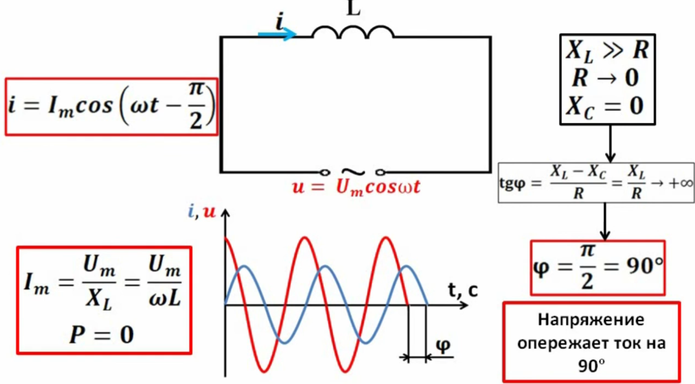
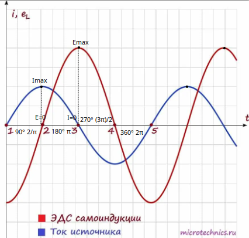
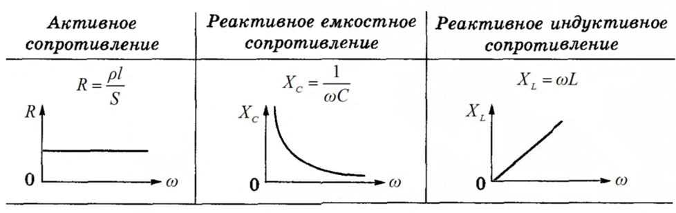
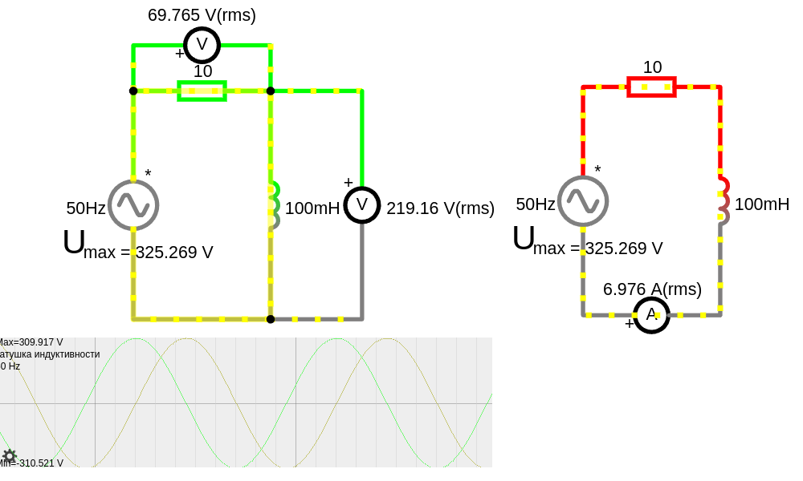
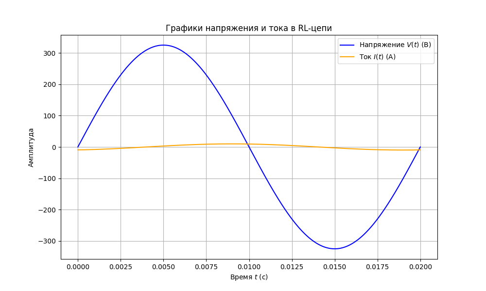
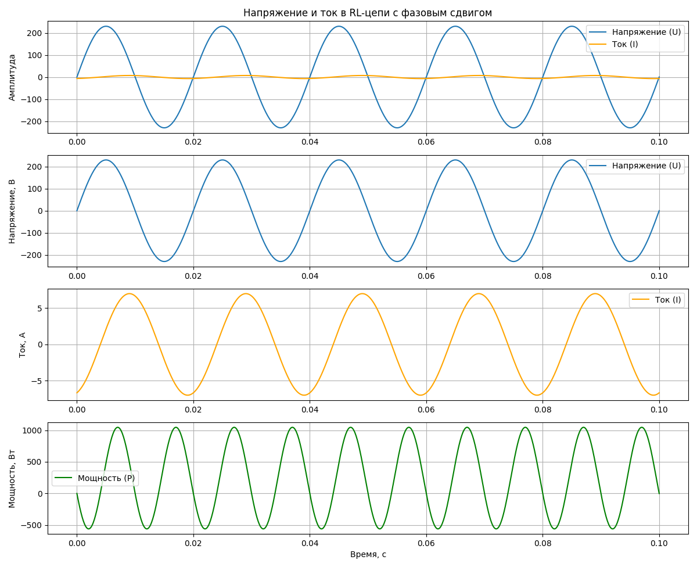
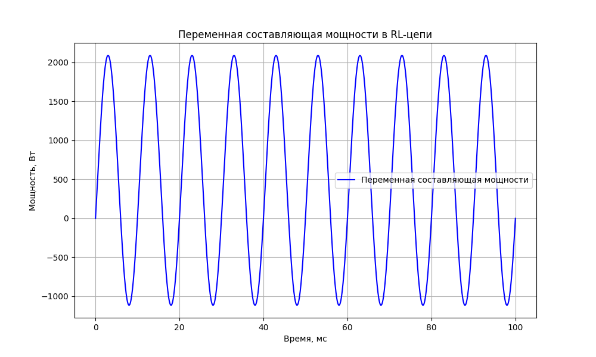

# Катушка индуктивности

В **AC-цепях** катушка индуктивности ведёт себя намного интереснее, чем в **DC-цепях**, поскольку переменный ток постоянно меняется, а индуктивность этому сопротивляется создавая ЭДС-самоиндукции. Разберём основные моменты.  



## 1. **Базовое уравнение индуктивности**  
Напряжение на катушке:  

$U_L = L \frac{di}{dt}$

Это означает, что напряжение на катушке пропорционально скорости изменения тока.

Закон Фарадея и ЭДС самоиндукции:

$\mathcal{E}_L = -L \frac{di}{dt}$

Где:  
- $ \mathcal{E}_L$ — ЭДС самоиндукции (напряжение, индуцируемое в катушке)  
- $ L $ — индуктивность  
- $ \frac{di}{dt}$ — скорость изменения тока  
- **Минус** отражает **правило Ленца**: индуцированное напряжение всегда направлено так, чтобы противодействовать изменению тока.  

Если смотреть со стороны внешней цепи, напряжение на катушке:  

$U_L = -\mathcal{E}_L = L \frac{di}{dt}$
 
То есть напряжение на клеммах катушки со стороны источника будет **с положительным знаком**, потому что источник должен «перебороть» ЭДС катушки, чтобы ток начал расти. 

Простой пример:  
- При **включении катушки** в цепь постоянного тока, растущий ток вызывает отрицательную ЭДС, которая мешает росту тока. Источник должен подать дополнительное напряжение, чтобы преодолеть эту ЭДС.  
- При **выключении катушки**, когда ток падает, катушка создаёт ЭДС, которая поддерживает ток в том же направлении (и может привести к всплеску напряжения). 

---

 
### Фазовый сдвиг идеальной катушки индуктивности без сопротивления
Катушка индуктивности сопротивляется изменению тока, что приводит к фазовому сдвигу между напряжением и током.

Индуктивность т.е. ток **отстаёт** по фазе от напряжения на $\pi/2$ т.е. 90° градусов (Или, что тоже самое, напряжение опережает ток на 90° градусов).  
- Если приложить синусоидальное напряжение, ток через катушку **отстаёт по фазе на 90°**. Когда напряжение на катушке достигает максимума, ток только начинает увеличиваться. 
- Напряжение **опережает** ток, что можно выразить так:  
  
  $I_{max} = \frac{U_{max}}{X_L} = \frac{U_{max}}{\omega L}$

  $i=\frac{U_{max}}{\omega L}  \sin \omega t$

  $i=I_{max} \cos (\omega t - \frac{\pi}{2})$

  при этом **ток запаздывает** относительно напряжения на четверть периода.  

🔹 Это важное свойство используется в **фазосдвигающих цепях** и **реактивных нагрузках**.



ЭДС самоиндукции прямо пропорциональна и противоположна по знаку скорости изменения тока:
- $\mathcal{E}_L = -L \frac{di}{dt}$

т.е. чем быстрее изменяется ток $\frac{di}{dt}$ тем больше ЭДС самоиндукции

На графике видно что с ростом тока, напряжение со знаком минус т.е. ЭДС самоиндукции катушки направлено против внешнего источника, и с уменьшением тока (в точке 2), напряжение со знаком плюс т.е. ЭДС самоиндукции катушки направлено в том же направлении что и у внешнего источника. Это препятствие изменению тока источника называется **индуктивным или реактивным сопротивление** катушки индуктивности.

Конденсаторы и катушки индуктивности создают реактивное сопротивление т.е. нагрузку но без потребления тока, в результате не вся выделяемая мощность генератора тратится на полезную работу т.е. реативная мощность не выполняет полезной работы, это просто перекачивания энергии из источника и обратно.

### Индуктивное сопротивление (реактивная часть) $X_L$



В отличие от DC, где в установившемся режиме катушка просто проводник, в AC она создаёт **реактивное сопротивление**:  

$X_L = \frac{U_{max}}{I_{max}}= \omega L = 2 \pi f L$ [Ом]

где:
- $X_L$ — реактивное сопротивление (Ом),
- $\omega = 2\pi f$ — угловая частота (рад/с),
- $L$ — индуктивность (Гн),
- $f$ — частота (Гц).  

Индуктивное сопротивление показывает, насколько катушка «сопротивляется» переменному току из-за эффекта самоиндукции. Оно растёт с увеличением частоты $f$ или индуктивности $L$.

**Вывод:** чем выше частота $f$, тем больше сопротивление катушки $X_L$ току! А если ток постоянный (f = 0), то реактивное сопротивление катушки равно 0, соответственно, она не оказывает влияния на протекающий ток.


### Импеданс катушки в AC-цепи
 
Импеданс — это **комплексное полное сопротивление**, которое учитывает как активную, так и реактивную составляющие:  

 
$Z_L = R + jX_L = R + j\omega L$ [Ом]
 

Где:  
- $ Z_L $ — импеданс катушки (Ом)  
- $ R $ — активное сопротивление провода (омическое сопротивление)  
- $ j $ — мнимая единица ($ j^2 = -1 $)  
- $ X_L $ — индуктивное сопротивление  

Если катушка идеальная (без активных потерь), то её импеданс чисто мнимый:  

 
$Z_L = jX_L = j\omega L$
 

Но в реальных катушках всегда есть небольшое омическое сопротивление провода, поэтому полное сопротивление будет комплексным. 

---

## Резонанс в LC-цепях 
Когда катушка $ L $ соединена с конденсатором $ C $, они могут образовать **резонансный контур**:  

$f_0 = \frac{1}{2 \pi \sqrt{L C}}$

- На этой частоте сопротивление контура минимально (в последовательном контуре) или максимально (в параллельном).  
- Используется в радиотехнике, фильтрах, антеннах и усилителях.

---

## Энергия в магнитном поле
Катушка накапливает энергию в магнитном поле:  

$W = \frac{1}{2} L\cdot I_{ампл}^2$

В AC-цепи эта энергия **постоянно перетекает** между катушкой и конденсатором в LC-контуре.

---

## Добротность катушки 
Катушка не идеальна — у неё есть сопротивление $ R $, поэтому она нагревается. Важный параметр — **добротность**:  

$Q = \frac{X_L}{R} = \frac{\omega L}{R}$

Чем выше $ Q $, тем лучше катушка сохраняет энергию.

---

## Фильтрация и дроссели
Катушки активно используются в **фильтрах и стабилизаторах**:  
- **Высокочастотный дроссель** — блокирует высокие частоты, пропуская DC.  
- **Индуктивно-ёмкостные (LC) фильтры** — сглаживают помехи в блоках питания.  
- **Трансформаторы** работают на принципе самоиндукции и передачи энергии через магнитное поле.

---

## Практические эффекты
- Катушка **гасит резкие изменения тока**, как в DC, но в AC это особенно важно в **импульсных источниках питания** и **фильтрах помех**.  
- В сети 50 Гц индукторы почти не влияют на токи малой частоты, но в радиочастотных схемах их влияние огромно.  
- В аудиоаппаратуре катушки применяются в **кроссоверах акустических систем**, чтобы разделять частоты.  

---

## Вывод: 
- В AC-цепях катушка создаёт **реактивное сопротивление**, которое увеличивается с частотой.  
- Вызывает **сдвиг фазы** между током и напряжением.  
- Входит в состав **фильтров, резонансных контуров и трансформаторов**.  

Хотите подробнее разобрать конкретный случай, например, LC-фильтры или расчёт параметров катушки? 🚀

 

## Пример расчета RL-цепи с синусоидальным напряжением   

Если вы работаете с электрическими цепями, понимание RL-цепи — это фундамент для более сложных задач, таких как анализ RLC-цепей, проектирование фильтров или работа с трехфазными системами.



<a href="/theories_of_electrical_circuits/falstad/circuitjs-91.txt" download="circuitjs-91.txt">Скачать схему для www.falstad.com/circuit</a>

**Дано:**  
- Напряжение источника: $ U = 230 \text{ В} $ (т.е. действующее (rms) среднеквадратичное, эффективное)
- Частота тока: $ f = 50 \text{ Гц} $  
- Индуктивность катушки: $ L = 100\ mH = 0.1 \text{ Гн} $  
- Сопротивление обмотки катушки (активное): $ R = 10 \, \Omega $  

**Найти:**  
- Индуктивное сопротивление $ X_L $  
- Полный импеданс $ Z $  
- Ток в цепи $ I $  
- Сдвиг фаз $ \varphi $ между током и напряжением  
- Расчет тока короткого замыкания: В RL-цепи важно знать, как быстро растет ток при аварии.
- Анализ переходных процессов: Например, как быстро ток достигает установившегося значения после включения цепи.

**Расчет:**

1. **Индуктивное (реактивное) сопротивление катушки ($X_L$)**
    - $X_L = \omega L = 2 \pi f L = 2 \cdot \pi \cdot 50 \cdot 0.1 = 31.416\ \Omega $
 
     - где 
        - $ \omega = 2 \pi f = 314.16 \,\ \text{рад/с} $ — угловая частота

    На высокой частоте реактивное сопротивление увеличивается, что ограничивает ток.

    На низкой частоте катушка ведет себя почти как проводник.

2. **Импеданс (полное сопротивление) цепи**
    - $Z = R + j X_L$

    А его модуль (действительное полное сопротивление): 
    - $|Z| = \sqrt{R^2 + X_L^2}$

    $Z = \sqrt{100 + 986.92} = \sqrt{1086.92} \approx 32.97 \, \Omega$
    
    Или расчет импеданса по формуле:
    - $Z = \frac{U_{действ}}{I_{действ}} = \frac{230}{6.97} \approx 32.97 \, Ом$

    Импеданс определяет, какой ток будет протекать в цепи при заданном напряжении. Это важно для расчета токов, выбора компонентов (например, проводов, предохранителей) и оценки нагрузки на источник питания.

3. **Амплитуда напряжения в цепи (максимальное)**
   - $U_{ампл}=U_{действ}\cdot \sqrt{2}=230\cdot \sqrt{2} = 325.269 \, \text{В}$

   Проверка напряжение в цепи, действующее (rms среднеквадратичное, эффективное)
   - $U_{действ} = \frac{U_{ампл}}{\sqrt{2}} = \frac{325.269}{\sqrt{2}} = 230 \, \text{В}$
 

5. **Амплитуда тока в цепи (максимальное)**

    Амплитуда тока ($ I_{ампл} $) связана с амплитудой напряжения ($ U_{ампл} $) и импедансом ($ Z $):
    - $I_{ампл} = \frac{U_{ампл}}{Z}= \frac{325.269}{32.97} \approx 9.86 \, \text{А}$

6. **Ток в цепи, действующий (rms среднеквадратичный, эффективный)**

   Установившийся ток — это состояние, когда ток в цепи переменного тока колеблется с постоянной амплитудой и частотой. Это означает, что переходные процессы, вызванные включением источника переменного тока или изменением параметров цепи, завершились.

   Действующее значение используется для расчета мощности и эффективных значений и сравнения с постоянным током.
   -  $I_{действ} = \frac{I_{ампл}}{\sqrt{2}} = \frac{9.86}{\sqrt{2}} \approx 6.97 \, \text{А}$


   Или ток через цепь определяется по закону Ома для цепей переменного тока:
   -  $I_{действ} = \frac{U_{действ}}{Z} = \frac{230}{32.97} \approx 6.97 \, \text{А}$  

    - где 
        - $ U_{действ} $ — действующее значение напряжения
        - $Z$ — импеданс цепи
  
8. **Сдвиг фаз $\varphi$ между напряжением и током в цепи с индуктивностью**

    В RL-цепи есть два элемента:
    - **Резистор ($ R $):** Напряжение на резисторе совпадает по фазе с током.
    - **Катушка ($ L $):** Напряжение на катушке опережает ток на 90°.

    Когда эти два элемента соединены последовательно, их влияние на ток и напряжение комбинируется. В результате фазовый сдвиг между напряжением и током в RL-цепи **меньше 90°** и зависит от соотношения сопротивления ($ R $) и индуктивного сопротивления ($ X_L $).


    В RL-цепи **ток отстаёт от напряжения**, но не на 90°, а на меньший угол ($\varphi $), который определяется по формуле:

    - $\varphi = \arctan\left(\frac{X_L}{R}\right)= \arctan\left(\frac{31.42}{10}\right) \approx \arctan(3.142)  \approx 1.262\ рад \approx 72.34^\circ$

    где:
    - $X_L$ — индуктивное сопротивление катушки

    Фазовый сдвиг влияет на работу устройств, особенно в цепях с реактивной мощностью (например, в электродвигателях, трансформаторах). Понимание фазового сдвига помогает правильно проектировать системы, чтобы минимизировать потери и улучшить КПД.

10. **Напряжение на резисторе и катушке, действующее**
    - Напряжение на резисторе:
        - $U_R = I_{действ} \cdot R = 6.97 \cdot 10 = 69.7 \, \text{В}$
    - Напряжение на катушке:
        - $U_L = I_{действ} \cdot X_L = 6.97 \cdot 31.42 \approx 219 \, \text{В}$

    **Проверка напряжения по теореме Пифагора**

    Напряжения на резисторе и катушке должны удовлетворять соотношению:
    - $U_{действ} = \sqrt{U_R^2 + U_L^2} = \sqrt{69.7^2 + 219^2}\approx 230 \, \text{В}$

    Это совпадает с действующим значением напряжения, что подтверждает правильность расчетов.

11. **Активная мощность в цепи (постоянная составляющая)**

    Полезная мощность, которая преобразуется в тепло или работу.

    $P = I_{действ}^2 \cdot R = 6.97^2 \cdot 10 = 486\ Вт$ 
    
    - где:
        - $ I_{действ} $ — эффективное (действующее) значение тока.
        - $ R $ — активное сопротивление.

12. **Реактивная мощность в цепи (переменная составляющая)**  

    мощность, связанная с накоплением энергии в магнитном поле катушки.

    $ Q = I_{действ}^2 \cdot X_L = 6.97^2 \cdot 31.42 \approx 1526\ ВАр$ (вольт-амперах реактивных)
   
    - где:
        - $ X_L = \omega L $ — реактивное сопротивление катушки.
        - $ \omega = 2 \pi f $ — угловая частота.

    Или воспользуемся другой формулой:
    - $Q = U_{действ} \cdot I_{действ} \cdot \sin(\varphi) = 230 \cdot 6.97 \cdot \sin(72.34) \approx 1526\ ВАр$ 
    - где:
        - $ U_{действ} $ — действующее значение напряжения,
        - $ I_{действ} $ — действующее значение тока,
        - $ \varphi $ — фазовый сдвиг между напряжением и током.
 
    Реактивная мощность увеличивает нагрузку на сеть, но не выполняет полезной работы. Ее учет помогает правильно проектировать системы компенсации (например, с использованием конденсаторов) для повышения эффективности.

13. **Полная мощность в цепи**  

    $S = U_{действ} \cdot I_{действ} = 230\cdot 6.97= 1603.1\ ВА $ (вольт-ампер)

    Коэффициент мощности ($\cos(\varphi) $)
    - $\cos(\varphi) = \frac{P}{S} = \frac{486}{1603.1} \approx 0.30$
    - Это означает:
        - Только **30%** энергии, передаваемой источником, используется для полезной работы.
        - Остальные **70%** — это реактивная мощность, которая "колеблется" между источником и катушкой индуктивности, не выполняя полезной работы.

    Коэффициент мощности ($\cos(\varphi) $) - показывает, насколько эффективно энергия передается от источника к нагрузке. Коэффициент мощности показывает, какая часть полной мощности $S$ используется для выполнения полезной работы 

    **Значения коэффициента мощности**
    - **$\cos(\varphi) = 1$**: Идеальный случай. Напряжение и ток совпадают по фазе, реактивная мощность отсутствует. Вся энергия передается в нагрузку без потерь. Это возможно только в цепях с чисто активной нагрузкой (например, резистор).
    - **$0 < \cos(\varphi) < 1$**: Реальный случай. Напряжение и ток не совпадают по фазе из-за наличия реактивных элементов (катушек или конденсаторов). Часть энергии "колеблется" между источником и нагрузкой, не выполняя полезной работы.
    - **$\cos(\varphi) = 0$**: Чисто реактивная нагрузка (например, идеальная катушка или конденсатор). Вся мощность является реактивной, полезная работа не выполняется.

    **Почему это важно?**
    - **Энергоэффективность**: Низкий коэффициент мощности ($\cos(\varphi) < 0.9$) указывает на неэффективное использование энергии. Это приводит к увеличению потерь в сети и перегрузке источников питания.
    - **Экономия**: Энергокомпании часто штрафуют потребителей за низкий коэффициент мощности, так как это увеличивает нагрузку на сеть.
    - **Проектирование**: При проектировании электрических систем важно учитывать коэффициент мощности, чтобы правильно выбирать компоненты (например, провода, трансформаторы) и минимизировать потери.

На графике будет видно, что ток "отстаёт" от напряжения на $72.3^\circ$, что соответствует фазовому сдвигу в RL-цепи.



<details>

<summary>build chart use python</summary>

```python
import numpy as np
import matplotlib.pyplot as plt

# Параметры цепи
V0 = 325.269  # Амплитуда напряжения (В)
I0 = 9.86  # Амплитуда тока (А)
f = 50  # Частота (Гц)
omega = 2 * np.pi * f  # Угловая частота (рад/с)
phi = np.radians(72.3)  # Фазовый сдвиг (радианы)

# Временной интервал (один период)
t = np.linspace(0, 1/f, 1000)  # 1000 точек на один период

# Мгновенные значения напряжения и тока
V_t = V0 * np.sin(omega * t)  # Напряжение
I_t = I0 * np.sin(omega * t - phi)  # Ток

# Построение графиков
plt.figure(figsize=(10, 6))
plt.plot(t, V_t, label='Напряжение $V(t)$ (В)', color='blue')
plt.plot(t, I_t, label='Ток $I(t)$ (А)', color='orange')

# Настройка графика
plt.title('Графики напряжения и тока в RL-цепи')
plt.xlabel('Время $t$ (с)')
plt.ylabel('Амплитуда')
plt.grid(True)
plt.legend()
plt.show()

```

</details>



<details>

<summary>build chart use python</summary>

```python
import numpy as np
import matplotlib.pyplot as plt

# Параметры цепи
U = 230  # Напряжение источника, В
f = 50   # Частота тока, Гц
L = 0.1  # Индуктивность катушки, Гн
R = 10   # Активное сопротивление, Ом

# Угловая частота
omega = 2 * np.pi * f

# Время
t = np.linspace(0, 0.1, 1000)  # От 0 до 0.1 секунды, 1000 точек

# Напряжение на источнике
u = U * np.sin(omega * t)

# Импеданс цепи
Z = np.sqrt(R**2 + (omega * L)**2)

# Фазовый сдвиг
phi = np.arctan((omega * L) / R)

# Ток в цепи
i = (U / Z) * np.sin(omega * t - phi)

# Мощность в цепи
p = u * i

# Построение графиков
plt.figure(figsize=(12, 10))

# График напряжения и тока с фазовым сдвигом
plt.subplot(4, 1, 1)
plt.plot(t, u, label='Напряжение (U)')
plt.plot(t, i, label='Ток (I)', color='orange')
plt.title('Напряжение и ток в RL-цепи с фазовым сдвигом')
plt.ylabel('Амплитуда')
plt.legend()
plt.grid(True)

# График напряжения
plt.subplot(4, 1, 2)
plt.plot(t, u, label='Напряжение (U)')
plt.ylabel('Напряжение, В')
plt.legend()
plt.grid(True)

# График тока
plt.subplot(4, 1, 3)
plt.plot(t, i, label='Ток (I)', color='orange')
plt.ylabel('Ток, А')
plt.legend()
plt.grid(True)

# График мощности
plt.subplot(4, 1, 4)
plt.plot(t, p, label='Мощность (P)', color='green')
plt.xlabel('Время, с')
plt.ylabel('Мощность, Вт')
plt.legend()
plt.grid(True)

plt.tight_layout()
plt.show()
```

</details>



 
<details>

<summary>build chart power use python</summary>

```python
import numpy as np
import matplotlib.pyplot as plt

# Параметры цепи
U = 230  # Действующее напряжение, В
I = 6.97  # Действующее значение тока, А
phi_deg = 72.3  # Фазовый сдвиг, градусы
f = 50  # Частота, Гц

# Угловая частота
omega = 2 * np.pi * f

# Фазовый сдвиг в радианах
phi_rad = np.deg2rad(phi_deg)

# Активная и реактивная мощность
P = U * I * np.cos(phi_rad)
Q = U * I * np.sin(phi_rad)

# Время
t = np.linspace(0, 0.1, 1000)  # От 0 до 100 мс

# Переменная составляющая мощности
p_var = P * (1 - np.cos(2 * omega * t)) + Q * np.sin(2 * omega * t)

# Построение графика
plt.figure(figsize=(10, 6))
plt.plot(t * 1000, p_var, label='Переменная составляющая мощности', color='b')
plt.title('Переменная составляющая мощности в RL-цепи')
plt.xlabel('Время, мс')
plt.ylabel('Мощность, Вт')
plt.legend()
plt.grid(True)
plt.show()
```
</details>


### Анализ временных (мгновенных значений) характеристик [инф](https://www.youtube.com/watch?v=oVcSFbkCoHY&list=PLa1hZtD9sL40izP87AoDr1O8CmlvW8pck&index=38&pp=iAQB)

1. **Постоянная времени цепи ($\tau $)**<br>
Постоянная времени ($ \tau $) показывает, как быстро ток достигает установившегося значения.
- $\tau = \frac{L}{R}= \frac{0.1}{10} = 0.01 \, \text{с} \quad (10 \, \text{мс})$

1. **Ток в цепи, установившийся режим**

    Установившийся ток (в долгосрочном режиме) при переменном токе:
    - $I_{ампл} = \frac{U_{\text{амп}}}{\sqrt{R^2 + (\omega L)^2}} = 9.86\ A$  


    - $I(t) = I_{ампл} \cdot \sin(\omega \cdot t - \varphi) $
    
    Здесь минус перед фазовым $ \varphi$ сдвигом показывает, что ток отстает от напряжения, что характерно для цепи с индуктивностью.

    - где:
        - $ I_{ампл} = 9.86\ А$ — амплитуда тока
        - $ \omega = 2 \pi f = 2\cdot \pi \cdot 50 = 314.159265359 $ — угловая частота
        - $ \varphi = 72.3^\circ=1.262\ рад$ — фазовый сдвиг

    Для $t = 0 \, \text{мс}$:
    - $I(0) = 9.86 \cdot \sin(314.16 \cdot 0 - 1.262) =  −9.393622698\ A$

    Для $ t = \tau = 10 \, \text{мс} $:
    - $I(0.01) = 9.86 \cdot \sin(314.16 \cdot 0.01 - 1.262) = 9.39\ A$

    Для $ t = 3\tau = 30 \, \text{мс} $:
    - $I(0.03) = 9.86 \cdot \sin(314.16 \cdot 0.03 - 1.262) = 9.39 \ A$

    Для $ t = 5\tau = 50 \, \text{мс} $:
    - $I(0.05) = 9.86 \cdot \sin(314.16 \cdot 0.05 - 1.262) = 9.39\ A$

    Для $t = 1 \, \text{мс}$:
    - $I(0.001) = 9.86 \cdot \sin(314.16 \cdot 0.001 - 1.262) = −8.007 \ A$

    Для $t = 2 \, \text{мс}$:
    - $I(0.002) = 9.86 \cdot \sin(314.16 \cdot 0.002 - 1.262) = −5.83 \ A$


    Для $t = 14 \, \text{мс}$:
    - $I(0.014) = 9.86 \cdot \sin(314.16 \cdot 0.014 - 1.262) = 0.0527\ A$

 
1. **Ток в цепи, переходный процесс при включении**

    Начальная амплитуда переходного тока будет определяться в зависимости от фазы напряжения при включении цепи. Так как мы начинаем с нулевого тока (при подключении источника), то $I_0$ на самом деле будет почти равен амплитуде установившегося тока, если мы подключаемся в момент максимума напряжения.

    Переходный процесс включает в себя как экспоненциальную составляющую (затухание начального тока), так и синусоидальное поведение переменного тока.

    В переходном процессе ток в цепи RL состоит из двух составляющих:
    - Установившейся синусоидальной составляющей,
    - Экспоненциально затухающей свободной составляющей.

    $i(t) = I_{ампл} \cdot \sin(\omega t - \varphi) + I_{\text{переход}}(t)$

    Где:
    - $ I_{ампл} \cdot \sin(\omega t - \varphi) $ — установившийся ток (то, что мы уже нашли).  
    - $ I_{переход}(t) = I_0 e^{-\frac{t}{\tau}} $ — переходной ток, затухающий по экспоненте.  
    - $I_0=I_{ампл}=9.86\ А$ - При условии что катушка была заряжена, ток не может мгновенно измениться ???

    Начальное условие при (t=0) 
    - $i(t)= I_{уст.реж} + I_{переход}=0$
    - $I_{переход}(0)=-I_{уст.реж}=-(-9.393622698)$

    Для $ t = 0 \, \text{мс} $:
    - $I_{ампл} \cdot \sin(\omega t - \varphi) = -9.393622698 \ A$
    - $I(0) = -9.393622698 + 9.393622698 e^{-\frac{0}{0.01}} = 0 \ A $

    Для $ t = 1 \, \text{мс} $:
    - $I_{ампл} \cdot \sin(\omega t - \varphi) = -8.007 \ A$
    - $I(0.001) = -8.007  + 9.393622698 e^{-\frac{0.001}{0.01}} = 0.492 \ A $

    Для $ t = \tau = 10 \, \text{мс} $:
    - $I_{ампл} \cdot \sin(\omega t - \varphi) = 9.39 \ A$
    - $I(0.01) = 9.39 + 9.393622698 e^{-\frac{0.01}{0.01}} = 12.84\ A $

    Для $ t = 3\tau = 30 \, \text{мс} $:
    - $I_{ампл} \cdot \sin(\omega t - \varphi) = 9.39 \ A$
    - $I(0.03) = 9.39 + 9.393622698 e^{-\frac{0.03}{0.01}} = 9.86 \ A $

    Для $ t = 5\tau = 50 \, \text{мс} $:
    - $I_{ампл} \cdot \sin(\omega t - \varphi) = 9.39\ A$
    - $I(0.05) = 9.39 + 9.393622698 e^{-\frac{0.05}{0.01}} = 9.45 \ A $

1. **Ток в цепи, переходный процесс при выключении**

    Но если мы отключили источник, то синусоидальная составляющая пропадает, и остаётся только переходный ток (катушка "доразряжается" через резистор).

    $i(t) = I_{переход}(t)$

    Где:
    - $ I_{переход}(t) = I_0 e^{-\frac{t}{\tau}} $ — переходной ток, затухающий по экспоненте. 
    - $I_0=I_{ампл}=9.86\ А$ - при условии что катушка была заряжена, ток не может мгновенно измениться

    $I_0$ может быть равно амплитудному значению установившегося тока или его мгновенному значению в момент выключения.

    $i(0) = 9.86 e^{-\frac{0}{0.01}}= 9.86\ A $ (в начальный момент ток равен амплитудному)

    $i(0.001) = 9.86 e^{-\frac{0.001}{0.01}}= 8.92\ A $

    $i(0.01) = 9.86 e^{-\frac{0.01}{0.01}}= 3.62\ A $ (для $1\tau$)

    $i(0.05) = 9.86 e^{-\frac{0.05}{0.01}}= 0.066\ A $ (для $5\tau$)

1. **Напряжение на катушке (индуктивное напряжение), временная зависимость**

    $U_L(t) = I_{ампл} \cdot \omega L \cdot \sin(\omega t + 90^\circ - \varphi)$<br>
    или<br>
    $U_L(t) = U_{L\ ампл} \cdot \sin(\omega t + 90^\circ - \varphi)$

    Если же говорить о полном напряжении на цепи, то:<br>
    $U_L(t) = U_{ампл} \cdot \sin(\omega t)$

    где:
    - $U_{ампл}=U_{действ}\cdot \sqrt{2}=325.269\ V$
    - $U_{L\ ампл}=I_{ампл} \cdot \omega L = I_{амп} \cdot X_L = 309.76\ V$
    - $I_{ампл}=9.86\ А$
    - $L=0.1\ H$
    - $\varphi=72.34^\circ$
    - $90^\circ - \varphi = 17.66^\circ \Rightarrow 17.66^\circ\cdot (\frac{\pi}{180})\approx 0.3082$ радиана
    - $\omega = 2 \pi f = 314.16 \, \text{рад/с}$

    Для $t = 14 \, \text{мс}$:
    - $U_L(0.014) = 9.86 \cdot 314.16\cdot 0.1 \cdot \sin(314.16\cdot 0.014 + 0.3082)=−309.75\ V$<br>
    или<br>
    - $U_L(0.014) = 309.76 \cdot \sin(314.16\cdot 0.014 + 0.3082) = −309.75\ V$

    Полное напряжение в сети для $t = 14 \, \text{мс}$:
    - $U_L(0.014) = 325.269 \cdot \sin(314.16\cdot 0.014)=−309.35\ V$

1. **Мгновенная мощность**

    Мгновенная мощность — это произведение мгновенного напряжения и мгновенного тока в каждый момент времени. Она важна для понимания, как энергия передаётся и преобразуется в цепи.

    $p(t) = U(t) \cdot I(t)$    

    - где:
        - $ u(t) = U_{\text{амп}} \cdot \sin(\omega t) $ — мгновенное напряжение,  
        - $ i(t) = I_{\text{амп}} \cdot \sin(\omega t - \varphi) $ — мгновенный ток, сдвинутый по фазе на угол $ \varphi $. 


1. **ЭДС самоиндукции**

    В установившемся режиме ток через катушку постоянен (или изменяется синусоидально с постоянной амплитудой). В этом случае скорость изменения тока $\frac{dI}{dt}=0$  и ЭДС самоиндукции равна нулю: $ \mathcal{E} =0 $

    В переходных процессах амплитуда тока изменяется что наводит ЭДС в катушке.

    $\mathcal{E}_{\text{самоинд}} = -L \frac{dI}{dt}$

    1. При **отключении** цепи ток через катушку индуктивности начинает уменьшаться, и возникает ЭДС самоиндукции, которая пытается поддержать ток.

        При отключении цепи ток через катушку начинает уменьшаться по экспоненциальному закону:
        - $I(t) = I_0 e^{-\frac{t}{\tau}}$
    
        где: 
        - $ I_0 = I_{действ} \approx 6.97 \, \text{А} $ — начальное значение тока
        
        Взяв производную и тогда формула ЭДС самоиндукции:
        - $\mathcal{E}_{\text{самоинд}} = L \cdot \frac{I_0}{\tau} e^{-\frac{t}{\tau}}$

        Для $t = 1 \, \text{мс}$:
        - $\mathcal{E}_{\text{самоинд}} = 0.1 \cdot \frac{6.97}{0.01} e^{-\frac{0.001}{0.01}} = 63.15 \, \text{В}$
    
        Для $ t = 5\tau = 50 \, \text{мс} $:
        - $\mathcal{E}_{\text{самоинд}} = 0.1 \cdot \frac{6.97}{0.01} e^{-\frac{0.05}{0.01}} = 0.47 \, \text{В}$

        ЭДС самоиндукции уменьшается практически до нуля, так как $t=5\tau$ соответствует моменту, когда переходный процесс практически завершен.
 
    2. При **включении** цепи ток через катушку индуктивности нарастает, и возникает ЭДС самоиндукции, которая противодействует изменению тока.

        При включении цепи ток через катушку нарастает по закону:
        - $I(t) = I_{действ} \left(1 - e^{-\frac{t}{\tau}}\right)$
        
        где: 
        - $ I_0 = I_{действ} \approx 6.97 \, \text{А} $ — начальное значение тока
   
        Взяв производную и тогда формула ЭДС самоиндукции:
        - $\mathcal{E}_{самоинд} = -L \cdot \frac{I_{действ}}{\tau} e^{-\frac{t}{\tau}}$

        Для $t = 1 \, \text{мс}$:
        - $\mathcal{E}_{самоинд} = -0.1 \cdot \frac{6.97}{0.01} e^{-\frac{0.001}{0.01}}=-63\, \text{В}$

        Для $ t = 5\tau = 50 \, \text{мс} $:
        - $\mathcal{E}_{самоинд} = -0.1 \cdot \frac{6.97}{0.01} e^{-\frac{0.05}{0.01}}=-0,47\, \text{В}$

        ЭДС самоиндукции уменьшается практически до нуля, так как $t=5\tau$ соответствует моменту, когда переходный процесс практически завершен.

        Знак "минус" указывает на то, что ЭДС самоиндукции направлена против изменения тока.

1. **Энергия, запасенная в магнитном поле катушки индуктивности**
    
    Энергия в установившемся режиме:
    - $W = \frac{1}{2}\cdot L\cdot I_{ампл}^2 = \frac{1}{2} \cdot 0.1 \cdot 9.86^2 = 4.86 \, \text{Дж}$

    Энергия в переходном режиме при заряде (где $I_{0}$ соответсвенный ток времени в режиме)
    - $W(0.05) = \frac{1}{2}\cdot L\cdot I_{0}^2 = \frac{1}{2} \cdot 0.1 \cdot 9.45^2 = 4.46 \, \text{Дж}$

    Энергия в переходном режиме при разряде (где $I_{0}$ соответсвенный ток времени в режиме)
    - $W(0.05) = \frac{1}{2}\cdot L\cdot I_{0}^2 = \frac{1}{2} \cdot 0.1 \cdot 0.066^2 = 0.0002 \, \text{Дж}$


  