# [Фильтры](https://www.ruselectronic.com/passive-filters/)

* С-фильтр
* RC-фильтр
* LR-фильтр
* CR-фильтр
* RL-фильтр ([Дифференцирующая RC-цепь](/theories_of_electrical_circuits/lessons/87.html), [Интегрирующая RC-цепь](/theories_of_electrical_circuits/lessons/88.html))
* Резонансные фильтры
* Полосовой фильтр
* Полосовые резонансные фильтры
* Заграждающие (режекторные) фильтры
* CL-фильтр
* LC-фильтр
* Расчет LC-фильтр (ФНЧ)


Электрический фильтр — это устройство для выделения желательных компонентов спектра (частот) электрического сигнала и/или для подавления нежелательных. Для остальных частот, которые не входят в полосу пропускания, фильтр создает большое затухание, вплоть до полного их исчезновения.

**Полоса пропускания** — это диапазон частот значением от минус полосы среза до плюс полосы среза, в пределах которого АЧХ радиотехнической цепи или устройства достаточно равномерна, чтобы обеспечить передачу сигнала без существенного искажения его формы.
Как же определить полосу пропускания? Это сделать довольно легко. Достаточно на графике АЧХ найти уровень в -3 дБ от максимального значения АЧХ и найти точку пересечения прямой с графиком.

**Наклон характеристики АЧХ**
Характеристика идеального фильтра должна вырезать строго определенную полосу частоты и «давить» другие частоты до полного их затухания. 
Наклон АЧХ в 6 дБ/октаву после точки, соответствующей значению коэффициента передачи в -3дБ, то есть частоты среза. Что означает запись 6 дБ/октаву? До или после частоты среза, наклон АЧХ принимает вид почти прямой линии при условии, что коэффициент передачи измеряем в дБ. Октава — это  соотношение частот два к одному. В нашем примере наклон АЧХ в 6 дБ/октаву говорит о том, что при увеличении частоты в два раза, у нас прямая АЧХ растет (или падает) на 6 дБ. Если соединить два фильтра первого порядка друг за другом то мы получим фильтра второго порядка и они обеспечивают наклон АЧХ в 12 дБ/октаву.
У фильтров третьего порядка 18 дБ/октаву. Соответственно, у фильтра 4 -ого порядка наклон АЧХ будет уже 24 дБ/октаву и тд.

В реальных условиях АЧХ может отличаться от программных анализов и график АЧХ сдвинется при подаче нагрузки, которую тоже надо учитывать после фильтра.

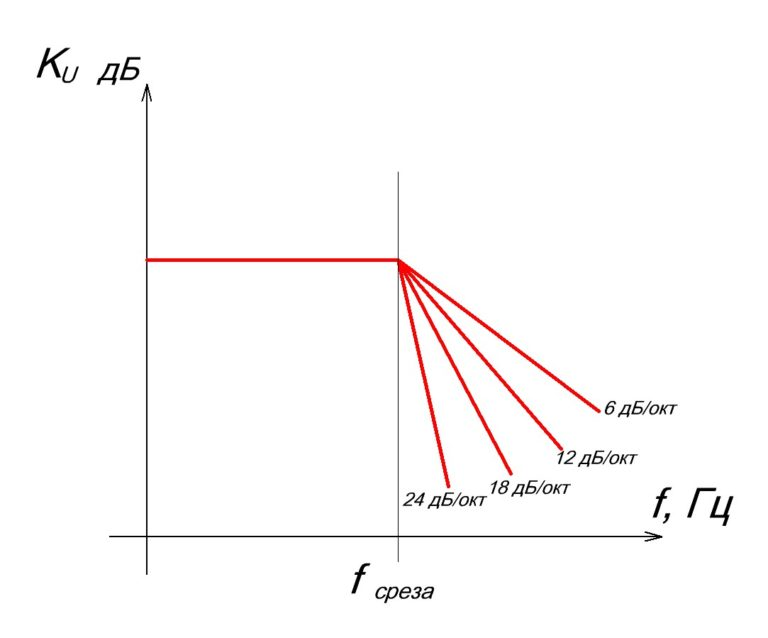


Существует два семейства фильтров: пассивные и активные.

**Пассивные фильтры** состоят из пассивных компонентов (резистор, конденсатор, катушка индуктивности), они больше подходят для ослабления сигналов т.е. как фильтры низких частот (ФНЧ) они гасят высокочастотные сигналы и пропускают низкочастотные сигналы. Пассивные фильтры не подходят для работы со слабыми сигналами, и они не очень точны и малоэффективны.

**Активные фильтры** включают в себя транзистор или усилитель, что позволяет им работать со слабыми сигналами и быть точными и эффективными.

**Цифровые фильтры** требуют преобразования сигнала в последовательность битов, подлежащих обработке схемой DSP (Digital Signal Processor), которая может математически расчитывать кадр сигнала, что дает возможность предсказывать следуюший кадр сигнала, что можно применить для изоляции шума использовав несколько несколько динамиков вокруг обьекта.

**Аналоговые фильтры**, служат управления изменяющимися сигналами с течением времени.

Классификация фильтров по поведению к сигналу
- фильтр низких частот (ФНЧ) - пропускает частоты ниже частоты среза
- фильтр высоких частот (ФВЧ) - пропускает частоты выше частоты среза
- полосовые фильтры - пропускает частоты в некоторой полосе пропускания
- заграждающие - заграждают определенную полосу частот


Сглаживающие фильтры должны пропускать постоянную составляющую выпрямленного напряжения и заметно ослаблять гармонические составляющие.

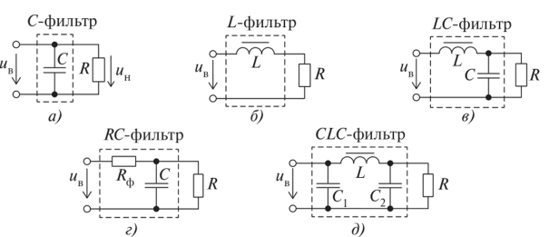

---

Простейшими являются емкостные С-фильтры и индуктивные Е-фильтры (рис. а, б).

**С-фильтр**: конденсатор наоборот представляет большое сопротивление постоянному току, малое переменному, чем выше частота тем меньше на ней сопротивление конденсатора, это позволяет блокировать высокочастотные колебания и пропускать постоянный или низкочастотный ток, это свойство кондесатора используется в С-фильтрах


В маломощных выпрямителях (при малых токах нагрузки) применяют П-образные (СХС-фильтры, рис. д).

В выпрямителях средней и большой мощности Г-образные (LC- или ЛС-фильтры, см. рис. в, г).

Для подавления гармоник высоких частот индуктивный элемент нужно включать последовательно, а емкостный — параллельно с нагрузкой. 

---

**RC-фильтр** - фильтр низких частот, конденсатор не пропускает высокочастотные сигналы.
Обеспечивает наклон характеристики АЧХ в 6 дБ/октаву после частоты среза.

Частота среза<br>
$$f_c = \frac{1}{2\cdot \pi \cdot R\cdot C }\ ,C=\frac{1}{2\cdot \pi \cdot R\cdot f_c}\ ,R=\frac{1}{2\cdot \pi \cdot C\cdot f_c}$$

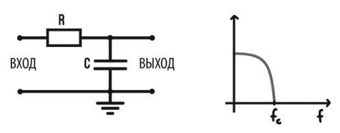

Как мы видим, АЧХ такого фильтра беспрепятственно пропускает низкие частоты, а с ростом частоты ослабляет высокие частоты. Поэтому, такой фильтр называют фильтром низких частот (ФНЧ).

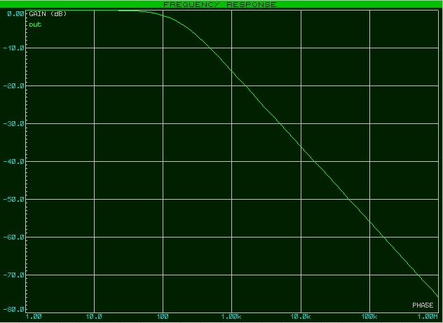

---

**LR-фильтр** - фильтр низких частот, с увеличением частоты катушка будет больше сопротивлятся (реактивное)

Частота среза<br>
$$f_c = \frac{R}{2\cdot \pi \cdot L },\ L=\frac{R}{2\cdot \pi f_c},\ R= 2\cdot \pi f_c \cdot L$$


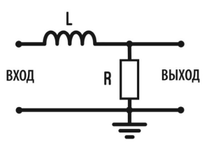

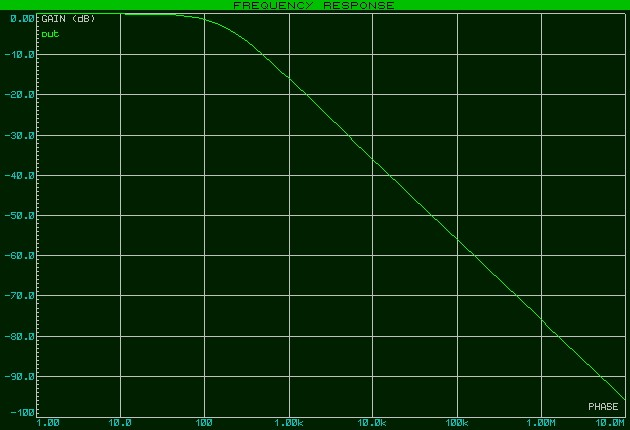

---

**CR-фильтр** - фильтр высоких частот, при постоянном сигнале ток вообще не пройдет, но увеличив частоту реактивное сопротивление конденсатора уменьшится и ток пройдет, т.е. низкие частоты не пройдут, а высокие будут лучше проходить.

Частота среза<br>
$$f_c = \frac{1}{2\cdot \pi \cdot R\cdot C },\ C=\frac{1}{2\cdot \pi \cdot R\cdot f_c},\ R=\frac{1}{2\cdot \pi \cdot C\cdot f_c}$$

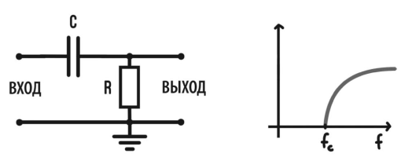

Такой фильтр ослабляет низкие частоты и пропускает высокие частоты, поэтому такой фильтр называется фильтром высокой частоты (ФВЧ).

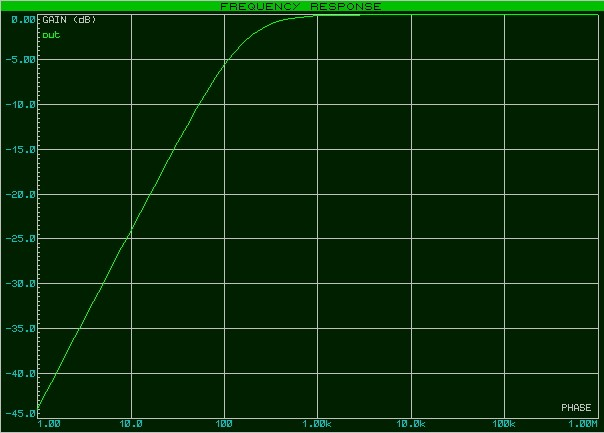

Выбор сопротивления $R$ для фильтра, должно быть больше выходного импеданса источника (50 Ом, типичное значение для многих генераторов сигналов и некоторых аудиовыходов) и одновременно должно быть меньше входного импеданса нагрузки (10 кОм, типичное значение для входов усилителей или других электронных схем)

Если R будет сравнимо с выходным импедансом источника или меньше него, значительная часть сигнала будет теряться внутри источника, и фильтр не будет работать эффективно. Желательно, чтобы R был хотя бы в несколько раз больше него.

Если R будет сравнимо с входным импедансом нагрузки или больше него, фильтр может быть сильно нагружен входным импедансом нагрузки, что может изменить его частотную характеристику. Желательно, чтобы R был хотя бы в несколько раз меньше него.

---

**RL-фильтр** - фильтр высоких частот, постоянный сигнал уходит в землю, т.е. этот фильтр для блокировки постоянного сигнала нежелательного напряжения, пропуская только не постоянный сигнал. 
Обеспечивает наклон характеристики АЧХ в 6 дБ/октаву после частоты среза.
 
Частота среза<br>

$$f_c = \frac{R}{2\cdot \pi \cdot L },\ L=\frac{R}{2\cdot \pi f_c},\ R= 2\cdot \pi f_c \cdot L$$

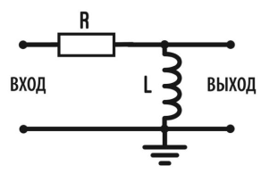

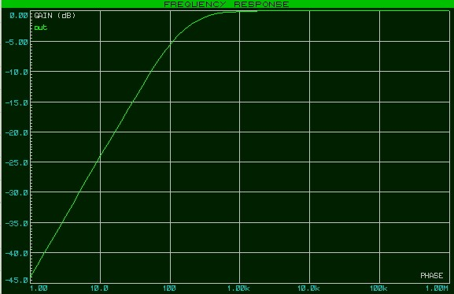

---

**Резонансные фильтры**

Если настроить последовательное LC-звено (рис. а) фильтра на режим резонанса напряжения для к-й гармоники (рис. б), то эта гармоника будет проходить фильтр без искажения, а при параллельном соединении элементов L и С (рис. в) и настройке звена на режим резонанса токов (рис. г) к-я гармоника будет полностью задержана ТС-фильтром-пробкой. Такие фильтры называют резонансными.

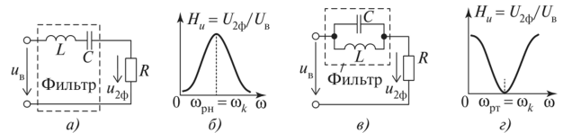

Применив цепочку фильтров-пробок, каждая из которых настроена в резонанс на определенную гармонику, можно осуществить фильтрацию нескольких гармоник.

[источник](https://studref.com/590028/tehnika/passivnye_sglazhivayuschie_filtry)

LC-контур без заземления (резонансный контур):  
- Если катушка и конденсатор соединены последовательно или параллельно без заземления, получается резонансный контур.  
- Он работает как полосовой фильтр:  
  - В **последовательном контуре** — низкое сопротивление на резонансной частоте, сигнал проходит.  
  - В **параллельном контуре** — высокое сопротивление на резонансной частоте, сигнал блокируется.  
- Такой вариант чаще используется для настройки на конкретную частоту (например, в радиотехнике), а не для простого сглаживания помех.

---

**Полосовой фильтр** [dzen](https://dzen.ru/a/YJkzLE-t43iL5MRV)

Особенность таких фильтров такова, что они имеют две частоты среза. Определяются они также на уровне в -3дБ  или на уровне в  0,707 от максимального значения коэффициента передачи

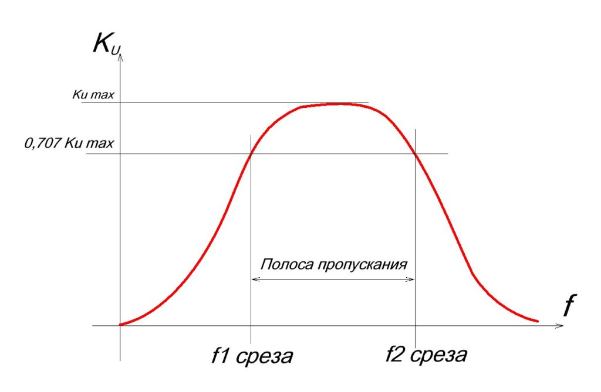

Фильтр пропускает некий диапазон частот (например канал радиопередач), подавляя остальные. 
Характеризуется параметром центральной частотой фильтра и добротностью $Q$ которая говорит о величине даипазона пропускания, чем выше добротность, тем уже диапазон пропускания.

Для получения полосового фильтра при последовательном соединении двух RC фильтров, необходимо, чтобы один из них был фильтром высоких частот (ФВЧ), а другой - фильтром низких частот (ФНЧ), и чтобы их частоты среза были расположены таким образом, чтобы образовалась полоса пропускания:
- Частота среза ФВЧ (fc_вч) должна быть ниже, чем частота среза ФНЧ (fc_нч)
- Чем ближе частоты среза ФВЧ и ФНЧ друг к другу, тем уже полоса пропускания. Чем дальше они друг от друга, тем шире полоса.

Формула для центральной частоты: 
- $f_{цчф} = \sqrt{fc_{вч} \cdot fc_{нч}}$


Где:
* $fc_{нч}$ — нижняя частота среза
* $fc_{вч}$ — верхняя частота среза

Центральная частота фильтра
$$f_{цчф} = \frac{1}{2\cdot \pi \cdot \sqrt{L\cdot C} },\ L = \frac{1}{4\cdot \pi² \cdot f_{цчф}² \cdot C },\ C = \frac{1}{4\cdot \pi² \cdot f_{цчф}² \cdot L }$$

Конфигурацию фильтра: Например, последовательный RLC контур, параллельный RLC контур, каскадное соединение RC и LR фильтров и т.д.

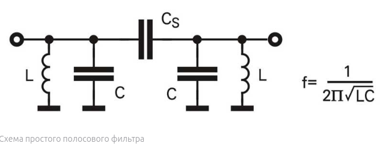

Хорошо, если катушки в этой схеме будут экранированы, т.е. разделены электромагнитными экранами из меди, и целиком также помещены в экран. Экранирование катушек улучшает электромагнитную совместимость катушек и они не мешают друг другу так как экран значительно снижает магнитное поле, создаваемое одной катушкой и проникающее в другую.


Схема полосового фильтра, последовательный CR-RC контур, где последовательно обьединены ФНЧ - CR с ФВЧ - RC, формулы для среза у них одинаковые.

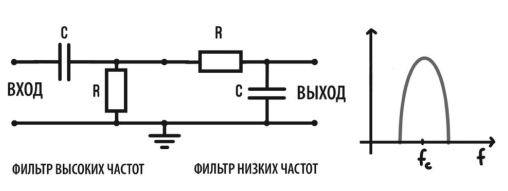

Например, расчитаем срез на 10 кГц:
- $U_{вх}=5\ V$ с частотой 6-13 kHz
- $C_1=C_2=10 nF=0.00000001\ F$
- $R_1=1768\ Om$
- $R_2=1591\ Om$

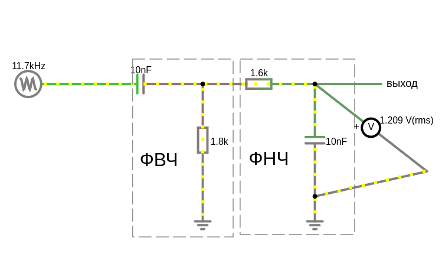

<a href="/theories_of_electrical_circuits/falstad/circuitjs-93.1.txt" download="circuitjs-93.1.txt">Скачать схему для www.falstad.com/circuit</a>

Расчет:
- $fc_{вч} = \frac{1}{2\cdot \pi \cdot R\cdot C }=\frac{1}{2\cdot \pi \cdot 1768\cdot 0.00000001 }\approx 9000 Hz$
- $fc_{нч} = \frac{1}{2\cdot \pi \cdot R\cdot C }=\frac{1}{2\cdot \pi \cdot 1591\cdot 0.00000001 }\approx 1000 Hz$
- $f_{цчф} = \sqrt{fc_{вч} \cdot fc_{нч}}=9486.8 Hz$

график зависимости коэффициента передачи по амплитуде (обычно в децибелах, дБ) от частоты (в логарифмическом масштабе)

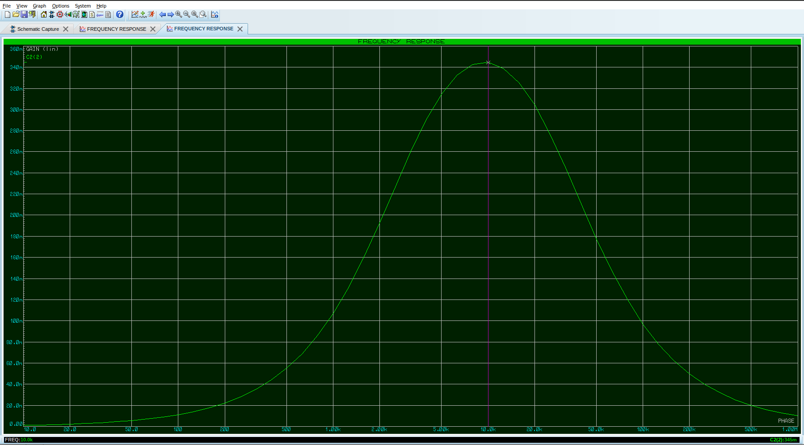

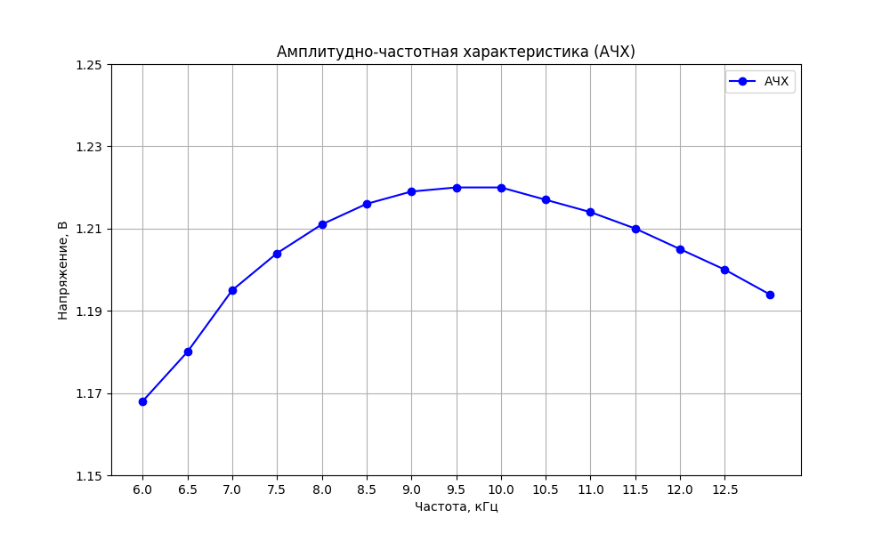

<details>

<summary>build chart use python</summary>

```python
import matplotlib.pyplot as plt
import numpy as np

# Данные
frequencies = [6, 6.5, 7, 7.5, 8, 8.5, 9, 9.5, 10, 10.5, 11, 11.5, 12,12.5,13]  # Частоты в кГц
voltages = [1.168, 1.180, 1.195, 1.204, 1.211, 1.216, 1.219, 1.220, 1.220, 1.217, 1.214, 1.210, 1.205,1.200,1.194]  # Напряжения в В

# Построение графика
plt.figure(figsize=(10, 6))
plt.plot(frequencies, voltages, marker='o', linestyle='-', color='b', label='АЧХ')

# Настройка графика
plt.title('Амплитудно-частотная характеристика (АЧХ)')
plt.xlabel('Частота, кГц')
plt.ylabel('Напряжение, В')
plt.grid(True)
plt.legend()
plt.xticks(np.arange(6, 13, 0.5))  # Шаг по оси X
plt.yticks(np.arange(1.15, 1.25, 0.02))  # Шаг по оси Y

# Показать график
plt.show()
```
</details>

Проблема в том, что пассивные фильтры имеют плавные характеристики, и их полоса пропускания не может быть очень узкой. 

Добиться более узкой полосы пропускания и более выраженного пика:
- Увеличить крутизну спада каждого фильтра (использовать фильтры более высокого порядка). используйте фильтры второго или более высоких порядков. Это можно сделать, каскадно соединяя несколько звеньев RC (с буферными усилителями между ними, чтобы избежать влияния нагрузки) или используя другие топологии фильтров (например, фильтры Саллена-Ки). Фильтры более высокого порядка имеют более крутой спад АЧХ за пределами полосы пропускания, что сделает полосу пропускания более узкой.
- Для получения очень узкой полосы пропускания с высоким Q-фактором (добротностью) лучше использовать резонансные контуры, состоящие из резистора, катушки индуктивности и конденсатора (RLC фильтры). Резонансные фильтры могут обеспечить гораздо более селективное пропускание определенной частотной полосы.

---

**Полосовые резонансные фильтры**

Если нам надо выделить какую-то узкую полосу частот, для этого применяются LC-резонанcные фильтры. Еще их часто называют избирательными. 

 
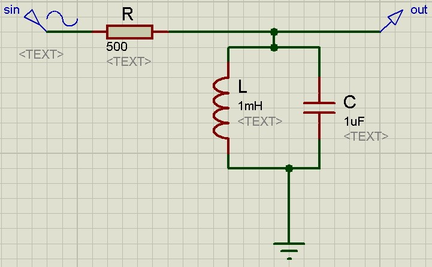

LC-контур в сочетании с резистором R образует делитель напряжения. Катушка и конденсатор в паре создают параллельный колебательный контур, который  на частоте резонанса будет иметь очень высокий импеданс, в народе — обрыв цепи. В результате, на выходе цепи при резонансе будет значение входного напряжения, при условии если мы к выходу такого фильтра не цепляем никакой нагрузки.

АЧХ данного фильтра будет выглядеть примерно вот так:
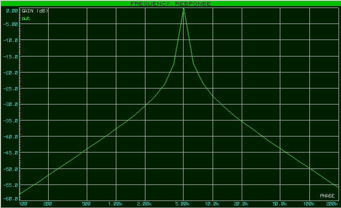

В реальной же цепи пик характеристики АЧХ будет сглажен за счет потерь в катушке и конденсаторе, так как катушка и конденсатор обладают паразитными параметрами.


Например:
- $C=1\ uF= 0.000001\ F $
- $L=1\ mH=0.001\ H$
- $R=500\ Om$

Резонансаная частота:
$f_0=\frac{1}{2 \pi \sqrt{L\cdot C} }=\frac{1}{2 \pi \sqrt{0.001\cdot 0.000001} }= 5033\ Hz$

Теперь надо определить полосу пропускания нашего фильтра. Делается это как обычно на уровне в -3 дБ, если вертикальная шкала в децибелах, либо на уровне в 0,707, если шкала линейная.

Смотрим на график (Давайте увеличим верхушку нашей АЧХ и найдем две частоты среза.):

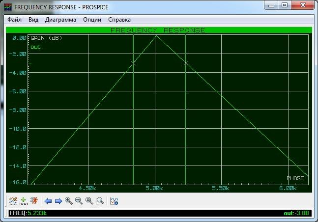

f1 = 4839 Hz<br>
f2 = 5233 Hz

Следовательно, полоса пропускания Δf=f2 — f1 = 5233-4839=394 Hz

Коэффициент добротности $Q$ позволяет оценить характеристику контура. Чем большее добротность, тем острее характеристика.

$Q=\frac{f_0}{Δf}=\frac{5033}{394}=12.77$

---

**Заграждающие (режекторные) фильтры**

Заграждающий фильтр в отличии от полосового фильтра, наоборот удаляет определенную частоту и передает все остальные. Соединити резистор, и последовательно катушку с конденсатором

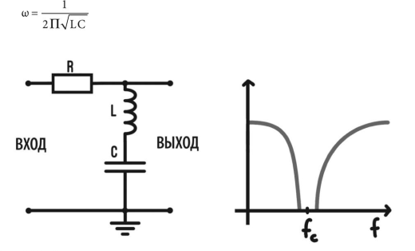

Как можно увидеть, такая схема на резонансной частоте и вблизи нее как бы вырезает небольшой диапазон частот. Здесь вступает в силу резонанс последовательного колебательного контура. Как вы помните, на резонансной частоте сопротивление контура будет равняться его активному сопротивлению. Активное сопротивление контура составляют паразитные параметры катушки и конденсатора, поэтому падение напряжения на самом контуре будет равняться падению напряжения на паразитном сопротивлении, которое очень мало. Такой фильтр называют узкополосным режекторным фильтром.

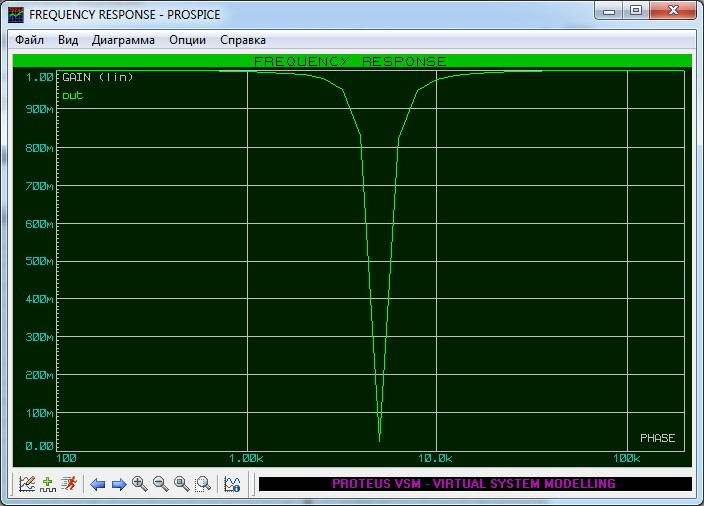

На практике звенья таких фильтров каскадируют, чтобы получить различные фильтры с требуемой полосой пропускания. Но есть один минус у фильтров, в которых имеется катушка индуктивности. Катушки дорогие, громоздкие, имеют много паразитных параметров. Они чувствительны к фону, который магнитным путем наводится от расположенных поблизости силовых трансформаторов.

Конечно, этот недостаток можно устранить, поместив катушку индуктивности в экран из мю-металла, но от этого она станет только дороже. Проектировщики всячески пытаются избежать катушек индуктивности, если это возможно. Но, благодаря прогрессу, в настоящее время катушки не используются в активных фильтрах, построенных на **ОУ**.

---

**CL-фильтр** - фильтр высоких частот со спадом 12 дБ/октаву

LC/CL фильтры называют уже фильтрами второго порядка и они обеспечивают наклон АЧХ в 12 дБ/октаву.

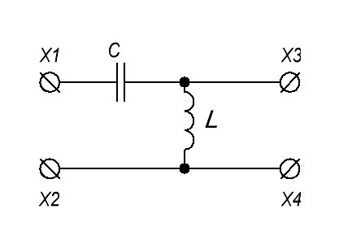


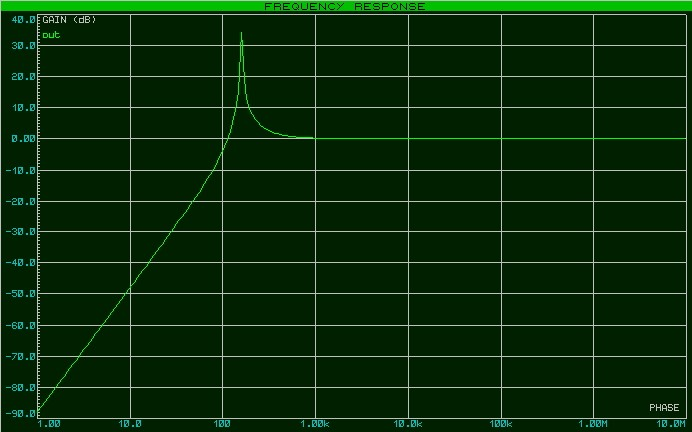

---

**LC-фильтр** - фильтр низких частот со спадом 12 дБ/октаву

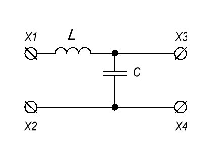

Мы получили последовательный колебательный контур, у которого, как вы помните, на частоте резонанса возникает резонанс напряжений. При резонансе напряжений, напряжение на катушке равняется напряжению на конденсаторе.

Это напряжение в Q (добротность) раз больше, чем напряжение, подаваемое на последовательный колебательный контур.

Вас этот пик напряжения не должен смущать, так как высота пика зависит от добротности, которая в реальных схемах составляет небольшое значение. Примечательна эта схема также тем, что наклон ее характеристики составляет 12 дБ/октаву, что в два раза лучше, чем у RC и RL фильтров. Кстати, если даже максимальная амплитуда превышает значения в 0 дБ, то все равно полосу пропускания определяем на уровне в -3 дБ.

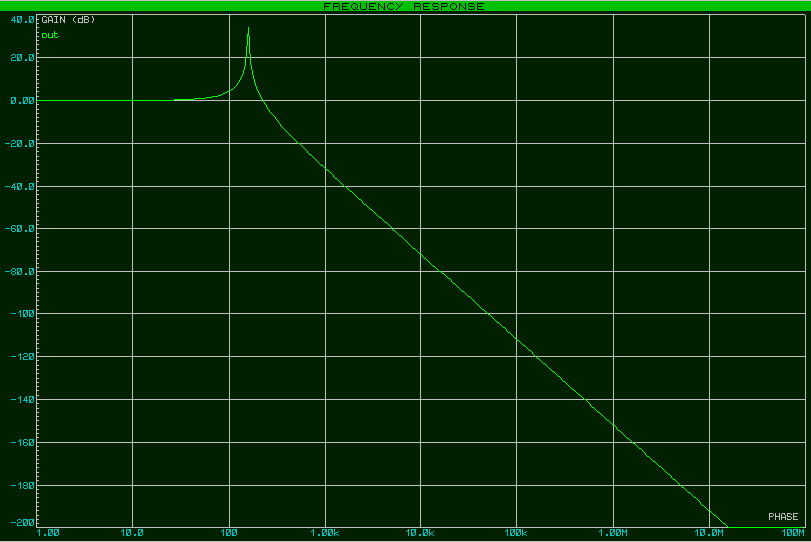

---

# Расчет LC-фильтр (ФНЧ)

В реальности это будет RLC-фильтр, так как катугка и конденсатор всегда имеют свое сопротивление т.е. потери.

L-фильтр — для сглаживания пульсаций и **подавления высокочастотных шумов** т.е. фильтр низких частот, сьем напряжения с резистора. 
Основная задача L-фильтра — пропускать постоянный ток, одновременно ослабляя переменные составляющие (пульсации и шумы). 
Блокирует высокочастотные помехи, так как сопротивление индуктивности $Z_L$ (импеданс) растет с увеличением частоты. 
Используют во вторичных источниках питания для подавления в нагрузке пульсаций напряжения или тока.

Если к катушке последовательно добавить резистор, он поможет рассеивать излишнюю энергию, а если параллельно нагрузке поставить конденсатор, получится ещё более эффективный LC-фильтр!

Основные параметры LC-фильтра:
- Индуктивность (L) — чем больше, тем сильнее фильтр подавляет высокие частоты своим индуктивным сопротивлением $X_L$.
- Сопротивление (R) — влияет на затухание колебаний и общие потери.
- Конденсатор (C): Параллельно нагрузке — "шунтирует" высокие частоты на землю, пропуская низкие частоты (для ВЧ конденсатор становится низкоомным). Отводит остаток помех после катушки, оставляя только низкочастотную или постоянную составляющую сигнала.

**Почему LC лучше, чем просто L или C:**  
- Катушка замедляет изменения тока, но не идеально гасит помехи.  
- Конденсатор фильтрует шум, но без катушки не так эффективно изолирует нагрузку.  
- В связке они дополняют друг друга, создавая резонансный барьер для нежелательных частот. 

**LC-фильтр с заземлением конденсатора (типичный ФНЧ):**  
- Катушка ставится последовательно с нагрузкой, а конденсатор подключается параллельно нагрузке и заземляется.  
- Это классическая схема **фильтра низких частот**:  
  - Катушка ослабляет высокочастотные помехи.  
  - Конденсатор «сбрасывает» остаток ВЧ на землю, пропуская низкие частоты.  
  - Снимать напряжение на конденсаторе!


**Какую частоту фильтровать:**  
- Для сглаживания пульсаций в выпрямителе — фильтруем всё выше **100–300 Гц**.  
- Для защиты от импульсных помех — фильтруем выше **20–100 кГц**.  
- Для чувствительных аналоговых схем — фильтруем ВЧ выше полезного сигнала (например, выше **10–20 кГц**)

**Опорная частота схемы:**  
- Если у тебя схема работает с низкочастотным сигналом (например, 0–10 кГц), то «высокими частотами» будет всё, что выше этого диапазона.  

**Формулы**

Частота среза:
- $f_c = \frac{1}{2\cdot \pi \cdot \sqrt{L\cdot C}}$

Частота среза - это та частота при которой выходная мощность должна составлять половину входной

Индуктивность:
- $L = \frac{1}{(2\cdot \pi \cdot f_c)^2 \cdot C}$

Емкость:
- $C = \frac{1}{(2\cdot \pi \cdot f_c)^2 \cdot L}$


### Пример устранить помехи от Wi-Fi роутера 

Ройтер с частотой 2,4 ГГц (стандарт Wi-Fi 802.11b/g/n)

Если ты работаешь с низкочастотной схемой (например, аудио, датчики), то можно поставить частоту среза где-то в районе 100 кГц – 1 МГц — этого уже хватит, чтобы ослабить Wi-Fi помехи на порядок.

 
**Выбор емкости:**

Для фильтрации ВЧ-помех (особенно гигагерцового диапазона) важны:
- Тип диэлектрика: лучше всего подойдут керамические конденсаторы.
- Класс конденсатора: класс I (например, C0G/NP0) — они стабильны и почти не теряют ёмкость на высоких частотах.
- Низкое эквивалентное последовательное сопротивление (ESR): чем ниже ESR, тем эффективнее фильтрация.

Рекомендуемые типы:
- Керамика MLCC (многослойные): очень низкий ESR, хорошая ВЧ-стабильность.
- Ёмкость: 100 пФ – 10 нФ (например, 1 нФ — универсальный вариант).
- Напряжение: с запасом, например, если питание 12 В, то выбирай конденсатор на 50 В.

**Выбор катушки:**
- Тип сердечника: ферритовый или воздушный (для высокой частоты феррит лучше).
- Коэффициент добротности (Q): средний или высокий — чтобы не терять энергию на нагрев.

Рекомендуемые типы:
- Ферритовые дроссели: компактные, отлично работают в диапазоне до нескольких мегагерц.
- Тороидальные индуктивности: чуть больше, но меньше излучают помехи наружу.
- Индуктивность: от 10 мкГн до 100 мкГн — для среза в диапазоне сотен килогерц.

**Подбор параметров:**
- допустим, выбираем частоту среза на 500 кГц (все что выше будем гасить)
- емксоть C=1нФ

Найдем индуктивность, при известной емкости:
- $L = \frac{1}{(2 \pi \cdot 500 \times 10^3)^2 \cdot 1 \times 10^{-9}} \approx 0.0001\ H = 100 \, \mu H$ ($100\cdot 10^{-6}\ H$)

Или найдем емкость при известной индуктивности:
- $C = \frac{1}{(2 \pi \cdot 500 \times 10^3)^2 \cdot 100 \times 10^{-6}}\approx 0.000000001 F = 1 \, nF$ ($1\cdot 10^{-9}\ F$)

На схеме справа осциллограф показывает емкость, вначале шум помех был на частоте 700 кГц и фильтр их сильнее гасил, а после переключил на помехи с частотой 400 кГц и фильтр их заметно лучше пропускал

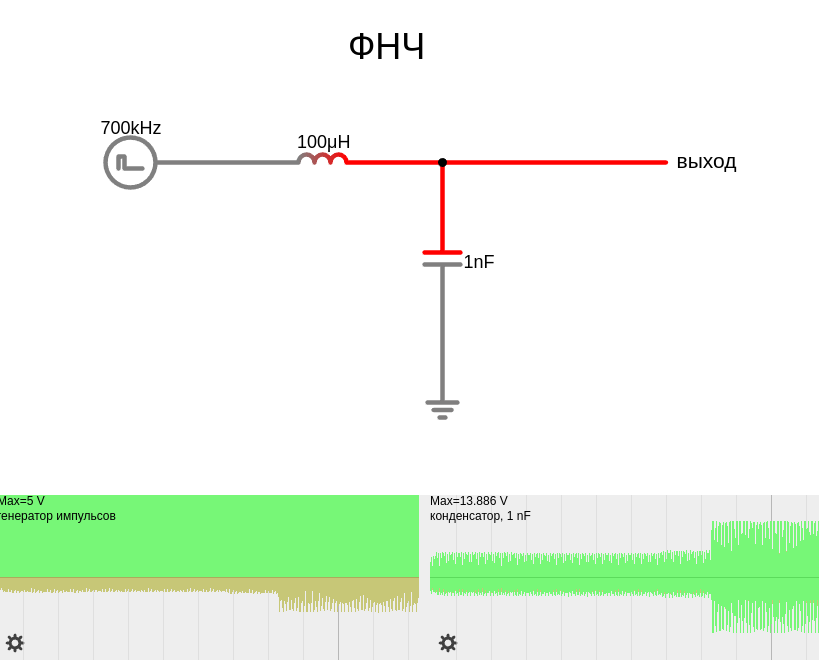

<a href="/theories_of_electrical_circuits/falstad/circuitjs-93.txt" download="circuitjs-93.txt">Скачать схему для www.falstad.com/circuit</a>

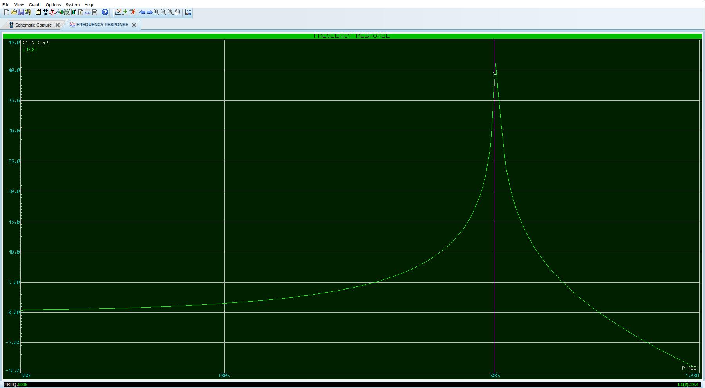

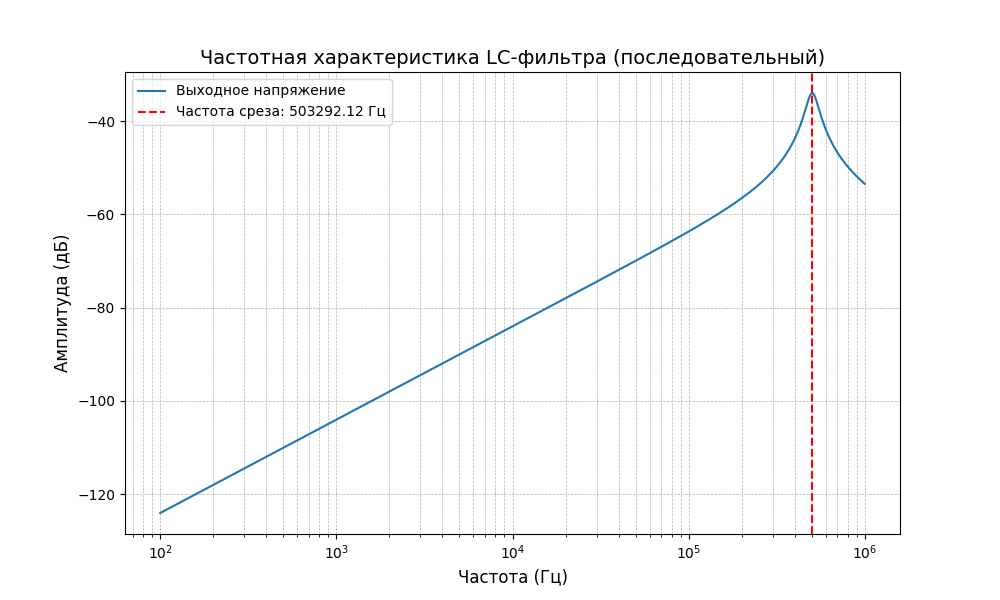

<details>

<summary>build chart use python</summary>

```python
import numpy as np
import matplotlib.pyplot as plt

# Заданные значения для LC-фильтра
L = 100e-6  # Индуктивность (100 мкГн)
C = 1e-9    # Ёмкость (1 нФ)
R = 50      # Сопротивление (например, 50 Ом)

# Частотный диапазон для анализа
f = np.logspace(2, 6, 1000)  # Частоты от 100 Гц до 1 МГц
omega = 2 * np.pi * f  # Круговая частота

# Расчёт импеданса для LC-фильтра (последовательная схема)
Z_L = 1j * omega * L   # Импеданс катушки
Z_C = 1 / (1j * omega * C)  # Импеданс конденсатора
Z_total = R + Z_L + Z_C  # Общий импеданс фильтра

# Амплитудное напряжение на выходе (отношение выходного импеданса к общему)
V_out = 1 / np.abs(Z_total)

# Частота среза
f_cutoff = 1 / (2 * np.pi * np.sqrt(L * C))  # Частота среза

# Построение графика
plt.figure(figsize=(10, 6))
plt.semilogx(f, 20 * np.log10(V_out), label='Выходное напряжение')

# Отметим частоту среза
plt.axvline(f_cutoff, color='r', linestyle='--', label=f'Частота среза: {f_cutoff:.2f} Гц')

# Настройки графика
plt.title('Частотная характеристика LC-фильтра (последовательный)', fontsize=14)
plt.xlabel('Частота (Гц)', fontsize=12)
plt.ylabel('Амплитуда (дБ)', fontsize=12)
plt.grid(True, which='both', linestyle='--', linewidth=0.5)
plt.legend()

plt.show()

```
</details>

Если фильтр недостаточно гасит помехи, можно:
- Увеличить ёмкость конденсатора.
- Увеличить индуктивность катушки.
- Или понизить частоту среза, чтобы сильнее давить ВЧ.


Что ещё поможет:
- Ферритовые кольца — хорошо гасят ВЧ, особенно удобно на проводах питания.
- Экранирование — металлические корпуса или экраны, если помеха проходит по воздуху.
- Развязка земли — чтобы Wi-Fi наводки не попадали через общий «ноль».
