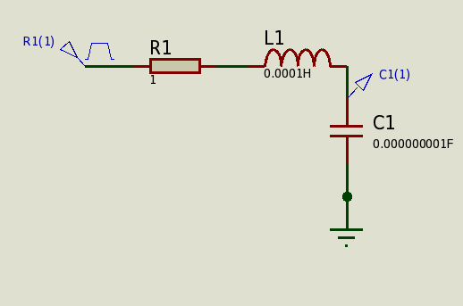
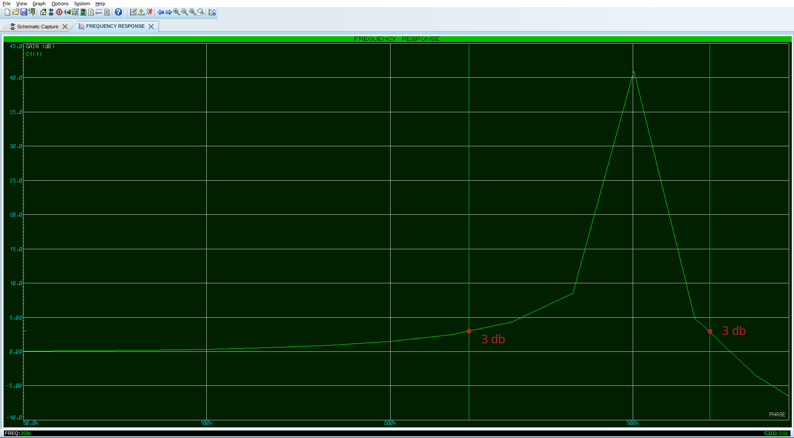

# Компенсация реактивной мощности катушки

### **Реактивная мощность и компенсация**
1. **Реактивная мощность**:
   - В цепях переменного тока (AC) с катушками индуктивности (L) и конденсаторами (C) возникает реактивная мощность. Она не совершает полезной работы, но создаёт дополнительную нагрузку на сеть.
   - Катушка индуктивности создаёт **отстающий ток** (ток отстаёт от напряжения на 90°).
   - Конденсатор создаёт **опережающий ток** (ток опережает напряжение на 90°).

2. **Компенсация реактивной мощности**:
   - Чтобы уменьшить реактивную мощность, используют **компенсацию**. Для этого параллельно катушке подключают конденсатор.
   - Конденсатор генерирует реактивную мощность, которая компенсирует реактивную мощность катушки.

```admonish info 
При резонансе в электрических цепях могут возникать интересные явления, такие как **увеличение напряжения или тока** по сравнению с источником.
На резонансной частоте напряжения на L и C могут быть очень высокими. Убедитесь, что компоненты рассчитаны на такие напряжения.
```

### **Резонанс**
1. **Резонансная частота**:
   - В цепи, состоящей из катушки индуктивности (L) и конденсатора (C), возникает резонанс на частоте:
   
     $$f_0 = \frac{1}{2 \pi \sqrt{L\cdot C}}$$

     $$C = \frac{1}{4 \pi^2 f_0^2 L}$$

     $$L = \frac{1}{4 \pi^2 f_0^2 C}$$

     Полоса пропускания - это частоты, на которых усиление падает на 3 дБ от максимального значения. 
     Падение на 3 дБ соответствует уменьшению мощности вдвое или уменьшению амплитуды в $\sqrt{2} \approx 0.707$ раза.

   - На этой частоте реактивные сопротивления катушки ($ X_L = 2 \pi f L $) и конденсатора ($ X_C = \frac{1}{2 \pi f C} $) становятся равными:
    
     $X_L = X_C$

2. **Резонанс в цепи**:
   - При резонансе реактивные мощности катушки и конденсатора компенсируют друг друга.
   - В результате полное сопротивление цепи становится минимальным, а ток — максимальным.
 
### **Связь компенсации и резонанса**
1. **Компенсация реактивной мощности**:
   - Компенсация происходит потому, что реактивные мощности катушки и конденсатора имеют противоположные знаки:
     
     $Q_L = I^2 X_L \quad \text{(реактивная мощность катушки)}$
    
     $Q_C = I^2 X_C \quad \text{(реактивная мощность конденсатора)} $
     
     $Q_{общая} = Q_L - Q_C$

     Если $ Q_L = Q_C $, то $ Q_{общая} = 0 $

2. **Резонансный режим**:
   - Если частота сети совпадает с резонансной частотой цепи $ f_0 $, то реактивные сопротивления катушки и конденсатора равны, и реактивная мощность полностью компенсируется.
   - Это идеальный случай компенсации реактивной мощности.
 

### **Практическое применение**
1. **Компенсация реактивной мощности в сетях**:
   - В промышленных сетях для компенсации реактивной мощности индуктивных нагрузок (например, электродвигателей) используют батареи конденсаторов.
   - Это снижает потери в сети и улучшает коэффициент мощности (cos φ).

2. **Резонансные цепи**:
   - В радиотехнике резонансные цепи (LC-контуры) используются для выделения или подавления определённых частот.
   - Например, в фильтрах, генераторах и тюнерах.

---

### Пример расчёта
Предположим, у нас есть:
- напряжение источника: $ U_{вх} = 5 \, \text{В} $
- катушка индуктивности $ L = 100 \, uH =  0.0001\ H$ 
- конденсатор $ C = 1 \, nF  = 0.000000001\ F$ 
- $R = 1\ Ом$. 



Резонансная частота:

$f_0 = \frac{1}{2 \pi \sqrt{L\cdot C}} = \frac{1}{2 \pi \sqrt{0.0001\cdot 0.000000001}} = 503292.1\ Hz = 503.2921\ kHz = 0.5032921\ MHz$

$C = \frac{1}{4 \pi^2 f_0^2 L}=\frac{1}{4\cdot \pi^2\cdot 503292.1^2 \cdot 0.0001}=0.000000001\ F $

$L = \frac{1}{4 \pi^2 f_0^2 C}=\frac{1}{4\cdot \pi^2 \cdot 503292.1^2 \cdot  0.000000001}=0.0001\ H$

На этой частоте реактивные мощности катушки и конденсатора компенсируют друг друга.
- $ X_L = 2\cdot \pi \cdot f \cdot  L = 2\cdot \pi \cdot 503292.1 \cdot 0.0001 = 316.227752794\ Om $ 
- $ X_C = \frac{1}{2\cdot \pi f \cdot  C} = \frac{1}{2\cdot \pi 503292.1 \cdot  0.000000001} = 316.22777924\ Om $

Полное сопротивление цепи минимально:
- $Z = \sqrt{R^2 + (X_L - X_C)^2} = R$
 
Исследование добротности<br>
Добротность $ Q $ показывает, насколько "острый" резонанс. 

Её можно рассчитать по формуле:
  
$Q = \frac{X_L}{R} = \frac{X_C}{R}=\frac{316.2}{1}=316.2$,  $ Q_{общая} = 0 $

Теперь, когда у вас есть резонансная частота $f_0=503.3\ кГц$, вы можете использовать этот фильтр для различных задач, таких как выделение или подавление определённых частот, создание резонансных цепей или измерение параметров сигнала.

**Напряжение на катушке и конденсаторе (резонанс напряжений, последовательный резонанс):**

Если в **последовательном RLC-контуре**, где катушка индуктивности (L), конденсатор (C) и резистор (R) соединены последовательно, $ X_L = X_C \gg R $, то $ U_L $ и $ U_C $ могут быть значительно больше, чем напряжение источника $ U $.

Ток в цепи максимален:<br>
Если сопротивление резистора $ R $ мало (например, $ R = 1 \, Ом $), то ток в цепи:
 
$I = \frac{U_{вх}}{R} = \frac{5}{1} = 5 \, А$

- Напряжение на катушке:
  
  $U_L = I \cdot X_L = 5 \cdot 316 = 1581 \, \text{В}$
  
- Напряжение на конденсаторе:
  
  $U_C = I \cdot X_C = 5 \cdot 316 = 1581 \, \text{В}$
   
АЧХ (amplitude-frequency response characteristic) в программе Proteus. Показано график зависимости частоты от напряжения в децибелах.
На частоте резонанса $503\ kHz$ которую мы нашли для заданных значений катушки и емкости, уровень усиления сигнала достигает 40.7 децибела, а полоса среза начинается от усиления сигнала при +3 децибела



Почему децибелы, в контексте амплитудно-частотной характеристики (АЧХ), децибелы обычно используются для представления **коэффициента передачи по напряжению (или току) или мощности** в зависимости от частоты. Децибелы используются для логарифмического представления отношения двух величин (обычно мощности или амплитуды), что позволяет показать широкий динамический диапазон в отличии от линейных значений напряжения или можности.

**Определение ключевых точек:** В децибелах легко определять такие важные характеристики, как:
   * **Усиление:** Положительное значение в дБ означает усиление сигнала.
   * **Ослабление (затухание):** Отрицательное значение в дБ означает ослабление сигнала.
   * **Частота среза (-3 дБ):** Частоты, на которых усиление падает на 3 дБ от максимального значения, часто определяют полосу пропускания фильтров. Падение на 3 дБ соответствует уменьшению мощности вдвое или уменьшению амплитуды в $\sqrt{2} \approx 0.707$ раза.

В данном случае, 40,7 дБ означает, что сигнал на частоте 500 кГц примерно в $10^{\frac{40,7}{20}} \approx 79.4$ раза сильнее, чем опорный уровень.

---

### **Заключение**
Компенсация реактивной мощности катушки за счёт ёмкости напрямую связана с резонансом. При резонансе реактивные сопротивления катушки и конденсатора равны, и их мощности компенсируют друг друга. Это используется как в энергетике (для компенсации реактивной мощности), так и в радиотехнике (в резонансных цепях).


---

## **Резонанс токов (параллельный резонанс)**

### **Что это?**
Резонанс токов возникает в **параллельном RLC-контуре**, где катушка индуктивности (L), конденсатор (C) и резистор (R) соединены параллельно.

### **Условие резонанса**
Резонанс наступает, когда реактивные проводимости катушки и конденсатора равны:
 
$B_L = B_C$
 
где:
- $ B_L = \frac{1}{X_L} $ — реактивная проводимость катушки,
- $ B_C = \frac{1}{X_C} $ — реактивная проводимость конденсатора.

Резонансная частота:
 
$f_0 = \frac{1}{2 \pi \sqrt{LC}}$
 

### **Что происходит при резонансе?**
1. **Полное сопротивление цепи максимально**:
    
  $ Z = \frac{R \cdot X_L \cdot X_C}{X_L \cdot X_C + R (X_L + X_C)}$
   
   (при $ X_L = X_C $, $ Z $ достигает максимума).

2. **Ток в цепи минимален**:
    
   $I = \frac{V}{Z}$
   
   (так как $ Z $ максимально).

3. **Токи через катушку и конденсатор**:
   - Ток через катушку:
     
    $ I_L = \frac{V}{X_L}$
     
   - Ток через конденсатор:
     
     $I_C = \frac{V}{X_C}$
      
   - Поскольку $ X_L = X_C $, то $ I_L = I_C $.

4. **Эффект увеличения тока**:
   - Если $ X_L = X_C \ll R $, то токи $ I_L $ и $ I_C $ могут быть значительно больше, чем ток источника $ I $.
   - Это явление называется **резонансом токов**.

---

## **Почему напряжение или ток могут превышать значения источника?**

### **Резонанс напряжений**
- В последовательном RLC-контуре при резонансе ток максимален, а напряжения на катушке и конденсаторе равны и могут быть больше напряжения источника, если $ X_L = X_C \gg R $.
- Это связано с тем, что энергия перекачивается между катушкой и конденсатором, создавая высокие напряжения.

### **Резонанс токов**
- В параллельном RLC-контуре при резонансе токи через катушку и конденсатор равны и могут быть больше тока источника, если $ X_L = X_C \ll R $.
- Это связано с тем, что энергия циркулирует между катушкой и конденсатором, создавая большие токи.

---

## **Практическое применение**
1. **Резонанс напряжений**:
   - Используется в радиотехнике для выделения определённых частот (например, в фильтрах и тюнерах).
   - В высоковольтных устройствах (например, трансформаторах Тесла).

2. **Резонанс токов**:
   - Используется для компенсации реактивной мощности в промышленных сетях.
   - В резонансных цепях для создания больших токов.

---

## **Заключение**
- **Резонанс напряжений** возникает в последовательном RLC-контуре и приводит к увеличению напряжений на катушке и конденсаторе.
- **Резонанс токов** возникает в параллельном RLC-контуре и приводит к увеличению токов через катушку и конденсатор.
- Оба явления связаны с обменом энергией между катушкой и конденсатором на резонансной частоте.

