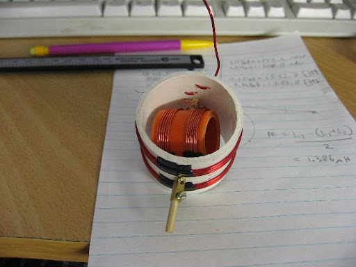
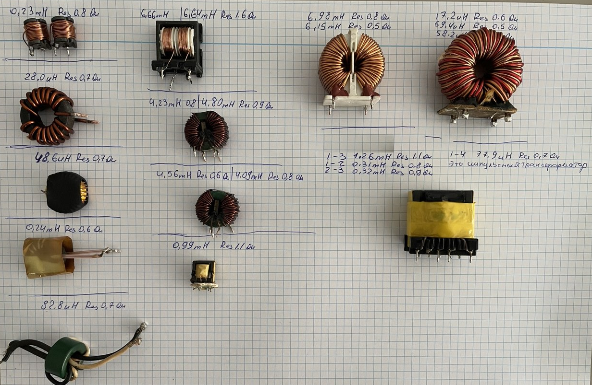

# Вариометр. Варьируемые индуктивные элементы (VLI – Variable Inductor)
Индуктивность можно изменять, регулируя положение подвижного сердечника в катушке. 

[Ссылка](https://sergeyhry.narod.ru/rl/1925-2/rl1925_15_16_21.htm)

[Калькулятор однослойной катушки](https://cxem.net/calc/inductor_calc.php)

Да, классический вариант – это **варьируемые катушки (VLI – Variable Inductor)**, которые позволяют изменять индуктивность. Они могут работать по разным принципам:  

### **Основные типы варьируемых катушек (VLI):**  

1️⃣ **Катушки с подвижным сердечником**  
   - Вставляемый или выдвигаемый ферритовый сердечник.  
   - Чем глубже сердечник в катушке, тем выше индуктивность.  
   - Используется в радиоприёмниках, фильтрах и генераторах.  

   - **Ферритовый вариометр**  
        - Индуктивность меняется за счёт перемещения **ферритового сердечника** внутри катушки.  
        - Чем глубже феррит в катушке – тем больше индуктивность.  
        - Применяется в **радиоприёмниках** и **антенных тюнерах**. 

2️⃣ **Катушки с управляемым насыщением феррита**  
   - Вторая управляющая обмотка изменяет магнитное насыщение сердечника.  
   - Чем больше управляющий ток – тем меньше индуктивность основной катушки.  
   - Применяется в автоматической настройке частоты (AFT) и фазовых детекторах. 

   - **Классический вариометр** (две катушки, одна вращается внутри другой) 
        - Состоит из **двух катушек**, соединённых **последовательно**.  
        - Одна катушка неподвижна, другая – **вращается**, изменяя взаимную индуктивность.  
        - В **параллельном соединении** катушек можно получить **переменную ёмкость**.   

3️⃣ **Переключаемые катушки**  
   - Набор фиксированных индуктивностей с переключением реле, транзисторов или варикапов.  
   - Это не плавная, но **цифрово-управляемая** подстройка.  

4️⃣ **Электронные эквиваленты индуктивности (гипотетический VLI)**  
   - Схемы на операционных усилителях (гираторы) могут имитировать переменную индуктивность.  
   - Используются в **миниатюрных ВЧ-фильтрах и генераторах**.  

   - **Электронный вариометр** (катушка с магнитным насыщением)  
        - Индуктивность регулируется **управляющим током**, влияющим на насыщение феррита.  
        - Это аналог вариометра для автоматической подстройки частоты (AFC).  
        - Используется в **автоматических тюнерах** и **автоподстройке ВЧ-фильтров**.  

Вариант с **управляемым ферритом (№2)** наиболее удобен для **плавного** изменения индуктивности, если нужен аналог варикапа.  

Какой диапазон частот или применение у твоего проекта?

---

Толщина провода в **вариометре с вращающимися катушками** влияет на:  

1. **Сопротивление катушки** – толще провод → меньше сопротивление → выше добротность (Q-фактор).  
2. **Добротность (Q-фактор)** – особенно важно для ВЧ-контуров.  
3. **Максимальный ток** – чем толще провод, тем больший ток выдержит катушка.  
4. **Жёсткость катушки** – тонкий провод может деформироваться при вращении.  

---

### **Как выбрать толщину провода?**  
- **Низкие частоты (до 1 МГц)** → **0,3–1 мм** (меньше потерь, важен ток нагрузки).  
- **Средние частоты (1–30 МГц)** → **0,2–0,5 мм** (баланс между добротностью и компактностью).  
- **Высокие частоты (30+ МГц)** → **0,1–0,3 мм** или **посеребрённый провод** (уменьшение поверхностных потерь из-за скин-эффекта).  

❗ **Важно:**  
- Для **КВ-диапазона (3–30 МГц)** часто используют **лаковый провод 0,3–0,5 мм**.  
- Для **УКВ (100+ МГц)** лучше тонкие посеребрённые провода **0,1–0,2 мм** или ленточные проводники.  
- Если катушка будет **вращаться**, лучше использовать **жёсткий провод** или зафиксировать витки на каркасе, чтобы избежать деформации.  

---

Два вариометра смогут **эффективно покрыть широкий диапазон частот**, если их правильно спроектировать.  

### **Как организовать два вариометра для всех диапазонов?**  

**Каждый вариометр полностью перекрывает свой диапазон частот, охватывая все нужные индуктивности.**

1️⃣ **Низкочастотный вариометр (LW, MW, HF – 0,1–30 МГц)**  
   - **Толстый провод (0,5–1 мм)** для уменьшения сопротивления и повышения добротности.  
   - **Большое количество витков** для работы на низких частотах.  
   - **Ферритовый сердечник или вращающаяся катушка** для плавного изменения индуктивности.  

    ### **1. Низкочастотный вариометр (LW, MW, HF: 0,1–30 МГц)**  
    ✅ **Диапазон индуктивностей:** **50 мкГн – 3(5) мГн**  
    ✅ **Перекрывает частоты:** **0,1–30 МГц**  
    ✅ **Конструкция:**  
    - Внешняя статическая катушка (50 витков, 0,8 мм).  
    - Внутренняя подвижная катушка (30 витков, 0,4 мм).  
    - Возможность использования ферритового сердечника для расширения диапазона.  
    - Вариант с вращающейся или движущейся вдоль оси внутренней катушкой.  

2️⃣ **Высокочастотный вариометр (VHF, UHF – 30+ МГц)**  
   - **Тонкий провод (0,1–0,3 мм, можно посеребрённый)** для снижения потерь.  
   - **Меньше витков** для работы на высоких частотах.  
   - **Без феррита** (или с воздушным сердечником) для снижения потерь на ВЧ.  
   - Можно использовать **вращающийся вариант или коаксиальную схему**.  

    ### **2. Высокочастотный вариометр (VHF, UHF: 30+ МГц)**  
    ✅ **Диапазон индуктивностей:** **1 мкГн – 100 мкГн**  
    ✅ **Перекрывает частоты:** **30+ МГц**  
    ✅ **Конструкция:**  
    - Воздушные катушки с тонким (0,2–0,5 мм) или посеребрённым проводом.  
    - Минимальное количество витков (5–20) для снижения паразитных ёмкостей.  
    - Внутренняя катушка вращается или движется вдоль оси.  
    - Без феррита (феррит неэффективен на этих частотах).  
    
 
 

---
# Низкочастотный вариометр (LW, MW, HF – 0,1–30 МГц)

**Цилиндрический вариометр с внутренней подвижной катушкой** позволит плавно менять индуктивность и подстроить контур в широком диапазоне. Давай разберём твои вопросы.  

 
### **1. Какую толщину провода выбрать?**  
Так как вариометр рассчитан на **низкие частоты (0,1–30 МГц)**, главное – **добротность и минимальные потери**.  

#### **Внешняя катушка (основная)**
- **Провод:** 0,5–1 мм (медный эмалированный или посеребрённый).  
- **Почему?** Толстый провод снижает сопротивление и повышает добротность.  

#### **Внутренняя катушка (подвижная)**
- **Провод:** 0,3–0,6 мм (медный эмалированный).  
- **Почему?** Она будет **двигаться**, поэтому толстый провод может быть менее удобен.  

 
### **2. Как должна двигаться внутренняя катушка?**  
Оба варианта работают, но имеют разные плюсы и минусы.  

#### **Вариант 1: Внутренняя катушка вращается вокруг своей оси (как классический вариометр)**
✅ Плюсы:  
- Плавная регулировка индуктивности.  
- Подходит для **широкого диапазона частот**.  
- Не требует направляющих – только ось вращения.  

❌ Минусы:  
- Сложнее в механической реализации (нужна ось и подвижные контакты).  
- Может влиять на добротность из-за подвижных соединений.  

 

#### **Вариант 2: Внутренняя катушка движется вдоль оси внешней катушки (как катушка с ферритовым сердечником)**  
✅ Плюсы:  
- Простая механика – можно двигать вручную или мотором.  
- Можно использовать **ферритовый стержень** внутри для большего изменения индуктивности.  
- Работает на **самых низких частотах** эффективнее, чем вращающийся вариант.  

❌ Минусы:  
- Диапазон подстройки может быть уже, чем у вращающегося варианта.  
- Нужно следить за плавностью перемещения.  

**Вывод:**  
- Если хочешь **широкий диапазон** – **вращающаяся катушка**.  
- Если нужна **простота и ферритовый сердечник** – **катушка, движущаяся вдоль оси**.  

 

### **3. Можно ли использовать ферритовый стержень?**  
Да, если ты выберешь вариант **с движением вдоль оси**, ферритовый стержень **увеличит диапазон изменения индуктивности**.  

Но если ты делаешь **вращающуюся катушку**, феррит **не нужен**, потому что он будет менять индуктивность нестабильно (из-за неравномерного вращения).  
 
Да, вы правильно поняли! Если вы работаете с **низкочастотным вариометром** (0,1–30 МГц), то ферритовый стержень вам, скорее всего, не понадобится для **циллиндрической катушки**. Диапазон индуктивности, которого можно достичь с помощью только изменения геометрии катушки (например, через вращение внутренней катушки), будет достаточен для настройки на нужный диапазон частот.

### Почему ферритовый стержень не нужен:
- **Для низких частот (LW, MW, HF)** катушка с обычным медным проводом будет вполне эффективна для обеспечения нужного диапазона индуктивности. Использование ферритового стержня будет избыточным, а его влияние на индуктивность может быть нестабильным при вращении, особенно если катушка вращается.
- Ферритовые материалы могут вводить дополнительные сложности в конструкцию и ухудшить стабильность работы на более высоких частотах или в случае вращающихся конструкций.

### Почему стоит выбрать **вращающуюся катушку**:
- Вариант с **вращающейся внутренней катушкой** вокруг своей оси — это хорошая идея для низкочастотного вариометра. Это позволяет плавно изменять индуктивность за счет изменения расположения витков внутри катушки, что даёт точную настройку на нужную частоту.
- **Плавность регулировки** и **широкий диапазон частот** можно достичь за счет этого метода, поскольку изменение геометрии катушки будет пропорционально изменению её индуктивности.

#### Преимущества вращающейся катушки:
- **Управление индуктивностью будет простым и плавным.**
- **Подходит для широкого диапазона частот**, как это необходимо в диапазоне 0,1–30 МГц.
- **Механика вращающейся катушки** может быть реализована проще, чем сложная конструкция с движущейся катушкой вдоль оси, особенно если вы хотите избежать использования ферритового стержня.

### Вывод:
В случае с цилиндрическим вариометром для низкочастотного диапазона (0,1–30 МГц) **вращающаяся внутренняя катушка** будет хорошим выбором, так как она обеспечит стабильную настройку на частоты без необходимости в ферритовом стержне.

--- 

# 1. Высокочастотный вариометр (VHF, UHF: 30+ МГц)

**Цилиндрический вариометр для VHF/UHF (30+ МГц) требует особого подхода**, так как на этих частотах важно минимизировать паразитные ёмкости и сопротивление. Давай разберёмся с твоими вопросами.  

 

### 1. Какую толщину провода выбрать? 
На **высоких частотах (VHF/UHF)** важно учитывать **скин-эффект** – ток течёт только по поверхности провода.  

#### Внешняя катушка (статическая)
- **Провод:** 0,5 мм или тоньше (0,3–0,5 мм).  
- **Лучше посеребрённый провод** (уменьшает потери от скин-эффекта).  
- **Количество витков:** 5–20 (зависит от частоты).  

#### Внутренняя катушка (подвижная)
- **Провод:** 0,2–0,5 мм, посеребрённый (по возможности).  
- **Число витков:** 3–15.  
- **Важно:** Минимальное расстояние между витками для снижения паразитной ёмкости.  

 
### 2. Как должна двигаться внутренняя катушка?  
На **высоких частотах (30+ МГц)** феррит **НЕ эффективен**, поэтому будем работать только с воздушными катушками.  

#### Вариант 1: Внутренняя катушка вращается вокруг своей оси 
✅ **Плюсы:**  
- Плавное изменение взаимной индуктивности.  
- Хорошо работает на **широком диапазоне частот**.  
- Простая механическая реализация (вращение на оси).  

❌ **Минусы:**  
- Ограниченный диапазон регулировки.  
- Требуются подвижные контакты (если катушка не соединена жёстко).  
 

#### Вариант 2: Внутренняя катушка движется вдоль оси внешней катушки 
✅ **Плюсы:**  
- Можно сделать **очень компактную конструкцию**.  
- Гибкость в настройке (можно двигать как плавно, так и пошагово).  
- Простая конструкция, не требует подвижных контактов.  

❌ **Минусы:**  
- **Феррит здесь не нужен** – на VHF/UHF он плохо работает.  
- Может быть сложнее точно настроить на нужную частоту.  
 
### 3. Можно ли использовать ферритовый стержень? 
❌ **Нет, на VHF/UHF феррит будет только ухудшать параметры**:  
- Он вносит **дополнительные потери** на таких частотах.  
- У феррита есть **верхняя граничная частота (~30–50 МГц)**, после чего он теряет эффективность.  
- **Лучше использовать воздушные катушки.**  

 

### **Выбор оптимального варианта**  
- **Если нужна простота и плавная настройка** → **вращающаяся внутренняя катушка**.  
- **Если нужен больший диапазон регулировки** → **подвижная катушка вдоль оси** (без феррита).  

 
# 2. Сферический вариометр

Для высоких частот (VHF, UHF, 30+ МГц): лучше сферический вариометр, так как у него меньше паразитная ёмкость и выше добротность.

Для создания высокочастотного вариометра в диапазоне VHF и UHF (30+ МГц), важно учесть несколько факторов, включая конструкцию катушек и принцип работы вариометра. Давайте разберем ваши вопросы.

### 1. Диапазон индуктивности

Для частот от 30 МГц до, скажем, 1 ГГц (что является типичным диапазоном для VHF/UHF), индуктивность катушек должна изменяться в определенных пределах, чтобы обеспечить настройку на эти частоты.

Формула для резонансной частоты LC-цепочки:
 
$f = \frac{1}{2 \pi \sqrt{LC}}$
 
где:
- $ f $ — резонансная частота,
- $ L $ — индуктивность,
- $ C $ — ёмкость.

Пусть ёмкость конденсатора вариометра в пределах 5-50 пФ. Для частоты 30 МГц (самая низкая из вашего диапазона) и ёмкости 50 пФ:

 
$L = \frac{1}{(2 \pi f)^2 C} = \frac{1}{(2 \pi 30 \times 10^6)^2 \times 50 \times 10^{-12}} \approx 0.88 \, \text{мкГн}$
 

Для более высоких частот индуктивность будет уменьшаться. Например, для 1 ГГц и той же ёмкости:

 
$L = \frac{1}{(2 \pi 1 \times 10^9)^2 \times 50 \times 10^{-12}} \approx 0.0035 \, \text{мкГн}$
 

Таким образом, диапазон индуктивности должен быть в пределах от примерно 0.88 мкГн до 0.0035 мкГн. Для катушек, регулируемых по индуктивности, обычно используется диапазон от 0.5 мкГн до 5 мкГн, в зависимости от требуемой точности настройки.

### 2. Диаметры проволоки

Для катушек, работающих в высокочастотном диапазоне (VHF/UHF), проволока должна быть тонкой, чтобы избежать потерь на высоких частотах, а также обеспечить компактность и стабильность характеристик.

- Диаметр проволоки обычно выбирается в пределах 0.2–1 мм. Для UHF диапазона предпочтительнее использовать более тонкую проволоку (например, 0.2–0.5 мм), так как она снижает сопротивление и улучшает характеристики катушки на высоких частотах.

- Если катушка должна быть выполнена сферической, то предпочтительнее использовать медную проволоку с хорошей изоляцией (например, эмалированную), чтобы избежать коротких замыканий между витками.

### 3. Намотка проволоки и вращение сфер

#### Намотка проволоки:

- Намотка катушек должна быть аккуратной, с равномерными витками, чтобы минимизировать паразитные емкости и индуктивности. Это важно для поддержания стабильности индуктивности при вращении.
- Для сферической катушки можно использовать технику намотки витков на специальную форму, которая затем преобразуется в сферическую конструкцию.

#### Вращение внутренней и внешней сфер:

В вариометре с катушками, расположенными на двух сферах, внутренний элемент обычно вращается относительно внешнего. Это можно реализовать следующим образом:

- **Внешняя сфера**: На внешней сфере фиксируются витки катушки с определённой индуктивностью. Внешняя сфера, возможно, будет неподвижной или с возможностью перемещения по оси для настройки.
- **Внутренняя сфера**: Внутренняя сфера будет вращаться, изменяя количество перекрывающихся витков катушки с внешней сферой. Изменение индуктивности при вращении внутренней сферы будет происходить за счет изменения геометрии катушки, что в свою очередь будет изменять её индуктивность.

Такое вращение можно реализовать с помощью механизма, который будет плавно изменять взаимное расположение внутренних и внешних катушек, что изменит их индуктивность.

Таким образом, для создания сферического вариометра для VHF/UHF необходимо точно рассчитать диапазон индуктивности катушек, подобрать подходящий диаметр проволоки и продумать механизм вращения внутренних и внешних сфер, чтобы обеспечить стабильную настройку в нужном диапазоне частот.

---

