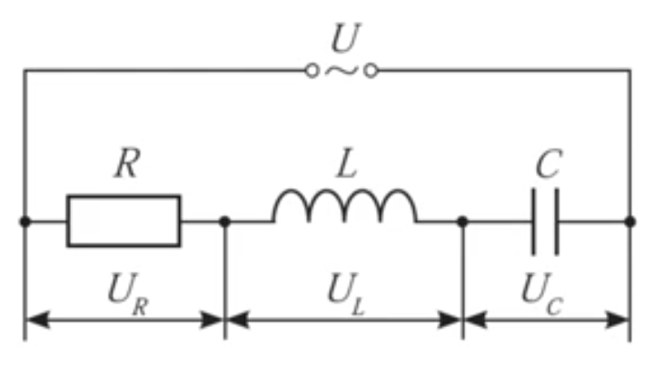

# Колебательный контур RLC цепь

Генератор синусоидальных сигналов: Использует колебательный контур на основе резонансных свойств цепи для создания сигнала определённой частоты в генераторах сигналов, радиоприёмниках, антеннах..

<a href="/theories_of_electrical_circuits/falstad/circuitjs-95.txt" download="circuitjs-95.txt">Скачать схему для www.falstad.com/circuit</a>

---

