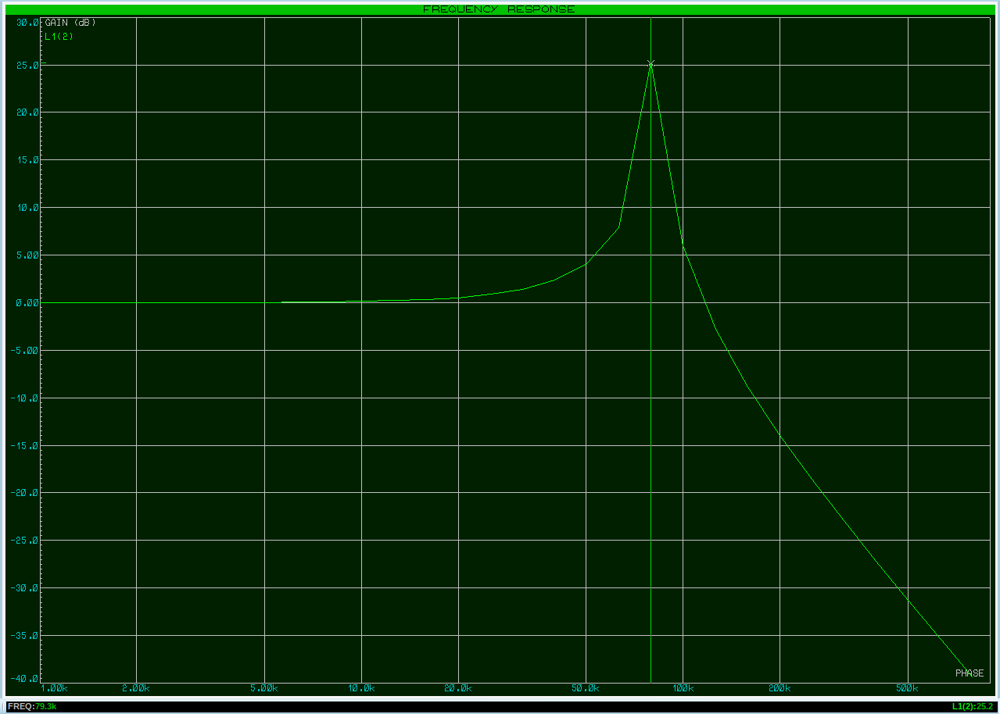
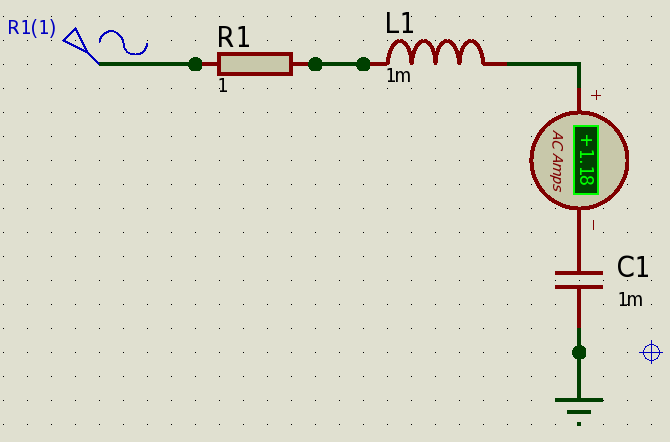
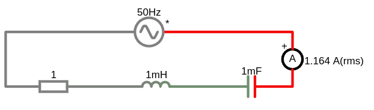
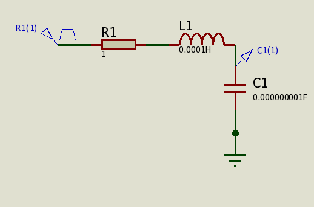
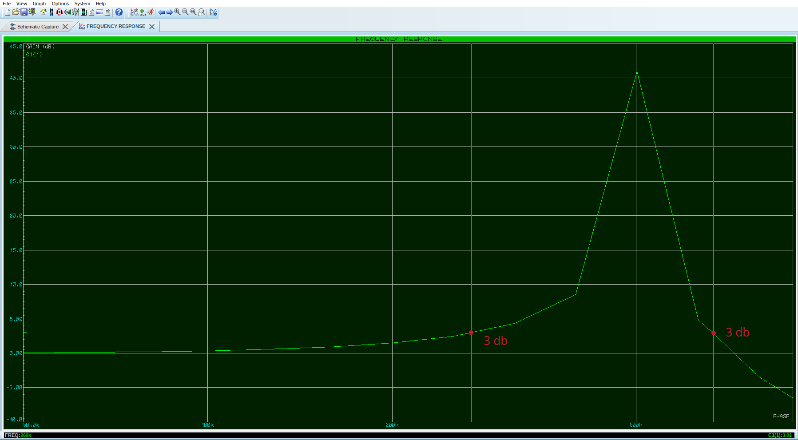
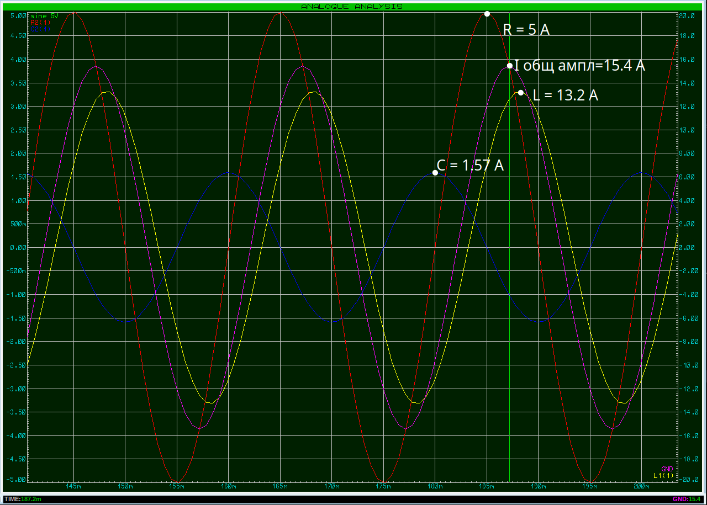

# Колебательный контур RLC цепь

Энергия перетекает между катушкой и конденсатором это и есть колебания.

Из-за наличия резистора часть энергии системы теряется в виде тепла на каждом цикле колебаний. Поэтому амплитуда колебаний постепенно уменьшается со временем. Такие колебания называются затухающими. Если в колебательный контур ввести дополнительный источник энергии, компенсирующий потери в резисторе, можно поддерживать незатухающие колебания с постоянной амплитудой.

Частота, на которой контур стремится колебаться в отсутствие внешнего воздействия, называется собственной частотой колебаний или резонансной частотой.  Это значит что при частоте резонанса колебательный контур обладает минимальным сопротивлением и он легко раскачивается поднимая напряжение или ток.

 

### Компенсация реактивной мощности катушки
1. **Реактивная мощность**:
   - В цепях переменного тока (AC) с катушками индуктивности (L) и конденсаторами (C) возникает реактивная мощность. Она не совершает полезной работы, но создаёт дополнительную нагрузку на сеть.
   - Катушка индуктивности создаёт **отстающий ток** (ток отстаёт от напряжения на 90°).
   - Конденсатор создаёт **опережающий ток** (ток опережает напряжение на 90°).

2. **Компенсация реактивной мощности**:
   - Чтобы уменьшить реактивную мощность, используют **компенсацию**. Для этого параллельно катушке подключают конденсатор.
   - Конденсатор генерирует реактивную мощность, которая компенсирует реактивную мощность катушки.

3. **Резонанс**: ([калькулятор резонансной частоты](https://www.1728.org/resfreq.htm))
   - Если конденсатор компенсирует потери катушки полностью, это если их сопротивления ($ X_L = 2 \pi f L $) и ($ X_C = \frac{1}{2 \pi f C} $) равны $X_L = X_C$, то наступает резонанс. В результате полное сопротивление цепи становится минимальным, а ток — максимальным.
   - Полоса пропускания - это частоты, на которых усиление падает на 3 дБ от максимального значения. 
     Падение на 3 дБ соответствует уменьшению мощности вдвое или уменьшению амплитуды в $\sqrt{2} \approx 0.707$ раза.

```admonish info 
При резонансе в электрических цепях могут возникать интересные явления, такие как **увеличение напряжения или тока** по сравнению с источником.
На резонансной частоте напряжения на L и C могут быть очень высокими. Убедитесь, что компоненты рассчитаны на такие напряжения.
```

4. **Связь компенсации и резонанса**
 
    Компенсация происходит потому, что реактивные мощности катушки и конденсатора имеют противоположные знаки:
     
    $Q_L = I^2 X_L \quad \text{(реактивная мощность катушки)}$
    
    $Q_C = I^2 X_C \quad \text{(реактивная мощность конденсатора)} $
     
    $Q_{общая} = Q_L - Q_C$

    Если $ Q_L = Q_C $, то $ Q_{общая} = 0 $
 
---

# Последовательный RLC контур (резонанс напряжений)


В цепи общий ток!

1. При малой частоте сила тока опережает напряжение. Попахивает реактивным сопротивлением конденсатора. На низких частотах: Доминирует емкостное реактивное сопротивление ($X_C \gg X_L$), что также приводит к большому импедансу и малому току.

2. На какой-то частоте резонанса, у нас сила тока станет максимальной, а сдвиг фаз станет равен нулю. И отсутвует реактивносе сопротивление $X_C == X_L$.
Это явление носит название резонанса (собственная частота колебательного контура). При этом конденсатор в этот момент времени будет полностью разряжен. Максимум входного напряжения будет приходится при нулевом напряжении на конденсаторе. Напряжения на катушке и конденсаторе будет отличаться на 90 градусов от входного в разные стороны.


3. При большой частоте ток будет запаздывать от напряжения. Попахивает реактивным сопротивлением катушки индуктивности. С увеличением частоты, сдвиг приближается к 90 градусов, а сила тока становится все меньше и меньше. На высоких частотах: Доминирует индуктивное реактивное сопротивление ($X_L \gg X_C$), что приводит к большому импедансу и малому току.

**Как происходит резонанс**

Дело в том, что в момент когда сдвиг фаз равен нулю, реактивное сопротивление катушки и конденсатора становятся равными, но противоположными по знаку. Поэтому, эти реактивные сопротивления как-бы вычитаются друг из друга, что в сумме дает ноль, и в цепи остается только активная составляющая сопротивления, то есть то самое паразитное сопротивление катушки и конденсатора, или иначе, сопротивление потерь R. Как вы помните, если у нас сопротивление  становится малым, а в данном случае сопротивления потерь катушки и конденсатора очень маленькие, то в цепи начинает течь большая сила тока согласно закону Ома: I=U/R. Если генератор мощный, то напряжение на нем не меняется, а сопротивление становится пренебрежимо малым и вуаля!

**Формула Томсона (резонанса) для последовательного колебательного контура**

Если при резонансе у нас реактивное сопротивление катушки равняется реактивному сопротивлению конденсатора $X_L=X_C$ , то можно уравнять их реактивные сопротивления и уже отсюда вычислить частоту, на которой произошел резонанс.

реактивное сопротивление катушки: $X_L=2 \pi f\cdot L$

реактивное сопротивление конденсатора: $X_C=\frac{1}{2 \pi f\cdot C}$

Формула резонансной частоты.
Приравниваем обе части и вычисляем отсюда F: 
$$f_0 = \frac{1}{2 \pi \sqrt{L\cdot C}},\ C = \frac{1}{4 \pi^2 f_0^2 L},\ L = \frac{1}{4 \pi^2 f_0^2 C}$$

[Построение графиков функций онлайн](https://yotx.ru/)

Так же последовательный колебательный контур называют **узкополосный (резонансный) усилитель напряжения**, а не мощности. Потому что напряжение на катушке и емкости больше (напряжения равны, так как ток общий и реактивные сопротивления на L и C тоже равны), в несколько раз чем входное, но сила тока маленькая, поэтому мощность малая.

**Добротность последовательного колебательного контура**

Коэффициент, показывающий во сколько раз напряжение на катушке либо на конденсаторе превышает напряжение на генераторе, называется добротностью Q последовательного колебательного контура и показывает качественную оценку колебательного контура. В основном стараются сделать Q как можно больше.

$Q=\frac{U_C}{U_{ист}}=\frac{U_L}{U_{ист}}$

B вторая формула для добротности:

$Q=\frac{1}{R}\cdot \sqrt{\frac{L}{C}} $

где:
- $R$ - сопротивление потерь последовательного колебательного контура (Катушка и конденсатор имеют паразитные омические потери, так как не являются идеальными радиоэлементами.)

Если взглянуть на формулу выше, то можно понять, для того, чтобы увеличить добротность, нам надо как-то уменьшить сопротивление потерь колебательного контура. Львиная доля потерь относится к катушке индуктивности, так как она уже конструктивно имеет большие потери. Она намотана из провода и в большинстве случаев имеет сердечник. На высоких частотах в проводе начинает проявляться скин-эффект, который еще больше вносит потери в контур.


Для последовательного колебательного контура на резонансной частоте наблюдается минимальное сопротивление (импеданс) и максимальный ток. Происходит "раскачка" по току, что может привести к большим напряжениям на L и C.

**Остальные формулы:**


Модуль сложения векторов напряжений т.е. величина (абсолютное значение):
- $U_{ампл}=\sqrt{U²_{ампл\ R} + (U_{ампл\ L} - U_{ампл\ C} )²} = \sqrt{I²_{ампл}R + (I_{ампл}X_L - I_{ампл}X_C )²}$

Сдвиг фаз $ \varphi $ между вектором напряжения и тока:
- $U=U_{ампл} \cos \omega t$

Мгновенное значение силы тока в цепи:
- $i=I_{ампл} \cos (\omega t - \varphi)$

Полное сопротивление:
- $Z=\frac{U_{ампл}}{I_{ампл}}=\sqrt{R² + (X_L - X_C)²}$

Закон Ома для цепи переменного тока:
- $I_{ампл}=\frac{U_{ампл}}{Z}=\frac{U_{ампл}}{\sqrt{R² + (X_L - X_C)²}}$


Определение угла $ \varphi $:


### Пример
- $L=19\ uH=0.00019\ H$
- $C=20\ nF=0.000000020\ F$
- $R=20\ Om$ (В реальности у нас катушка обладает приличным сопротивлением потерь, так как намотана из провода. И конденсатор тоже имеет потери (ESR конденсатора), маленькое последовательное сопротивление, которое тоже вносит вклад в общее затухание.)

Чем меньше значения катугки и емкости тем меньше частота среза.


Резонансная частота:
- $f_0=\frac{1}{2 \pi \sqrt{L\cdot C}} = \frac{1}{2 \pi \sqrt{0.00019\cdot 0.000000020}}\approx 81644\ Hz$



При резонансной частоте 81644 Hz, напряжение на катушке и конденсаторе будет $\approx 25$ Вольт, хотя источник 5 вольт.
А если сопротивление будет еще меньше, то напряжение подскочет еще больше.


На графике напряжение на конденсаторе представлено красной синусоидой


На графике видно, что ток (красная синусоида, значения справа) и напряжение источника (зеленая синусоида, значения слева) совпадают по фазе


Посчитаем:

1. $\omega = 2 \pi f_0 \approx 512984\ рад/с$

1. Находим емкостное сопротивление конденсатора:<br>
    $X_C=\frac{1}{\omega C}=\frac{1}{512984 \cdot 0.000000020}= 97.47\ Om $

1. Находим индуктивное сопротивление катушки:<br>
    $X_L=\omega \cdot L= 512984 \cdot 0.00019 = 97.47\ Om $

1. Находим полное сопротивления (геометрически складываем):<br>
    $Z=\sqrt{R² + (X_L - X_C)²}=\sqrt{20² + (97.47 - 97.47)²}= 20\ Om $

1. Находим амплитудный ток по закону Ома для цепи переменного тока:<br>
    $I_{ампл}=\frac{U_{ампл}}{Z}=\frac{5}{20}=0.25\ A$ (как видим ток небольшой)

1. Напряжения на элементах, амплитудное:<br>
    - $U_R = I_{ампл} \cdot R = 0.25 \cdot 20 = 5\ V$

    - $U_L = I_{ампл} \cdot X_L = 0.25 \cdot 97.47 = 24.37\ V$
    
    - $U_C = I_{ампл} \cdot X_C = 0.25 \cdot 97.47 = 24.37\ V$    

1. Добротность:<br>
    $Q=\frac{U_C}{U_{ист}}=\frac{U_L}{U_{ист}} = \frac{24.37}{5}=4.87$

    $Q=\frac{1}{R}\cdot \sqrt{\frac{L}{C}} = \frac{1}{20}\cdot \sqrt{\frac{0.00019}{0.000000020}}=4.87$

    Т.е. напряжение на катушке и конденсаторе превышает в 4.87 раза напряжение источника, немного, но если уменьшить сопротивление то будет больше.


<details>

<summary>Еще один пример расчета последовательного контура</summary>

**Пример расчета цепи:**
- Источник переменного напряжения 
  - $U_{ампл}=5\ V$ ($U_{действ}=3.535534\ V$) 
  - частотой $f=50\ Hz$ 
- Резистор $R=1\ Om$
- Конденсатор $C=1\ mF\ =0.001\ F$
- Катушка индуктивности $L=1\ mH = 0.001\ H $

1. $\omega = 2 \pi f \approx 314\ рад/с$

1. Находим емкостное сопротивление конденсатора:<br>
    $X_C=\frac{1}{\omega C}=\frac{1}{314 \cdot 0.001}= 3.19\ Om $

1. Находим индуктивное сопротивление катушки:<br>
    $X_L=\omega \cdot L= 314 \cdot 0.001 = 0.31\ Om $

1. Находим полное сопротивления (геометрически складываем):<br>
    $Z=\sqrt{R² + (X_L - X_C)²}=\sqrt{1² + (0.31 - 3.19)²}\approx 3.05\ Om $

1. Находим действующий ток:<br>
    $I_{дейст} = \frac{U_{дейст}}{ Z} = \frac{I_{ампл}}{ \sqrt{2}} = \frac{1.64}{\sqrt{2}} = 1.16\ A$

1. Находим амплитудный ток по закону Ома для цепи переменного тока:<br>
    $I_{ампл}=\frac{U_{ампл}}{Z}=\frac{5}{3.05}=1.66\ A$

1. Угол фазового сдвига ($\varphi$):<br>
    $\varphi = \arctan{\frac{X_L - X_C}{R}}=\arctan{\frac{0.314 - 3.18}{1}}=\arctan{(-2.866)} \approx -70.6^\circ $

1. Напряжения на элементах, действующее:<br>
    - $U_R = I_{дейст} \cdot R = 1.16 \cdot 1 = 1.16\ V$

    - $U_L = I_{дейст} \cdot X_L = 1.16 \cdot 0.314 = 0.364\ V$
    
    - $U_C = I_{дейст} \cdot X_C = 1.16 \cdot 3.18 = 3.68\ V$

1. Проверим расчеты действующего напряжения:
    - $U_{дейст}=\sqrt{U²_{дейст\ R} + (U_{дейст\ L} - U_{дейст\ C} )²} = \sqrt{1.16² + (0.364 - 3.68 )²}\approx 3.53\ V$
    - $U_{ампл}=U_{дейст}\cdot \sqrt{2}=5\ V$


1. Мгновенное значение силы тока в цепи:<br>
    - $\varphi = -70.6^\circ = -1.23 \text{ рад}$
    - $i(t)=I_{ампл} \cos (\omega t - \varphi) = 1.64 \cos(314.16 t -1.23)$

1. Резонансная частота:<br>
    Нулевой сдвиг по фазе означает, что напряжение и ток в цепи синфазны, то есть достигают своих максимальных и минимальных значений одновременно. Это происходит, когда цепь работает на резонансной частоте. <br>
    Для последовательного контура $Z=R$ на резонансной частоте импеданс цепи минимален, поэтому ток достигает максимума.
    Для параллельного контура, импеданс максимален и полная проводимость минимальна $Y=\frac{1}{R}$, а значит, общий ток из источника минимален.<br> 
    Максимальный коэффициент мощности при резонансе $\varphi=0^\circ$, значит: $\cos (\varphi) = 1$ это означает, что вся подведённая мощность идёт в нагрузку.<br> 
    При резонансе напряжений, напряжение на катушке равняется напряжению на конденсаторе. Это напряжение в Q ( добротность) раз больше, чем напряжение, подаваемое на последовательный колебательный контур.<br>
    Резонанс в последовательной RLC-цепи возникает, когда индуктивное и емкостное сопротивления равны:<br> 
    - $X_L = X_C$
    - $f_0 = \frac{1}{2\pi \sqrt{L\cdot C}}=\frac{1}{2\pi \sqrt{0.001\cdot 0.001}}\approx 159.15\ Hz$

1. Коэффициент добротности:  
    - $Q = \frac{X_L}{R} = \frac{X_C}{R}= \frac{X_C}{R} = \frac{\omega_0 L}{R} = \frac{1}{\omega_0 C R}$

    - Угловая резонансная частота:
        - $\omega_0 = 2\pi f_0 = 2\pi \cdot 159.15 = 1000 \text{ рад/с}$
    - $Q = \frac{1000 \cdot 0.001}{1} = 1$
        - Коэффициент добротности $Q$ = 1 (это низкая добротность, значит, затухание в контуре довольно сильное)

1. Энергия в катушке и конденсаторе: 
    - В катушке: $ W_L = \frac{1}{2} L\cdot I_{ампл}^2 = \frac{1}{2} \cdot 0.001 \cdot 1.66^2 = 0.00137 \text{ Дж}$
    - В конденсаторе: 
        - $U_{C\ ампл}=U_{C\ дейст}\cdot \sqrt{2}=3.68\cdot \sqrt{2} = 5.2\ V $
        - $W_C = \frac{1}{2} C\cdot U_{C\ ампл}^2  =\frac{1}{2} \cdot 0.001 \cdot 5.2^2 = 0.0135 \text{ Дж}$







<a href="/theories_of_electrical_circuits/falstad/circuitjs-96.txt" download="circuitjs-96.txt">Скачать схему для www.falstad.com/circuit</a>


---

</details>


<details>

<summary>Еще один пример расчета последовательного контура</summary>

### Пример расчёта последовательного RLC-контура
Предположим, у нас есть:
- напряжение источника: $ U_{вх} = 5 \, \text{В} $
- катушка индуктивности $ L = 100 \, uH =  0.0001\ H$ 
- конденсатор $ C = 1 \, nF  = 0.000000001\ F$ 
- $R = 1\ Ом$. 



Резонансная частота:

$f_0 = \frac{1}{2 \pi \sqrt{L\cdot C}} = \frac{1}{2 \pi \sqrt{0.0001\cdot 0.000000001}} = 503292.1\ Hz = 503.2921\ kHz = 0.5032921\ MHz$

$C = \frac{1}{4 \pi^2 f_0^2 L}=\frac{1}{4\cdot \pi^2\cdot 503292.1^2 \cdot 0.0001}=0.000000001\ F $

$L = \frac{1}{4 \pi^2 f_0^2 C}=\frac{1}{4\cdot \pi^2 \cdot 503292.1^2 \cdot  0.000000001}=0.0001\ H$

На этой частоте реактивные мощности катушки и конденсатора компенсируют друг друга.
- $ X_L = 2\cdot \pi \cdot f \cdot  L = 2\cdot \pi \cdot 503292.1 \cdot 0.0001 = 316.227752794\ Om $ 
- $ X_C = \frac{1}{2\cdot \pi f \cdot  C} = \frac{1}{2\cdot \pi 503292.1 \cdot  0.000000001} = 316.22777924\ Om $

Полное сопротивление цепи минимально:
- $Z = \sqrt{R^2 + (X_L - X_C)^2} = R$
 
Исследование добротности<br>
Добротность $ Q $ показывает, насколько "острый" резонанс. 

Её можно рассчитать по формуле:
  
$Q = \frac{X_L}{R} = \frac{X_C}{R}=\frac{316.2}{1}=316.2$,  $ Q_{общая} = 0 $

Теперь, когда у вас есть резонансная частота $f_0=503.3\ кГц$, вы можете использовать этот фильтр для различных задач, таких как выделение или подавление определённых частот, создание резонансных цепей или измерение параметров сигнала.

**Напряжение на катушке и конденсаторе (резонанс напряжений, последовательный резонанс):**

Если в **последовательном RLC-контуре**, где катушка индуктивности (L), конденсатор (C) и резистор (R) соединены последовательно, $ X_L = X_C \gg R $, то $ U_L $ и $ U_C $ могут быть значительно больше, чем напряжение источника $ U $.

Ток в цепи максимален:<br>
Если сопротивление резистора $ R $ мало (например, $ R = 1 \, Ом $), то ток в цепи:
 
$I = \frac{U_{вх}}{R} = \frac{5}{1} = 5 \, А$

- Напряжение на катушке:
  
  $U_L = I \cdot X_L = 5 \cdot 316 = 1581 \, \text{В}$
  
- Напряжение на конденсаторе:
  
  $U_C = I \cdot X_C = 5 \cdot 316 = 1581 \, \text{В}$
   
АЧХ (amplitude-frequency response characteristic) в программе Proteus. Показано график зависимости частоты от напряжения в децибелах.
На частоте резонанса $503\ kHz$ которую мы нашли для заданных значений катушки и емкости, уровень усиления сигнала достигает 40.7 децибела, а полоса среза начинается от усиления сигнала при +3 децибела



Почему децибелы, в контексте амплитудно-частотной характеристики (АЧХ), децибелы обычно используются для представления **коэффициента передачи по напряжению (или току) или мощности** в зависимости от частоты. Децибелы используются для логарифмического представления отношения двух величин (обычно мощности или амплитуды), что позволяет показать широкий динамический диапазон в отличии от линейных значений напряжения или можности.

**Определение ключевых точек:** В децибелах легко определять такие важные характеристики, как:
   * **Усиление:** Положительное значение в дБ означает усиление сигнала.
   * **Ослабление (затухание):** Отрицательное значение в дБ означает ослабление сигнала.
   * **Частота среза (-3 дБ):** Частоты, на которых усиление падает на 3 дБ от максимального значения, часто определяют полосу пропускания фильтров. Падение на 3 дБ соответствует уменьшению мощности вдвое или уменьшению амплитуды в $\sqrt{2} \approx 0.707$ раза.

В данном случае, 40,7 дБ означает, что сигнал на частоте 500 кГц примерно в $10^{\frac{40,7}{20}} \approx 79.4$ раза сильнее, чем опорный уровень.

---

### **Заключение**
Компенсация реактивной мощности катушки за счёт ёмкости напрямую связана с резонансом. При резонансе реактивные сопротивления катушки и конденсатора равны, и их мощности компенсируют друг друга. Это используется как в энергетике (для компенсации реактивной мощности), так и в радиотехнике (в резонансных цепях).


---

</details>

# Параллельный колебательный контур (резонанс токов)


Схема похожа на делитель напряжения. Итак, вспоминаем правило делителя напряжения: на меньшем сопротивлении падает меньшее напряжение, на большем сопротивлении падает большее напряжение.
На резонансной частоте сопротивление контура $R_{рез}$ будет максимальным, вследствие чего у нас на этом сопротивлении «упадет» большее напряжение.
 

1. Если плавно увеличивать частоту, то можно понять из формул, что в самом начале конденсатор будет оказывать большее сопротивление, чем катушка индуктивности ($X_C \gg X_L$). Полный импеданс ($Z = U/I$) будет малым из-за большого общего тока. Характер импеданса будет индуктивным.

2. На какой-то частоте резонанса, реактивные сопротивления катушки $X_L$ и конденсатора $X_C$ уравняются. Контур ведет себя как очень большое сопротивление для сигнала резонансной частоты. При резонансе $X_L=X_C$ колебательный контур начнет оказывать большее сопротивление (резонансное сопротивление контура) переменному электрическому току т.е. максимальный импеданс (или минимальная проводимость) ($Z=R$) поэтому будет минимальный общий ток от источника $I_{рез}$ и находится в фазе с напряжением. Несмотря на минимальный общий ток от источника, токи, циркулирующие в параллельных ветвях с катушкой и конденсатором, могут быть значительно больше тока от источника. Это явление называется резонансом токов или антирезонансом.


3. Если далее увеличивать частоту, то уже катушка будет оказывать большее сопротивление, чем конденсатор. 
Индуктивное реактивное сопротивление возрастает (проводимость падает).
Емкостное реактивное сопротивление падает (емкостная проводимость возрастает).
Полная проводимость параллельного контура начнет увеличиваться, соответственно, полный импеданс падает и приобретет емкостной характер.
Изменение общего тока от источника, поскольку полный импеданс контура уменьшается, общий ток будет увеличиваться. Ток через катушку будет уменьшаться, а ток через конденсатор будет возрастать


Эквивалентное активное сопротивление контура на резонансной частоте:<br>
$R_{рез}=\frac{L}{C\cdot R}$

где:
- $R$ — сопротивление потерь катушки
 
 
Для параллельного колебательного контура также работает формула Томсона для резонансной частоты как и для последовательного колебательного контура:<br>
$$f_0 = \frac{1}{2 \pi \sqrt{L\cdot C}},\ C = \frac{1}{4 \pi^2 f_0^2 L},\ L = \frac{1}{4 \pi^2 f_0^2 C}$$

**Добротность**

В параллельном колебательном контуре, добротность показывает во сколько раз сила тока в контуре  $I_{кон}$  больше сила тока в общей цепи $I_{рез}$

$Q=\frac{I_{кон}}{I_{рез}}$

Если сюда еще добавить сопротивление потерь, то формула примет вот такой вид:

$Q=R\cdot \sqrt{\frac{C}{L}}$

Для параллельного колебательного контура на резонансной частоте наблюдается максимальное сопротивление (импеданс) и минимальный общий ток. Происходит "раскачка" по напряжению на L и C, что может привести к большим токам, циркулирующим между ними.


---
В параллельном RLC контуре мы часто используем проводимость (Y) и ее составляющие (активную проводимость G и реактивные проводимости ($B_L$) и ($B_C$))

Проводимость (Y) - это величина, обратная импедансу (Z), и измеряется в Сименсах (См). Она показывает, насколько легко переменный ток протекает через элемент или цепь на определенной частоте.
Высокая проводимость означает низкий импеданс и, следовательно, легкое протекание тока, и наоборот. Это интуитивно более понятно, чем говорить о "сложности" протекания тока (импедансе) в параллельных ветвях.


### **Условие резонанса**

Резонанс в параллельном контуре наступает, когда реактивные составляющие полной проводимости становятся равными по величине и противоположными по знаку, то есть когда: $B_L = B_C$ или $\frac{1}{\omega L} = \omega C$

где:
- $ B_L = \frac{1}{X_L} $ — реактивная проводимость катушки,
- $ B_C = \frac{1}{X_C} $ — реактивная проводимость конденсатора.

В этот момент полная проводимость становится чисто активной ($Y = G$), а полный импеданс - чисто резистивным ($Z = R$) и максимальным.

Резонансная частота:
 
$f_0 = \frac{1}{2 \pi \sqrt{LC}}$
 

**Что происходит при резонансе?**

1. Полное сопротивление цепи максимально:
    
   $ Z = \frac{R \cdot X_L \cdot X_C}{X_L \cdot X_C + R (X_L + X_C)}$
   
   (при $ X_L = X_C $, $ Z $ достигает максимума).

2. Ток в цепи минимален:
    
   $I = \frac{U_{ист}}{Z}$
   
   (так как $ Z $ максимально).

3. Токи через катушку и конденсатор:
   - Ток через катушку:
     
     $ I_L = \frac{U_{ист}}{X_L}$
     
   - Ток через конденсатор:
     
     $I_C = \frac{U_{ист}}{X_C}$
      
   - Поскольку $ X_L = X_C $, то $ I_L = I_C $

4. Эффект увеличения тока:
   - Если $ X_L = X_C \ll R $, то токи $ I_L $ и $ I_C $ могут быть значительно больше, чем ток источника $ I $.
   - Это явление называется **резонансом токов**.

### Пример 1 без резонансной частоты
 
- Источник переменного напряжения 
  - $U_{ампл}=5\ V$ ($U_{действ}=3.535534\ V$) 
  - частотой $f=50\ Hz$ 
- Конденсатор $C=1\ mF\ =0.001\ F$
- Катушка индуктивности $L=1\ mH = 0.001\ H $
- Резистор $R=1\ Om$ (В реальности у нас катушка обладает приличным сопротивлением потерь, так как намотана из провода, да и конденсатор тоже имеет некоторое сопротивление потерь.) 


Амперметры меряют rms т.е. действующее значение



1. Емкостное сопротивление:<br>

    $X_C = \frac{1}{2\pi f\cdot C} = \frac{1}{2\pi \cdot 50 \cdot 0.001} = 3.1831\ Om$

1. Индуктивное сопротивление:<br>

    $X_L = 2\pi f L = 2\pi \cdot 50 \cdot 0.001 = 0.314159265\ Om$

1. Находим полное сопротивления<br>

    Полное сопротивление $ Z $ в параллельной цепи вычисляется через **полную проводимость $ Y $**: <br>

    $Y = \sqrt{G^2 + (B_L - B_C)^2}$

    где:  
    - $ G = \frac{1}{R} $ — проводимость резистора 
    - $B_L = \frac{1}{X_L} $ — индуктивная проводимость
    - $B_C = \frac{1}{X_C} $ — ёмкостная проводимость

    Вычислим проводимости<br>
    - $G = \frac{1}{R} = \frac{1}{1} = 1 \text{ См}$
    - $B_L = \frac{1}{X_L} = \frac{1}{0.314} \approx 3.18 \text{ См}$
    - $B_C = \frac{1}{X_C} = \frac{1}{3.18} \approx 0.314 \text{ См}$

    Так как $ B_L $ и $ B_C $ имеют **противоположные знаки**, их разность:
    - $B_{\text{total}} = B_L - B_C = 3.18 - 0.314 = 2.866 \text{ См}$

    Теперь найдём полную проводимость:
    - $Y = \sqrt{G^2 + B_{\text{total}}^2}= \sqrt{1^2 + 2.866^2} = \sqrt{1 + 8.22} \approx 3.04 \text{ См}$

    Полное сопротивление:
    - $Z = \frac{1}{Y} = \frac{1}{3.04} \approx 0.33Ω$

    **Цепь активно-индуктивного характера**, так как $ B_L > B_C $

1. Ток через резистор (по закону Ома):<br>
    $I_{R\ ампл} = \frac{U_{ампл}}{R} = \frac{5}{1} = 5A$ 
      - ($I_{R\ действ} = \frac{U_{действ}}{R} = \frac{3.535534}{1} = 3.53\ A$)

1. Ток через катушку (по закону Ома для индуктивного сопротивления):<br>
    $I_{L\ ампл} = \frac{U_{ампл}}{X_L} = \frac{5}{0.314} \approx 15.9154\ A$ (Отстаёт по фазе на **90°** от напряжения)
      - $I_{L\ действ} = \frac{U_{действ}}{X_L} = \frac{3.535534}{0.314159265} = 11.25\ A $

1. Ток через конденсатор (по закону Ома для ёмкостного сопротивления):<br>
    $I_{C\ ампл} = \frac{U_{ампл}}{X_C} = \frac{5}{3.1831} \approx 1.5708\ A$ (Опережает по фазе на **90°**)
      - $I_{C\ действ} = \frac{U_{действ}}{X_C} = \frac{3.535534}{3.1831} = 1.11\ A $

1. Полный амплитудный ток в цепи:<br>
    Так как $ I_L $ и $ I_C $ сдвинуты по фазе на 180° (противоположны), их результирующий ток: <br>
    $I_{LC} = I_L - I_C = 15.92 - 1.57 = 14.3446\ A$ (Так как цепь **индуктивная**, ток через катушку больше тока через конденсатор.)  

    Теперь найдём общий ток по теореме Пифагора:<br>
    $I_{ампл} = \sqrt{I_R^2 + I_{LC}^2} = \sqrt{5^2 + 14.3446^2} \approx 15.19\ A$
      - $I_{действ}=\frac{I_{ампл}}{\sqrt{2}} \approx 10.75\ A$

    Проверим расчет амплитудного тока:<br>
    $U_{ампл}=I_{ампл}\cdot Z=15.19\cdot 0.33 = 5\ V$


1. Фазовый угол $\varphi $:<br>
$\varphi = \arctan \frac{I_{LC}}{I_R}= \arctan \frac{14.35}{5} \approx 70.6^\circ =1.23\ радиан$

1. Мгновенное значение тока:<br>
$i(t) = I_{max} \cos(\omega t + \varphi) = 21.5 \cos(314.16 t + 1.23)$

1. Добротность параллельного RLC-контура ($ Q $):<br>
$Q = R \sqrt{\frac{C}{L}} = 1 \cdot \sqrt{\frac{0.001}{0.001}} = 1$ (это низкая добротность, значит, затухание в контуре довольно сильное)

1. Резонансная частота:<br>
    Нулевой сдвиг по фазе означает, что напряжение и ток в цепи синфазны, то есть достигают своих максимальных и минимальных значений одновременно. Это происходит, когда цепь работает на резонансной частоте. <br>
    Для последовательного контура $Z=R$ на резонансной частоте импеданс цепи минимален, поэтому ток достигает максимума.
    (Для параллельного контура, импеданс максимален и полная проводимость минимальна $Y=\frac{1}{R}$, а значит, общий ток из источника минимален.)<br> 
    Максимальный коэффициент мощности при резонансе $\varphi=0^\circ$, значит: $\cos (\varphi) = 1$ это означает, что вся подведённая мощность идёт в нагрузку.<br> 
    При резонансе напряжений, напряжение на катушке равняется напряжению на конденсаторе. Это напряжение в Q ( добротность) раз больше, чем напряжение, подаваемое на последовательный колебательный контур.<br> 
    Резонанс в последовательной RLC-цепи возникает, когда индуктивное и емкостное сопротивления равны:<br> 
    - $X_L = X_C$
    - $f_0 = \frac{1}{2 \pi \sqrt{L\cdot C}}=\frac{1}{2 \pi \sqrt{0.001 \cdot 0.001}} \approx 159.15 \, \text{Гц}$

1. Полоса пропускания:<br>
$\Delta f = \frac{f_0}{Q}=\frac{159.15}{1} = 159.15 \, \text{Гц}$
(Полоса пропускания (
$\Delta f$) – это диапазон частот, в котором контур остаётся эффективным, то есть его реактивные свойства (индуктивность и ёмкость) ещё вносят заметный вклад в работу цепи.)


### Пример 2 Параллельный контур на резонансной частоте
 
- Источник переменного напряжения 
  - $U_{ампл}=5\ V$ ($U_{действ}=3.535534\ V$) 
  - частотой $f=159.15\ Hz$ 
- Конденсатор $C=1\ mF\ =0.001\ F$
- Катушка индуктивности $L=1\ mH = 0.001\ H $
- Резистор $R=20\ Om$ (В реальности у нас катушка обладает приличным сопротивлением потерь, так как намотана из провода, да и конденсатор тоже имеет некоторое сопротивление потерь.)


1. $\omega = 2 \pi f \approx 1000\ рад/с$

1. Емкостное сопротивление:<br>

    $X_C = \frac{1}{\omega \cdot C}  = 1\ Om$

1. Индуктивное сопротивление:<br>

    $X_L = \omega \cdot L =  1\ Om$


1. Находим полное сопротивления<br>

    Полное сопротивление $ Z $ в параллельной цепи вычисляется через **полную проводимость $ Y $**: <br>

    $Y = \sqrt{G^2 + (B_L - B_C)^2}$

    где:  
    - $ G = \frac{1}{R} = 0.05 \text{ См}$ — проводимость резистора 
    - $B_L = \frac{1}{X_L} = 1  \text{ См} $ — индуктивная проводимость
    - $B_C = \frac{1}{X_C} = 1  \text{ См}$ — ёмкостная проводимость
 
    Так как $ B_L $ и $ B_C $ имеют **противоположные знаки**, их разность:
    - $B_{\text{total}} = B_L - B_C = 1 - 1 = 0 \text{ См}$

    Теперь найдём полную проводимость:
    - $Y = \sqrt{G^2 + B_{total}^2}= \sqrt{0.05^2 + 0^2} = 0.05 \text{См}$

    Полное сопротивление:
    - $Z = \frac{1}{Y} = \frac{1}{0.05} = 20\ Ω$ (по сравнению с предыдущим расчетом при частоте 50 Hz сопротивление контура было $Z=0.33Ω$, то тут при резонансе, сопротивление контура уже $Z=20 Ω$, соответственно падение напряжение будет больше, что даст минимальный обший ток $I_{ампл}$, но ток в контуре вырастит в разы больше чем $I_{ампл}$, что и называется резонансом токов или антирезонансом)

    **Цепь в резонансе**, так как $ B_L == B_C $

1. Ток через резистор (по закону Ома):<br>
    $I_{R\ ампл} = \frac{U_{ампл}}{R} = \frac{5}{20} = 0.25\ A$ 
      - ($I_{R\ действ} = \frac{U_{действ}}{R} = \frac{3.535534}{20} = 0.176\ A$)

1. Ток через катушку (по закону Ома для индуктивного сопротивления):<br>
    $I_{L\ ампл} = \frac{U_{ампл}}{X_L} = \frac{5}{1}= 5\ A$ (Отстаёт по фазе на **90°** от напряжения)
      - $I_{L\ действ} = \frac{U_{действ}}{X_L} = \frac{3.535534}{1} = 3.53\ A $

1. Ток через конденсатор (по закону Ома для ёмкостного сопротивления):<br>
    $I_{C\ ампл} = \frac{U_{ампл}}{X_C} = \frac{5}{1} = 5\ A$ (Опережает по фазе на **90°**)
      - $I_{C\ действ} = \frac{U_{действ}}{X_C} = \frac{3.535534}{1} = 3.53\ A $

1. Полный амплитудный ток в цепи:<br>
    Так как $ I_L $ и $ I_C $ сдвинуты по фазе на 180° (противоположны), их результирующий ток: <br>
    $I_{LC} = I_L - I_C = 5 - 5 = 0\ A$ 

    Теперь найдём общий ток по теореме Пифагора:<br>
    $I_{ампл} = \sqrt{I_R^2 + I_{LC}^2} = \sqrt{0.25^2 + 0^2}=0.25\ A$
      - $I_{действ}=\frac{I_{ампл}}{\sqrt{2}} \approx 0.176\ A$

    Проверим расчет амплитудного тока:<br>
    $U_{ампл}=I_{ампл}\cdot Z=0.25\cdot 20 = 5\ V$

1. Сопротивление контура на резонансной частоте:<br>
    $R_{рез}=\frac{L}{C\cdot R} = \frac{0.001}{0.001\cdot 20} = 0.05\ Om $
 
1. Добротность параллельного RLC-контура ($ Q $):<br>
    $Q = R \sqrt{\frac{C}{L}} = 20 \cdot \sqrt{\frac{0.001}{0.001}} = 20$

    $Q=\frac{I_{кон}}{I_{рез}}=\frac{5}{0.25}=20$

1. Полоса пропускания:<br>
$\Delta f = \frac{f_0}{Q}=\frac{159.15}{20} = 7.9575 \, \text{Гц}$  (Полоса пропускания (
$\Delta f$) – это диапазон частот, в котором контур остаётся эффективным, то есть его реактивные свойства (индуктивность и ёмкость) ещё вносят заметный вклад в работу цепи.)

На графике, ток индуктивности $L$ это желтая синусоида, а конденсатор $C$ фиолетовым, они имеют по 5 Ампер, но различаются по фазе. А общий ток это красная синусоида и он маленький 0.46 mA (отличается от расчетного). Ток на резисторе это синяя синусоида 0.25 mA
