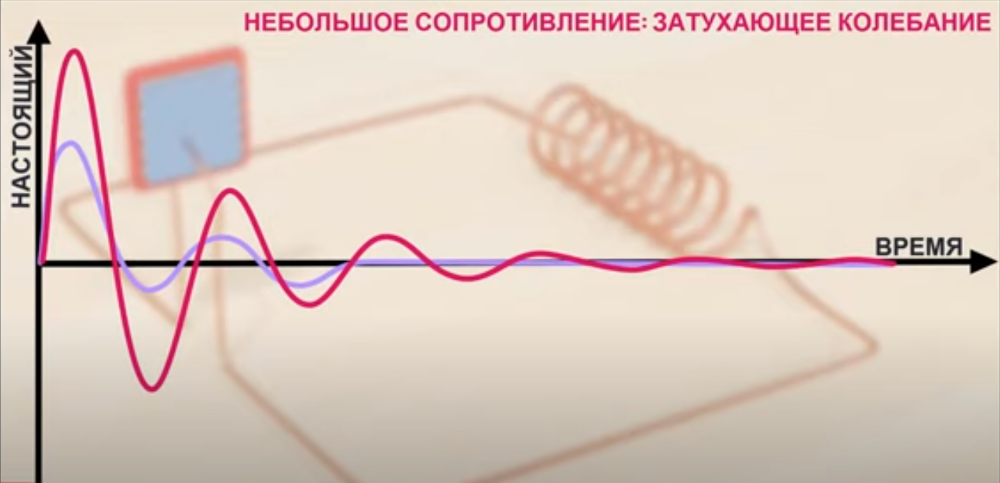

# Затухающие колебания RLC цепи

**Что будет, если подать DC на параллельный RLC-контур?**
- **Кратковременный переходный процесс**:  
  При подключении батарейки контур выдаст **затухающие колебания** (как колокольчик):  
  
  $U(t) = U_0 \cdot e^{-\frac{R}{2L}t} \cdot \cos(\omega t)$
    
  где $ \omega = \sqrt{\frac{1}{LC} - \left(\frac{R}{2L}\right)^2} $   
- **Через ~1 мс** колебания исчезнут, и система придёт в равновесие  

---

### Уравнение затухающих колебаний
Напряжение на контуре описывается формулой:
 
$U(t) = U_0 \cdot e^{-\delta t} \cdot \cos(\omega t)$
 
где:
- $ U_0 $ — начальное напряжение (например, 9 В от батарейки),
- $ \delta = \frac{R}{2L} $ — коэффициент затухания,
- $ \omega = \sqrt{\omega_0^2 - \delta^2} $ — частота затухающих колебаний,
- $ \omega_0 = \frac{1}{\sqrt{LC}} $ — резонансная частота контура.

### Как долго будут длиться колебания?
Время затухания зависит от **добротности контура** $ Q $:

Последовательный RLC-контур: 
$Q = \frac{\omega_0 L}{R} = \frac{1}{R} \sqrt{\frac{L}{C}}$
 
Параллельный RLC-контур: 
$Q = R \sqrt{\frac{C}{L}}$

Затухающие колебания - чем больше $ Q $, тем дольше колебания, при Q>0.5. Сигнал затухает медленнее, так как энергия перекачивается между L и C.

Апериодический процесс - плавный разряд без колебаний, при Q<0.5. Не имеют частоты в классическом смысле (нет периодичности), так как энергия рассеивается без возврата в контур.

**Коэффициент затухания $ \alpha $:**  
   - Последовательный RLC-контур:  $\alpha = \frac{R}{2L}$
     
   - Параллельный RLC-контур:  $\alpha = \frac{1}{2RC}$

**Практическое правило**:  
Колебания считаются затухшими, когда их амплитуда падает в $ e $ раз (~37% от начальной).  
Время затухания до этого уровня:
 
$t_{\text{затухания}} \approx \frac{2Q}{\omega_0}$
 

### Как улучшить затухающие колебания?
Если хотите продлить колебания:
1. **Увеличьте добротность $ Q $**:
   - Уменьшите $ R $ (идеально — сверхпроводник!)
   - Увеличьте $ L $ или уменьшите $ C $
2. **Используйте активную схему** (например, отрицательное сопротивление на транзисторе).

---

### Высокочастотные затухающие колебания с хорошей добротностью
Чтобы увеличить частоту колебаний **при $Q > 0.5 $**:
1. **Уменьшайте $ L $ и $ C $**, чтобы повысить $ \omega_0 $  
2. **Подбирайте $ R $** так, чтобы сохранить $ Q > 0.5 $:  
   - Для **последовательного RLC** — уменьшайте $ R$  
   - Для **параллельного RLC** — увеличивайте $R$  

---

### Пример, параллельный контур RLC с колебательными затухающими сигналами
- $U_0=5\ V$
- $L=1\ H$
- $C=150\ uF = 0.00015\ F$
- $R=100\ Om$

1. Определение типа процесса (колебательный или апериодический)

    $Q = R \sqrt{\frac{C}{L}}=100\cdot \sqrt{\frac{0.00015}{1}}=1.225$

    Так как Q>0.5, процесс колебательный с затуханием.

2. Расчёт параметров затухающих колебаний

    - Собственная частота контура (без затухания):  
    
        $\omega_0 = \frac{1}{\sqrt{LC}} = \frac{1}{\sqrt{1 \cdot 0.00015}} \approx \frac{1}{0.01225} \approx 81.65 \, \text{рад/с}$
    
    - Коэффициент затухания:  
    
        $\alpha = \frac{1}{2RC} = \frac{1}{2 \cdot 100 \cdot 0.00015} = \frac{1}{0.03} \approx 33.33 \, \text{рад/с}$
        
    - Частота затухающих колебаний:  
    
        $\omega_d = \sqrt{\omega_0^2 - \alpha^2} = \sqrt{81.65^2 - 33.33^2} \approx 74.54 \, \text{рад/с}$
    
    **Частота колебаний**: $\omega_d \approx 74.54 \, \text{рад/с} $ ($ f_d \approx 11.86 \, \text{Гц} $)  

    **Время затухания**: $\tau = \frac{1}{\alpha} \approx 0.03 \, \text{с} $

    **Проверка добротности**: $Q = \frac{\omega_0}{2\alpha} = \frac{81.65}{2 \times 33.33} \approx 1.225 \quad (\text{совпадает с расчётом выше})$

### Пример, параллельный контур RLC с апериодическими затухающими сигналами
- $U_0=5\ V$
- $L=1\ H$
- $C=15\ uF = 0.000015\ F$
- $R=100\ Om$

1. Определение типа процесса (колебательный или апериодический)

    $Q = R \sqrt{\frac{C}{L}}=100\cdot \sqrt{\frac{0.000015}{1}}=0.387$

    Так как Q<0.5, процесс апериодическими без колебаний (плавный разряд).

2. Расчёт параметров затухающих колебаний

    - Собственная частота контура (без затухания):  
    
        $\omega_0 = \frac{1}{\sqrt{LC}} = \frac{1}{\sqrt{1 \cdot 0.000015}} \approx \frac{1}{0.01225} \approx 258.2 \, \text{рад/с}$
    
    - Коэффициент затухания:  
    
        $\alpha = \frac{1}{2RC} = \frac{1}{2 \cdot 100 \cdot 0.000015} = \frac{1}{0.03} \approx 333.33 \, \text{рад/с}$
        
    - Частота затухающих колебаний:  
    
        $\omega_d = \sqrt{\omega_0^2 - \alpha^2} = \sqrt{258.2^2 - 333.33^2} \approx 210.8 \, \text{рад/с}$
    
    **Частота колебаний**: $\omega_d \approx 210.8 \, \text{рад/с} $ ($ f_d \approx 33.550\, \text{Гц} $)  

    **Время затухания**: $\tau = \frac{1}{\alpha} \approx 0.003 \, \text{с} $

    **Проверка добротности**: $Q = \frac{\omega_0}{2\alpha} = \frac{258.2}{2 \times 333.33} \approx 0.3873 \quad (\text{совпадает с расчётом выше})$    

### Пример, параллельный контур RLC подбор частоты с максимальным временем затухания 

**Цель:**  
- Резонансная частота $ f_0 = 1 \, \text{МГц}$ ($\omega_0 = 2\pi \times 10^6 \, \text{рад/с}$)  
- Максимальное время затухания (максимальная добротность $ Q $)  
- Режим **колебательный** ($Q > 0.5$) 

Последовательный RLC не подходит для долгих затуханий на 1 МГц (нужны огромные L и крошечные C)

Чтобы **увеличить время затухания $ \tau $** нужно:  
- **Минимизировать $\alpha $** (чем меньше затухание, тем дольше колебания) 
- **Максимизировать $Q $** (чем выше добротность, тем медленнее затухание)

**Нужно:**  
- **Увеличивать $R$** (чем больше $ R $, тем меньше потери)
- **Увеличивать $C$** (но это снижает $\omega_0 $, поэтому $L$ надо уменьшать)

**Основные формулы**  

1. Резонансная частота:  
   
   $\omega_0 = \frac{1}{\sqrt{LC}}$
   
2. Добротность $ Q $:  
    
    $Q = R \sqrt{\frac{C}{L}}$
      
3. Коэффициент затухания $ \alpha $: 
   
    $\alpha = \frac{1}{2RC}$
     
4. Время затухания (до уровня $ e^{-1} $):
  
   $\tau = \frac{1}{\alpha}$
     

1. Выбираем **максимально возможную $ C $** (чтобы увеличить $ \tau = 2RC $).  
   - Пусть $ C = 1 \, \text{нФ} $.  
2. Рассчитываем $ L $:  
   
   $L = \frac{1}{\omega_0^2 C} = \frac{1}{(6.28 \times 10^6)^2 \times 10^{-9}}} \approx 2.53 \, \text{мкГн}$
   
3. Подбираем $ R $ для $ Q > 0.5 $:  
   
   $Q = R \sqrt{\frac{C}{L}} > 0.5 \implies R > 0.5 \sqrt{\frac{2.53 \times 10^{-6}}{10^{-9}}} \approx 796 \, \text{Ом}$
    
   Берём $ R = 10 \, \text{кОм} $, тогда:  
   
   $Q \approx 6.25 \quad (\text{хорошая добротность})$
    
4. Время затухания:  
    
   $\tau = 2RC = 2 \times 10^4 \times 10^{-9} = 20 \, \text{мкс}$
     
   (Уже лучше, но можно увеличить).  

5. Увеличиваем $ C $ дальше:  
   - Пусть $ C = 10 \, \text{нФ} $, тогда $ L = 253 \, \text{нГн} $.  
   - $ R > 0.5 \sqrt{\frac{253 \times 10^{-9}}{10^{-8}}} \approx 251 \, \text{Ом} $.  
   - Берём $ R = 100 \, \text{кОм} $, тогда $ Q \approx 19.9 $.  
   - Время затухания:  
     
    $\tau = 2 \times 10^5 \times 10^{-8} = 2 \, \text{мс}$
      
     (Отличный результат!)  
 
**4. Оптимальные параметры для $ f_0 = 1 \, \text{МГц} $ и максимального $ \tau $**  
| Параметр       | Значение            |
|----------------|---------------------|
| Контур         | **Параллельный RLC** |
| Ёмкость $ C $ | $ 10 \, \text{нФ} $ |
| Индуктивность $ L $ | $ 253 \, \text{нГн} $ |
| Сопротивление $ R $ | $ 100 \, \text{кОм} $ |
| Добротность $ Q $ | $ \approx 20 $ |
| Время затухания $ \tau $ | $ 2 \, \text{мс} $ |
