# RLC-цепи

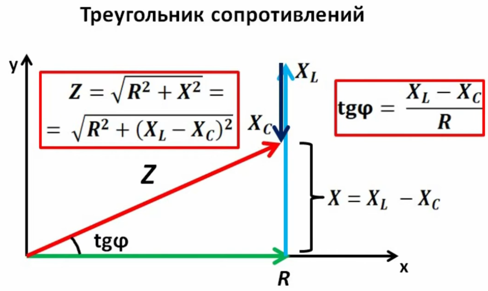

## Последовательный RLC-контур

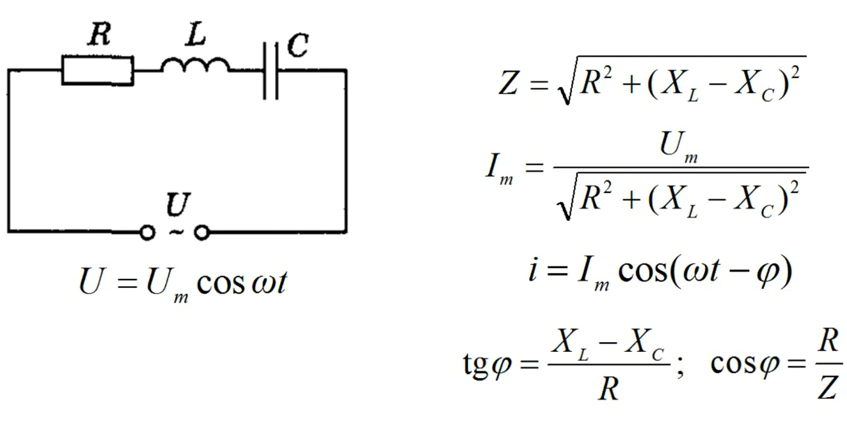

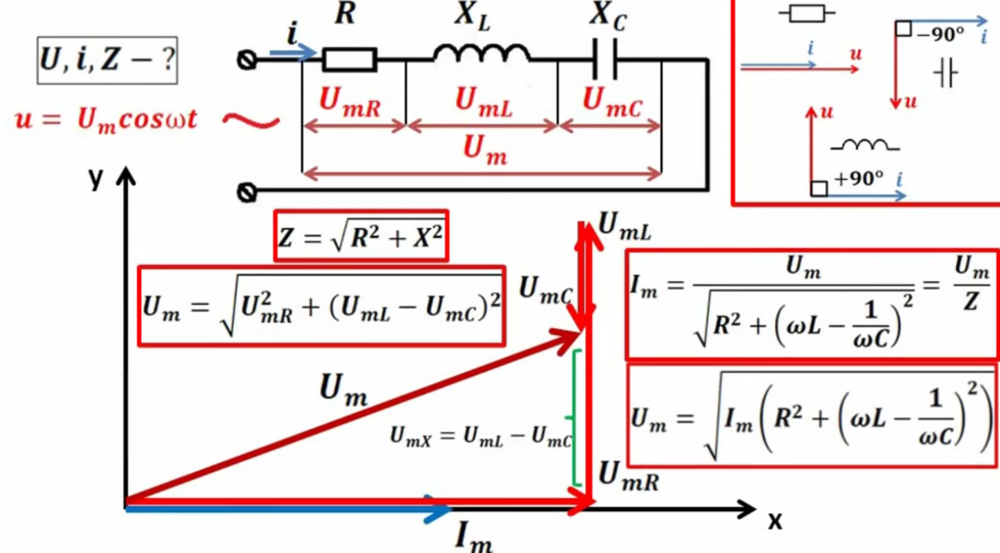

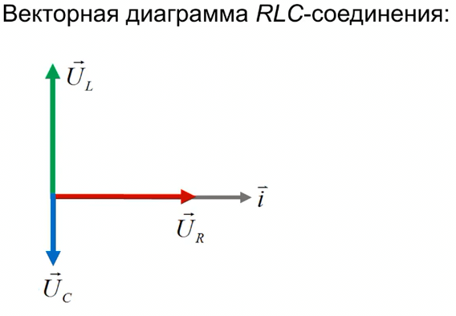

Векторная диаграмма используется для нахождения угла сдвига фаз $ \varphi $, а для расчетов модуля используют формулы.

1. Вектор напряжения резистора $U_R$ совпадает по фазе с вектором тока
2. Вектор напряжения катушки $U_L$ опережает вектор тока на $\pi/2$ т.е. $90^\circ$
3. Вектор напряжения конденсатора $U_C$ отстает от вектора тока на $\pi/2$ т.е. $90^\circ$

Почему вектор напряжения емкости короче вектора катушки в последовательной RLC цепи?

В последовательной RLC-цепи длины векторов напряжений (напряжения на резисторе $U_R $, катушке индуктивности $ U_L $ и конденсаторе $ U_C $) зависят от реактивных сопротивлений $X_L $ и $X_C $, а также от амплитуды тока в цепи.  
 Всегда ли напряжение на емкости меньше, чем на катушке?  
Нет, это зависит от частоты:  
- **При низкой частоте** $ X_C > X_L $ → $ U_C > U_L $ 
- **При высокой частоте** $ X_L > X_C $ → $ U_L > U_C $  
- **На резонансной частоте** $ X_L = X_C $, и $ U_L = U_C $  

Таким образом, вектор напряжения на емкости будет короче, чем на катушке **только при частотах выше резонансной**.

Для сложения (так как элементы цепи последовательны) векторов напряжений, необходимо создать из них параллелограмм, для этого создадим вектор из суммы противоположно направленных векторов $U_L+U_C$ и после воспользуемся правилом параллелограмма для сложения векторов суммы $U_L+U_C$ и $U_R$ для получения вектора напряжения $U$

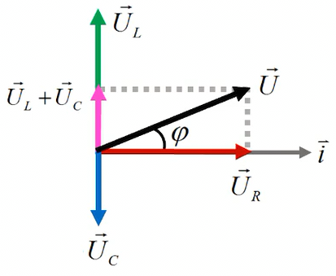

Модуль сложения векторов напряжений т.е. величина (абсолютное значение):
- $U_{ампл}=\sqrt{U²_{ампл\ R} + (U_{ампл\ L} - U_{ампл\ C} )²} = \sqrt{I²_{ампл}R + (I_{ампл}X_L - I_{ампл}X_C )²}$

Сдвиг фаз $ \varphi $ между вектором напряжения и тока:
- $U=U_{ампл} \cos \omega t$

Мгновенное значение силы тока в цепи:
- $i=I_{ампл} \cos (\omega t - \varphi)$

Полное сопротивление:
- $Z=\frac{U_{ампл}}{I_{ампл}}=\sqrt{R² + (X_L - X_C)²}$

Закон Ома для цепи переменного тока:
- $I_{ампл}=\frac{U_{ампл}}{Z}=\frac{U_{ампл}}{\sqrt{R² + (X_L - X_C)²}}$

Определение угла $ \varphi $:

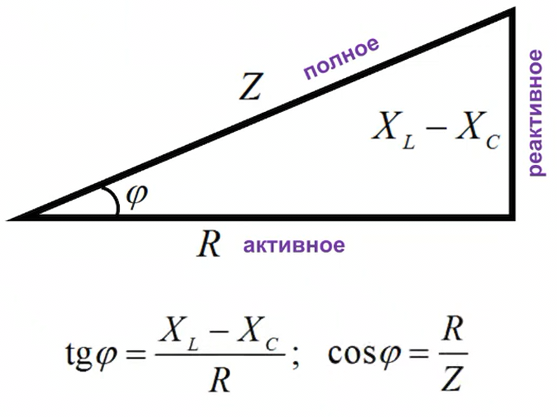

**Пример расчета цепи:**
- Источник переменного напряжения 
  - $U_{ампл}=5\ V$ ($U_{действ}=3.535534\ V$) 
  - частотой $f=50\ Hz$ 
- Резистор $R=1\ Om$
- Конденсатор $C=1\ mF\ =0.001\ F$
- Катушка индуктивности $L=1\ mH = 0.001\ H $

1. $\omega = 2 \pi f \approx 314\ рад/с$

1. Находим емкостное сопротивление конденсатора: 
    $X_C=\frac{1}{\omega C}=\frac{1}{314 \cdot 0.001}= 3.19\ Om $

1. Находим индуктивное сопротивление катушки: 
    $X_L=\omega \cdot L= 314 \cdot 0.001 = 0.31\ Om $

1. Находим полное сопротивления (геометрически складываем): 
    $Z=\sqrt{R² + (X_L - X_C)²}=\sqrt{1² + (0.31 - 3.19)²}\approx 3.05\ Om $

1. Находим действующий ток: 
    $I_{дейст} = \frac{U_{дейст}}{ Z} = \frac{I_{ампл}}{ \sqrt{2}} = \frac{1.64}{\sqrt{2}} = 1.16\ A$

1. Находим амплитудный ток по закону Ома для цепи переменного тока: 
    $I_{ампл}=\frac{U_{ампл}}{Z}=\frac{5}{3.05}=1.66\ A$

1. Угол фазового сдвига ($\varphi$): 
    $\varphi = \arctan{\frac{X_L - X_C}{R}}=\arctan{\frac{0.314 - 3.18}{1}}=\arctan{(-2.866)} \approx -70.6^\circ $

1. Напряжения на элементах, действующее: 
    - $U_R = I_{дейст} \cdot R = 1.16 \cdot 1 = 1.16\ V$

    - $U_L = I_{дейст} \cdot X_L = 1.16 \cdot 0.314 = 0.364\ V$
    
    - $U_C = I_{дейст} \cdot X_C = 1.16 \cdot 3.18 = 3.68\ V$

1. Проверим расчеты действующего напряжения:
    - $U_{дейст}=\sqrt{U²_{дейст\ R} + (U_{дейст\ L} - U_{дейст\ C} )²} = \sqrt{1.16² + (0.364 - 3.68 )²}\approx 3.53\ V$
    - $U_{ампл}=U_{дейст}\cdot \sqrt{2}=5\ V$

1. Мгновенное значение силы тока в цепи: 
    - $\varphi = -70.6^\circ = -1.23 \text{ рад}$
    - $i(t)=I_{ампл} \cos (\omega t - \varphi) = 1.64 \cos(314.16 t -1.23)$

1. Резонансная частота: 
    Нулевой сдвиг по фазе означает, что напряжение и ток в цепи синфазны, то есть достигают своих максимальных и минимальных значений одновременно. Это происходит, когда цепь работает на резонансной частоте.  
    Для последовательного контура $Z=R$ на резонансной частоте импеданс цепи минимален, поэтому ток достигает максимума.
    Для параллельного контура, импеданс максимален и полная проводимость минимальна $Y=\frac{1}{R}$, а значит, общий ток из источника минимален.  
    Максимальный коэффициент мощности при резонансе $\varphi=0^\circ$, значит: $\cos (\varphi) = 1$ это означает, что вся подведённая мощность идёт в нагрузку.  
    Резонанс в последовательной RLC-цепи возникает, когда индуктивное и емкостное сопротивления равны:  
    - $X_L = X_C$
    - $f_0 = \frac{1}{2\pi \sqrt{L\cdot C}}=\frac{1}{2\pi \sqrt{0.001\cdot 0.001}}\approx 159.15\ Hz$

1. Коэффициент добротности:  
    - $Q = \frac{X_L}{R} = \frac{X_C}{R}= \frac{X_C}{R} = \frac{\omega_0 L}{R} = \frac{1}{\omega_0 C R}$

    - Угловая резонансная частота:
        - $\omega_0 = 2\pi f_0 = 2\pi \cdot 159.15 = 1000 \text{ рад/с}$
    - $Q = \frac{1000 \cdot 0.001}{1} = 1$
        - Коэффициент добротности $Q$ = 1 (это низкая добротность, значит, затухание в контуре довольно сильное)

1. Энергия в катушке и конденсаторе: 
    - В катушке: $ W_L = \frac{1}{2} L\cdot I_{ампл}^2 = \frac{1}{2} \cdot 0.001 \cdot 1.66^2 = 0.00137 \text{ Дж}$
    - В конденсаторе: 
        - $U_{C\ ампл}=U_{C\ дейст}\cdot \sqrt{2}=3.68\cdot \sqrt{2} = 5.2\ V $
        - $W_C = \frac{1}{2} C\cdot U_{C\ ампл}^2  =\frac{1}{2} \cdot 0.001 \cdot 5.2^2 = 0.0135 \text{ Дж}$

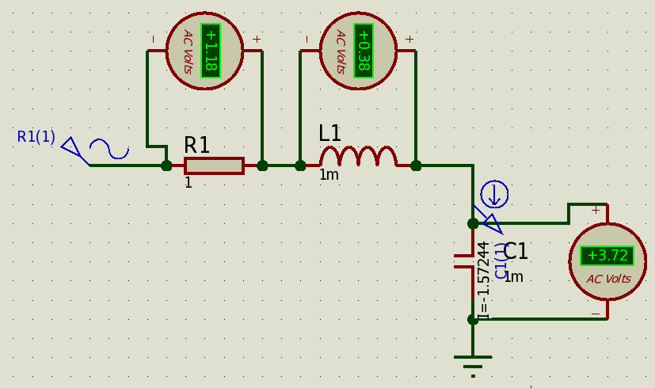

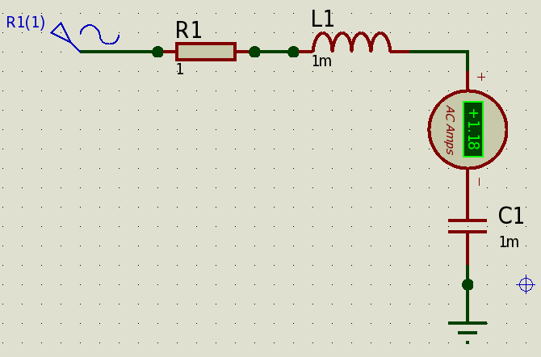

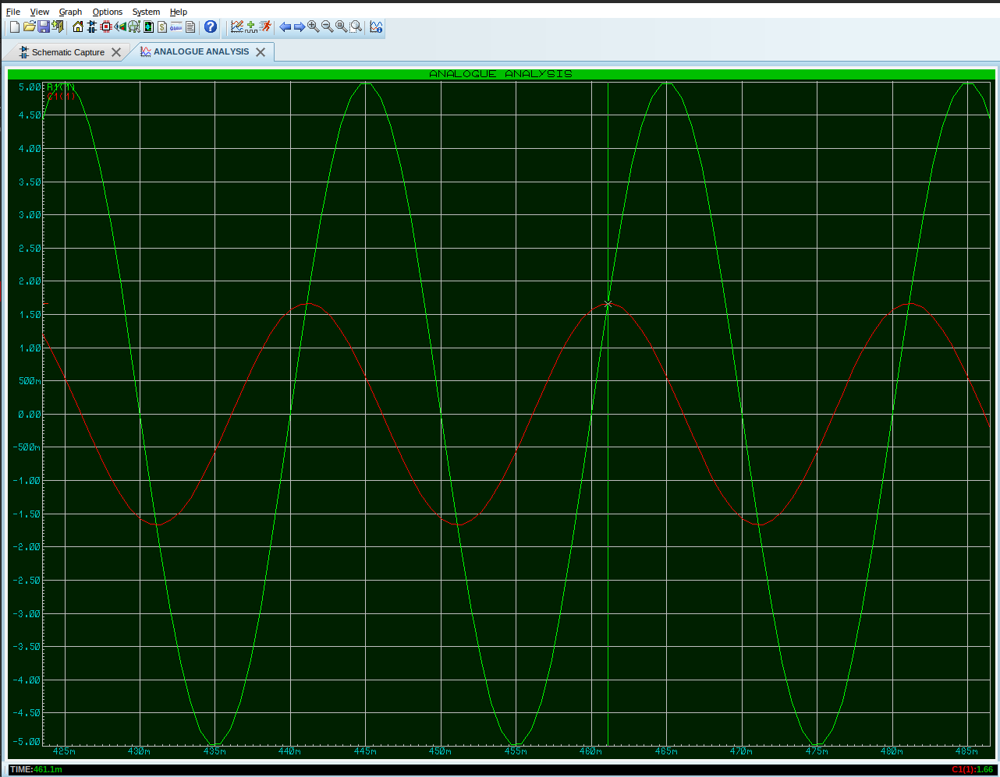

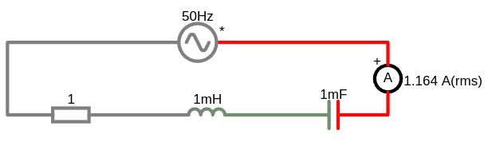

<a href="/theories_of_electrical_circuits/falstad/circuitjs-96.txt" download="circuitjs-96.txt">Скачать схему для www.falstad.com/circuit</a>

## Параллельный RLC-контур

**Пример расчета цепи:**
- Источник переменного напряжения 
  - $U_{ампл}=5\ V$ ($U_{действ}=3.535534\ V$) 
  - частотой $f=50\ Hz$ 
- Резистор $R=1\ Om$
- Конденсатор $C=1\ mF\ =0.001\ F$
- Катушка индуктивности $L=1\ mH = 0.001\ H $

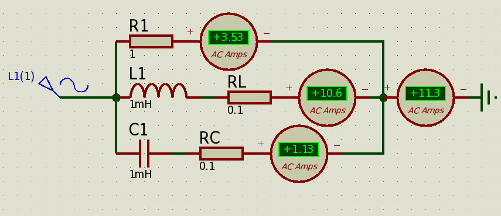
Амперметры меряют rms т.е. действующее значение

 https://youtu.be/1udb_NmPLJw?t=1514

1. Емкостное сопротивление: 

    $X_C = \frac{1}{2\pi f\cdot C} = \frac{1}{2\pi \cdot 50 \cdot 0.001} = 3.1831\ Om$

1. Индуктивное сопротивление: 

    $X_L = 2\pi f L = 2\pi \cdot 50 \cdot 0.001 = 0.314159265\ Om$

1. Находим полное сопротивления 

    Полное сопротивление $ Z $ в параллельной цепи вычисляется через **полную проводимость $ Y $**:  

    $Y = \sqrt{G^2 + (B_L - B_C)^2}$

    где:  
    - $ G = \frac{1}{R} $ — проводимость резистора 
    - $B_L = \frac{1}{X_L} $ — индуктивная проводимость
    - $B_C = \frac{1}{X_C} $ — ёмкостная проводимость

    Вычислим проводимости 
    - $G = \frac{1}{R} = \frac{1}{1} = 1 \text{ См}$
    - $B_L = \frac{1}{X_L} = \frac{1}{0.314} \approx 3.18 \text{ См}$
    - $B_C = \frac{1}{X_C} = \frac{1}{3.18} \approx 0.314 \text{ См}$

    Так как $ B_L $ и $ B_C $ имеют **противоположные знаки**, их разность:
    - $B_{\text{total}} = B_L - B_C = 3.18 - 0.314 = 2.866 \text{ См}$

    Теперь найдём полную проводимость:
    - $Y = \sqrt{G^2 + B_{\text{total}}^2}= \sqrt{1^2 + 2.866^2} = \sqrt{1 + 8.22} \approx 3.04 \text{ См}$

    Полное сопротивление:
    - $Z = \frac{1}{Y} = \frac{1}{3.04} \approx 0.33Ω$

    **Цепь активно-индуктивного характера**, так как $ B_L > B_C $

1. Ток через резистор (по закону Ома): 
    $I_{R\ ампл} = \frac{U_{ампл}}{R} = \frac{5}{1} = 5A$ 
      - ($I_{R\ действ} = \frac{U_{действ}}{R} = \frac{3.535534}{1} = 3.53\ A$)

1. Ток через катушку (по закону Ома для индуктивного сопротивления): 
    $I_{L\ ампл} = \frac{U_{ампл}}{X_L} = \frac{5}{0.314} \approx 15.9154\ A$ (Отстаёт по фазе на **90°** от напряжения)
      - $I_{L\ действ} = \frac{U_{действ}}{X_L} = \frac{3.535534}{0.314159265} = 11.25\ A $

1. Ток через конденсатор (по закону Ома для ёмкостного сопротивления): 
    $I_{C\ ампл} = \frac{U_{ампл}}{X_C} = \frac{5}{3.1831} \approx 1.5708\ A$ (Опережает по фазе на **90°**)
      - $I_{C\ действ} = \frac{U_{действ}}{X_C} = \frac{3.535534}{3.1831} = 1.11\ A $

1. Полный амплитудный ток в цепи: 
    Так как $ I_L $ и $ I_C $ сдвинуты по фазе на 180° (противоположны), их результирующий ток:  
    $I_{LC} = I_L - I_C = 15.92 - 1.57 = 14.3446\ A$ (Так как цепь **индуктивная**, ток через катушку больше тока через конденсатор.)  

    Теперь найдём общий ток по теореме Пифагора: 
    $I_{ампл} = \sqrt{I_R^2 + I_{LC}^2} = \sqrt{5^2 + 14.3446^2} \approx 15.19\ A$
      - $I_{действ}=\frac{I_{ампл}}{\sqrt{2}} \approx 10.75\ A$

    Проверим расчет амплитудного тока: 
    $U_{ампл}=I_{ампл}\cdot Z=15.19\cdot 0.33 = 5\ V$

1. Фазовый угол $\varphi $: 
$\varphi = \arctan \frac{I_{LC}}{I_R}= \arctan \frac{14.35}{5} \approx 70.6^\circ =1.23\ радиан$

 

1. Мгновенное значение тока: 
$i(t) = I_{max} \cos(\omega t + \varphi) = 21.5 \cos(314.16 t + 1.23)$

1. Добротность параллельного RLC-контура ($ Q $): 
$Q = R \sqrt{\frac{C}{L}} = 1 \cdot \sqrt{\frac{0.001}{0.001}} = 1$ (это низкая добротность, значит, затухание в контуре довольно сильное)

1. Резонансная частота: 
    Нулевой сдвиг по фазе означает, что напряжение и ток в цепи синфазны, то есть достигают своих максимальных и минимальных значений одновременно. Это происходит, когда цепь работает на резонансной частоте.  
    Для последовательного контура $Z=R$ на резонансной частоте импеданс цепи минимален, поэтому ток достигает максимума.
    Для параллельного контура, импеданс максимален и полная проводимость минимальна $Y=\frac{1}{R}$, а значит, общий ток из источника минимален.  
    Максимальный коэффициент мощности при резонансе $\varphi=0^\circ$, значит: $\cos (\varphi) = 1$ это означает, что вся подведённая мощность идёт в нагрузку.  
    Резонанс в последовательной RLC-цепи возникает, когда индуктивное и емкостное сопротивления равны:  
    - $X_L = X_C$
    - $f_0 = \frac{1}{2 \pi \sqrt{L\cdot C}}=\frac{1}{2 \pi \sqrt{0.001 \cdot 0.001}} \approx 159.15 \, \text{Гц}$

1. Полоса пропускания: 
$\Delta f = \frac{f_0}{Q}=\frac{159.15}{1} = 159.15 \, \text{Гц}$

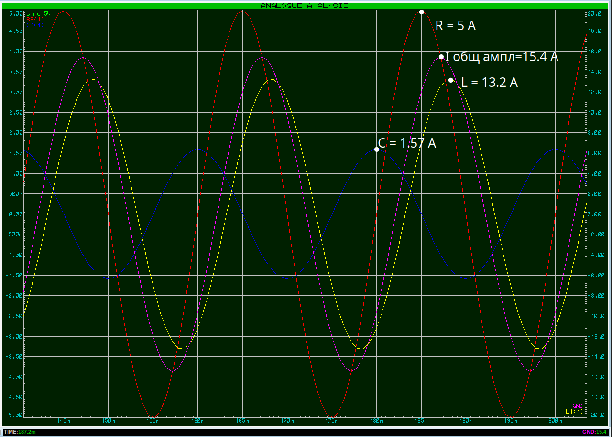

