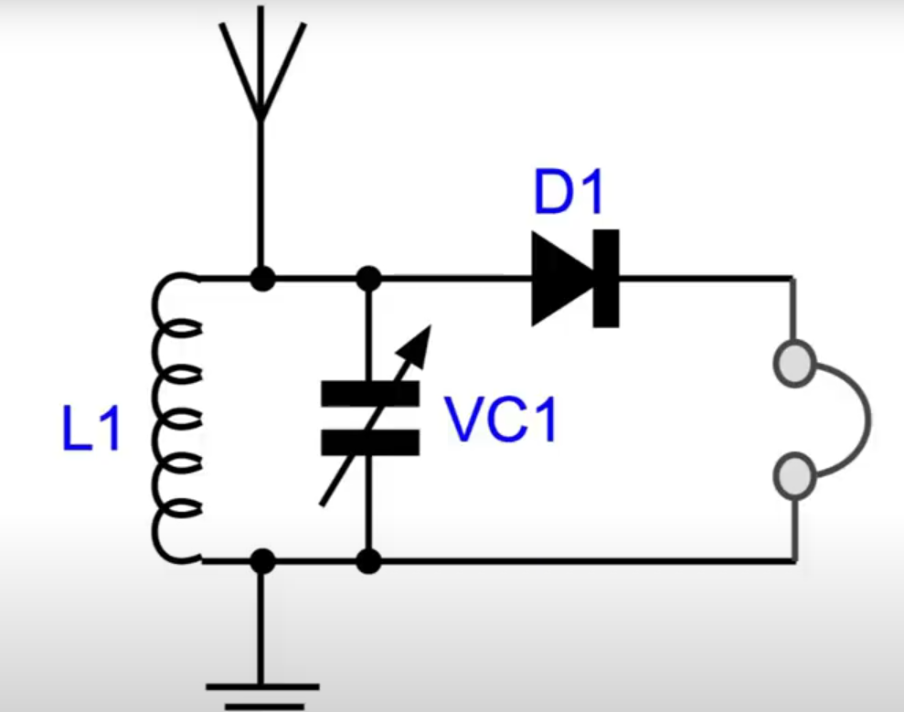

Попробуйте собрать схему — это лучший способ понять, как радиоволны превращаются в музыку! 📡🎶

С таким радио вы **увидите резонанс в действии**: поворачивая конденсатор, найдёте станцию, где сигнал станет громким. Это отличный способ понять, как работают RLC-цепи в реальной жизни! 

Чтобы сделать простейшее **радио** (crystal radio receiver), использующее резонансный контур для настройки на нужную частоту, вам понадобятся базовые компоненты и понимание принципов работы [RLC-цепи](/theories_of_electrical_circuits/lessons/95.html).  


**1. Простейшее радио (детекторный приёмник)**
- Источник энергии: сама радиоволна (не требует батареек/розетки)
- Как:
  - Антенна ловит электромагнитные волны → в контуре возникает переменный ток → диод выпрямляет его → наушники звучат
  - Максимум можно получить ~1-2 мВт (тихий звук в высокоомных наушниках)

**2. Радио с усилителем**
- Источник: батарейка 3-9V
- Как:
  - Антенна + RLC-контур как в п.1 → усилитель на транзисторе → обычные наушники
  - Даёт громкий звук, но требует питания

**3. Лабораторный эксперимент с резонансом**
- Источник: генератор сигналов (питание от батареи/блока)
- Как:
  - Генератор подаёт переменное напряжение → RLC-контур резонирует → осциллограф показывает пик
  - Частота генератора должна совпадать с f₀=1/(2π√LC)

**Важно!** Сеть 220V для таких экспериментов не нужна и опасна. Хватит батареек или энергии эфира.


---

## 1. [Простейшее радио (детекторный приёмник)](https://www.youtube.com/watch?v=U1uzY5g8NgY&t=1341s)



### **1. Основные компоненты**
1. **Резонансный контур (RLC)**:
   - **Катушка индуктивности (L)**: Например, 50–100 мкГн (Лучше переменную индуктивность, можно намотать провод на ферритовый стержень).
   - **Конденсатор переменной ёмкости (C)**: 10–500 пФ (Для настройки частоты нужна переменная емкость).
   - **Резистор (R)**: 1–10 кОм (для демпфирования, если нужно).

2. **Антенна**: Провод длиной 1–10 м (чем длиннее, тем лучше приём). Если антенна короче 1–2 м, сигнал будет слишком слабым.

3. **Детектор (диод)**: Диод с низким прямым падением напряжения Forward voltage (Vf). 
  - Германиевые диоды: Они обладают самым низким прямым падением напряжения (около 0.2-0.3 В). Примерами являются Д9, Д2, Д311, а также зарубежные аналоги типа 1N34A.
  - Диоды Шоттки: BAT54 кремний Диод Шоттки 30В 200мА [SOT-23-3] его прямое падение напряжения (Vf) обычно составляет от 0.3 В до 0.5 В при малых токах (например, 1 мА - 30 мА).
  - Почему другие типы диодов менее подходят: Имеют более высокое прямое падение напряжения (около 0.6-0.7 В), что может привести к потере слабых сигналов при детектировании.

    <details>

    <summary>лезвие бритвы с грифелем от карандаша</summary>

      Использование обгоревшего лезвия бритвы с грифелем от карандаша в качестве детектора радиосигналов - это **исторический и очень примитивный метод**, известный со времен раннего радио (начало XX века). Он основан на принципе работы **кристального детектора** или **когерера**.

    **Вот как это "работает" (очень упрощенно):**

    * **Грифель карандаша (графит):** Обладает полупроводниковыми свойствами (хотя и очень слабыми).
    * **Обгоревшее лезвие бритвы:** На его поверхности образуется тонкий слой оксида металла, который также обладает нелинейной проводимостью.
    * **Контакт:** При легком контакте между графитом и оксидной пленкой лезвия образуется очень несовершенный и нестабильный полупроводниковый переход, способный пропускать ток преимущественно в одном направлении (хотя и очень слабо).

    **Почему это может "работать" для слабого сигнала:**

    * **Низкий "порог" проводимости:** Этот примитивный "диод" может начать пропускать ток при очень малых напряжениях, что теоретически позволяет детектировать очень слабые радиосигналы.

    **Однако у этого метода есть огромные недостатки:**

    * **Крайне нестабильный контакт:** Малейшая вибрация или изменение давления могут нарушить контакт и прекратить работу детектора.
    * **Низкая эффективность:** Эффективность такого детектора очень мала по сравнению с современными диодами. Он будет способен детектировать только относительно сильные радиостанции.
    * **Непредсказуемые характеристики:** Параметры такого "диода" (прямое падение напряжения, обратный ток и т.д.) будут очень нестабильными и непредсказуемыми.
    * **Сложность настройки:** Для достижения хоть какого-то результата необходимо очень тщательно подбирать точку контакта между грифелем и лезвием.

    **Почему это не является рекомендуемым или практичным способом в наше время:**

    * **Доступность современных полупроводниковых диодов:** В настоящее время германиевые и Шоттки диоды с низким прямым падением напряжения очень доступны и стоят недорого. Они обеспечивают гораздо более стабильную, эффективную и предсказуемую работу детектора.
    * **Низкая чувствительность:** Радиоприемник, использующий такой примитивный детектор, будет обладать крайне низкой чувствительностью и сможет принимать только очень мощные местные радиостанции (если вообще сможет).
    * **Ненадежность:** Конструкция крайне ненадежна и непрактична для повседневного использования.

    **Вывод:**

    Использование обгоревшего лезвия с грифелем от карандаша - это скорее **исторический курьез и демонстрация принципа работы первых радиодетекторов**, чем **практический или рекомендуемый способ** для создания радиоприемника в наше время.

    Если вы хотите построить рабочий радиоприемник, **настоятельно рекомендуется использовать современные полупроводниковые диоды** (германиевые или Шоттки) с низким прямым падением напряжения. Они обеспечат гораздо лучшую чувствительность, стабильность и надежность вашего приемника.

    Так что, хотя теоретически это может сработать в очень простых условиях и с сильным сигналом, на практике это не является разумной альтернативой современным диодам.

    ---

    </details>

4. **Наушники или усилитель**: Высокоомные наушники **Советские ТОН-2** (2000 Ом) или простой усилитель НЧ.

    Современные низкоомные наушники (32 Ом) **не подойдут** — для них нужен усилитель.

    Наушники должны быть высоомными, так как низкоомные, например динамик на 8 Ом, создают огромную нагрузку на контур → резонанс "затухнет", сигнал пропадёт.
    Обычные динамики (например, от колонок или смартфона) имеют низкое сопротивление (4–32 Ом) и требуют большей мощности, чем может дать детекторный приёмник без батареек. Если сопротивление маленькое то ток будет большим для слабого сигнала.

    Энергии радиоволн хватает только на микроватты (этого мало для движения тяжёлой мембраны динамика).

    Высокоомные наушники (2000–4000 Ом) работают от малых токов, так как их катушка тоньше и легче. 
    Можно использовать пьезоэлементы (например, из электронных часов) работают от малых токов.

5. **Заземление**: Подключение к радиатору или металлическому стержню в земле.
 


---

### Как это работает?
1. **Резонансный контур**:
   - На резонансной частоте $f_0 = \frac{1}{2\pi\sqrt{LC}}$ контур усиливает сигнал нужной радиостанции, подавляя остальные.
   - Поворачивая ротор переменного конденсатора, вы меняете ёмкость и настраиваетесь на разные частоты.

2. **Детектирование**:
   - Диод отсекает одну половину радиоволны (амплитудная модуляция), оставляя аудиосигнал.

3. **Звук**:
   - В наушниках слышен сигнал радиостанции.

---

### Пример расчёта резонансной частоты
Допустим, у вас:
- $ L = 100 \, \mu H = 0.0001 \, H $,
- $ C $ регулируется от 10 до 500 пФ.

**Диапазон частот**:
- Для $ C = 10 \, pF $:
 
  $f_0 = \frac{1}{2\pi\sqrt{0.0001 \cdot 10 \cdot 10^{-12}}} \approx 5.03 \, MHz \, (\text{диапазон СВ})$
  
- Для $ C = 500 \, pF $:
 
  $f_0 = \frac{1}{2\pi\sqrt{0.0001 \cdot 500 \cdot 10^{-12}}} \approx 0.71 \, MHz \, (\text{диапазон ДВ})$
 
 
**Что можно поймать?**

- В зависимости от антенны и местоположения:
  - **ДВ (150–450 кГц)**: Радиостанции дальнего действия.
  - **СВ (520–1600 кГц)**: Местные AM-станции.
  - **КВ (3–30 МГц)**: Международные станции (нужна хорошая антенна).
 
---

 
Для простейшего радиоприёмника **не нужен внешний источник энергии** вроде сети 220 В или батареек. Такое радио работает за счёт энергии самой радиоволны! 

Вот как это происходит:

**1. Откуда берётся энергия?**
- **Радиоволны** от передающих станций несут не только информацию, но и **электромагнитную энергию**.  
- Антенна улавливает эту энергию, а резонансный контур усиливает сигнал нужной частоты.  
- Диод и наушники преобразуют энергию радиоволны в звук — это и есть **радиоприёмник с нулевым питанием** (известный как «детекторный приёмник» или «кристадин»).
 

**2. Почему не нужна розетка?**
- Мощности радиоволн достаточно для работы высокоомных наушников (2000–4000 Ом), но звук будет тихим.  
- Если станция близко (например, в городе), сигнал будет громче.  
- Для усиления звука можно добавить **усилитель на батарейках** (см. ниже).

---

### Что делать, если сигнал слабый?
Если хочется громкого звука, добавьте **усилитель НЧ с питанием** (simple transistor radio amplifier):
- **Усилитель НЧ**: Без усилителя слышны только мощные станции. Добавьте транзисторный усилитель (например, на BC547), чтобы громче слышать слабые станции.
- **Добавочная катушка**: Увеличьте индуктивность для приёма более длинных волн.
- **Фильтрация**: Добавьте конденсатор (0.01–0.1 мкФ) параллельно наушникам, чтобы сгладить сигнал.
- **Батарейка 9 В** + простой транзисторный усилитель (например, на транзисторе BC547).  
- **Схема усилителя** (минимальный вариант):
   ```
   Антенна → RLC-контур → Диод → Усилитель (транзистор + батарейка) → Наушники
   ```
 

 
  