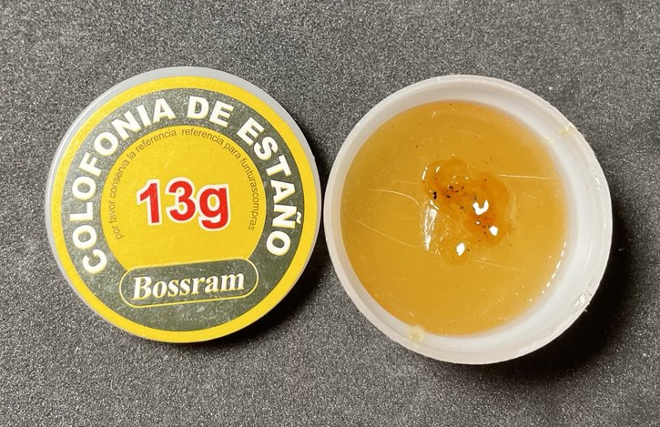
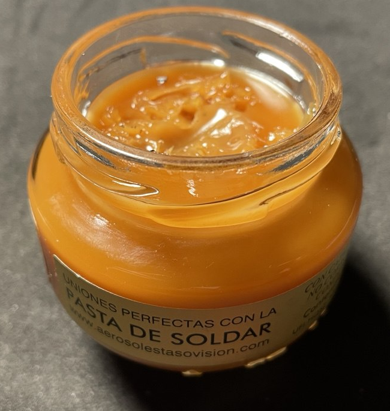
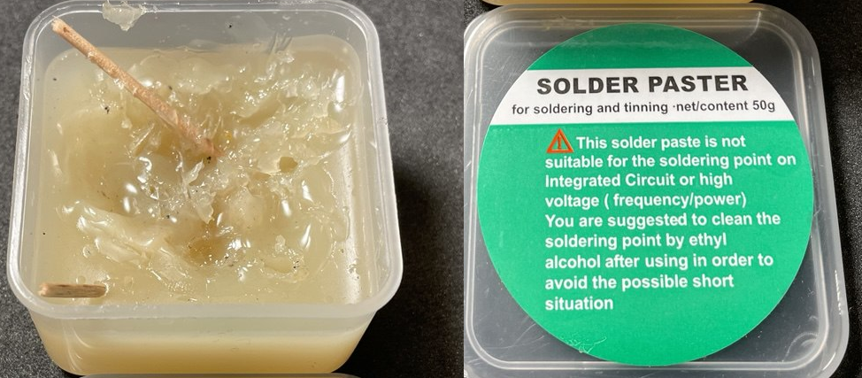
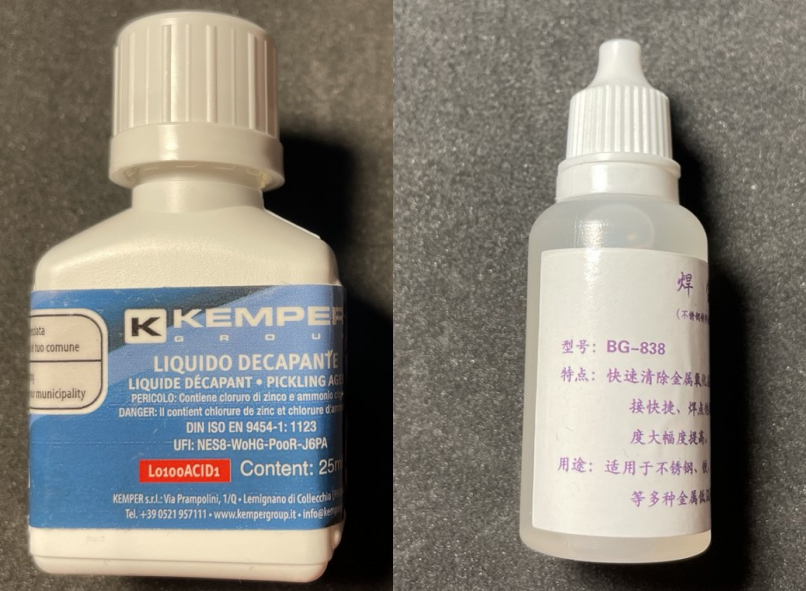
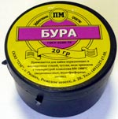
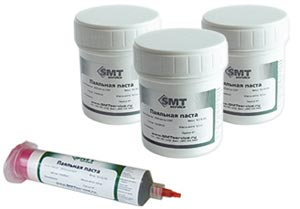

# Химия

- Канифольный флюс (Colofonia de Estaño)
- Универсальная паяльная паста
- Грубый флюс
- Кислотный флюс
- Бура
- Оксидал
- Цапонлак


```admonish warning
Тестировать:
- Нейтральный флюс (например, no-clean или водосмываемые) - безотмывочный (No-Clean) гелеобразный флюс
- Сплав Розе или Вуда
- Фулюс Flux-Plus гелевый флюс
```

Фолюс нужен для сцепления припоя,он удаляет окислы с поверхности металлов, тем самым улучшая смачиваемость припоем.

Есть активные (ортофосфорная кислота) и не активные флюсы (канифоль). Имеют агрегатные состояния - твердые, жидкие и пастообразные формы.

Не активные флюсы, такие как канифоль, активно разьедают окислы металла только в жиком расплавленном виде, но после остывания перестают влиять на металл, в отличии от активных флюсов, которые надо смывать спиртом иначе они будут разьедать все металлы (радиодетали можно очистить от кислоты раствором соды и после мыльным раствором).

```admonish info
Флюс для SMD-пайки – это специальный состав, используемый для пайки компонентов поверхностного монтажа (SMD), обеспечивающий хорошее смачивание припоем и предотвращающий образование окислов. 
Примеры: 
- Для пайки паяльником: No-Clean или Rosin-Based. 
- Для паяльной пасты и трафаретной пайки: Гелеобразный флюс (Flux Gel). 
- Для работы с окисленными платами: Водосмываемый флюс (Water-Soluble, ORH).  

Оптимальный вариант для большинства задач – безотмывочный (No-Clean) гелеобразный флюс.
```


## Канифольный флюс (Colofonia de Estaño)



Канифоль (colofonia) — это натуральная смола, часто используемая в качестве флюса для пайки. Предназначен для очистки и улучшения смачиваемости при пайке.

Это классический и безопасный флюс для работы с электроникой! 🔥

**Для чего она нужна?**  
* Очищает поверхность от окислов – помогает припою лучше прилипать к металлу.  
* Уменьшает поверхностное натяжение припоя – делает пайку более ровной и качественной.  
* Используется в электронике – безопасна для печатных плат и проводов.  

**Как использовать?**  
1. Нанести небольшое количество канифоли на место пайки.  
2. Нагреть паяльником, чтобы канифоль растопилась.  
3. Припаять провод или компонент.  

**Важно!**  
- Остатки канифоли **не обязательно смывать**, но если пайка критична (например, ВЧ-цепи), лучше удалить их спиртом.  
- Этот флюс **не подходит для нержавейки, никеля, алюминия** – для них нужны кислотные флюсы.  

---

## Универсальная паяльная паста



Ключевые свойства:
- Некоррозионный – не разъедает металлы после пайки.
- Непроводящий – остатки флюса не создают утечек тока.
- Каталитический состав – улучшает адгезию припоя 

Этот флюс – хороший вариант для ручной пайки проводов и крупных компонентов, но для точной работы с BGA или SMD-микросхемами стоит выбрать специализированную пасту (например, RMA- или no-clean-флюсы).

---

## Грубый флюс



Не подходит для пайки интегральных схем (микросхем) и высоковольтных/высокочастотных компонентов по нескольким причинам:

Почему не подходит для микросхем?
- Агрессивный флюс – возможно, содержит кислотные или коррозионные компоненты (например, хлориды, канифоль низкого качества), которые могут повредить тонкие дорожки и контакты микросхем.
- Низкая чистота состава – может оставлять остатки, которые трудно удалить, что приводит к утечкам тока или коррозии.
- Крупные частицы припоя – если паста содержит крупные гранулы олова, это может вызвать короткие замыкания между выводами микросхем (особенно в SMD-компонентах с мелким шагом).

Для чего она тогда подходит?
- Эта паста предназначена для грубой пайки, например:
- Провода и разъёмы – соединение толстых проводов, клемм, контактов реле.
- Крупные компоненты – пайка резисторов, конденсаторов, диодов на обычных платах.

Почему не для высокого напряжения/частоты?
- Остатки флюса могут проводить ток, что критично в высоковольтных схемах (например, в блоках питания).


Для микросхем (особенно SMD) и высокоточной пайки нужны специальные пасты с **нейтральным флюсом (например, no-clean или водосмываемые)**.

---


## Кислотный флюс



Содержит хлорид цинка (ZnCl₂) и хлорид аммония (NH₄Cl), кислотный флюса для удаления окислов и улучшения пайки. Более агрессивный, чем обычные (некислотные) флюсы, такие как канифольные.

Он предназначен для пайки трудно смачиваемых металлов, таких как:
- Оцинкованная сталь
- Нержавеющая сталь
- Латунь
- Медь (при сильном окислении)
- Некоторые другие сплавы

Однако важно помнить:
- После пайки металл нужно тщательно промыть водой или нейтрализовать щёлочным раствором (например, содой), так как остатки кислоты могут вызвать коррозию.
- Не используйте этот флюс для пайки электроники, так как он очень агрессивный и может разъедать дорожки и компоненты.

## Бура


Это высокотемпературный флюс (700-900*С), буру используют как флюс для пайки сталей, чугуна, меди и её сплавов среднеплавкими медными, латунными, золотыми и серебряными припоями. Расплавленная бура растворяет окислы металлов и очищает поверхность спаиваемых деталей. После применения буры при пайке необходимо удалять оставшиеся соли, применяя механическую зачистку.

Бура с борной кислотой при смешивании по весу один к одному образует борный флюс. Нужно перемешать составляющие, тщательно растереть в фарфоровой ступке, нагревая растворить в дистиллированной воде и выпаривать до твёрдого остатка. Для повышения активности флюса в смесь добавляют фтористые и хлористые соли.

## Оксидал
Применяется для очистки жал паяльников или для пайки окисленных выводов радиодеталей. Для лучшего действия оксидала паяльник должен быть не менее 40 ватт. Продается оксидал в виде порошка, при работе с ним он выделяет неприятный запах и место около пайки покрывается "инеем". После пайки оксидалом остатки удаляются механическим путем.

## Цапонлак

Цапонлак применяют для покрытия печатных дорожек с целью защиты их от внешних воздействий, например для защиты от влаги. Со временем на местах спайки радиодеталей могут появляться микротрещины, а проникновение в трещину паров воды со временем вызывает образование не проводящих тока оксидов. Цапонлак, нанесенный на точку пайки, образует прочную поверхностную упругую пленку и защищает это место от влаги.

Цапонлак бывает разных цветов: зеленого, красного, синего… Наносить его на плату лучше кисточкой или мягкой губкой. Покрывать цапонлаком (и вообще любыми ацетоносодержащими веществами) печатные платы целиком не рекомендую. Для этих целей продаются специальные бесцветные лаки.

## Паяльная паста


Паяльная паста представляет собой пастообразное вещество, состоит из мельчайших шариков припоя, флюса и различных добавок. Паяльные пасты бывают безотмывочные и водосмываемые, последние содержат активные вещества, частицы которых могут стать причиной коррозии, если не удалить их с поверхности печатной платы.

Паяльная паста в основном применяется для поверхностного монтажа, для чип (SMD) радиодеталей и особенно удобны для пайки в труднодоступных местах. Пайка радиодеталей такой пастой осуществляется с помощью паяльной (фен) или ИК станции. Если вкратце, то технология следующая, сначала наносят капли пасты на места будущего спая, располагают радиодетали и нагревают.

Последовательность действий при пайке следующая:

1. Сначала поверхность платы нужно очистить, обезжирить и высушить. Для ускорения сушки можно воспользоваться феном.

2. Печатную плату необходимо надежно зафиксировать в горизонтальном положении, чтобы компоненты не слетели.

3. Паяльную пасту нужно наносить на печатную плату в местах будущей спайки, добиться чтобы вся паяемая поверхность была смочена пастой.

4. На плату устанавливаются детали: чип резисторы, конденсаторы, микросхемы и пр…
Постарайтесь добиться точного совмещения ножек микросхем и компонентов на печатной плате.

5. В идеале плату нужно подогревать еще и снизу, через пару минут фен устанавливается на температуру 150*C и несильной струей воздуха чтобы не сдуть детали, прогревается паяемая верхняя сторона платы вместе с установленными деталями. Прогрев продолжается до тех пор, пока флюс из паяльной пасты не испарится. Далее фен устанавливается на температуру около 240*C (температура плавления оловянно-свинцовой паяльной пасты около 200*C), и поверхность платы снова прогревается, при этом частицы припоя в пасте должны оплавиться и сформировать аккуратную пайку.

6. После окончания пайки плате нужно дать время остыть, затем можно ее промыть

