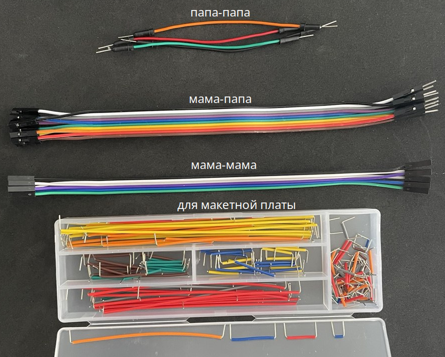

# Components

- Соединительные провода
- Макетная плата (breadboard)
- Шлифовальная машинка
- USB Tester

## Соединительные провода

## Соединительные щупы 
- 10-контактный логический анализатор (Logic Analyzer Cable Test)
- щупы типа «крокодил» (Alligator Clips Probes)

## Макетная плата (breadboard)

Макетная плата для монтажа в гнёзда, безпаячная. На 1600 отверстий модель ZY-204

## Шлифовальная машинка

JANGKLIFE USB беспроводной вращающийся инструмент набор деревообрабатывающий гравировальный станок DIY для ювелирных изделий металла стекла мини беспроводная дрель

## USB Tester
Цифровой вольтметр Измеритель тока Амперметр Напряжение

