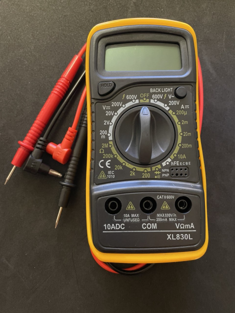

# Мультиметр

```admonish warning
Тестировать: Нужен измеритель индуктивности, емкости, транзисторов, частоты.
```

## Aналоговый (стрелочный) мультиметр


- Это компактный аналоговый (стрелочный) мультиметр для базовых измерений в электронике и бытовых условиях. 
- Класс точности: 5 (погрешность ~5%, низкая точность, подходит для грубых измерений).
- Малый диапазон токов (до 500 мА) — не для силовых цепей


Измеряемые параметры:
- Постоянное напряжение (DCV): 0–10–50–250–1000 В.
- Переменное напряжение (ACV): 0–10–50–250–1000 В.
- Постоянный ток (DCA): 0–0.5–50–500 мА.
- Сопротивление (Ω): Диапазоны ×10, ×100, ×1k.
- Проверка звука (Audio): -20...+22 dB.

Этот мультиметр — дешёвый и простой инструмент для бытового использования, но для профессиональных задач (например, ремонт микросхем) лучше выбрать цифровую модель с автоподстройкой диапазона и защитой от перегрузок.

---

## Цифровой мультиметр XL830L



Этот мультиметр — бюджетный вариант для дома и простого ремонта, но для профессионального использования (например, работы с микросхемами) лучше выбрать модель с автодиапазоном, защитой и расширенными функциями (например, UNI-T UT61E).

- Для токов >200 мА используйте разъём 10A и не держите измерение дольше 10 секунд.
- Опасность при высоких токах: разъём 10A без предохранителя может перегореть.
- Не превышайте 600 В — риск поражения током или повреждения прибора.
- Низкая точность для сложных задач (например, настройка точных схем).

**Основные функции:**
- **Напряжение**:  
  - Постоянное (DCV): **200 мВ – 600 В**.  
  - Переменное (ACV): **200 В – 600 В** (ограниченный диапазон).  
- **Ток**:  
  - Постоянный (DCA): **200 мкА – 10 А** (разъём 10A без предохранителя!).  
- **Сопротивление**: **200 Ом – 20 МОм**.  
- **Прозвонка диодов/цепей** (значок диода и звука).  
- **Измерение коэффициента усиления транзисторов** (hFE, поддержка NPN/PNP).  
- **Дополнительно**:  
  - Кнопка **HOLD** (фиксация показаний).  
  - **Подсветка экрана** (BACK LIGHT).  


**Ключевые особенности:**
- **Защита**:  
  - Максимальное напряжение: **600 В**.  
  - Предохранитель отсутствует в разъёме **10A** (риск повреждения при перегрузке).  
- **Точность**: Средняя (типична для бюджетных моделей, например, ±1% для напряжения).  
- **Разъёмы**:  
  - **COM** (чёрный щуп).  
  - **VΩmA** (красный щуп для напряжения, сопротивления, токов до 200 мА).  
  - **10A** (красный щуп для больших токов).  
