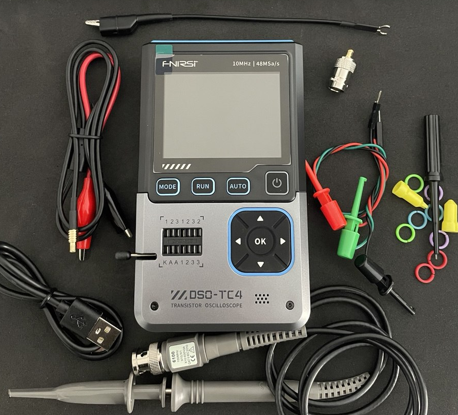
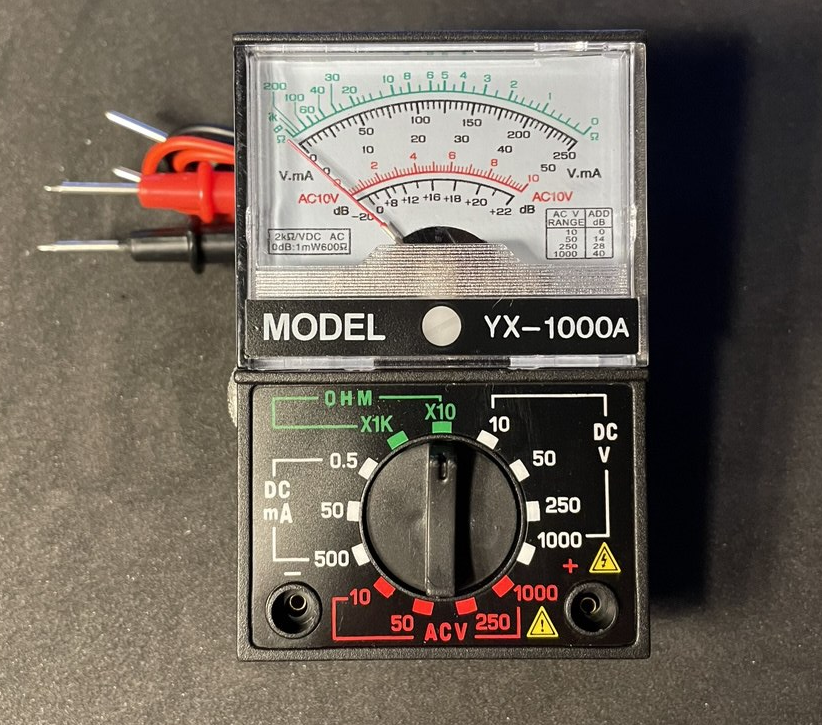

# Мультиметр

```admonish warning
Тестировать: Нужен измеритель индуктивности, емкости, транзисторов, частоты.
```

## FNIRSI DSO-TC4



FNIRSI DSO-TC4 3 in 1 
- Digital Oscilloscope 
- Transistor Tester 
- Signal Generator 10MHz 48Ms/s 

Automative Ocsillscope LCR Tester Tools

[Обзор FNIRSI DSO-TC4](https://www.youtube.com/watch?v=FUBPwYwAhRA)

[Обзор FNIRSI DSO-TC4](https://www.youtube.com/watch?v=52RISxEyf4M)

- Может сохранять осциллограммы для дальнейшего переброса на ПК
- Имеет одноканальный осциллограф (разьем DSO)
- Генератор сигналов (разьем DDS)
- Мультиметр (разьем IN 0-40)

Про осциллограф:
- Полоса пропускания Analog Bandwidth 10 MHz с амплитудой до 3 V, для анализа высокочастотной техники смарфоны, ноутбуки этого будет мало, так как они работают с частотой > 100 MHz
- Вертикальная развертка осциллографа Vertical Sensitivity 10 mV/div на клетку маловат, желательно 1 mV/div для измерения малошумящих сигналов
- сложный сигнал Меандр может принять только до 2 MHz, а синусоиду до 5 MHz


Про тестер:
- Может измерять все светодиоды, на щупах до 5 вольт
- Диоды Zener и стабилитроны (но до 4.5 вольт что мало)
- Емкости от 25pF - 1000uF(1 mF)  (это малый диапазон, желательно до 100 mF)
- Индуктивность от 10uH - 1000uH(1 mH) (тоже малый диапазон)

Про генератор сигналов:
- 13 форм сигнала 
- частотой 0-50 kHz (что маловато)
- при максимальной частоте 50 kHz сигнал прямоугольной формы Меандр с небольшим скруглением

Предел измерений 1000 uF (1 mF), но конденсатор на 3300 uF определил.


| Маркировка |  Емкость  | Измерение прибора    |
|------------|-----------|----------------------|
| Электолит. | 3300 uF   |  3430 uF (3.43 mF)   | 
| Электолит. | 2200 uF   |  2260 uF (2.26 mF)   | 
| Электолит. | 100 uF    |  107 uF              | 
| Электолит. | 10 uF     |  10.2 uF             | 
| 104        | 100 nF    |  101 nF  (0.1 uF)    | 
| 223        | 22 nF     |  23.4 nF (0.0234 uF) | 
| 331        | 330 pF    |  328 pF              | 
| 30         | 30 pF     |  37 pF (уже не точен)| 
| 22         | 22 pF     |  30 pF (уже не точен)| 

## Aналоговый (стрелочный) мультиметр



- Это компактный аналоговый (стрелочный) мультиметр для базовых измерений в электронике и бытовых условиях. 
- Класс точности: 5 (погрешность ~5%, низкая точность, подходит для грубых измерений).
- Малый диапазон токов (до 500 мА) — не для силовых цепей


Измеряемые параметры:
- Постоянное напряжение (DCV): 0–10–50–250–1000 В.
- Переменное напряжение (ACV): 0–10–50–250–1000 В.
- Постоянный ток (DCA): 0–0.5–50–500 мА.
- Сопротивление (Ω): Диапазоны ×10, ×100, ×1k.
- Проверка звука (Audio): -20...+22 dB.

Этот мультиметр — дешёвый и простой инструмент для бытового использования, но для профессиональных задач (например, ремонт микросхем) лучше выбрать цифровую модель с автоподстройкой диапазона и защитой от перегрузок.

---

## Цифровой мультиметр XL830L


Этот мультиметр — бюджетный вариант для дома и простого ремонта, но для профессионального использования (например, работы с микросхемами) лучше выбрать модель с автодиапазоном, защитой и расширенными функциями (например, UNI-T UT61E).

- Для токов >200 мА используйте разъём 10A и не держите измерение дольше 10 секунд.
- Опасность при высоких токах: разъём 10A без предохранителя может перегореть.
- Не превышайте 600 В — риск поражения током или повреждения прибора.
- Низкая точность для сложных задач (например, настройка точных схем).

**Основные функции:**
- **Напряжение**:  
  - Постоянное (DCV): **200 мВ – 600 В**.  
  - Переменное (ACV): **200 В – 600 В** (ограниченный диапазон).  
- **Ток**:  
  - Постоянный (DCA): **200 мкА – 10 А** (разъём 10A без предохранителя!).  
- **Сопротивление**: **200 Ом – 20 МОм**.  
- **Прозвонка диодов/цепей** (значок диода и звука).  
- **Измерение коэффициента усиления транзисторов** (hFE, поддержка NPN/PNP).  
- **Дополнительно**:  
  - Кнопка **HOLD** (фиксация показаний).  
  - **Подсветка экрана** (BACK LIGHT).  
 
**Ключевые особенности:**
- **Защита**:  
  - Максимальное напряжение: **600 В**.  
  - Предохранитель отсутствует в разъёме **10A** (риск повреждения при перегрузке).  
- **Точность**: Средняя (типична для бюджетных моделей, например, ±1% для напряжения).  
- **Разъёмы**:  
  - **COM** (чёрный щуп).  
  - **VΩmA** (красный щуп для напряжения, сопротивления, токов до 200 мА).  
  - **10A** (красный щуп для больших токов).  

## Цифровой мультиметр ANENG SZ303  

- Автоматический выбор диапазона (Auto Range): Мультиметр автоматически выбирает наиболее подходящий диапазон измерения, что упрощает использование.
- Измерение частоты (Frequency): Диапазон до 2 МГц.
- Проверка диодов (Diode Test): Позволяет проверить работоспособность диодов и определить их полярность.
- Функция NCV означает Non-Contact Voltage (бесконтактное обнаружение переменного напряжения (AC). При активации режима NCV и приближении мультиметра к проводу или розетке под напряжением переменного тока, мультиметр может обнаружить наличие электрического поля без прямого физического контакта с проводником.) Она не работает для обнаружения постоянного напряжения (DC).

