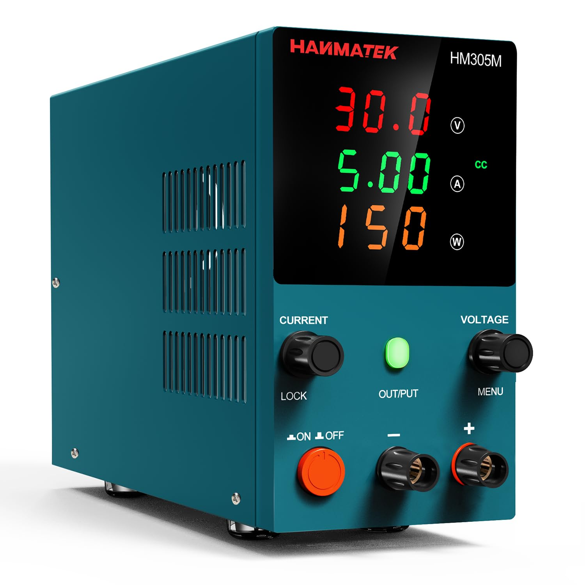

# Блок питания

## HANMATEK HM305

### **Обзор блока питания HANMATEK HM305**  

**HM305** — это **линейный регулируемый лабораторный блок питания (БП)** с двумя каналами, предназначенный для радиолюбителей, ремонта электроники и лабораторных работ. Вот что важно о нём знать:  

 

### **🔹 Основные характеристики**  
1. **Тип**: Линейный (низкий уровень шума, но менее эффективный, чем импульсные БП).  
2. **Выходы**:  
   - **Канал 1 (основной)**: **0–30 В**, **0–5 А** (макс. мощность **150 Вт**).  
   - **Канал 2 (фиксированный)**: **5 В / 3 А** (удобен для цифровых схем).  
3. **Точность**:  
   - Напряжение: **±0,1% + 2 мВ**.  
   - Ток: **±0,3% + 3 мА**.  
4. **Дисплей**: **ЖК-экран** (отдельные индикаторы для напряжения и тока).  
5. **Защита**:  
   - Ограничение тока (CC mode).  
   - Защита от перегрева.  
   - Защита от короткого замыкания.  

 

### **🔹 Для чего он подходит?**  
✅ **Ремонт электроники** (тестирование плат, блоков питания, зарядных устройств).  
✅ **Разработка и отладка схем** (аналоговые и цифровые устройства).  
✅ **Зарядка аккумуляторов** (Li-ion, свинцово-кислотных и др. с ручной настройкой).  
✅ **Обучение и хобби** (пайка, Arduino, Raspberry Pi, LED-ленты).  

 

### **🔹 Плюсы и минусы**  

| **Преимущества**                     | **Недостатки**                     |
|--------------------------------------|------------------------------------|
| ✔ Низкий уровень пульсаций (линейный) | ❌ Греется при больших нагрузках   |
| ✔ Точная установка V/I (0,01 В/А)    | ❌ Нет интерфейса USB/PC           |
| ✔ Защита от КЗ и перегрузки          | ❌ Тяжёлый (из-за трансформатора)  |
| ✔ Два канала (30В + 5В)              | ❌ Фиксированный 5В канал (не регулируется) |

 
### **🔹 Важные нюансы**  
1. **Линейный vs импульсный**  
   - HM305 — **линейный**, поэтому:  
     - 🔹 **Плюс**: Меньше шума на выходе (важно для аналоговой электроники).  
     - 🔹 **Минус**: КПД ~60%, требует хорошего охлаждения.  

2. **Ограничение по мощности**  
   - Макс. **150 Вт** на основном канале → нельзя выдать **30 В / 5 А** одновременно (реально ~30В/3А или 15В/5А).  

3. **Фиксированный 5В канал**  
   - Удобен для цифровых схем (Arduino, ESP8266), но не регулируется.  

4. **Альтернативы**  
   - Если нужен **импульсный БП** (лёгкий, с высоким КПД), смотрите **Korad KA3005P** или **Riden RD6006**.  
 
### **🔹 Как использовать правильно?**  
1. **Перед включением**:  
   - Установите **ограничение тока** (регулируйте ручку "Current" перед подключением нагрузки).  
2. **При работе**:  
   - Не закрывайте вентиляционные отверстия.  
   - При больших нагрузках (**>3 А**) используйте внешний вентилятор.  
3. **Для точных измерений**:  
   - Подключайте нагрузку **прямо к клеммам** (длинные провода добавляют сопротивление).  

 

### **🔹 Вывод: стоит ли брать?**  
**Да, если:**  
- Нужен **точный и стабильный** БП для ремонта/разработки.  
- Важен **низкий уровень шума** (для аудио, RF-схем).  
- Не нужны **удалённое управление и USB**.  

**Нет, если:**  
- Требуется **мобильность** (импульсные БП легче).  
- Нужны **высокие токи (>5A)** или **программируемые профили**.  

Если бюджет позволяет, можно рассмотреть **Riden RD6006** (импульсный, с Bluetooth), но для большинства задач **HM305** — отличный выбор. 🚀
