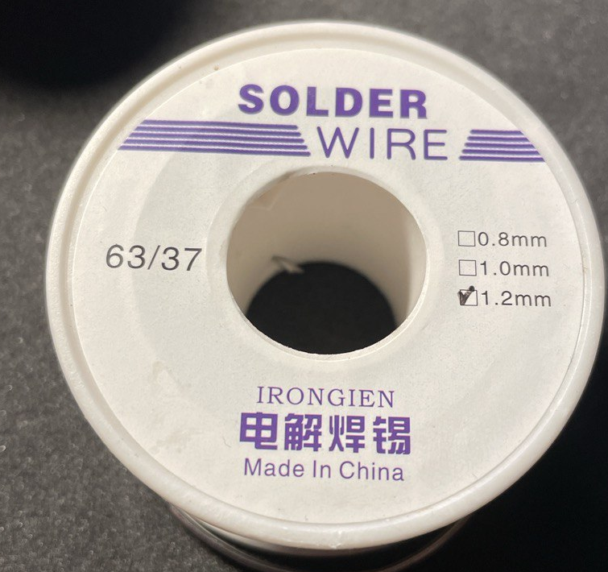
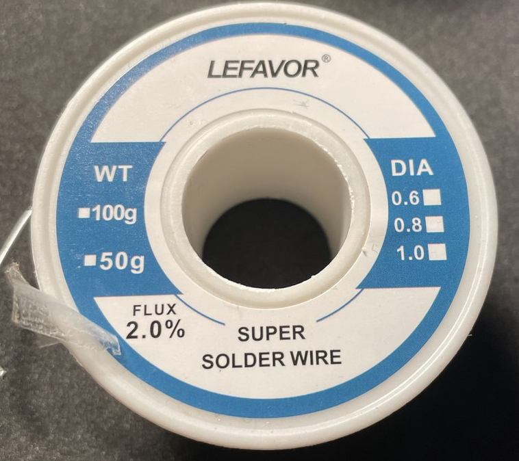
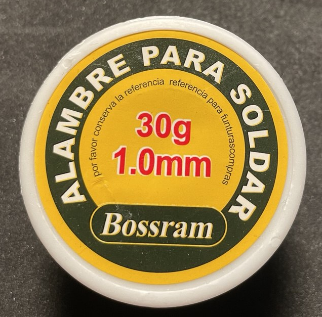

# Припой (solder)

```admonish warning
Тестировать:
- Низкоплавкий припой ПОС-61
```

```admonish info
Тугоплавкий бессвинцовый припой PB – это припой, не содержащий свинца, с высокой температурой плавления (обычно выше 250°C). Почти все материнские платы, видеокарты и прочее комьютерное железо.

Преимущества:
- Экологичность (нет токсичного свинца, соответствует RoHS).
- Высокая механическая прочность.
- Устойчивость к температурам (особенно важна в промышленности и силовой электронике).

Недостатки:
- **Требуется более высокая температура пайки (труднее паять).** Что бы выпаять нужен мощный паяльник 60 ватт
```


## Оловянно-свинцовый припой



- Это оловянно-свинцовая припойная проволока марки 63/37 (63% олова Sn, 37% свинца Pb)
- Проволока с флюсовым сердечником (канифольным или аналогичным)
- Температура плавления: 183°C (эвтектический сплав — плавится сразу, без переходного состояния)
- Содержит свинец — не для пищевого/медицинского оборудования

Если нужна более экологичная альтернатива, ищите бессвинцовые припои (например, Sn99.3/Cu0.7). Для точной пайки микросхем используйте паяльную пасту с нейтральным флюсом.

---

## Припой с флюсовым сердечником



- Проволока тонкая 0.6 мм для точной пайки с 2% флюсовым сердечником (обычно канифольным или активированным флюсом).
- Ручная пайка компонентов микросхемы, SMD-деталей.
- Флюс внутри — упрощает пайку (не требует отдельного нанесения флюса). 
 
---

## Припой 



Это припойная проволока Bossram диаметром 1.0 мм (30 г)